# API参考

<cite>
**本文档中引用的文件**  
- [__init__.py](file://rez-3.3.0/src/rez/__init__.py)
- [_main.py](file://rez-3.3.0/src/rez/cli/_main.py)
- [api.rst](file://rez-3.3.0/docs/source/api.rst)
- [commands_index.rst](file://rez-3.3.0/docs/source/commands_index.rst)
- [env.py](file://rez-3.3.0/src/rez/cli/env.py)
- [build.py](file://rez-3.3.0/src/rez/cli/build.py)
- [context.py](file://rez-3.3.0/src/rez/cli/context.py)
- [_util.py](file://rez-3.3.0/src/rez/cli/_util.py)
- [_entry_points.py](file://rez-3.3.0/src/rez/cli/_entry_points.py)
- [exceptions.py](file://rez-3.3.0/src/rez/exceptions.py)
</cite>

## 目录
1. [简介](#简介)
2. [Python API](#python-api)
3. [CLI API](#cli-api)
4. [错误处理与异常](#错误处理与异常)
5. [性能特征](#性能特征)
6. [使用示例与常见用例](#使用示例与常见用例)

## 简介

Rez系统提供了一套完整的API接口，用于软件包管理和环境配置。本API参考文档详细描述了Python API和CLI API的所有端点规范。Python API通过`__init__.py`文件暴露公共接口，而CLI API则基于`_main.py`中的实现文档化所有命令行接口。文档内容参考了`api.rst`和`commands_index.rst`中的信息以确保完整性。

Rez系统的核心功能包括软件包的构建、发布、依赖解析和环境管理。API设计遵循模块化原则，将不同功能分离到独立的模块中，便于维护和扩展。系统支持多种构建系统和发布流程，通过插件机制实现灵活的扩展性。

**本节来源**
- [__init__.py](file://rez-3.3.0/src/rez/__init__.py#L1-L71)
- [api.rst](file://rez-3.3.0/docs/source/api.rst#L1-L54)

## Python API

Rez系统的Python API提供了丰富的功能模块，用于程序化地管理软件包和环境。API的入口点在`__init__.py`文件中定义，暴露了版本信息、模块路径和初始化日志功能。

### 核心模块

Python API包含多个功能模块，每个模块负责特定领域的功能：

- **build_process**: 构建流程管理
- **build_system**: 构建系统集成
- **bundle_context**: 上下文打包
- **command**: 命令执行
- **config**: 配置管理
- **developer_package**: 开发者包管理
- **package_cache**: 包缓存
- **package_copy**: 包复制
- **package_filter**: 包过滤
- **package_help**: 帮助信息
- **package_maker**: 包创建
- **package_move**: 包移动
- **package_order**: 包排序
- **package_py_utils**: Python工具
- **package_remove**: 包删除
- **package_repository**: 包仓库
- **package_resources**: 包资源
- **package_search**: 包搜索
- **package_serialise**: 包序列化
- **package_test**: 包测试
- **packages**: 包管理
- **plugin_managers**: 插件管理
- **release_hook**: 发布钩子
- **release_vcs**: 版本控制系统集成
- **resolved_context**: 已解析上下文
- **resolver**: 解析器
- **rex_bindings**: Rex绑定
- **rex**: Rex脚本引擎
- **serialise**: 序列化
- **shells**: Shell集成
- **solver**: 求解器
- **status**: 状态管理
- **suite**: 套件管理
- **system**: 系统信息
- **util**: 实用工具
- **utils**: 工具集
- **version**: 版本管理
- **wrapper**: 包装器

### 公共接口

`__init__.py`文件定义了以下公共接口：

- `__version__`: Rez系统的版本号
- `__author__`: 作者信息
- `__license__`: 许可证信息
- `module_root_path`: 模块根路径
- `_init_logging()`: 初始化日志系统

这些接口为开发者提供了访问Rez系统核心功能的入口点。API设计遵循Python最佳实践，提供了清晰的命名和文档字符串。

**本节来源**
- [__init__.py](file://rez-3.3.0/src/rez/__init__.py#L1-L71)
- [api.rst](file://rez-3.3.0/docs/source/api.rst#L1-L54)

## CLI API

Rez系统的命令行接口(CLI)提供了丰富的命令集，用于交互式地管理软件包和环境。CLI API基于`_main.py`中的实现，通过`_entry_points.py`定义入口点。

### 命令结构

CLI命令遵循统一的结构，支持多种调用方式：

- `rez <command> [options]`: 标准调用方式
- `rez-<command> [options]`: 连字符调用方式
- `rez <command> -- <arguments>`: 参数传递方式

命令行解析由`LazyArgumentParser`类处理，支持延迟加载子命令解析器，提高了启动性能。

### 主要命令

根据`_util.py`文件中的`subcommands`字典，Rez系统提供了以下主要命令：

- **bind**: 绑定包
- **build**: 构建包
- **config**: 配置管理
- **context**: 上下文管理
- **cp**: 包复制
- **depends**: 依赖分析
- **diff**: 差异比较
- **env**: 环境管理
- **gui**: 图形界面
- **help**: 帮助信息
- **interpret**: 解释执行
- **memcache**: 内存缓存
- **pip**: Python包管理
- **pkg-cache**: 包缓存
- **plugins**: 插件管理
- **python**: Python环境
- **release**: 发布包
- **search**: 包搜索
- **selftest**: 自检
- **status**: 状态查询
- **suite**: 套件管理
- **test**: 包测试
- **view**: 查看信息
- **yaml2py**: YAML转Python

### 命令参数

每个命令支持通用参数和特定参数：

- `-v, --verbose`: 详细模式，可重复使用增加详细程度
- `--debug`: 调试模式
- `--profile`: 性能分析
- `-i, --info`: 打印系统信息并退出
- `-V, --version`: 打印版本信息

特定命令的参数在各自的`setup_parser`函数中定义，遵循一致的命名约定。

**本节来源**
- [_main.py](file://rez-3.3.0/src/rez/cli/_main.py#L1-L201)
- [_util.py](file://rez-3.3.0/src/rez/cli/_util.py#L1-L248)
- [_entry_points.py](file://rez-3.3.0/src/rez/cli/_entry_points.py#L1-L317)

## 错误处理与异常

Rez系统提供了完善的错误处理机制，通过异常层次结构清晰地表示不同类型的错误。

### 异常层次结构

Rez系统的异常继承自`RezError`基类，形成了清晰的层次结构：

```mermaid
classDiagram
class RezError {
+__init__(value)
+__str__()
}
class RezSystemError {
}
class RezBindError {
}
class RezPluginError {
}
class ConfigurationError {
}
class ResolveError {
}
class PackageFamilyNotFoundError {
}
class PackageNotFoundError {
}
class ResourceError {
}
class ResourceNotFoundError {
}
class ResourceContentError {
+type_name
+__init__(value, path, resource_key)
}
class PackageMetadataError {
+type_name
}
class PackageCommandError {
}
class PackageRequestError {
}
class PackageCopyError {
}
class PackageMoveError {
}
class ContextBundleError {
}
class PackageCacheError {
}
class PackageTestError {
}
class ResolvedContextError {
}
class RexError {
}
class RexUndefinedVariableError {
}
class RexStopError {
}
class BuildError {
}
class BuildSystemError {
}
class BuildContextResolveError {
+context
+__init__(context)
}
class BuildProcessError {
}
class ReleaseError {
}
class ReleaseVCSError {
}
class ReleaseHookError {
}
class ReleaseHookCancellingError {
}
class SuiteError {
}
class PackageRepositoryError {
}
class InvalidPackageError {
}
RezError <|-- RezSystemError
RezError <|-- RezBindError
RezError <|-- RezPluginError
RezError <|-- ConfigurationError
RezError <|-- ResolveError
RezError <|-- PackageFamilyNotFoundError
RezError <|-- PackageNotFoundError
RezError <|-- ResourceError
RezError <|-- PackageCommandError
RezError <|-- PackageRequestError
RezError <|-- PackageCopyError
RezError <|-- PackageMoveError
RezError <|-- ContextBundleError
RezError <|-- PackageCacheError
RezError <|-- PackageTestError
RezError <|-- ResolvedContextError
RezError <|-- RexError
RezError <|-- BuildError
RezError <|-- BuildProcessError
RezError <|-- ReleaseError
RezError <|-- SuiteError
RezError <|-- PackageRepositoryError
RezError <|-- InvalidPackageError
ResourceError <|-- ResourceNotFoundError
ResourceError <|-- ResourceContentError
ResourceContentError <|-- PackageMetadataError
RexError <|-- RexUndefinedVariableError
RexError <|-- RexStopError
BuildError <|-- BuildSystemError
BuildError <|-- BuildContextResolveError
ReleaseError <|-- ReleaseVCSError
ReleaseError <|-- ReleaseHookError
ReleaseHookError <|-- ReleaseHookCancellingError
```



**图源**
- [exceptions.py](file://rez-3.3.0/src/rez/exceptions.py#L1-L229)

### 错误码

Rez系统使用标准的退出码表示执行结果：

- `0`: 成功执行
- `1`: 一般错误
- `2`: 命令行解析错误
- `3`: 配置错误
- `4`: 包查找错误
- `5`: 解析错误
- `6`: 构建错误
- `7`: 发布错误

### 异常处理策略

Rez系统在`_main.py`中实现了统一的异常处理策略：

1. 在调试模式下，显示完整的堆栈跟踪
2. 在生产模式下，只显示错误消息
3. 特定异常类型（如`RezSystemError`）总是被重新抛出
4. 使用`convert_errors`上下文管理器转换异常类型

这种策略确保了错误信息的清晰性和一致性，同时提供了足够的调试信息。

**本节来源**
- [exceptions.py](file://rez-3.3.0/src/rez/exceptions.py#L1-L229)
- [_main.py](file://rez-3.3.0/src/rez/cli/_main.py#L1-L201)

## 性能特征

Rez系统在设计时考虑了性能优化，特别是在包解析和环境管理方面。

### 缓存机制

Rez系统实现了多层次的缓存机制：

- **包缓存**: 缓存已解析的包信息，避免重复解析
- **内存缓存**: 使用memcached存储频繁访问的数据
- **资源缓存**: 缓存包资源，提高访问速度

缓存行为可以通过环境变量和配置文件进行控制：

- `REZ_CACHE_PACKAGES_PATH`: 包缓存路径
- `REZ_MEMCACHED_URI`: memcached服务器地址
- `REZ_RESOURCE_CACHING_MAXSIZE`: 资源缓存最大大小

### 解析性能

包解析是Rez系统的核心功能，其性能特征包括：

- **时间复杂度**: O(n log n)，其中n是包的数量
- **空间复杂度**: O(n)，存储包依赖关系图
- **并发支持**: 支持多线程解析
- **增量解析**: 支持基于先前解析结果的增量更新

### 启动性能

CLI的启动性能通过以下机制优化：

- **延迟加载**: 子命令解析器在需要时才加载
- **模块缓存**: 避免重复导入模块
- **预编译**: 预编译正则表达式和模板

### 性能分析

Rez系统内置了性能分析功能，可以通过`--profile`参数启用：

- 生成cProfile分析文件
- 支持多种分析格式
- 可以指定输出文件名

这些性能特征使得Rez系统能够高效地处理大规模的包依赖关系，满足生产环境的需求。

**本节来源**
- [_main.py](file://rez-3.3.0/src/rez/cli/_main.py#L1-L201)
- [config.py](file://rez-3.3.0/src/rez/config.py)
- [solver.py](file://rez-3.3.0/src/rez/solver.py)

## 使用示例与常见用例

本节提供Rez系统API的使用示例和常见用例，帮助开发者快速上手。

### Python API使用示例

```python
# 导入Rez系统
import rez

# 获取版本信息
print(f"Rez版本: {rez.__version__}")

# 初始化日志
rez._init_logging()

# 使用包管理功能
from rez.packages import get_package
package = get_package("python", "3.7.0")
print(f"找到包: {package.qualified_name}")
```

### CLI API使用示例

#### 环境管理

```bash
# 创建交互式环境
rez env python-3.7 maya-2022

# 执行命令后退出
rez env python-3.7 -- python --version

# 从文件加载环境
rez env -i my_context.rxt
```

#### 包构建

```bash
# 构建当前包
rez build

# 清理并重新构建
rez build --clean

# 构建并安装到指定路径
rez build --install --prefix /path/to/install
```

#### 上下文管理

```bash
# 查看当前上下文信息
rez context

# 查看解析的包列表
rez context --print-resolve

# 生成环境脚本
rez context --interpret --format bash
```

### 常见用例

#### 开发环境设置

```bash
# 设置开发环境
rez env --no-implicit python-3.7 numpy scipy matplotlib

# 在环境中执行Python脚本
rez env python-3.7 -- python my_script.py
```

#### 包发布流程

```bash
# 构建包
rez build --install

# 发布包
rez release --variant 0

# 验证发布
rez search mypackage
```

#### 依赖分析

```bash
# 分析包依赖
rez depends mypackage

# 比较两个环境的差异
rez context --diff old_context.rxt
```

#### 自动化脚本

```python
#!/usr/bin/env python
import sys
from rez.resolved_context import ResolvedContext

def check_environment():
    """检查当前环境是否满足要求"""
    try:
        context = ResolvedContext.load()
        required_packages = ["python-3.7", "numpy", "pandas"]
        
        for pkg in required_packages:
            if not any(p.name == pkg.split('-')[0] for p in context.resolved_packages):
                print(f"缺少必需的包: {pkg}")
                return False
        return True
    except Exception as e:
        print(f"环境检查失败: {e}")
        return False

if __name__ == "__main__":
    if not check_environment():
        sys.exit(1)
    print("环境检查通过")
```

这些示例和用例展示了Rez系统API的核心功能和最佳实践，帮助开发者高效地使用系统。

**本节来源**
- [env.py](file://rez-3.3.0/src/rez/cli/env.py#L1-L279)
- [build.py](file://rez-3.3.0/src/rez/cli/build.py#L1-L174)
- [context.py](file://rez-3.3.0/src/rez/cli/context.py#L1-L196)
- [__init__.py](file://rez-3.3.0/src/rez/__init__.py#L1-L71)