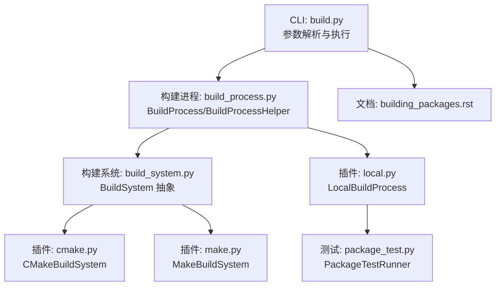
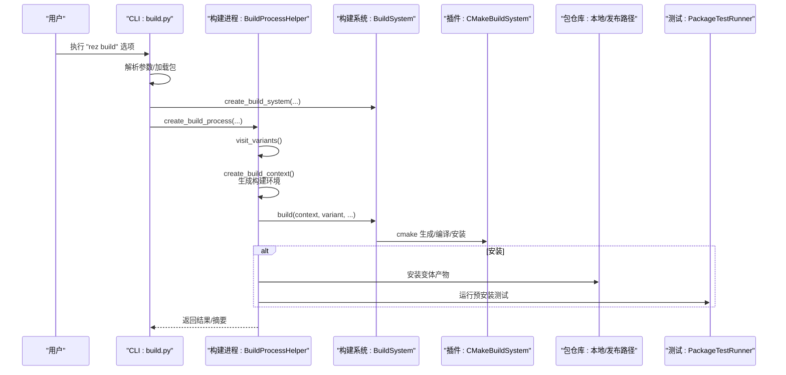
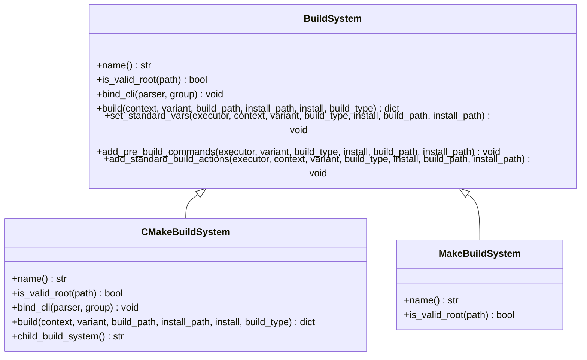
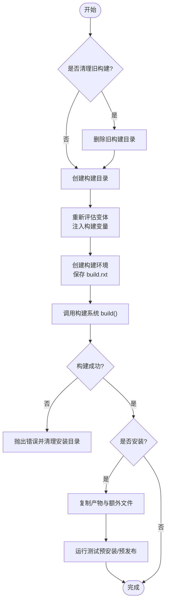
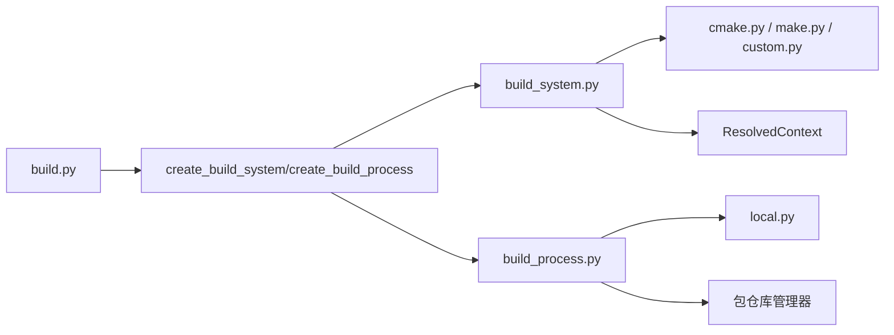

# build 命令

<cite>
**本文引用的文件列表**
- [build.py](file://rez-3.3.0/src/rez/cli/build.py)
- [build_process.py](file://rez-3.3.0/src/rez/build_process.py)
- [build_system.py](file://rez-3.3.0/src/rez/build_system.py)
- [cmake.py](file://rez-3.3.0/src/rezplugins/build_system/cmake.py)
- [make.py](file://rez-3.3.0/src/rezplugins/build_system/make.py)
- [local.py](file://rez-3.3.0/src/rezplugins/build_process/local.py)
- [building_packages.rst](file://rez-3.3.0/docs/source/building_packages.rst)
- [package_test.py](file://rez-3.3.0/src/rez/package_test.py)
- [release.py](file://rez-3.3.0/src/rez/cli/release.py)
</cite>

## 目录
1. [简介](#简介)
2. [项目结构与入口](#项目结构与入口)
3. [核心组件](#核心组件)
4. [架构总览](#架构总览)
5. [详细组件分析](#详细组件分析)
6. [依赖关系分析](#依赖关系分析)
7. [性能与可扩展性](#性能与可扩展性)
8. [故障排查与常见问题](#故障排查与常见问题)
9. [结论](#结论)
10. [附录：常用用法与示例](#附录常用用法与示例)

## 简介
本篇文档围绕 Rez 的 build 命令展开，系统阐述从源码到安装的完整构建与打包流程，覆盖以下关键点：
- 命令选项与行为：--install、--variants、--build-args/--cba、--scripts、--view-pre、--fail-graph、--process 等
- 构建系统插件集成：cmake.py、make.py 与自定义 build_command 的工作方式
- 依赖解析与环境配置：构建环境的生成、变量注入、子构建系统（如 cmake -> make）
- 测试与发布：本地安装后的测试运行、发布流程与钩子
- 常见失败原因与排障建议

## 项目结构与入口
- CLI 入口：命令参数解析与执行逻辑集中在 CLI 层，负责加载包定义、选择构建系统与构建进程，并调用底层构建流程。
- 构建进程：负责遍历变体、创建构建环境、调用构建系统、安装产物、运行测试等。
- 构建系统：抽象出通用接口，具体实现（如 cmake、make、custom）按需绑定 CLI 参数并执行构建。
- 文档与指南：官方文档对构建环境、依赖传递、构建系统选择、自定义命令等有详尽说明。

图表来源
- [build.py](file://rez-3.3.0/src/rez/cli/build.py#L1-L174)
- [build_process.py](file://rez-3.3.0/src/rez/build_process.py#L1-L450)
- [build_system.py](file://rez-3.3.0/src/rez/build_system.py#L1-L312)
- [cmake.py](file://rez-3.3.0/src/rezplugins/build_system/cmake.py#L1-L308)
- [make.py](file://rez-3.3.0/src/rezplugins/build_system/make.py#L1-L29)
- [local.py](file://rez-3.3.0/src/rezplugins/build_process/local.py#L1-L499)
- [building_packages.rst](file://rez-3.3.0/docs/source/building_packages.rst#L1-L296)
- [package_test.py](file://rez-3.3.0/src/rez/package_test.py#L1-L200)

章节来源
- [build.py](file://rez-3.3.0/src/rez/cli/build.py#L1-L174)
- [building_packages.rst](file://rez-3.3.0/docs/source/building_packages.rst#L1-L296)

## 核心组件
- CLI build 命令
  - 负责解析参数、加载当前开发者包、创建构建系统与构建进程、执行构建并处理失败图输出。
  - 关键参数：--install、--variants、--build-args/--cba、--scripts、--view-pre、--fail-graph、--process 等。
- 构建进程（BuildProcess/BuildProcessHelper）
  - 遍历变体、创建构建上下文（ResolvedContext）、执行构建系统、安装产物、运行测试、生成调试文件（如 build.rxt）。
- 构建系统（BuildSystem 抽象）
  - 统一接口：name/is_valid_root/bind_cli/build/set_standard_vars/add_pre_build_commands/add_standard_build_actions
  - 插件：cmake、make、custom；支持父子构建系统链（如 cmake -> make）。
- 插件：CMakeBuildSystem
  - 自动检测 CMakeLists.txt，设置 CMAKE_* 变量，调用 cmake 生成构建脚本，再调用 make/ninja/nmake 等进行编译与安装。
- 插件：MakeBuildSystem
  - 检测 Makefile，作为子构建系统被 cmake 等间接使用。
- 本地构建进程：LocalBuildProcess
  - 在本地主机顺序构建变体，支持清理、安装、测试、短链接、临时可写目录等。

章节来源
- [build.py](file://rez-3.3.0/src/rez/cli/build.py#L1-L174)
- [build_process.py](file://rez-3.3.0/src/rez/build_process.py#L1-L450)
- [build_system.py](file://rez-3.3.0/src/rez/build_system.py#L1-L312)
- [cmake.py](file://rez-3.3.0/src/rezplugins/build_system/cmake.py#L1-L308)
- [make.py](file://rez-3.3.0/src/rezplugins/build_system/make.py#L1-L29)
- [local.py](file://rez-3.3.0/src/rezplugins/build_process/local.py#L1-L499)

## 架构总览
下图展示从 CLI 到构建系统与安装的端到端流程。

图表来源
- [build.py](file://rez-3.3.0/src/rez/cli/build.py#L124-L174)
- [build_process.py](file://rez-3.3.0/src/rez/build_process.py#L180-L450)
- [build_system.py](file://rez-3.3.0/src/rez/build_system.py#L180-L312)
- [cmake.py](file://rez-3.3.0/src/rezplugins/build_system/cmake.py#L108-L245)
- [local.py](file://rez-3.3.0/src/rezplugins/build_process/local.py#L133-L285)
- [package_test.py](file://rez-3.3.0/src/rez/package_test.py#L1-L200)

## 详细组件分析

### CLI 参数与执行流程
- 主要选项
  - --install：在构建后安装到本地或指定仓库路径
  - --variants：仅构建指定索引的变体
  - --build-args/--ba：传递给构建系统的参数
  - --child-build-args/--cba：传递给子构建系统的参数（如 cmake -> make）
  - --scripts：生成构建脚本而非直接执行构建，便于手动进入构建环境
  - --view-pre：查看预处理后的包定义
  - --fail-graph：当构建环境解析失败时，输出冲突图
  - --process：选择构建进程类型（默认 local）
  - --clean：清理上次构建
  - --prefix：自定义安装路径
  - --build-system：显式指定构建系统（如 cmake、make、custom）
- 执行流程
  - 加载当前开发者包
  - 解析 --build-args 与 --child-build-args（支持通过 -- 分隔）
  - 创建构建系统与构建进程
  - 调用 builder.build(...)，内部遍历变体、创建构建环境、执行构建系统、安装与测试

章节来源
- [build.py](file://rez-3.3.0/src/rez/cli/build.py#L44-L174)
- [building_packages.rst](file://rez-3.3.0/docs/source/building_packages.rst#L141-L219)

### 构建系统抽象与插件
- BuildSystem 抽象
  - 提供统一接口：name、is_valid_root、bind_cli、build、set_standard_vars、add_pre_build_commands、add_standard_build_actions
  - 支持父子构建系统：如 cmake -> make
- CMakeBuildSystem
  - 检测 CMakeLists.txt，绑定 --build-target、--cmake-build-system 等参数
  - 设置 CMAKE_* 变量与 REZ_BUILD_* 环境变量，调用 cmake 生成构建脚本，再调用 make/ninja/nmake 执行编译与安装
  - 支持生成 build-env 脚本，允许用户手动进入构建环境
- MakeBuildSystem
  - 检测 Makefile，作为子构建系统被 cmake 等间接使用

图表来源
- [build_system.py](file://rez-3.3.0/src/rez/build_system.py#L103-L312)
- [cmake.py](file://rez-3.3.0/src/rezplugins/build_system/cmake.py#L29-L107)
- [make.py](file://rez-3.3.0/src/rezplugins/build_system/make.py#L1-L29)

章节来源
- [build_system.py](file://rez-3.3.0/src/rez/build_system.py#L1-L312)
- [cmake.py](file://rez-3.3.0/src/rezplugins/build_system/cmake.py#L1-L308)
- [make.py](file://rez-3.3.0/src/rezplugins/build_system/make.py#L1-L29)

### 构建进程与本地安装
- LocalBuildProcess
  - 遍历变体，为每个变体创建构建路径与安装路径
  - 重新评估变体以注入构建相关变量，创建构建环境（ResolvedContext），保存 build.rxt 以便调试
  - 调用构建系统执行 build，若成功则安装产物与额外文件（如 build.rxt、variant.json）
  - 运行测试（预安装/预发布），失败则回滚并取消安装
  - 支持变体短链接、临时可写目录等细节

图表来源
- [local.py](file://rez-3.3.0/src/rezplugins/build_process/local.py#L133-L285)
- [build_process.py](file://rez-3.3.0/src/rez/build_process.py#L233-L275)

章节来源
- [local.py](file://rez-3.3.0/src/rezplugins/build_process/local.py#L1-L499)
- [build_process.py](file://rez-3.3.0/src/rez/build_process.py#L180-L450)

### 依赖解析与环境配置
- 构建环境要求来源
  - 包的 requires
  - 包的 build_requires（递归包含其他包的构建依赖）
  - 包的 private_build_requires（非递归，仅用于当前包）
  - 当前变体的要求
- 标准环境变量
  - REZ_BUILD_* 系列变量（构建类型、变体索引、变体要求、项目名称/版本、源路径、安装路径等）
  - CMAKE_MODULE_PATH 等由构建系统注入
- 子构建系统链
  - cmake -> make/ninja/nmake 等，父子构建系统参数分别传入

章节来源
- [building_packages.rst](file://rez-3.3.0/docs/source/building_packages.rst#L28-L123)
- [build_system.py](file://rez-3.3.0/src/rez/build_system.py#L209-L259)
- [cmake.py](file://rez-3.3.0/src/rezplugins/build_system/cmake.py#L128-L141)

### 测试与发布
- 测试
  - 在安装/发布前运行测试，失败则取消安装/发布
  - 支持 run_on 标签（如 pre_install、pre_release），避免重复运行
- 发布
  - 通过 release 命令触发，创建构建系统与构建进程，执行 release 流程
  - 支持发布钩子（pre/post）与版本标签管理

章节来源
- [local.py](file://rez-3.3.0/src/rezplugins/build_process/local.py#L348-L496)
- [package_test.py](file://rez-3.3.0/src/rez/package_test.py#L1-L200)
- [release.py](file://rez-3.3.0/src/rez/cli/release.py#L43-L149)

## 依赖关系分析
- 组件耦合
  - CLI 依赖构建系统与构建进程工厂方法
  - 构建进程依赖构建系统实例与包仓库管理器
  - 构建系统依赖包定义与解析上下文
- 外部依赖
  - CMake/Make/Ninja/NMake 等工具
  - 版本控制（发布流程中）

图表来源
- [build.py](file://rez-3.3.0/src/rez/cli/build.py#L124-L174)
- [build_system.py](file://rez-3.3.0/src/rez/build_system.py#L70-L101)
- [build_process.py](file://rez-3.3.0/src/rez/build_process.py#L32-L58)
- [cmake.py](file://rez-3.3.0/src/rezplugins/build_system/cmake.py#L1-L308)
- [make.py](file://rez-3.3.0/src/rezplugins/build_system/make.py#L1-L29)
- [local.py](file://rez-3.3.0/src/rezplugins/build_process/local.py#L1-L132)

## 性能与可扩展性
- 并行与线程数
  - 子构建系统（如 make）会根据变体配置的线程数添加并发参数
- 变体短链接与临时可写
  - 支持变体短链接减少长路径，临时可写目录提升安装稳定性
- 可扩展性
  - 新增构建系统只需实现 BuildSystem 接口并注册插件
  - 通过 package.py 的 build_command 或 build_system 字段灵活切换

[本节为通用指导，无需列出章节来源]

## 故障排查与常见问题
- 构建环境解析失败
  - 使用 --fail-graph 查看冲突图，定位依赖冲突
  - 检查包定义中的 requires/build_requires/private_build_requires 是否合理
- 未找到构建系统
  - 未检测到 CMakeLists.txt 或 Makefile，或包未声明 build_system/build_command
  - 显式使用 --build-system 指定
- 子构建系统参数冲突
  - --build-args 与 --cba 不能与 -- 后的参数混用
- 安装失败回滚
  - 安装过程中失败会删除部分安装产物并取消安装
- 发布失败
  - 发布路径不存在、版本已存在、仓库状态不满足等都会导致失败

章节来源
- [build.py](file://rez-3.3.0/src/rez/cli/build.py#L106-L174)
- [build_process.py](file://rez-3.3.0/src/rez/build_process.py#L233-L275)
- [local.py](file://rez-3.3.0/src/rezplugins/build_process/local.py#L255-L368)

## 结论
build 命令通过“CLI -> 构建系统 -> 构建进程”的分层设计，实现了从源码到安装的完整流程。其核心优势在于：
- 强大的依赖解析与环境配置能力
- 可插拔的构建系统与进程模型
- 内置测试与发布支持
- 清晰的调试与可视化（build.rxt、失败图）

[本节为总结，无需列出章节来源]

## 附录：常用用法与示例
- 基本安装
  - 在包根目录执行安装：使用 --install
- 指定变体
  - 使用 --variants 0 仅构建第一个变体
- 传递构建参数
  - 使用 --build-args 或在 -- 后面追加构建系统参数
- 生成构建脚本
  - 使用 --scripts 生成 build-env 脚本，手动进入构建环境
- 查看预处理包定义
  - 使用 --view-pre 查看预处理后的包定义
- 失败时查看冲突图
  - 使用 --fail-graph 输出冲突图
- 发布流程
  - 使用 release 命令触发发布，内部同样创建构建系统与构建进程

章节来源
- [building_packages.rst](file://rez-3.3.0/docs/source/building_packages.rst#L141-L219)
- [release.py](file://rez-3.3.0/src/rez/cli/release.py#L43-L149)