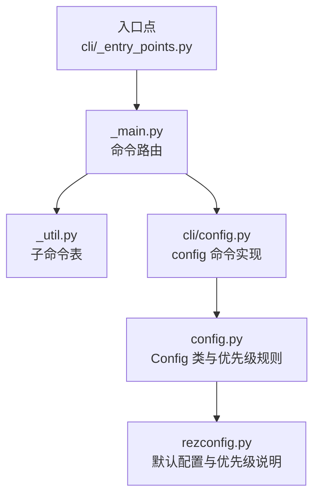
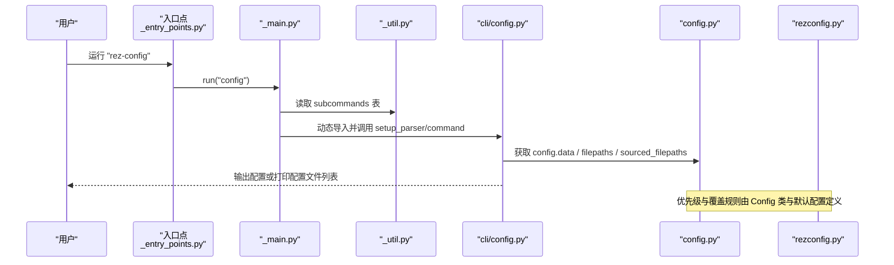
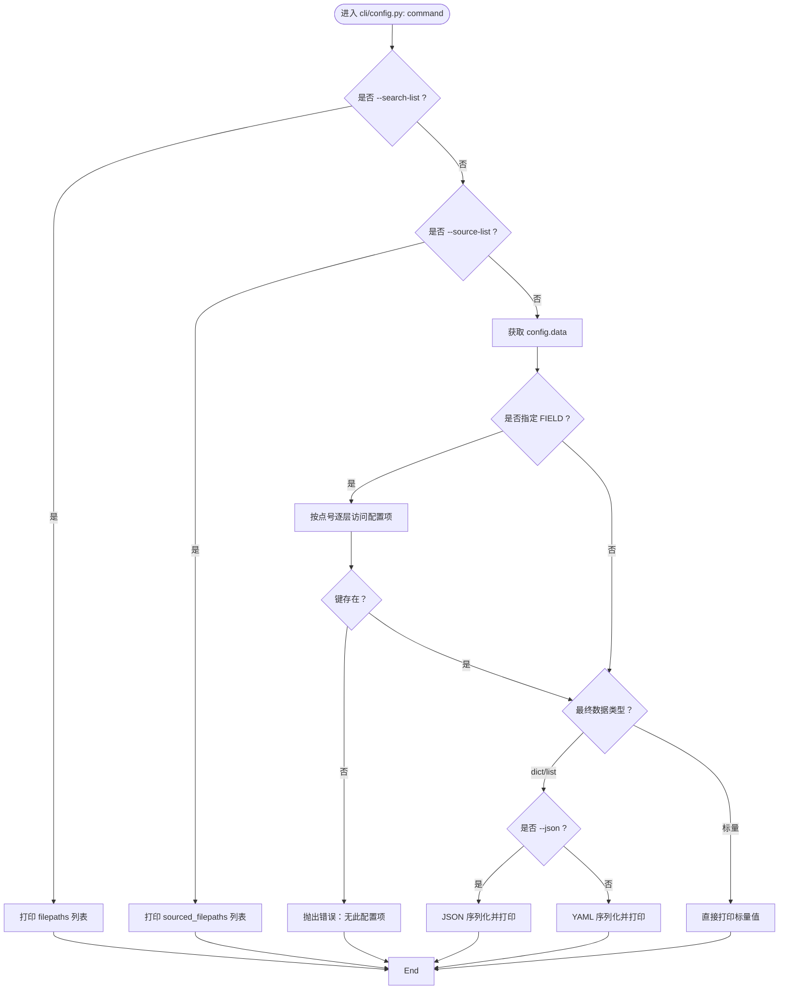
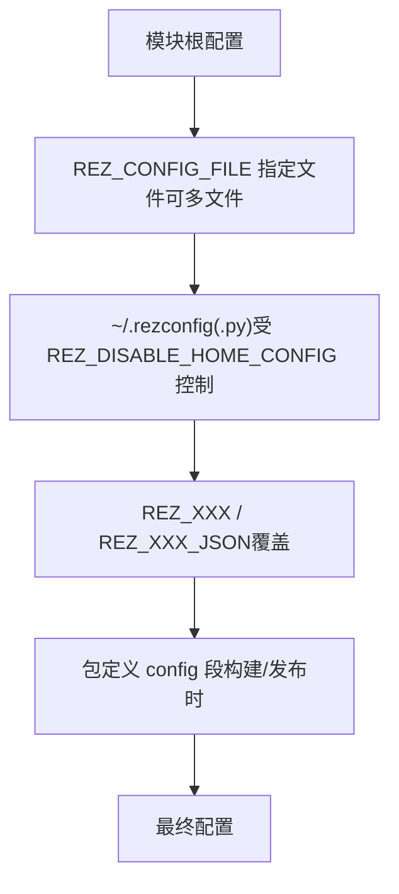
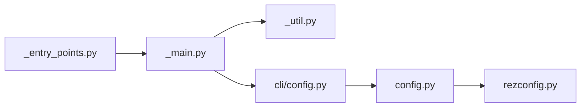

# config 命令

<cite>
**本文引用的文件**
- [cli/config.py](file://rez-3.3.0/src/rez/cli/config.py)
- [config.py](file://rez-3.3.0/src/rez/config.py)
- [rezconfig.py](file://rez-3.3.0/src/rez/rezconfig.py)
- [cli/_entry_points.py](file://rez-3.3.0/src/rez/cli/_entry_points.py)
- [cli/_main.py](file://rez-3.3.0/src/rez/cli/_main.py)
- [cli/_util.py](file://rez-3.3.0/src/rez/cli/_util.py)
- [docs/source/configuring_rez.rst](file://rez-3.3.0/docs/source/configuring_rez.rst)
- [src/rez/tests/test_config.py](file://rez-3.3.0/src/rez/tests/test_config.py)
</cite>

## 目录
1. [简介](#简介)
2. [项目结构](#项目结构)
3. [核心组件](#核心组件)
4. [架构总览](#架构总览)
5. [详细组件分析](#详细组件分析)
6. [依赖关系分析](#依赖关系分析)
7. [性能考量](#性能考量)
8. [故障排查指南](#故障排查指南)
9. [结论](#结论)
10. [附录](#附录)

## 简介
本文件面向 Rez 的 config 命令，系统性说明其功能与用法，重点覆盖：
- 查询与修改 Rez 配置的能力边界与现状
- 子命令行为：get、list、set 的实际支持情况与替代方案
- 配置优先级与配置文件查找路径
- 配置项对其他 CLI 命令行为的影响
- 因配置错误导致命令失败的排查方法

说明：当前 CLI 层面的 config 命令仅支持“查询”能力；“设置”并非通过该命令直接执行，而是通过环境变量或配置文件进行覆盖。本文将明确这一点并给出可操作的替代流程。

## 项目结构
与 config 命令直接相关的模块分布如下：
- CLI 入口与路由：_entry_points.py、_main.py、_util.py
- config 命令实现：cli/config.py
- 配置系统核心：config.py、rezconfig.py
- 文档与测试：docs/source/configuring_rez.rst、src/rez/tests/test_config.py

图表来源
- [cli/_entry_points.py](file://rez-3.3.0/src/rez/cli/_entry_points.py#L109-L114)
- [cli/_main.py](file://rez-3.3.0/src/rez/cli/_main.py#L108-L117)
- [cli/_util.py](file://rez-3.3.0/src/rez/cli/_util.py#L21-L70)
- [cli/config.py](file://rez-3.3.0/src/rez/cli/config.py#L1-L66)
- [config.py](file://rez-3.3.0/src/rez/config.py#L536-L775)
- [rezconfig.py](file://rez-3.3.0/src/rez/rezconfig.py#L5-L45)

章节来源
- [cli/_entry_points.py](file://rez-3.3.0/src/rez/cli/_entry_points.py#L109-L114)
- [cli/_main.py](file://rez-3.3.0/src/rez/cli/_main.py#L108-L117)
- [cli/_util.py](file://rez-3.3.0/src/rez/cli/_util.py#L21-L70)

## 核心组件
- CLI config 命令实现：负责解析参数、输出配置数据、列出搜索/来源配置文件路径
- 配置系统 Config：负责加载、合并、验证配置，定义优先级与覆盖规则
- 默认配置 rezconfig.py：提供默认配置项与优先级说明
- 文档 configuring_rez.rst：提供配置文件格式、合并规则、字符串扩展等背景知识
- 测试 test_config.py：验证配置加载、覆盖、环境变量解析、JSON 转换等行为

章节来源
- [cli/config.py](file://rez-3.3.0/src/rez/cli/config.py#L1-L66)
- [config.py](file://rez-3.3.0/src/rez/config.py#L536-L775)
- [rezconfig.py](file://rez-3.3.0/src/rez/rezconfig.py#L5-L45)
- [docs/source/configuring_rez.rst](file://rez-3.3.0/docs/source/configuring_rez.rst#L1-L151)
- [src/rez/tests/test_config.py](file://rez-3.3.0/src/rez/tests/test_config.py#L1-L396)

## 架构总览
config 命令的调用链路如下：
- 入口：通过入口点将“rez-config”映射到“run_rez_config”，进而调用 _main.run("config")
- 解析：_main.setup_parser 构建参数解析器，按 _util.subcommands 中的配置加载 cli/config.py
- 执行：cli/config.py 的 command 函数根据选项输出配置数据或列出配置文件路径

图表来源
- [cli/_entry_points.py](file://rez-3.3.0/src/rez/cli/_entry_points.py#L109-L114)
- [cli/_main.py](file://rez-3.3.0/src/rez/cli/_main.py#L108-L117)
- [cli/_util.py](file://rez-3.3.0/src/rez/cli/_util.py#L21-L70)
- [cli/config.py](file://rez-3.3.0/src/rez/cli/config.py#L31-L66)
- [config.py](file://rez-3.3.0/src/rez/config.py#L536-L775)
- [rezconfig.py](file://rez-3.3.0/src/rez/rezconfig.py#L5-L45)

## 详细组件分析

### CLI config 命令实现（cli/config.py）
- 支持的选项
  - --json：当输出字典/列表时以 JSON 格式打印，便于设置 REZ_*_JSON 环境变量
  - --search-list：打印“搜索到”的配置文件路径列表
  - --source-list：打印“实际来源”的配置文件路径列表
  - FIELD：可选的配置键路径（支持点号分隔），用于查询具体配置项
- 行为
  - 当传入 --search-list 或 --source-list 时，分别输出对应列表
  - 当传入 FIELD 时，按点号拆分逐层访问，若键不存在则抛出错误
  - 若最终数据为字典或列表，按是否指定 --json 决定输出 YAML 或 JSON；否则直接打印标量值

图表来源
- [cli/config.py](file://rez-3.3.0/src/rez/cli/config.py#L31-L66)

章节来源
- [cli/config.py](file://rez-3.3.0/src/rez/cli/config.py#L11-L66)

### 配置系统与优先级（config.py、rezconfig.py）
- 配置来源与优先级（高到低）
  1) 模块根配置文件（安装目录下的默认配置）
  2) 环境变量 REZ_CONFIG_FILE 指向的一个或多个配置文件（支持多文件，以路径分隔符分隔）
  3) 用户主目录下的 ~/.rezconfig 或 ~/.rezconfig.py（除非设置了 REZ_DISABLE_HOME_CONFIG=1）
  4) 环境变量 REZ_XXX（大写键名）覆盖；REZ_XXX_JSON 可用于 JSON 编码的复杂值
  5) 包构建/发布期间，包定义中的 config 段可覆盖上述所有设置（仅在构建/发布时生效）
- 特殊规则
  - 插件设置（plugins.*）不适用上述第4/5条覆盖规则
  - 字符串支持变量展开：系统属性（如 {system.platform}）、环境变量（如 ${HOME}）

图表来源
- [rezconfig.py](file://rez-3.3.0/src/rez/rezconfig.py#L5-L45)
- [config.py](file://rez-3.3.0/src/rez/config.py#L754-L775)

章节来源
- [rezconfig.py](file://rez-3.3.0/src/rez/rezconfig.py#L5-L45)
- [config.py](file://rez-3.3.0/src/rez/config.py#L754-L775)

### 子命令与行为说明
- get（查询）
  - 通过 FIELD 参数查询具体配置项，支持点号分隔的嵌套键
  - 若键不存在，会报错提示“无此配置项”
- list（列出）
  - 通过 --search-list 输出“搜索到”的配置文件路径
  - 通过 --source-list 输出“实际来源”的配置文件路径
- set（设置）
  - 当前 CLI 层面未提供“set”子命令
  - 设置方式应通过以下途径完成：
    - 在自定义配置文件中覆盖（推荐）
    - 使用环境变量 REZ_XXX 或 REZ_XXX_JSON
    - 在包定义的 config 段中覆盖（仅构建/发布时生效）

章节来源
- [cli/config.py](file://rez-3.3.0/src/rez/cli/config.py#L11-L66)
- [docs/source/configuring_rez.rst](file://rez-3.3.0/docs/source/configuring_rez.rst#L1-L151)

### 配置项对其他 CLI 命令行为的影响
- 影响范围
  - 包搜索路径、缓存策略、解析行为、插件设置、调试/警告开关、工具可见性等
- 实际影响举例
  - packages_path、local_packages_path、release_packages_path：决定包发现与发布位置
  - resolve_caching、cache_package_files、cache_listdir：影响解析与资源缓存性能
  - debug_*、warn_*：控制日志与警告输出
  - suite_visibility、rez_tools_visibility：影响工具在环境中的可见性
  - default_shell、terminal_emulator_command：影响交互式 shell 启动行为

章节来源
- [rezconfig.py](file://rez-3.3.0/src/rez/rezconfig.py#L55-L120)
- [rezconfig.py](file://rez-3.3.0/src/rez/rezconfig.py#L140-L220)
- [rezconfig.py](file://rez-3.3.0/src/rez/rezconfig.py#L330-L470)
- [rezconfig.py](file://rez-3.3.0/src/rez/rezconfig.py#L540-L620)
- [rezconfig.py](file://rez-3.3.0/src/rez/rezconfig.py#L700-L760)

### 使用示例与最佳实践
- 查询单个配置项
  - 示例：查询包定义使用的 Python 版本相关设置
  - 建议：先用 --json 输出，再结合 REZ_*_JSON 环境变量进行临时覆盖
- 列出配置文件
  - 使用 --search-list 查看“搜索到”的路径
  - 使用 --source-list 查看“实际来源”的路径
- 设置配置
  - 推荐：在自定义配置文件中覆盖（例如通过 REZ_CONFIG_FILE 指向的文件）
  - 临时覆盖：使用 REZ_XXX 或 REZ_XXX_JSON（注意 JSON 编码要求）
  - 仅构建/发布时覆盖：在包定义的 config 段中设置

章节来源
- [cli/config.py](file://rez-3.3.0/src/rez/cli/config.py#L11-L66)
- [docs/source/configuring_rez.rst](file://rez-3.3.0/docs/source/configuring_rez.rst#L116-L151)
- [src/rez/tests/test_config.py](file://rez-3.3.0/src/rez/tests/test_config.py#L250-L299)

## 依赖关系分析
- 入口点与路由
  - _entry_points.py 将“rez-config”映射到 run_rez_config
  - _main.py 根据 _util.subcommands 加载 cli/config.py
- 命令实现与配置系统
  - cli/config.py 依赖 config.py 提供的 data、filepaths、sourced_filepaths
  - 配置优先级与覆盖规则由 config.py 与默认配置文件共同定义

图表来源
- [cli/_entry_points.py](file://rez-3.3.0/src/rez/cli/_entry_points.py#L109-L114)
- [cli/_main.py](file://rez-3.3.0/src/rez/cli/_main.py#L108-L117)
- [cli/_util.py](file://rez-3.3.0/src/rez/cli/_util.py#L21-L70)
- [cli/config.py](file://rez-3.3.0/src/rez/cli/config.py#L31-L66)
- [config.py](file://rez-3.3.0/src/rez/config.py#L536-L775)
- [rezconfig.py](file://rez-3.3.0/src/rez/rezconfig.py#L5-L45)

章节来源
- [cli/_entry_points.py](file://rez-3.3.0/src/rez/cli/_entry_points.py#L109-L114)
- [cli/_main.py](file://rez-3.3.0/src/rez/cli/_main.py#L108-L117)
- [cli/_util.py](file://rez-3.3.0/src/rez/cli/_util.py#L21-L70)
- [cli/config.py](file://rez-3.3.0/src/rez/cli/config.py#L31-L66)
- [config.py](file://rez-3.3.0/src/rez/config.py#L536-L775)
- [rezconfig.py](file://rez-3.3.0/src/rez/rezconfig.py#L5-L45)

## 性能考量
- 配置加载与缓存
  - Config 使用缓存属性避免重复加载与计算
  - 插件配置按需延迟加载，减少启动开销
- 输出格式选择
  - 对于复杂字典/列表，使用 --json 可减少格式化开销，便于后续处理
- 环境变量覆盖
  - 通过 REZ_XXX_JSON 可直接传递 JSON 数据，避免额外解析成本

章节来源
- [config.py](file://rez-3.3.0/src/rez/config.py#L631-L775)
- [cli/config.py](file://rez-3.3.0/src/rez/cli/config.py#L57-L66)

## 故障排查指南
- 错误：查询不存在的配置项
  - 现象：提示“无此配置项”
  - 处理：确认键名拼写与层级；使用 --search-list 或 --source-list 检查实际来源
- 错误：JSON 环境变量格式不正确
  - 现象：配置系统抛出“期望 JSON 编码字符串”类错误
  - 处理：确保 REZ_XXX_JSON 的值为合法 JSON；可通过 CLI --json 输出默认值进行比对
- 错误：覆盖未生效
  - 现象：期望的覆盖未出现
  - 处理：检查优先级顺序；确认未被包定义 config 段覆盖；确认未被更高优先级的配置源覆盖
- 错误：调试/警告过多或过少
  - 现象：日志过多或过少
  - 处理：调整 debug_*、warn_* 相关配置项；必要时使用 --debug 触发更详细的日志

章节来源
- [cli/config.py](file://rez-3.3.0/src/rez/cli/config.py#L47-L56)
- [config.py](file://rez-3.3.0/src/rez/config.py#L80-L135)
- [src/rez/tests/test_config.py](file://rez-3.3.0/src/rez/tests/test_config.py#L250-L299)

## 结论
- config 命令当前仅支持“查询”能力，不提供“set”子命令
- “设置”应通过配置文件或环境变量进行覆盖，其中 REZ_XXX_JSON 适合复杂数据类型
- 明确配置优先级有助于定位问题与制定覆盖策略
- 通过 --search-list 与 --source-list 可快速定位配置文件来源，提高排障效率

## 附录

### 配置优先级与查找路径对照
- 优先级（从高到低）
  1) 模块根配置文件
  2) REZ_CONFIG_FILE 指定文件（可多文件）
  3) ~/.rezconfig(.py)（受 REZ_DISABLE_HOME_CONFIG 控制）
  4) REZ_XXX / REZ_XXX_JSON
  5) 包定义 config 段（构建/发布时）
- 查找路径
  - 搜索路径：通过 --search-list 输出
  - 实际来源：通过 --source-list 输出

章节来源
- [rezconfig.py](file://rez-3.3.0/src/rez/rezconfig.py#L5-L45)
- [cli/config.py](file://rez-3.3.0/src/rez/cli/config.py#L31-L44)