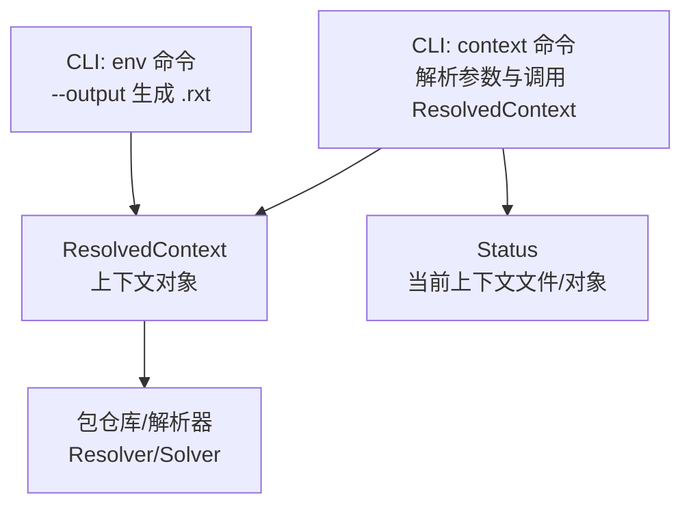
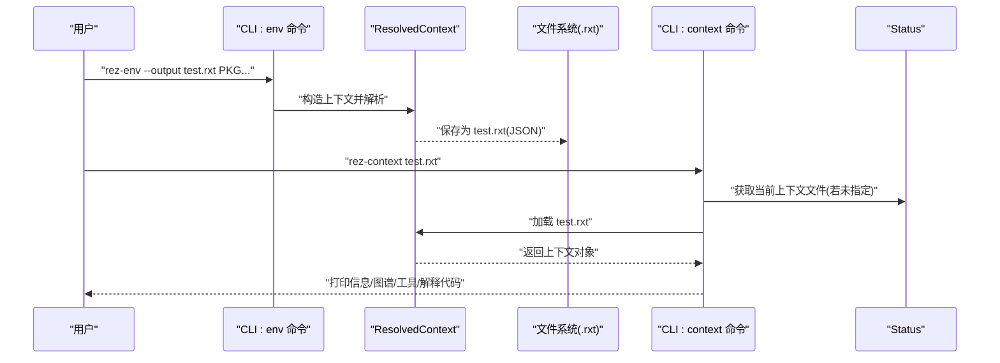
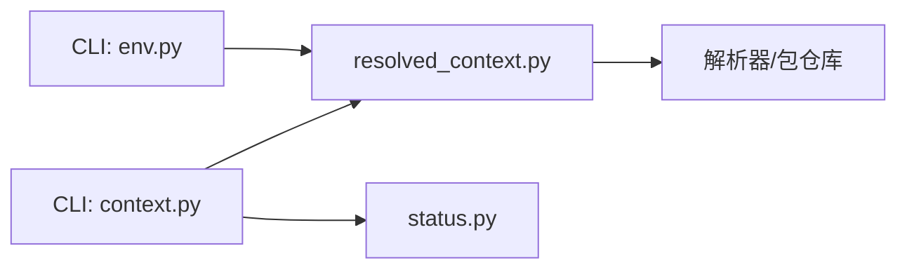

# context 命令

<cite>
**本文引用的文件列表**
- [context.py](file://rez-3.3.0/src/rez/cli/context.py)
- [resolved_context.py](file://rez-3.3.0/src/rez/resolved_context.py)
- [context.rst](file://rez-3.3.0/docs/source/context.rst)
- [status.py](file://rez-3.3.0/src/rez/status.py)
- [env.py](file://rez-3.3.0/src/rez/cli/env.py)
- [test_context.py](file://rez-3.3.0/src/rez/tests/test_context.py)
</cite>

## 目录
1. [简介](#简介)
2. [项目结构与定位](#项目结构与定位)
3. [核心组件](#核心组件)
4. [架构总览](#架构总览)
5. [详细组件分析](#详细组件分析)
6. [依赖关系分析](#依赖关系分析)
7. [性能与缓存优化](#性能与缓存优化)
8. [故障排查与依赖冲突](#故障排查与依赖冲突)
9. [结论](#结论)
10. [附录：常用示例与参数速查](#附录常用示例与参数速查)

## 简介
本篇文档围绕 Rez 的 context 命令展开，系统性说明其核心功能、工作原理、参数用法、与解析后环境上下文（resolved context）的关系，以及在实际工程中的使用方式。context 命令用于“检查/分析”一个已存在的 .rxt 上下文文件，或在当前解析环境中进行上下文信息的打印、工具列表、图谱输出等；而“创建并保存 .rxt”的能力主要由 rez-env 的 --output 选项实现。本文将结合源码与官方文档，给出可操作的实践建议与排障思路。

## 项目结构与定位
- CLI 层：context 命令位于 CLI 子模块中，负责解析参数、加载 .rxt 并执行相应展示/分析逻辑。
- 核心模型层：ResolvedContext 是上下文的核心对象，封装了请求、解析结果、统计信息、图谱、序列化/反序列化等能力。
- 状态与环境：Status 提供当前上下文文件路径与上下文对象的访问；env 命令提供创建/加载 .rxt 的能力。

图表来源
- [context.py](file://rez-3.3.0/src/rez/cli/context.py#L110-L196)
- [resolved_context.py](file://rez-3.3.0/src/rez/resolved_context.py#L126-L210)
- [status.py](file://rez-3.3.0/src/rez/status.py#L20-L47)
- [env.py](file://rez-3.3.0/src/rez/cli/env.py#L67-L75)

章节来源
- [context.py](file://rez-3.3.0/src/rez/cli/context.py#L110-L196)
- [resolved_context.py](file://rez-3.3.0/src/rez/resolved_context.py#L126-L210)
- [status.py](file://rez-3.3.0/src/rez/status.py#L20-L47)
- [env.py](file://rez-3.3.0/src/rez/cli/env.py#L67-L75)

## 核心组件
- CLI context 命令：负责解析参数、加载 .rxt 文件、打印信息、生成/查看图谱、比较上下文、解释上下文为 shell 代码或环境字典等。
- ResolvedContext：封装解析请求、解析结果、统计、图谱、序列化/反序列化、工具查询、环境解释等。
- Status：提供当前上下文文件路径与上下文对象的访问。
- env 命令：通过 --output 将解析后的上下文写入 .rxt 文件，供后续 context 命令分析或 rez-env 加载。

章节来源
- [context.py](file://rez-3.3.0/src/rez/cli/context.py#L110-L196)
- [resolved_context.py](file://rez-3.3.0/src/rez/resolved_context.py#L126-L210)
- [status.py](file://rez-3.3.0/src/rez/status.py#L20-L47)
- [env.py](file://rez-3.3.0/src/rez/cli/env.py#L67-L75)

## 架构总览
下面以“生成 .rxt 与分析 .rxt”的视角，展示关键流程与组件交互。

图表来源
- [env.py](file://rez-3.3.0/src/rez/cli/env.py#L67-L75)
- [resolved_context.py](file://rez-3.3.0/src/rez/resolved_context.py#L652-L665)
- [context.py](file://rez-3.3.0/src/rez/cli/context.py#L118-L127)
- [status.py](file://rez-3.3.0/src/rez/status.py#L20-L47)

## 详细组件分析

### CLI context 命令
- 功能概览
  - 加载 .rxt 文件（支持从标准输入读取）
  - 打印请求列表、解析列表、工具列表、依赖图/解析图、图谱字符串/图像
  - 对比当前上下文与另一个 .rxt，或重新解析当前请求以对比
  - 解释上下文为 shell 代码或环境字典/表格/JSON
- 关键参数（节选）
  - --req/--print-request：仅打印请求列表（不含隐式）
  - --res/--print-resolve：仅打印解析列表，配合 --su 可打印 URI
  - --so/--source-order：按排序顺序打印，而非字母序
  - --su/--show-uris：打印 URI 而非根路径
  - -t/--tools：打印上下文中可用的可执行工具
  - --which CMD：在上下文中定位程序路径
  - -g/--graph、-d/--dependency-graph、--pg/--print-graph、--wg/--write-graph：图谱相关
  - --pp/--prune-package：裁剪图到指定包
  - -i/--interpret：解释上下文并输出代码
  - -f/--format：解释格式（dict/table/json 或 shell 类型）
  - -s/--style：代码输出风格（与 --interpret 配合）
  - --no-env：在空环境上解释
  - --diff RXT：与另一个 .rxt 对比
  - --fetch：与重新解析的当前上下文对比
  - RXT：上下文文件位置（缺省使用当前上下文）

章节来源
- [context.py](file://rez-3.3.0/src/rez/cli/context.py#L28-L108)
- [context.py](file://rez-3.3.0/src/rez/cli/context.py#L110-L196)

### ResolvedContext 上下文对象
- 职责
  - 执行解析（Resolver/Solver）、记录统计、维护图谱、序列化/反序列化、工具查询、环境解释
  - 支持 retargeted（重定向变体）、patch 请求、diff 比较、图谱读取/写出
- 关键能力
  - 保存/加载：save/load/write_to_buffer/read_from_buffer
  - 图谱：graph()/has_graph/get_dependency_graph 等
  - 工具：print_tools/get_tools/get_tool_variants/which
  - 环境：get_environ/get_shell_code/print_info
  - 比较：get_resolve_diff/print_resolve_diff

章节来源
- [resolved_context.py](file://rez-3.3.0/src/rez/resolved_context.py#L652-L701)
- [resolved_context.py](file://rez-3.3.0/src/rez/resolved_context.py#L800-L900)
- [resolved_context.py](file://rez-3.3.0/src/rez/resolved_context.py#L900-L1000)

### Status 当前上下文
- 提供当前上下文文件路径（REZ_RXT_FILE）与上下文对象的便捷访问
- 用于 context 命令在未显式传入 .rxt 时，自动定位当前上下文

章节来源
- [status.py](file://rez-3.3.0/src/rez/status.py#L20-L47)

### env 命令与 .rxt 生成
- 通过 --output 将解析后的上下文写入 .rxt 文件，供后续 context 命令分析或 rez-env 加载
- 通过 --input 使用已有 .rxt 文件直接进入环境

章节来源
- [env.py](file://rez-3.3.0/src/rez/cli/env.py#L67-L75)

## 依赖关系分析
- CLI context 依赖 ResolvedContext 进行加载与展示
- CLI context 依赖 Status 获取当前上下文文件
- env 命令与 ResolvedContext 共同完成 .rxt 的创建与保存
- ResolvedContext 依赖解析器（Resolver/Solver）、包仓库、图工具、序列化工具等

图表来源
- [context.py](file://rez-3.3.0/src/rez/cli/context.py#L110-L196)
- [resolved_context.py](file://rez-3.3.0/src/rez/resolved_context.py#L126-L210)
- [status.py](file://rez-3.3.0/src/rez/status.py#L20-L47)
- [env.py](file://rez-3.3.0/src/rez/cli/env.py#L67-L75)

## 性能与缓存优化
- 解析缓存
  - ResolvedContext 构造时可启用解析缓存（resolve_caching），并在成功解析后更新包缓存
  - 可通过配置项控制是否启用包缓存、异步缓存等
- 回调与超时
  - 支持 max_fails/time_limit 控制解析过程的失败次数与耗时上限
- 图谱处理
  - 大规模图谱建议使用 --write-graph 输出 DOT/图像，避免长文本打印带来的 I/O 压力
- 重复解析
  - 若需要频繁对比同一组请求，建议先用 env --output 保存 .rxt，再用 context --diff 对比，避免重复解析

章节来源
- [resolved_context.py](file://rez-3.3.0/src/rez/resolved_context.py#L165-L211)
- [resolved_context.py](file://rez-3.3.0/src/rez/resolved_context.py#L296-L348)

## 故障排查与依赖冲突
- 常见问题
  - 未在解析环境中运行 context：当未设置 REZ_RXT_FILE 且未显式传入 .rxt 时，会提示不在解析环境中
  - 图谱不可用：若上下文未包含图谱，将提示无法显示
  - 工具未找到：--which 会在上下文中查找程序，找不到会提示
  - 比较失败：当两个上下文的包搜索路径不一致时，diff 会报错
- 排查步骤
  - 使用 --fetch 对比当前上下文与重新解析的结果，定位是否因包仓库变更导致
  - 使用 --diff 对比两个 .rxt，关注新增/删除/版本变化
  - 使用 --dependency-graph 或 --graph 输出图谱，结合 --prune-package 定位冲突点
  - 使用 --stats（在 env 命令中）查看解析统计，辅助判断解析瓶颈
- 依赖冲突定位
  - 结合图谱裁剪（--prune-package）与版本范围迭代，确认冲突来源包
  - 使用 get_resolve_diff 打印差异集合，逐项核对版本范围与可用包

章节来源
- [context.py](file://rez-3.3.0/src/rez/cli/context.py#L128-L179)
- [resolved_context.py](file://rez-3.3.0/src/rez/resolved_context.py#L711-L796)

## 结论
- context 命令专注于“分析/检查”已有的 .rxt 上下文，提供丰富的展示与对比能力
- .rxt 的创建与保存由 env 命令完成，二者配合形成“创建—分析—复用”的闭环
- 在大型工程中，建议通过 --output 保存关键环境快照，并用 --diff/图谱进行持续验证与回归

## 附录：常用示例与参数速查

- 生成并保存 .rxt（由 env 命令完成）
  - 示例：创建并输出到文件
    - 参考路径：[env.py](file://rez-3.3.0/src/rez/cli/env.py#L67-L75)
  - 示例：输出到标准输出
    - 参考路径：[env.py](file://rez-3.3.0/src/rez/cli/env.py#L67-L75)

- 分析 .rxt（context 命令）
  - 打印解析列表
    - 参考路径：[context.py](file://rez-3.3.0/src/rez/cli/context.py#L140-L148)
  - 打印工具列表
    - 参考路径：[context.py](file://rez-3.3.0/src/rez/cli/context.py#L148-L150)
  - 定位程序路径
    - 参考路径：[context.py](file://rez-3.3.0/src/rez/cli/context.py#L158-L165)
  - 输出图谱（字符串/图像）
    - 参考路径：[context.py](file://rez-3.3.0/src/rez/cli/context.py#L165-L175)
  - 对比上下文
    - 参考路径：[context.py](file://rez-3.3.0/src/rez/cli/context.py#L150-L158)
  - 重新解析对比
    - 参考路径：[context.py](file://rez-3.3.0/src/rez/cli/context.py#L153-L158)

- 参数速查（节选）
  - --req/--print-request：仅打印请求列表
  - --res/--print-resolve：仅打印解析列表
  - --su/--show-uris：打印 URI
  - -t/--tools：打印工具
  - --which：定位程序
  - -g/-d/--graph/--dependency-graph/--print-graph/--write-graph：图谱相关
  - --pp/--prune-package：裁剪图
  - -i/--interpret：解释上下文
  - -f/--format：解释格式（dict/table/json 或 shell 类型）
  - -s/--style：代码输出风格
  - --no-env：空环境解释
  - --diff/--fetch：对比上下文
  - RXT：上下文文件（缺省使用当前上下文）

章节来源
- [context.py](file://rez-3.3.0/src/rez/cli/context.py#L28-L108)
- [context.py](file://rez-3.3.0/src/rez/cli/context.py#L110-L196)
- [env.py](file://rez-3.3.0/src/rez/cli/env.py#L67-L75)