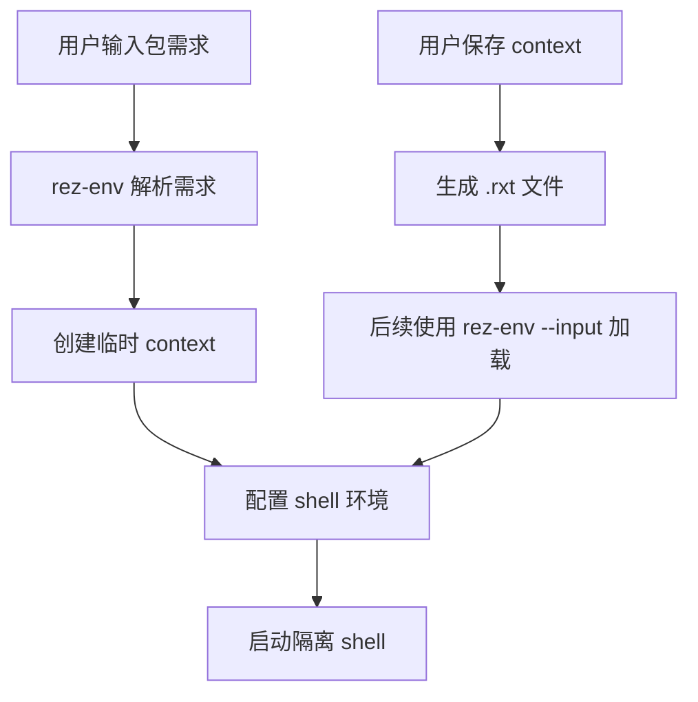
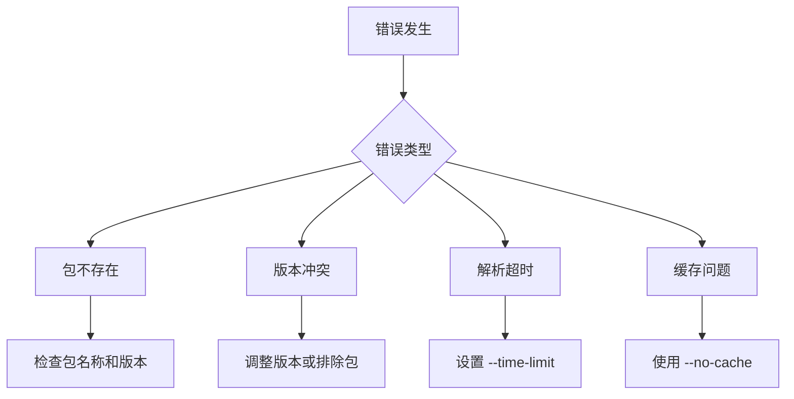

# env 命令

<cite>
**本文档引用的文件**  
- [env.py](file://rez-3.3.0\src\rez\cli\env.py)
- [context.rst](file://rez-3.3.0\docs/source/context.rst)
- [environment.rst](file://rez-3.3.0\docs/source/environment.rst)
</cite>

## 目录
1. [简介](#简介)
2. [核心功能](#核心功能)
3. [关键参数](#关键参数)
4. [典型使用示例](#典型使用示例)
5. [与 context 命令的关系](#与-context-命令的关系)
6. [故障排除指南](#故障排除指南)
7. [结论](#结论)

## 简介
`env` 命令是 Rez 包管理系统中的核心命令之一，用于基于包需求或已保存的上下文启动一个临时的、隔离的 shell 环境。该命令允许用户在不永久修改系统环境的情况下，快速配置和使用特定的软件包组合。

**Section sources**
- [env.py](file://rez-3.3.0\src\rez\cli\env.py#L1-L279)

## 核心功能
`env` 命令的核心作用是创建一个临时的、隔离的 shell 环境。它通过解析用户指定的包需求或加载已保存的上下文文件（.rxt）来配置环境。该环境包含所有必要的环境变量和路径设置，确保指定的软件包可以正确运行。

当使用 `rez-env` 命令时，实际上会创建一个称为 *context* 的对象。这个 context 存储了初始的包请求列表、解析结果（即选择的变体列表）以及显示解析过程的图。context 本身很小，以 JSON 格式存储在扩展名为 `.rxt` 的文件中。

**Section sources**
- [env.py](file://rez-3.3.0\src\rez\cli\env.py#L1-L279)
- [context.rst](file://rez-3.3.0\docs/source/context.rst#L1-L112)

## 关键参数
`env` 命令支持多个关键参数，用于定制环境配置：

- `--shell`：指定目标 shell 类型。默认值由配置或系统 shell 决定。
- `--working-dir`：设置工作目录。此参数允许用户指定新 shell 的起始目录。
- `--no-bind`：避免绑定可执行文件。此选项防止将包中的可执行文件链接到环境的 PATH 中。
- `--input`：使用先前保存的上下文文件。此选项允许用户加载已解析的环境，而不是重新解析包需求。
- `--output`：将上下文存储到 .rxt 文件中，而不是启动交互式 shell。
- `--no-implicit`：不添加隐式包到请求中。
- `--no-local`：不加载本地包。

**Section sources**
- [env.py](file://rez-3.3.0\src\rez\cli\env.py#L10-L135)

## 典型使用示例
以下是一些 `env` 命令的典型使用示例：

```bash
# 启动包含 Python 3.7 和 numpy 1.21 的环境并运行脚本
rez-env python-3.7 numpy==1.21 -- python script.py

# 使用特定 shell 类型启动环境
rez-env --shell bash python-3.7 -- python script.py

# 设置工作目录
rez-env --working-dir /path/to/project python-3.7

# 避免绑定可执行文件
rez-env --no-bind python-3.7

# 将解析的上下文保存到文件
rez-env python-3.7 --output my_context.rxt

# 从保存的上下文文件加载环境
rez-env --input my_context.rxt
```

**Section sources**
- [env.py](file://rez-3.3.0\src\rez\cli\env.py#L146-L279)

## 与 context 命令的关系
`env` 命令与 `context` 命令密切相关。`env` 命令可以直接解析包需求或加载 .rxt 文件来创建环境。而 `context` 命令则用于检查和操作这些 .rxt 文件。

当使用 `rez-env` 创建环境时，会生成一个临时的 .rxt 文件。用户可以使用 `--output` 选项将此文件保存到磁盘，以便后续使用。然后，可以使用 `rez-context` 命令来检查这个文件的内容，或者使用 `rez-env --input` 来重新加载这个环境。



**Diagram sources**
- [context.rst](file://rez-3.3.0\docs/source/context.rst#L1-L112)
- [env.py](file://rez-3.3.0\src\rez\cli\env.py#L1-L279)

**Section sources**
- [context.rst](file://rez-3.3.0\docs/source/context.rst#L1-L112)

## 故障排除指南
在使用 `env` 命令时，可能会遇到一些常见问题。以下是这些问题的解决方法：

- **包不存在**：如果请求的包不存在，`env` 命令会显示错误信息并退出。请检查包名称和版本是否正确。
- **版本冲突**：当存在版本冲突时，解析器无法找到满足所有依赖关系的包组合。错误信息会显示冲突的包和版本。可以尝试调整包版本或使用 `--exclude` 参数排除某些包。
- **解析超时**：如果解析过程耗时过长，可以使用 `--time-limit` 参数设置超时时间。超过此时间后，解析将中止。
- **缓存问题**：如果遇到意外的解析结果，可以使用 `--no-cache` 参数禁用缓存，强制重新解析。



**Diagram sources**
- [env.py](file://rez-3.3.0\src\rez\cli\env.py#L146-L279)

**Section sources**
- [env.py](file://rez-3.3.0\src\rez\cli\env.py#L146-L279)

## 结论
`env` 命令是 Rez 包管理系统中用于创建临时、隔离 shell 环境的核心工具。它通过解析包需求或加载已保存的上下文来配置环境，支持多种参数以满足不同的使用场景。理解 `env` 命令的工作原理和与 `context` 命令的关系，对于有效使用 Rez 系统至关重要。