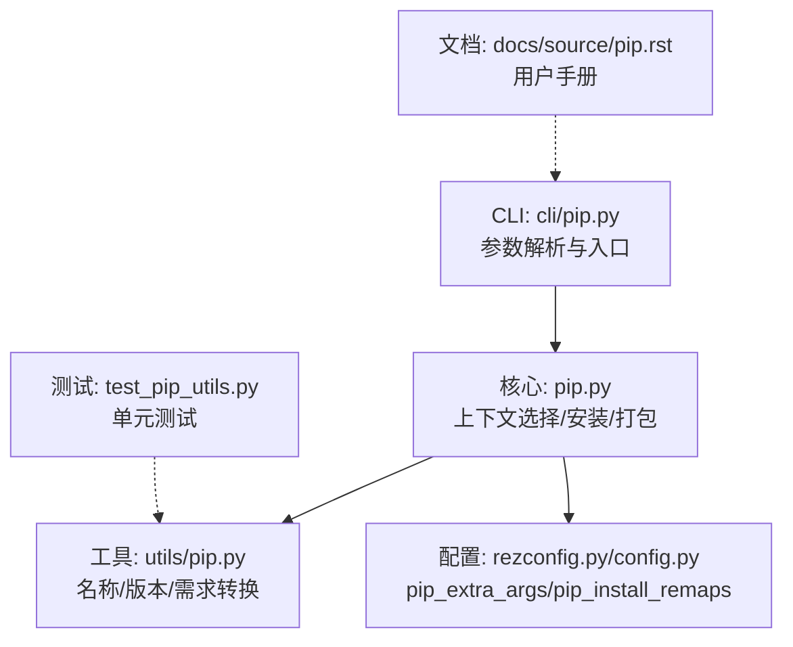
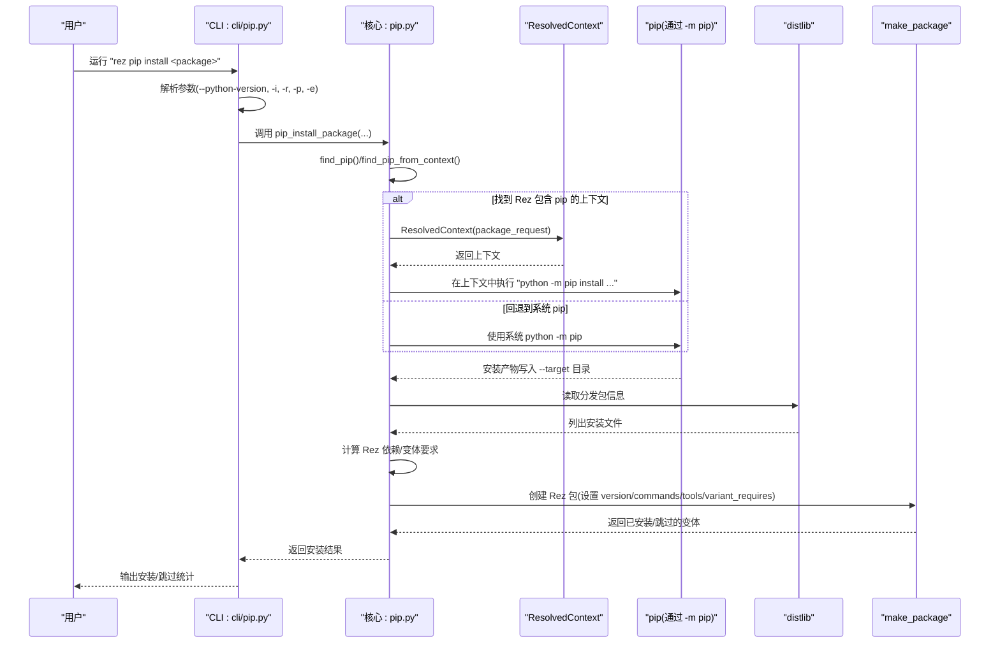
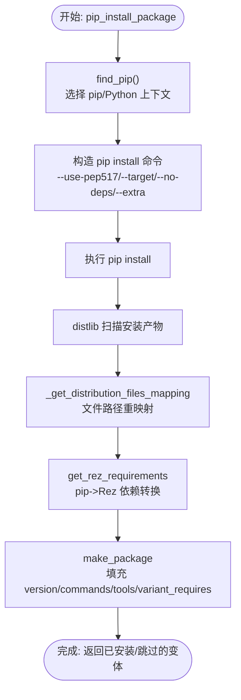
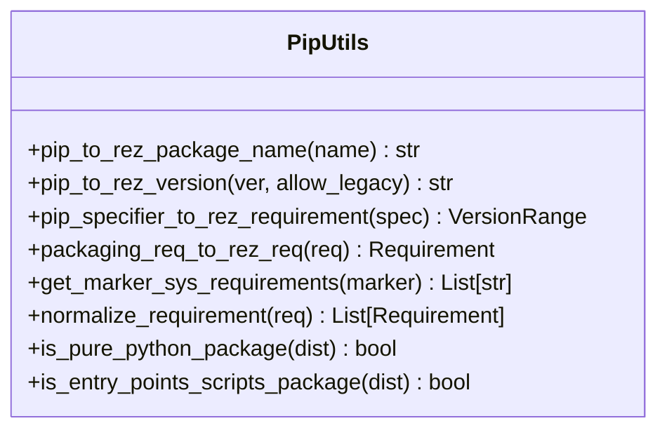
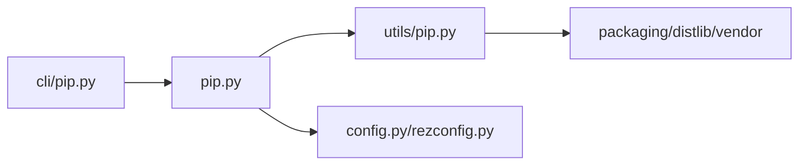

# pip 命令

<cite>
**本文引用的文件**
- [cli/pip.py](file://rez-3.3.0/src/rez/cli/pip.py)
- [pip.py](file://rez-3.3.0/src/rez/pip.py)
- [utils/pip.py](file://rez-3.3.0/src/rez/utils/pip.py)
- [pip.rst](file://rez-3.3.0/docs/source/pip.rst)
- [rezconfig.py](file://rez-3.3.0/src/rez/rezconfig.py)
- [config.py](file://rez-3.3.0/src/rez/config.py)
- [test_pip_utils.py](file://rez-3.3.0/src/rez/tests/test_pip_utils.py)
</cite>

## 目录
1. [简介](#简介)
2. [项目结构](#项目结构)
3. [核心组件](#核心组件)
4. [架构总览](#架构总览)
5. [详细组件分析](#详细组件分析)
6. [依赖关系分析](#依赖关系分析)
7. [性能考量](#性能考量)
8. [故障排查指南](#故障排查指南)
9. [结论](#结论)
10. [附录](#附录)

## 简介
本文件系统性地文档化 Rez 内置的 pip 命令，解释其作为 Rez 环境内 Python 包安装代理的工作机制。Rez 使用该命令将 pip 兼容的 Python 包及其依赖转换为 Rez 包，从而纳入 Rez 的版本解析、变体管理和环境构建流程。文档覆盖：
- 支持的子命令与参数（如 install、--python-version、--release、--prefix、--extra）
- 与标准 pip 的差异（在 Rez 管理的环境中运行，自动记录依赖并生成 Rez 包）
- 安装流程与关键步骤（选择 pip/Python 上下文、调用 pip、解析依赖、生成 Rez 包）
- 与 package.py 中 python_requires 字段的协同方式（通过 pip 元数据推导 Rez 依赖）
- 配置项（pip_extra_args、pip_install_remaps）对安装行为的影响
- 示例：rez pip install requests

## 项目结构
Rez 的 pip 命令由 CLI 解析层与核心实现层组成：
- CLI 层负责参数解析与入口调用
- 核心实现层负责定位 pip/Python 上下文、执行 pip 安装、解析依赖、生成 Rez 包
- 工具层提供 pip 元数据到 Rez 语义的转换逻辑
- 文档与配置定义了可用参数、默认行为与可调参数

图表来源
- [cli/pip.py](file://rez-3.3.0/src/rez/cli/pip.py#L1-L58)
- [pip.py](file://rez-3.3.0/src/rez/pip.py#L236-L477)
- [utils/pip.py](file://rez-3.3.0/src/rez/utils/pip.py#L28-L144)
- [rezconfig.py](file://rez-3.3.0/src/rez/rezconfig.py#L920-L967)
- [config.py](file://rez-3.3.0/src/rez/config.py#L393-L394)
- [pip.rst](file://rez-3.3.0/docs/source/pip.rst#L1-L144)
- [test_pip_utils.py](file://rez-3.3.0/src/rez/tests/test_pip_utils.py#L1-L359)

章节来源
- [cli/pip.py](file://rez-3.3.0/src/rez/cli/pip.py#L1-L58)
- [pip.py](file://rez-3.3.0/src/rez/pip.py#L236-L477)
- [utils/pip.py](file://rez-3.3.0/src/rez/utils/pip.py#L28-L144)
- [rezconfig.py](file://rez-3.3.0/src/rez/rezconfig.py#L920-L967)
- [config.py](file://rez-3.3.0/src/rez/config.py#L393-L394)
- [pip.rst](file://rez-3.3.0/docs/source/pip.rst#L1-L144)
- [test_pip_utils.py](file://rez-3.3.0/src/rez/tests/test_pip_utils.py#L1-L359)

## 核心组件
- CLI 层（cli/pip.py）
  - 定义参数：--python-version、-i/--install、-r/--release、-p/--prefix、-e/--extra、PACKAGE
  - 校验仅支持 --install；将参数透传至核心安装函数
- 核心层（pip.py）
  - 选择 pip/Python 上下文（优先从 Rez 包解析，回退到系统 pip）
  - 构造 pip install 命令（默认 --use-pep517、--target 指向临时目录、可选 --no-deps）
  - 执行 pip 并收集结果分发包（distlib），映射文件路径，生成 Rez 包
  - 将 pip 依赖转换为 Rez 依赖（含系统要求与变体要求）
- 工具层（utils/pip.py）
  - 分发包名/版本到 Rez 名称/版本的转换
  - PEP440 规范到 Rez 版本范围的等价转换
  - 环境标记到系统要求（platform/arch/python）的提取
  - 条件 extras 的规范化处理
- 配置层（rezconfig.py/config.py）
  - pip_extra_args：额外透传给 pip install 的参数
  - pip_install_remaps：针对未知父目录路径的重映射规则，保证文件复制正确

章节来源
- [cli/pip.py](file://rez-3.3.0/src/rez/cli/pip.py#L12-L58)
- [pip.py](file://rez-3.3.0/src/rez/pip.py#L236-L477)
- [utils/pip.py](file://rez-3.3.0/src/rez/utils/pip.py#L28-L144)
- [utils/pip.py](file://rez-3.3.0/src/rez/utils/pip.py#L368-L519)
- [rezconfig.py](file://rez-3.3.0/src/rez/rezconfig.py#L920-L967)
- [config.py](file://rez-3.3.0/src/rez/config.py#L393-L394)

## 架构总览
Rez pip 命令的核心流程如下：

图表来源
- [cli/pip.py](file://rez-3.3.0/src/rez/cli/pip.py#L37-L58)
- [pip.py](file://rez-3.3.0/src/rez/pip.py#L236-L477)
- [pip.py](file://rez-3.3.0/src/rez/pip.py#L46-L119)
- [pip.py](file://rez-3.3.0/src/rez/pip.py#L154-L234)
- [utils/pip.py](file://rez-3.3.0/src/rez/utils/pip.py#L368-L519)

## 详细组件分析

### CLI 参数与入口
- 支持的关键参数
  - --python-version：指定用于安装的 Python Rez 包版本（默认最新）
  - -i/--install：安装模式（当前仅支持）
  - -r/--release：发布到发布仓库；否则安装到本地仓库
  - -p/--prefix：自定义包仓库路径
  - -e/--extra：透传给 pip install 的额外参数（会覆盖预设参数）
  - PACKAGE：待安装的包名或源码/URL
- 行为要点
  - 仅接受 --install；未满足时报错
  - 将 --verbose 映射到全局调试开关，影响日志级别与内部调试输出

章节来源
- [cli/pip.py](file://rez-3.3.0/src/rez/cli/pip.py#L12-L58)

### 核心安装流程（pip.py）
- 上下文选择
  - 优先从指定或最新 Python Rez 包解析 pip；若存在则在该上下文中执行 pip
  - 若未找到，则尝试解析 pip Rez 包；仍失败则回退到 Rez 自带虚拟环境中的 pip
  - 对 pip 版本有硬性要求（>=19）
- pip 命令构造
  - 默认启用 --use-pep517
  - 默认使用 --target 指向临时目录
  - 可选 --no-deps（当 mode=no_deps 且未显式传入）
  - 合并 --extra 与 config.pip_extra_args
- 安装与产物处理
  - 执行 pip install，收集安装产物
  - 使用 distlib 读取分发包元数据，列出安装文件
  - 通过 _get_distribution_files_mapping 将 pip 安装路径映射到 Rez 包结构
  - 逐个分发包创建 Rez 包：设置 version、description、requires、variant_requires、commands、hashed_variants 等
  - 自动识别可执行脚本并注入 PATH
  - 记录 pip 名称、来源、纯 Python 标记等元信息
- 依赖转换
  - 通过 utils/pip.get_rez_requirements 将 pip run_requires 转换为 Rez 依赖
  - 处理环境标记（python_version、platform_machine 等）生成系统变体要求
  - 处理条件 extras 与大小写不一致的包名映射

图表来源
- [pip.py](file://rez-3.3.0/src/rez/pip.py#L236-L477)
- [pip.py](file://rez-3.3.0/src/rez/pip.py#L46-L119)
- [pip.py](file://rez-3.3.0/src/rez/pip.py#L484-L575)
- [utils/pip.py](file://rez-3.3.0/src/rez/utils/pip.py#L368-L519)

章节来源
- [pip.py](file://rez-3.3.0/src/rez/pip.py#L236-L477)
- [pip.py](file://rez-3.3.0/src/rez/pip.py#L46-L119)
- [pip.py](file://rez-3.3.0/src/rez/pip.py#L484-L575)

### 依赖转换与变体要求（utils/pip.py）
- 名称与版本转换
  - pip_to_rez_package_name：将连字符替换为下划线，避免 Rez 包名非法
  - pip_to_rez_version：将 PEP440 版本转换为 Rez 兼容格式（epoch/local 等处理）
- 规范化与等价转换
  - pip_specifier_to_rez_requirement：将 PEP440 规范符转换为 Rez 版本范围（考虑 ~=、!=、== 等）
  - packaging_req_to_rez_req：将 packaging Requirement 转为 Rez Requirement（忽略 extras）
- 环境标记与系统要求
  - get_marker_sys_requirements：从环境标记中提取平台/架构/Python 等系统要求
  - normalize_requirement：规范化字符串/字典形式的依赖声明，分离条件 extras
- 纯 Python 与入口点脚本
  - is_pure_python_package：基于 WHEEL 元数据判断是否纯 Python
  - is_entry_points_scripts_package：检测是否生成控制台/GUI 脚本

图表来源
- [utils/pip.py](file://rez-3.3.0/src/rez/utils/pip.py#L28-L144)
- [utils/pip.py](file://rez-3.3.0/src/rez/utils/pip.py#L146-L289)
- [utils/pip.py](file://rez-3.3.0/src/rez/utils/pip.py#L291-L367)
- [utils/pip.py](file://rez-3.3.0/src/rez/utils/pip.py#L368-L519)
- [utils/pip.py](file://rez-3.3.0/src/rez/utils/pip.py#L521-L754)

章节来源
- [utils/pip.py](file://rez-3.3.0/src/rez/utils/pip.py#L28-L144)
- [utils/pip.py](file://rez-3.3.0/src/rez/utils/pip.py#L146-L289)
- [utils/pip.py](file://rez-3.3.0/src/rez/utils/pip.py#L291-L367)
- [utils/pip.py](file://rez-3.3.0/src/rez/utils/pip.py#L368-L519)
- [utils/pip.py](file://rez-3.3.0/src/rez/utils/pip.py#L521-L754)

### 配置项与行为定制
- pip_extra_args
  - 类型：可选字符串列表
  - 作用：为 pip install 添加额外参数（会被 --extra 覆盖）
  - 默认值：空列表
- pip_install_remaps
  - 类型：有序重映射规则
  - 作用：当 pip 安装记录中的相对路径无法直接对应时，通过正则表达式与模板进行路径重映射，确保文件被复制到 Rez 包的正确位置
  - 默认规则：包含典型二进制与库路径的重映射

章节来源
- [config.py](file://rez-3.3.0/src/rez/config.py#L393-L394)
- [rezconfig.py](file://rez-3.3.0/src/rez/rezconfig.py#L920-L967)

### 与 package.py 的协同（python_requires）
- Rez 通过 pip 元数据推导依赖，而非直接读取 package.py 的 python_requires 字段
- 实际上，pip 安装后会读取分发包的元数据（如 Requires-Dist、Environment Marker 等），并通过 utils/pip.get_rez_requirements 转换为 Rez 的 requires/variant_requires
- 由于 Rez 的变体系统会根据系统要求（platform/arch/python）生成变体，因此安装时指定的 --python-version 会直接影响生成的变体要求（例如 python-3.10）

章节来源
- [utils/pip.py](file://rez-3.3.0/src/rez/utils/pip.py#L368-L519)
- [pip.py](file://rez-3.3.0/src/rez/pip.py#L308-L316)

### 与标准 pip 的区别
- Rez pip 在 Rez 管理的环境中运行，优先使用 Rez 化的 Python/pip，确保与目标 Python 版本严格匹配
- 安装完成后，自动将 pip 包转换为 Rez 包，记录依赖并生成变体，纳入 Rez 的解析与环境构建
- 提供 --release 与 --prefix 控制安装位置，便于团队共享与版本管理

章节来源
- [pip.rst](file://rez-3.3.0/docs/source/pip.rst#L1-L144)
- [pip.py](file://rez-3.3.0/src/rez/pip.py#L236-L477)

## 依赖关系分析
- 组件耦合
  - CLI 仅负责参数与入口，低耦合
  - 核心层依赖上下文解析、distlib、make_package 等
  - 工具层提供跨模块复用的转换逻辑
- 外部依赖
  - pip（通过 -m pip）、distlib、packaging、setuptools/importlib.metadata
- 潜在循环
  - 无直接循环；各层职责清晰

图表来源
- [cli/pip.py](file://rez-3.3.0/src/rez/cli/pip.py#L37-L58)
- [pip.py](file://rez-3.3.0/src/rez/pip.py#L236-L477)
- [utils/pip.py](file://rez-3.3.0/src/rez/utils/pip.py#L28-L144)
- [config.py](file://rez-3.3.0/src/rez/config.py#L393-L394)
- [rezconfig.py](file://rez-3.3.0/src/rez/rezconfig.py#L920-L967)

章节来源
- [cli/pip.py](file://rez-3.3.0/src/rez/cli/pip.py#L37-L58)
- [pip.py](file://rez-3.3.0/src/rez/pip.py#L236-L477)
- [utils/pip.py](file://rez-3.3.0/src/rez/utils/pip.py#L28-L144)
- [config.py](file://rez-3.3.0/src/rez/config.py#L393-L394)
- [rezconfig.py](file://rez-3.3.0/src/rez/rezconfig.py#L920-L967)

## 性能考量
- 临时目录与文件复制
  - 安装产物写入临时目录，再复制到 Rez 包根目录，避免直接写入仓库
- 依赖解析复杂度
  - 依赖转换涉及多轮解析与规范化，建议在 CI 中缓存 Rez 包仓库以减少重复安装
- 变体生成
  - 纯 Python 包通常只生成一个变体；非纯 Python 包会按 platform/arch/python 生成多个变体，注意变体数量对解析时间的影响

[本节为通用指导，无需特定文件来源]

## 故障排查指南
- pip 版本不足
  - 现象：提示需要 pip>=19
  - 处理：升级 pip 或使用 Rez 化的 pip
- 未找到 pip
  - 现象：回退到 Rez 自带虚拟环境中的 pip
  - 处理：确认已安装 pip 到目标 Python 解释器
- 未知父目录路径
  - 现象：提示未知源文件路径，需添加 pip_install_remaps 规则
  - 处理：根据错误提示在配置中新增重映射规则
- 条件 extras/环境标记
  - 现象：某些依赖可能被忽略或转换为变体要求
  - 处理：检查环境标记与 extras 的兼容性；必要时手动调整 Rez 包的变体要求
- 依赖冲突
  - 现象：解析阶段出现冲突
  - 处理：检查 Rez 依赖范围与 pip 元数据的等价转换结果

章节来源
- [pip.py](file://rez-3.3.0/src/rez/pip.py#L46-L119)
- [pip.py](file://rez-3.3.0/src/rez/pip.py#L508-L551)
- [utils/pip.py](file://rez-3.3.0/src/rez/utils/pip.py#L521-L754)
- [pip.rst](file://rez-3.3.0/docs/source/pip.rst#L1-L144)

## 结论
Rez 的 pip 命令将 pip 的生态无缝接入 Rez 的包管理与环境构建体系。通过在 Rez 管理的环境中执行 pip 安装，并将 pip 元数据转换为 Rez 依赖与变体，实现了：
- 严格的 Python 版本与实现一致性
- 自动化的依赖记录与变体生成
- 可配置的安装参数与路径重映射
- 与 Rez 生态（解析、变体、环境）的深度集成

对于使用者而言，推荐：
- 明确目标 Python 版本并使用 --python-version
- 使用 --release 发布到共享仓库
- 遇到路径问题时通过 pip_install_remaps 进行修正
- 通过 pip_extra_args 传递必要的安装参数

[本节为总结，无需特定文件来源]

## 附录

### 常用示例
- 安装 requests 到本地仓库（使用最新 Python）
  - 示例命令：rez pip install requests
- 安装并发布到发布仓库
  - 示例命令：rez pip -i -r requests
- 指定 Python 版本安装
  - 示例命令：rez pip --python-version 3.10 -i requests
- 透传额外参数
  - 示例命令：rez pip -i -e --no-cache-dir requests

章节来源
- [pip.rst](file://rez-3.3.0/docs/source/pip.rst#L1-L144)
- [cli/pip.py](file://rez-3.3.0/src/rez/cli/pip.py#L12-L58)

### 关键 API 与路径
- CLI 入口与参数
  - [cli/pip.py](file://rez-3.3.0/src/rez/cli/pip.py#L12-L58)
- 安装主流程
  - [pip.py](file://rez-3.3.0/src/rez/pip.py#L236-L477)
- 依赖转换工具
  - [utils/pip.py](file://rez-3.3.0/src/rez/utils/pip.py#L368-L519)
- 配置项
  - [config.py](file://rez-3.3.0/src/rez/config.py#L393-L394)
  - [rezconfig.py](file://rez-3.3.0/src/rez/rezconfig.py#L920-L967)
- 用户手册
  - [pip.rst](file://rez-3.3.0/docs/source/pip.rst#L1-L144)
- 单元测试
  - [test_pip_utils.py](file://rez-3.3.0/src/rez/tests/test_pip_utils.py#L1-L359)