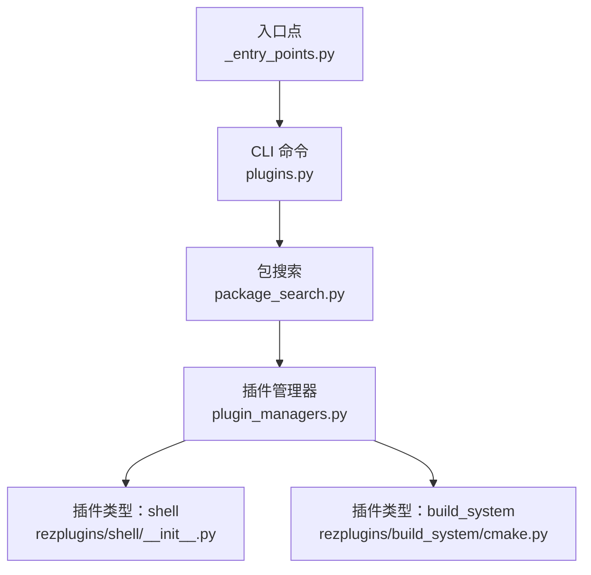
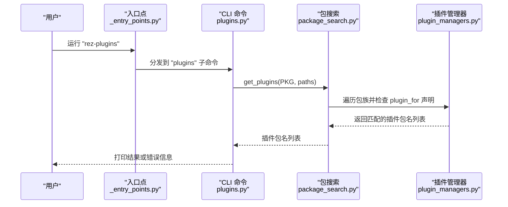
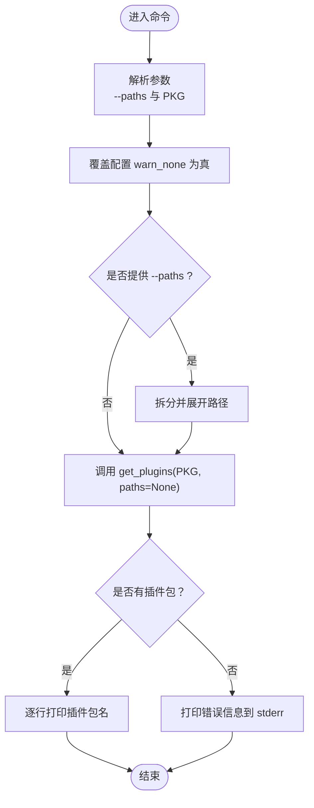
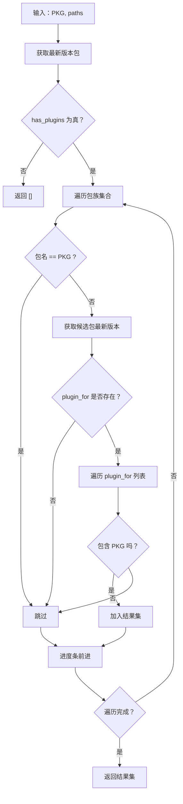
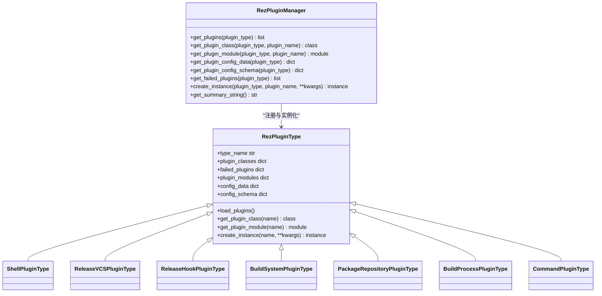

# plugins 命令

<cite>
**本文引用的文件**
- [plugins.py](file://rez-3.3.0/src/rez/cli/plugins.py)
- [package_search.py](file://rez-3.3.0/src/rez/package_search.py)
- [_entry_points.py](file://rez-3.3.0/src/rez/cli/_entry_points.py)
- [plugin_managers.py](file://rez-3.3.0/src/rez/plugin_managers.py)
- [shell/__init__.py](file://rez-3.3.0/src/rezplugins/shell/__init__.py)
- [build_system/cmake.py](file://rez-3.3.0/src/rezplugins/build_system/cmake.py)
- [config.py](file://rez-3.3.0/src/rez/config.py)
- [developing_your_own_plugin.rst](file://rez-3.3.0/docs/source/guides/developing_your_own_plugin.rst)
</cite>

## 目录
1. [简介](#简介)
2. [项目结构](#项目结构)
3. [核心组件](#核心组件)
4. [架构总览](#架构总览)
5. [详细组件分析](#详细组件分析)
6. [依赖关系分析](#依赖关系分析)
7. [性能考量](#性能考量)
8. [故障排查指南](#故障排查指南)
9. [结论](#结论)
10. [附录：使用示例与最佳实践](#附录使用示例与最佳实践)

## 简介
本文件面向 Rez 用户与开发者，系统化地文档化“plugins”命令，说明其用于列出、查询和管理 Rez 系统中“作为其他包插件”的包集合的能力。重点涵盖：
- 命令目标：查询某个包的所有“插件包”，即声明了对目标包进行“插件扩展”的包集合。
- 子命令：当前命令入口为“plugins”，其参数支持指定搜索路径与目标包名；未提供“list/info”等子命令，但可通过组合参数与输出格式化达到类似目的。
- 插件类型：Rez 插件系统包含多种类型（如 build_system、shell、release_vcs 等），这些类型由插件管理器统一加载与注册，便于开发者扩展 Rez 的功能边界。
- 调试与排障：通过配置开关与插件管理器提供的失败插件列表，定位插件加载问题。

## 项目结构
围绕“plugins”命令的相关文件组织如下：
- CLI 入口与路由：命令入口脚本将“rez-plugins”映射到“plugins”子命令。
- 命令实现：CLI 层负责解析参数并调用包搜索逻辑。
- 包搜索算法：根据目标包的“插件声明”反向查找所有“插件包”。
- 插件管理器：负责插件类型的注册、加载与失败记录，支撑调试与诊断。
- 插件类型示例：shell、build_system 等类型展示了 Rez 如何通过插件扩展功能。

图表来源
- [_entry_points.py](file://rez-3.3.0/src/rez/cli/_entry_points.py#L193-L197)
- [plugins.py](file://rez-3.3.0/src/rez/cli/plugins.py#L10-L42)
- [package_search.py](file://rez-3.3.0/src/rez/package_search.py#L129-L162)
- [plugin_managers.py](file://rez-3.3.0/src/rez/plugin_managers.py#L450-L506)
- [shell/__init__.py](file://rez-3.3.0/src/rezplugins/shell/__init__.py#L1-L7)
- [build_system/cmake.py](file://rez-3.3.0/src/rezplugins/build_system/cmake.py#L1-L200)

章节来源
- [plugins.py](file://rez-3.3.0/src/rez/cli/plugins.py#L10-L42)
- [_entry_points.py](file://rez-3.3.0/src/rez/cli/_entry_points.py#L193-L197)

## 核心组件
- CLI 命令“plugins”
  - 参数：支持通过“--paths”指定包搜索路径；位置参数“PKG”为目标包名。
  - 行为：调用包搜索函数，打印该包的所有“插件包”名称，若无则输出错误信息。
- 包搜索算法
  - 输入：目标包名与可选的包搜索路径。
  - 输出：返回所有声明“对目标包进行插件扩展”的包名列表。
- 插件管理器
  - 负责插件类型的注册与加载，维护成功与失败插件清单，提供汇总字符串以辅助调试。
- 插件类型
  - Rez 内置多种插件类型，如 shell、build_system、release_vcs、release_hook、package_repository、build_process、command 等，分别扩展不同领域的功能。

章节来源
- [plugins.py](file://rez-3.3.0/src/rez/cli/plugins.py#L10-L42)
- [package_search.py](file://rez-3.3.0/src/rez/package_search.py#L129-L162)
- [plugin_managers.py](file://rez-3.3.0/src/rez/plugin_managers.py#L371-L448)
- [plugin_managers.py](file://rez-3.3.0/src/rez/plugin_managers.py#L450-L506)

## 架构总览
“plugins”命令的执行流程从 CLI 入口开始，经由包搜索模块，最终回到插件管理器与插件类型系统，形成闭环。

图表来源
- [_entry_points.py](file://rez-3.3.0/src/rez/cli/_entry_points.py#L193-L197)
- [plugins.py](file://rez-3.3.0/src/rez/cli/plugins.py#L23-L42)
- [package_search.py](file://rez-3.3.0/src/rez/package_search.py#L129-L162)
- [plugin_managers.py](file://rez-3.3.0/src/rez/plugin_managers.py#L371-L448)

## 详细组件分析

### CLI 命令“plugins”
- 参数设计
  - “--paths”：允许显式传入包搜索路径，内部按分隔符拆分并展开用户路径。
  - “PKG”：必填的目标包名，用于查询其“插件包”集合。
- 行为细节
  - 覆盖配置项“warn_none”为真，确保在无插件时输出错误信息而非静默。
  - 调用包搜索函数获取结果，若有插件包则逐行打印，否则输出标准错误提示。

图表来源
- [plugins.py](file://rez-3.3.0/src/rez/cli/plugins.py#L10-L42)

章节来源
- [plugins.py](file://rez-3.3.0/src/rez/cli/plugins.py#L10-L42)

### 包搜索算法“get_plugins”
- 目标：找出所有声明“对目标包进行插件扩展”的包。
- 关键步骤
  - 获取目标包最新版本，若未声明“有插件”，直接返回空列表。
  - 遍历所有包族，跳过自身；对每个候选包检查其“plugin_for”字段，若包含目标包名，则加入结果集。
  - 使用进度条显示遍历进度，最后返回插件包名列表。

图表来源
- [package_search.py](file://rez-3.3.0/src/rez/package_search.py#L129-L162)

章节来源
- [package_search.py](file://rez-3.3.0/src/rez/package_search.py#L129-L162)

### 插件管理器与插件类型
- 插件管理器职责
  - 注册插件类型（如 shell、build_system、release_vcs 等）。
  - 统一加载各类型插件，收集成功与失败插件，提供汇总字符串辅助调试。
- 插件类型
  - Rez 将插件按类型组织，每种类型对应一个子包（如“rezplugins/shell”、“rezplugins/build_system”等）。
  - 插件命名空间包通过“extend_path”机制合并多处目录，实现插件路径扩展与覆盖优先级控制。
- 示例类型
  - shell：扩展不同目标 shell 的支持。
  - build_system：扩展构建系统能力（如 cmake、make 等）。

图表来源
- [plugin_managers.py](file://rez-3.3.0/src/rez/plugin_managers.py#L371-L448)
- [plugin_managers.py](file://rez-3.3.0/src/rez/plugin_managers.py#L450-L506)

章节来源
- [plugin_managers.py](file://rez-3.3.0/src/rez/plugin_managers.py#L371-L448)
- [plugin_managers.py](file://rez-3.3.0/src/rez/plugin_managers.py#L450-L506)
- [shell/__init__.py](file://rez-3.3.0/src/rezplugins/shell/__init__.py#L1-L7)
- [build_system/cmake.py](file://rez-3.3.0/src/rezplugins/build_system/cmake.py#L1-L200)

## 依赖关系分析
- CLI 与包搜索
  - CLI 仅负责参数解析与调用，包搜索负责业务逻辑。
- 包搜索与插件管理器
  - 包搜索不直接依赖插件管理器；它基于包元数据（如“plugin_for”）进行匹配。
- 插件管理器与插件类型
  - 插件管理器注册并加载各类型插件，类型之间相互独立，共同构成 Rez 的扩展能力。

图表来源
- [plugins.py](file://rez-3.3.0/src/rez/cli/plugins.py#L23-L42)
- [package_search.py](file://rez-3.3.0/src/rez/package_search.py#L129-L162)
- [plugin_managers.py](file://rez-3.3.0/src/rez/plugin_managers.py#L371-L448)

章节来源
- [plugins.py](file://rez-3.3.0/src/rez/cli/plugins.py#L23-L42)
- [package_search.py](file://rez-3.3.0/src/rez/package_search.py#L129-L162)
- [plugin_managers.py](file://rez-3.3.0/src/rez/plugin_managers.py#L371-L448)

## 性能考量
- 包搜索复杂度
  - 当前实现会遍历所有包族并对每个候选包检查“plugin_for”字段，时间复杂度与包数量线性相关。
  - 若包仓库规模较大，建议通过“--paths”缩小搜索范围，减少遍历成本。
- 加载与调试
  - 插件管理器在加载过程中会记录失败插件，便于定位问题；同时支持“debug_plugins”配置以输出详细日志。

章节来源
- [package_search.py](file://rez-3.3.0/src/rez/package_search.py#L129-L162)
- [config.py](file://rez-3.3.0/src/rez/config.py#L469-L492)

## 故障排查指南
- 常见问题
  - 无插件输出：确认目标包确实声明了“插件”，或检查“--paths”是否正确指向包含该包的路径。
  - 插件加载失败：使用“debug_plugins”配置开启详细日志，结合“get_failed_plugins”输出定位具体原因。
- 定位步骤
  - 开启调试：设置“debug_plugins”为真，重试命令以捕获加载异常堆栈。
  - 查看失败插件：通过插件管理器的失败插件列表，核对插件模块路径与报错信息。
  - 检查命名空间包：确认“extend_path”机制是否正确合并了多处插件目录。
- 参考实现
  - 插件管理器在加载失败时会记录错误，并在调试模式下打印堆栈，便于开发者快速定位问题。

章节来源
- [plugin_managers.py](file://rez-3.3.0/src/rez/plugin_managers.py#L177-L212)
- [config.py](file://rez-3.3.0/src/rez/config.py#L469-L492)

## 结论
“plugins”命令通过包搜索算法，帮助用户快速识别某个包的所有“插件包”。配合插件管理器的调试能力，开发者可以高效定位插件加载问题，保障 Rez 生态的稳定性与可扩展性。尽管命令本身未提供“list/info”等子命令，但其参数与输出足以满足日常查询与排障需求。

## 附录：使用示例与最佳实践
- 使用示例
  - 查询某包的所有插件包：运行“rez-plugins PKG”，其中 PKG 为目标包名。
  - 指定包搜索路径：运行“rez-plugins --paths PATH1:PATH2 PKG”，以缩小搜索范围。
- 最佳实践
  - 在大型仓库中优先使用“--paths”限定搜索路径，提升性能。
  - 开启“debug_plugins”以捕获插件加载异常，结合失败插件列表进行修复。
  - 对于自定义插件，遵循“developing_your_own_plugin”指南，确保模块结构与注册函数符合规范。

章节来源
- [plugins.py](file://rez-3.3.0/src/rez/cli/plugins.py#L10-L42)
- [developing_your_own_plugin.rst](file://rez-3.3.0/docs/source/guides/developing_your_own_plugin.rst#L1-L134)