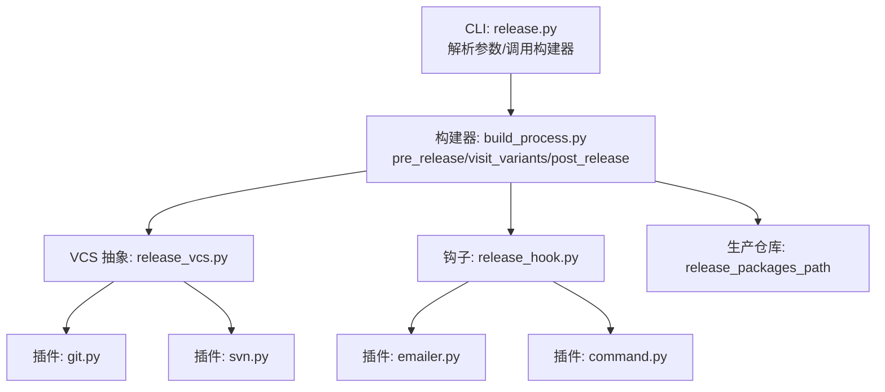
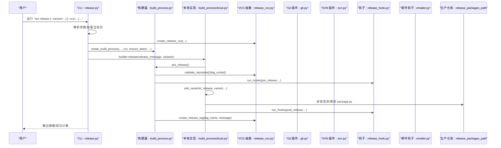
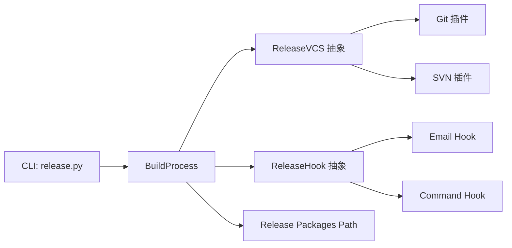
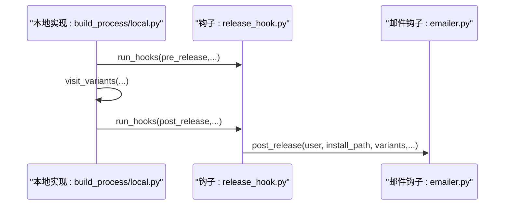

# release 命令

<cite>
**本文引用的文件**
- [src/rez/cli/release.py](file://src/rez/cli/release.py)
- [src/rez/build_process.py](file://src/rez/build_process.py)
- [src/rezplugins/build_process/local.py](file://src/rezplugins/build_process/local.py)
- [src/rez/release_vcs.py](file://src/rez/release_vcs.py)
- [src/rezplugins/release_vcs/git.py](file://src/rezplugins/release_vcs/git.py)
- [src/rezplugins/release_vcs/svn.py](file://src/rezplugins/release_vcs/svn.py)
- [src/rez/release_hook.py](file://src/rez/release_hook.py)
- [src/rezplugins/release_hook/emailer.py](file://src/rezplugins/release_hook/emailer.py)
- [src/rezplugins/release_hook/command.py](file://src/rezplugins/release_hook/command.py)
- [src/rezplugins/release_hook/rezconfig.py](file://src/rezplugins/release_hook/rezconfig.py)
- [docs/source/releasing_packages.rst](file://docs/source/releasing_packages.rst)
- [src/rez/tests/test_release.py](file://src/rez/tests/test_release.py)
</cite>

## 目录
1. [简介](#简介)
2. [项目结构](#项目结构)
3. [核心组件](#核心组件)
4. [架构总览](#架构总览)
5. [详细组件分析](#详细组件分析)
6. [依赖关系分析](#依赖关系分析)
7. [性能考量](#性能考量)
8. [故障排查指南](#故障排查指南)
9. [结论](#结论)
10. [附录](#附录)

## 简介
本文件系统性地文档化 Rez 的 release 命令，解释其将构建好的包发布到生产仓库的完整流程。重点覆盖以下方面：
- 发布流程的关键步骤与控制流
- 关键命令行选项：--variant 指定发布变体、--skip-build 跳过构建、--vcs 强制 VCS 类型等
- 与 VCS 插件（git.py、svn.py）的集成与校验
- 发布钩子（release_hook）在 pre_release/post_release 阶段的触发与行为
- 权限控制、版本校验与错误处理机制
- 示例：rez release --variant=0

本指南面向不同技术背景的读者，既提供高层概览，也包含代码级的结构与流程图示，便于深入理解。

## 项目结构
与 release 命令直接相关的核心模块与插件如下：
- CLI 层：解析命令行参数并协调构建、VCS、钩子与仓库写入
- 构建流程：本地构建与发布流程封装
- VCS 抽象与插件：Git/SVN 等版本控制系统的统一接口
- 发布钩子：邮件、命令行、AMQP 等扩展点
- 文档与测试：官方文档与单元测试验证发布行为

图表来源
- [src/rez/cli/release.py](file://src/rez/cli/release.py#L1-L150)
- [src/rez/build_process.py](file://src/rez/build_process.py#L100-L450)
- [src/rez/release_vcs.py](file://src/rez/release_vcs.py#L1-L231)
- [src/rezplugins/release_vcs/git.py](file://src/rezplugins/release_vcs/git.py#L1-L242)
- [src/rezplugins/release_vcs/svn.py](file://src/rezplugins/release_vcs/svn.py#L1-L140)
- [src/rez/release_hook.py](file://src/rez/release_hook.py#L1-L142)
- [src/rezplugins/release_hook/emailer.py](file://src/rezplugins/release_hook/emailer.py#L1-L157)
- [src/rezplugins/release_hook/command.py](file://src/rezplugins/release_hook/command.py#L181-L210)

章节来源
- [src/rez/cli/release.py](file://src/rez/cli/release.py#L1-L150)
- [src/rez/build_process.py](file://src/rez/build_process.py#L100-L450)
- [src/rez/release_vcs.py](file://src/rez/release_vcs.py#L1-L231)
- [src/rez/release_hook.py](file://src/rez/release_hook.py#L1-L142)
- [docs/source/releasing_packages.rst](file://docs/source/releasing_packages.rst#L1-L28)

## 核心组件
- CLI 解析与执行
  - 解析 --message、--vcs、--no-latest、--ignore-existing-tag、--skip-repo-errors、--no-message 等选项
  - 加载当前开发者包，创建 VCS 实例与构建系统实例
  - 创建构建器并执行 release，支持 variants 参数
- 构建器（BuildProcess）
  - pre_release：检查仓库状态、确保最新版本、UUID 一致性、是否已存在相同版本标签
  - visit_variants：迭代变体，构建并安装到 release 仓库
  - post_release：写入版本标签（按配置格式化 tag_name），可跳过仓库错误
  - run_hooks：按事件类型触发钩子（pre_release/post_release）
- VCS 抽象与插件
  - 统一接口：validate_repostate、get_current_revision、get_changelog、tag_exists、create_release_tag、export
  - Git 插件：校验分支、上游、未提交变更、相对远程提交数；生成 changelog；创建并推送标签
  - SVN 插件：校验工作副本状态；创建标签 URL；获取当前修订
- 发布钩子
  - 邮件钩子：post_release 后发送邮件，支持模板化主题与正文
  - 命令钩子：pre_build/pre_release/post_release 执行外部命令，支持环境变量与用户切换
  - 配置项：打印命令、错误处理策略、命令列表等

章节来源
- [src/rez/cli/release.py](file://src/rez/cli/release.py#L1-L150)
- [src/rez/build_process.py](file://src/rez/build_process.py#L100-L450)
- [src/rezplugins/build_process/local.py](file://src/rezplugins/build_process/local.py#L76-L132)
- [src/rez/release_vcs.py](file://src/rez/release_vcs.py#L1-L231)
- [src/rezplugins/release_vcs/git.py](file://src/rezplugins/release_vcs/git.py#L1-L242)
- [src/rezplugins/release_vcs/svn.py](file://src/rezplugins/release_vcs/svn.py#L1-L140)
- [src/rez/release_hook.py](file://src/rez/release_hook.py#L1-L142)
- [src/rezplugins/release_hook/emailer.py](file://src/rezplugins/release_hook/emailer.py#L1-L157)
- [src/rezplugins/release_hook/command.py](file://src/rezplugins/release_hook/command.py#L181-L210)
- [src/rezplugins/release_hook/rezconfig.py](file://src/rezplugins/release_hook/rezconfig.py#L33-L132)

## 架构总览
下图展示从 CLI 到构建器、VCS 插件与钩子的整体交互流程。

图表来源
- [src/rez/cli/release.py](file://src/rez/cli/release.py#L43-L150)
- [src/rez/build_process.py](file://src/rez/build_process.py#L100-L450)
- [src/rezplugins/build_process/local.py](file://src/rezplugins/build_process/local.py#L76-L132)
- [src/rez/release_vcs.py](file://src/rez/release_vcs.py#L1-L231)
- [src/rezplugins/release_vcs/git.py](file://src/rezplugins/release_vcs/git.py#L1-L242)
- [src/rezplugins/release_vcs/svn.py](file://src/rezplugins/release_vcs/svn.py#L1-L140)
- [src/rez/release_hook.py](file://src/rez/release_hook.py#L1-L142)
- [src/rezplugins/release_hook/emailer.py](file://src/rezplugins/release_hook/emailer.py#L1-L157)

## 详细组件分析

### CLI：命令行入口与参数解析
- 主要选项
  - --message/-m：发布消息
  - --vcs：强制指定 VCS 类型（git/svn 等）
  - --no-latest：允许发布早于最新版本的包
  - --ignore-existing-tag：忽略已存在的版本标签
  - --skip-repo-errors：跳过仓库相关错误继续发布
  - --no-message：不提示输入发布消息
  - --variant：指定要发布的变体索引列表
- 行为要点
  - 读取当前开发者包
  - 创建 VCS 实例与构建系统实例
  - 创建构建器并执行 release，传入 release_message 与 variants
  - 可选弹出编辑器生成发布消息，并进行空消息确认

章节来源
- [src/rez/cli/release.py](file://src/rez/cli/release.py#L1-L150)

### 构建器：发布流程与校验
- pre_release 步骤
  - 校验 release_packages_path 是否存在
  - 若启用 VCS：调用 vcs.validate_repostate()
  - 检查是否已存在当前版本标签（受配置与 --ignore-existing-tag 影响）
  - UUID 一致性校验
  - ensure_latest：若开启则禁止发布更早版本
- visit_variants 步骤
  - 支持 variants 参数过滤
  - 对每个变体执行 _release_variant：构建、安装、测试（pre_release 阶段）
  - 已存在目标变体将被跳过
- post_release 步骤
  - 生成 tag_name 并写入 VCS 标签（可跳过仓库错误）
- run_hooks 步骤
  - pre_release：在发布前触发
  - post_release：在所有变体发布完成后触发
  - 支持取消发布（ReleaseHookCancellingError）

章节来源
- [src/rez/build_process.py](file://src/rez/build_process.py#L100-L450)
- [src/rezplugins/build_process/local.py](file://src/rezplugins/build_process/local.py#L76-L132)

### VCS 抽象与插件
- 抽象接口
  - name/find_executable/is_valid_root/search_parents_for_root/find_vcs_root
  - validate_repostate/get_current_revision/get_changelog/tag_exists/create_release_tag/export
- Git 插件
  - 校验：非裸仓库、上游分支、可发布分支正则匹配、无未提交更改、与远程同步状态
  - changelog：基于上一次发布修订范围的日志
  - 标签：创建并推送
- SVN 插件
  - 校验：工作副本状态为空
  - 标签：根据 trunk/branches 基础路径生成 tags URL 并复制

章节来源
- [src/rez/release_vcs.py](file://src/rez/release_vcs.py#L1-L231)
- [src/rezplugins/release_vcs/git.py](file://src/rezplugins/release_vcs/git.py#L1-L242)
- [src/rezplugins/release_vcs/svn.py](file://src/rezplugins/release_vcs/svn.py#L1-L140)

### 发布钩子：扩展与通知
- 邮件钩子（emailer）
  - post_release 触发，构造主题与正文模板，发送 SMTP 邮件
  - 支持从文件加载收件人规则
- 命令钩子（command）
  - 支持 pre_build/pre_release/post_release 三类命令
  - 可配置打印命令、错误处理策略、停止策略
- 配置项
  - print_commands/print_output/print_error/cancel_on_error/stop_on_error
  - pre_build_commands/pre_release_commands/post_release_commands

章节来源
- [src/rez/release_hook.py](file://src/rez/release_hook.py#L1-L142)
- [src/rezplugins/release_hook/emailer.py](file://src/rezplugins/release_hook/emailer.py#L1-L157)
- [src/rezplugins/release_hook/command.py](file://src/rezplugins/release_hook/command.py#L181-L210)
- [src/rezplugins/release_hook/rezconfig.py](file://src/rezplugins/release_hook/rezconfig.py#L33-L132)

### 版本校验与权限控制
- 版本校验
  - UUID 一致性：防止同名不同包误发布
  - ensure_latest：避免回退发布更早版本
  - 标签存在性：默认阻止重复发布同一版本
- 权限与安全
  - Git：要求有上游分支（可配置允许无上游）、无未提交更改、与远程同步
  - SVN：要求工作副本干净
  - 邮件钩子：SMTP 主机必填，否则跳过发送
  - 命令钩子：可配置停止策略与取消策略，避免破坏发布

章节来源
- [src/rez/build_process.py](file://src/rez/build_process.py#L277-L334)
- [src/rezplugins/release_vcs/git.py](file://src/rezplugins/release_vcs/git.py#L93-L143)
- [src/rezplugins/release_vcs/svn.py](file://src/rezplugins/release_vcs/svn.py#L83-L95)
- [src/rezplugins/release_hook/emailer.py](file://src/rezplugins/release_hook/emailer.py#L65-L94)
- [src/rezplugins/release_hook/command.py](file://src/rezplugins/release_hook/command.py#L181-L210)

### 错误处理机制
- 仓库错误可跳过：通过 --skip-repo-errors 或配置项控制
- 钩子取消：ReleaseHookCancellingError 将导致发布被取消
- 测试失败：pre_release 阶段的测试失败会取消变体安装
- VCS 命令失败：抛出 ReleaseVCSError 并记录调试信息

章节来源
- [src/rez/build_process.py](file://src/rez/build_process.py#L183-L190)
- [src/rezplugins/release_vcs/git.py](file://src/rezplugins/release_vcs/git.py#L210-L224)
- [src/rez/release_vcs.py](file://src/rez/release_vcs.py#L209-L231)

## 依赖关系分析
- CLI 依赖构建器与 VCS 抽象
- 构建器依赖 VCS 抽象与钩子框架
- VCS 抽象依赖插件管理器加载具体实现
- 钩子依赖插件管理器与配置系统

图表来源
- [src/rez/cli/release.py](file://src/rez/cli/release.py#L1-L150)
- [src/rez/build_process.py](file://src/rez/build_process.py#L100-L450)
- [src/rez/release_vcs.py](file://src/rez/release_vcs.py#L1-L231)
- [src/rez/release_hook.py](file://src/rez/release_hook.py#L1-L142)

章节来源
- [src/rez/cli/release.py](file://src/rez/cli/release.py#L1-L150)
- [src/rez/build_process.py](file://src/rez/build_process.py#L100-L450)
- [src/rez/release_vcs.py](file://src/rez/release_vcs.py#L1-L231)
- [src/rez/release_hook.py](file://src/rez/release_hook.py#L1-L142)

## 性能考量
- 变体过滤：通过 --variant 减少不必要的构建与安装
- 跳过仓库错误：在特定场景下可减少阻塞，但需谨慎使用
- changelog 截断：避免超长日志影响包加载性能
- 钩子执行成本：邮件与外部命令可能带来额外延迟，建议按需启用

章节来源
- [src/rezplugins/build_process/local.py](file://src/rezplugins/build_process/local.py#L76-L132)
- [src/rez/build_process.py](file://src/rez/build_process.py#L375-L425)

## 故障排查指南
- 发布路径不存在
  - 症状：ReleaseError 提示 release_packages_path 不存在
  - 处理：确保配置的生产仓库目录存在且可写
- 仓库状态不符
  - Git：无上游分支、未提交更改、落后/超前远程
  - SVN：工作副本存在未提交状态
  - 处理：按提示修复仓库状态或配置 allow_no_upstream
- 版本冲突
  - UUID 不一致：检查包定义与仓库一致性
  - 新版本已存在：关闭 ensure_latest 或提升包版本
  - 标签已存在：使用 --ignore-existing-tag 或清理标签
- 钩子取消发布
  - 症状：抛出 ReleaseHookCancellingError
  - 处理：检查钩子配置与外部命令返回码
- 邮件发送失败
  - 症状：SMTP 主机未配置或认证失败
  - 处理：完善 SMTP 配置或移除邮件钩子

章节来源
- [src/rez/build_process.py](file://src/rez/build_process.py#L277-L334)
- [src/rezplugins/release_vcs/git.py](file://src/rezplugins/release_vcs/git.py#L93-L143)
- [src/rezplugins/release_vcs/svn.py](file://src/rezplugins/release_vcs/svn.py#L83-L95)
- [src/rezplugins/release_hook/emailer.py](file://src/rezplugins/release_hook/emailer.py#L65-L94)
- [src/rez/tests/test_release.py](file://src/rez/tests/test_release.py#L108-L169)

## 结论
release 命令通过“构建器 + VCS 抽象 + 钩子框架”的组合，提供了从本地构建到生产仓库发布的一站式流程。它内置了严格的版本校验、仓库状态检查与错误处理策略，并通过插件化钩子扩展通知与自动化能力。合理使用 --variant、--vcs、--no-latest、--ignore-existing-tag、--skip-repo-errors 等选项，可在保证安全性的前提下灵活适配不同发布场景。

## 附录

### 命令行选项与行为对照
- --variant：仅发布指定变体索引列表
- --vcs：强制选择 VCS 类型（git/svn 等）
- --no-latest：允许发布早于最新版本的包
- --ignore-existing-tag：忽略已存在标签继续发布
- --skip-repo-errors：跳过仓库相关错误继续发布
- --no-message：不提示输入发布消息
- --message/-m：显式提供发布消息

章节来源
- [src/rez/cli/release.py](file://src/rez/cli/release.py#L1-L150)
- [src/rezplugins/release_vcs/git.py](file://src/rezplugins/release_vcs/git.py#L93-L143)
- [src/rezplugins/release_vcs/svn.py](file://src/rezplugins/release_vcs/svn.py#L83-L95)

### 发布钩子触发时序

图表来源
- [src/rezplugins/build_process/local.py](file://src/rezplugins/build_process/local.py#L76-L132)
- [src/rez/release_hook.py](file://src/rez/release_hook.py#L1-L142)
- [src/rezplugins/release_hook/emailer.py](file://src/rezplugins/release_hook/emailer.py#L1-L157)

### 示例：发布指定变体
- 示例命令：rez release --variant=0
- 行为说明：仅发布第一个变体（索引从 0 开始），其余变体将被跳过

章节来源
- [src/rez/cli/release.py](file://src/rez/cli/release.py#L140-L143)
- [src/rezplugins/build_process/local.py](file://src/rezplugins/build_process/local.py#L190-L217)

### 官方文档与测试参考
- 官方文档：releasing_packages.rst
- 单元测试：test_release.py（验证基本发布、变体合并、版本顺序与标签）

章节来源
- [docs/source/releasing_packages.rst](file://docs/source/releasing_packages.rst#L1-L28)
- [src/rez/tests/test_release.py](file://src/rez/tests/test_release.py#L108-L232)