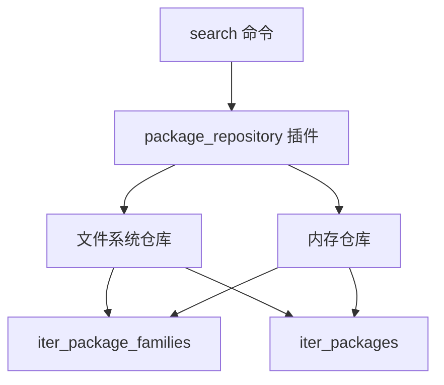

# search 命令

<cite>
**本文档中引用的文件**   
- [search.py](file://rez-3.3.0\src\rez\cli\search.py)
- [package_search.py](file://rez-3.3.0\src\rez\package_search.py)
- [package_repository.py](file://rez-3.3.0\src\rez\package_repository.py)
- [filesystem.py](file://rez-3.3.0\src\rezplugins\package_repository\filesystem.py)
- [memory.py](file://rez-3.3.0\src\rezplugins\package_repository\memory.py)
</cite>

## 目录
1. [简介](#简介)
2. [语法与基本用法](#语法与基本用法)
3. [搜索结果输出格式](#搜索结果输出格式)
4. [与 package_repository 插件的交互](#与-package_repository-插件的交互)
5. [无结果搜索的可能原因](#无结果搜索的可能原因)

## 简介
`search` 命令是 Rez 包管理工具中的核心功能之一，用于在配置的包仓库中搜索可用的包及其版本。该命令支持通配符和正则表达式，能够灵活地查找包家族、特定版本的包或变体。通过与 `package_repository` 插件系统交互，`search` 命令可以查询不同类型的仓库，如文件系统仓库和内存仓库。

**Section sources**
- [search.py](file://rez-3.3.0\src\rez\cli\search.py#L1-L121)
- [package_search.py](file://rez-3.3.0\src\rez\package_search.py#L1-L435)

## 语法与基本用法
`search` 命令的基本语法如下：
```
rez search [OPTIONS] [PKG]
```

其中，`PKG` 是要搜索的包名，支持 glob 风格的通配符。例如：
- `rez search python*`：搜索所有以 "python" 开头的包。
- `rez search 'foo-*'`：搜索所有以 "foo-" 开头的包。

使用 `--all` 选项可以显示所有版本的包，而不仅仅是最新版本。例如：
```
rez search --all python
```

此外，`search` 命令还支持多种选项，如 `--type` 指定搜索资源类型（包、包家族或变体），`--paths` 指定包搜索路径等。

**Section sources**
- [search.py](file://rez-3.3.0\src\rez\cli\search.py#L12-L65)

## 搜索结果输出格式
`search` 命令的输出格式包括包名、版本、仓库路径等信息。默认情况下，输出为包的全名（qualified name）。用户可以通过 `--format` 选项自定义输出格式，例如：
```
rez search --format='{qualified_name} | {description}' python
```

输出字段包括 `pre_commands`, `tools`, `uuid`, `build_requires`, `version`, `timestamp`, `release_message`, `private_build_requires`, `revision`, `description`, `base`, `authors`, `variants`, `commands`, `name`, `changelog`, `post_commands`, `requires`, `root`, `index`, `uri`, `num_variants`, `qualified_name` 等。

**Section sources**
- [package_search.py](file://rez-3.3.0\src\rez\package_search.py#L348-L354)

## 与 package_repository 插件的交互
`search` 命令通过 `package_repository` 插件系统与不同类型的仓库进行交互。Rez 支持多种仓库类型，如文件系统仓库和内存仓库。插件系统允许用户扩展 Rez 的功能，以支持自定义的仓库类型。

例如，文件系统仓库插件 (`filesystem.py`) 通过遍历文件系统中的目录来查找包，而内存仓库插件 (`memory.py`) 则在内存中维护包数据。`search` 命令通过调用这些插件的 `iter_package_families` 和 `iter_packages` 方法来获取包信息。



**Diagram sources**
- [package_repository.py](file://rez-3.3.0\src\rez\package_repository.py#L1-L649)
- [filesystem.py](file://rez-3.3.0\src\rezplugins\package_repository\filesystem.py#L1-L533)
- [memory.py](file://rez-3.3.0\src\rezplugins\package_repository\memory.py#L1-L201)

**Section sources**
- [package_repository.py](file://rez-3.3.0\src\rez\package_repository.py#L1-L649)

## 无结果搜索的可能原因
当 `search` 命令返回无结果时，可能的原因包括：
1. **包名拼写错误**：检查包名是否正确，包括大小写和特殊字符。
2. **搜索路径配置错误**：确保 `packages_path` 配置正确，包含目标包的路径。
3. **仓库类型不支持**：确认使用的仓库类型（如文件系统、内存）是否支持搜索功能。
4. **权限问题**：检查是否有足够的权限访问目标仓库。
5. **包未发布**：确认目标包是否已正确发布到仓库中。

通过检查这些可能的原因，可以有效解决搜索无结果的问题。

**Section sources**
- [search.py](file://rez-3.3.0\src\rez\cli\search.py#L102-L113)
- [package_search.py](file://rez-3.3.0\src\rez\package_search.py#L265-L267)