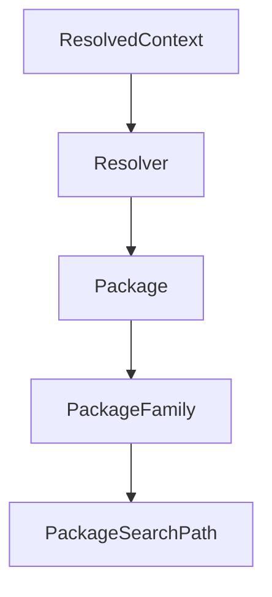

# Python API

<cite>
**本文档中引用的文件**   
- [__init__.py](file://rez-3.3.0\src\rez\__init__.py)
- [packages.py](file://rez-3.3.0\src\rez\packages.py)
- [resolver.py](file://rez-3.3.0\src\rez\resolver.py)
- [resolved_context.py](file://rez-3.3.0\src\rez\resolved_context.py)
- [config.py](file://rez-3.3.0\src\rez\config.py)
- [exceptions.py](file://rez-3.3.0\src\rez\exceptions.py)
</cite>

## 目录
1. [简介](#简介)
2. [核心模块](#核心模块)
3. [包管理API](#包管理api)
4. [解析器API](#解析器api)
5. [上下文API](#上下文api)
6. [配置与异常](#配置与异常)
7. [使用示例](#使用示例)
8. [调用关系](#调用关系)
9. [性能与线程安全](#性能与线程安全)
10. [常见问题解决方案](#常见问题解决方案)

## 简介
Rez系统是一个跨平台的包管理系统，能够构建和安装多个版本的软件包，并在运行时动态配置解析环境。本API文档详细介绍了Rez系统的Python API，包括核心模块、包管理、解析器、上下文处理、配置和异常处理等功能。

**Section sources**
- [__init__.py](file://rez-3.3.0\src\rez\__init__.py#L1-L71)

## 核心模块
Rez系统的核心模块包括包管理、解析器和上下文处理。这些模块共同协作，实现软件包的管理和环境的配置。

**Section sources**
- [__init__.py](file://rez-3.3.0\src\rez\__init__.py#L1-L71)
- [packages.py](file://rez-3.3.0\src\rez\packages.py#L1-L967)
- [resolver.py](file://rez-3.3.0\src\rez\resolver.py#L1-L475)
- [resolved_context.py](file://rez-3.3.0\src\rez\resolved_context.py#L1-L2192)

## 包管理API
包管理API提供了对软件包的创建、查询和操作功能。

### PackageFamily
表示一个包族。

**Section sources**
- [packages.py](file://rez-3.3.0\src\rez\packages.py#L48-L69)

### Package
表示一个具体的软件包。

**Section sources**
- [packages.py](file://rez-3.3.0\src\rez\packages.py#L186-L323)

### Variant
表示一个包的变体。

**Section sources**
- [packages.py](file://rez-3.3.0\src\rez\packages.py#L324-L464)

### PackageSearchPath
表示一个包搜索路径列表。

**Section sources**
- [packages.py](file://rez-3.3.0\src\rez\packages.py#L470-L515)

### 资源获取函数
提供了一系列函数用于获取包资源。

**Section sources**
- [packages.py](file://rez-3.3.0\src\rez\packages.py#L521-L779)

## 解析器API
解析器API负责解决包依赖关系。

### Resolver
包解析器类。

**Section sources**
- [resolver.py](file://rez-3.3.0\src\rez\resolver.py#L32-L475)

## 上下文API
上下文API用于创建、保存和加载解析环境。

### ResolvedContext
表示一个已解析的上下文。

**Section sources**
- [resolved_context.py](file://rez-3.3.0\src\rez\resolved_context.py#L126-L2192)

## 配置与异常
配置和异常处理是Rez系统的重要组成部分。

### Config
配置类。

**Section sources**
- [config.py](file://rez-3.3.0\src\rez\config.py#L51-L200)

### 异常类
定义了各种异常类型。

**Section sources**
- [exceptions.py](file://rez-3.3.0\src\rez\exceptions.py#L11-L200)

## 使用示例
以下是一些常见的使用示例。

### 包加载
```python
from rez.packages import get_package
package = get_package("maya", "2022")
```

**Section sources**
- [packages.py](file://rez-3.3.0\src\rez\packages.py#L577-L598)

### 环境解析
```python
from rez.resolver import Resolver
from rez.resolved_context import ResolvedContext

context = ResolvedContext(["maya-2022", "python-3.10"])
```

**Section sources**
- [resolved_context.py](file://rez-3.3.0\src\rez\resolved_context.py#L165-L322)

### 上下文创建
```python
from rez.resolved_context import ResolvedContext

context = ResolvedContext(["maya-2022"])
context.save("my_context.rxt")
```

**Section sources**
- [resolved_context.py](file://rez-3.3.0\src\rez\resolved_context.py#L652-L657)

## 调用关系
解析器与包管理模块之间的调用关系如下：



**Diagram sources**
- [resolved_context.py](file://rez-3.3.0\src\rez\resolved_context.py#L165-L322)
- [resolver.py](file://rez-3.3.0\src\rez\resolver.py#L32-L475)
- [packages.py](file://rez-3.3.0\src\rez\packages.py#L48-L69)

## 性能与线程安全
Rez系统的API设计考虑了性能和线程安全。

### 性能特征
- 使用缓存机制提高解析速度
- 支持异步包缓存

**Section sources**
- [resolver.py](file://rez-3.3.0\src\rez\resolver.py#L113-L131)
- [resolved_context.py](file://rez-3.3.0\src\rez\resolved_context.py#L255-L257)

### 线程安全
- 使用线程局部存储保证线程安全
- 提供线程锁机制

**Section sources**
- [resolved_context.py](file://rez-3.3.0\src\rez\resolved_context.py#L140-L142)

## 常见问题解决方案
### 导入失败
检查包路径是否正确，确保包存在于指定路径中。

**Section sources**
- [packages.py](file://rez-3.3.0\src\rez\packages.py#L577-L598)

### 解析错误
检查依赖关系是否冲突，使用`get_resolve_diff`方法比较不同上下文的差异。

**Section sources**
- [resolved_context.py](file://rez-3.3.0\src\rez\resolved_context.py#L711-L796)