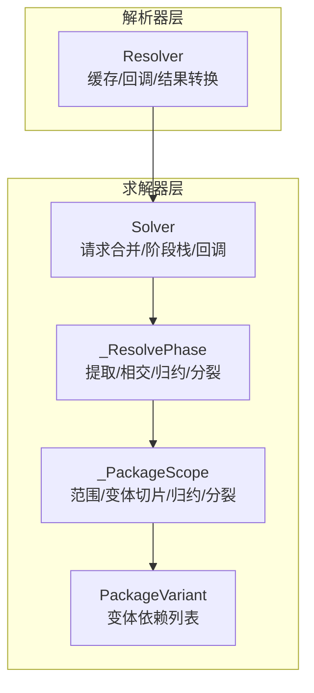
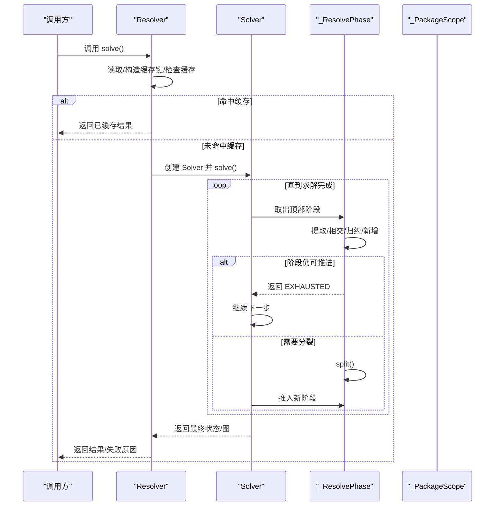
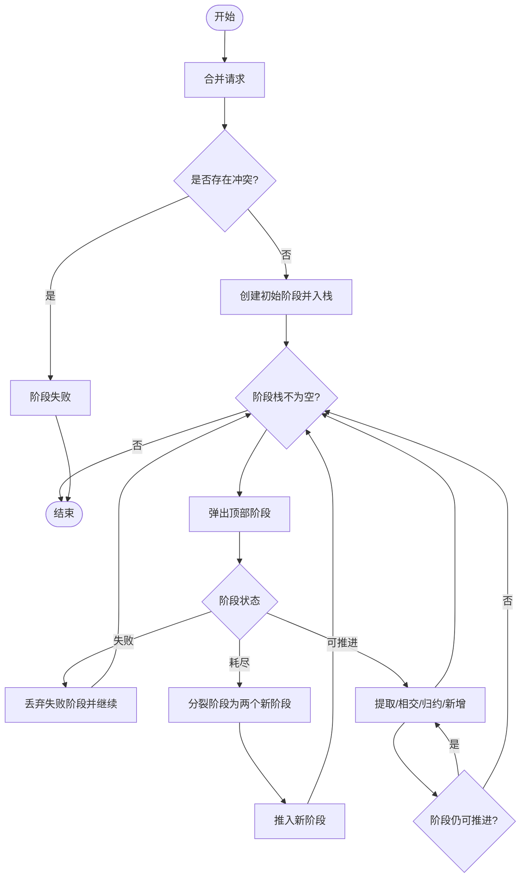

# 依赖解析

<cite>
**本文引用的文件**
- [resolver.py](file://rez-3.3.0/src/rez/resolver.py)
- [solver.py](file://rez-3.3.0/src/rez/solver.py)
- [SOLVER.md](file://rez-3.3.0/src/rez/SOLVER.md)
- [benchmark.py](file://rez-3.3.0/src/rez/cli/benchmark.py)
- [RESULTS.md](file://rez-3.3.0/metrics/benchmarking/RESULTS.md)
- [config.py](file://rez-3.3.0/src/rez/config.py)
</cite>

## 目录
1. [简介](#简介)
2. [项目结构](#项目结构)
3. [核心组件](#核心组件)
4. [架构总览](#架构总览)
5. [详细组件分析](#详细组件分析)
6. [依赖分析](#依赖分析)
7. [性能考量](#性能考量)
8. [故障排查指南](#故障排查指南)
9. [结论](#结论)
10. [附录](#附录)

## 简介
本文件围绕 Rez 的依赖解析系统进行深入技术文档化，重点基于 resolver.py 与 solver.py 的实现，系统阐述 Rez 如何解决复杂的包依赖关系、版本冲突与循环依赖；解释求解算法的工作原理、性能特征与统计指标；结合 benchmarking 数据展示不同场景下的解析性能；说明错误处理与回退机制；并给出优化依赖声明的最佳实践与调试技巧。

## 项目结构
Rez 的依赖解析由两层协作完成：
- 解析器层（Resolver）：负责缓存、状态管理、回调与结果转换，面向上层调用者。
- 求解器层（Solver/_ResolvePhase）：执行核心算法，包含提取、合并提取、相交、新增、归约、分裂等步骤，并维护“阶段栈”推进求解。

图表来源
- [resolver.py](file://rez-3.3.0/src/rez/resolver.py#L114-L171)
- [solver.py](file://rez-3.3.0/src/rez/solver.py#L1883-L2001)
- [solver.py](file://rez-3.3.0/src/rez/solver.py#L1223-L1299)

章节来源
- [resolver.py](file://rez-3.3.0/src/rez/resolver.py#L114-L171)
- [solver.py](file://rez-3.3.0/src/rez/solver.py#L1883-L2001)

## 核心组件
- Resolver：封装缓存、时间度量、回调、过滤器与时间戳组合，协调 Solver 完成一次解析。
- Solver：负责请求合并、初始阶段入栈、迭代求解步骤、统计计时、失败原因与图生成。
- _ResolvePhase：单次求解阶段，执行提取/相交/归约/新增/分裂等动作，直至穷尽或拆分。
- _PackageScope：每个包请求的当前范围，可为冲突范围或变体切片，支持相交、归约、提取、分裂。
- PackageVariant：具体变体对象，延迟加载依赖列表，避免不必要的包加载。

章节来源
- [resolver.py](file://rez-3.3.0/src/rez/resolver.py#L114-L171)
- [solver.py](file://rez-3.3.0/src/rez/solver.py#L1883-L2001)
- [solver.py](file://rez-3.3.0/src/rez/solver.py#L1223-L1299)
- [solver.py](file://rez-3.3.0/src/rez/solver.py#L956-L1192)
- [solver.py](file://rez-3.3.0/src/rez/solver.py#L291-L366)

## 架构总览
下图展示了从 Resolver 调用到 Solver 阶段推进、再到最终成功/失败/循环检测的整体流程。

图表来源
- [resolver.py](file://rez-3.3.0/src/rez/resolver.py#L114-L171)
- [solver.py](file://rez-3.3.0/src/rez/solver.py#L2094-L2211)
- [solver.py](file://rez-3.3.0/src/rez/solver.py#L1223-L1299)
- [solver.py](file://rez-3.3.0/src/rez/solver.py#L1519-L1574)

## 详细组件分析

### Resolver：缓存、回调与结果转换
- 缓存策略
  - 支持 memcached，根据请求、仓库标识、过滤器哈希、变体选择器哈希、构建模式、测试模式、是否裁剪失败图、可选时间戳生成键。
  - 未命中时执行求解并将结果写回缓存；命中则直接返回。
  - 时间戳感知：若存在时间戳且缓存中存在“发布后新版本”，则按时间戳写入特定键，否则写入非时间戳键。
- 回调与状态
  - 通过回调控制求解进度，支持中止与标记失败。
  - 状态枚举：pending/solved/failed/aborted。
- 结果转换
  - 将 Solver 的内部表示转换为包变体与临时包范围列表，便于上层使用。

章节来源
- [resolver.py](file://rez-3.3.0/src/rez/resolver.py#L114-L171)
- [resolver.py](file://rez-3.3.0/src/rez/resolver.py#L175-L320)
- [resolver.py](file://rez-3.3.0/src/rez/resolver.py#L321-L374)
- [resolver.py](file://rez-3.3.0/src/rez/resolver.py#L375-L414)
- [resolver.py](file://rez-3.3.0/src/rez/resolver.py#L415-L475)

### Solver：阶段推进与统计
- 请求合并与初始化
  - 合并请求，若存在冲突则直接失败；否则创建初始阶段并入栈。
- 阶段推进
  - 循环弹出顶部阶段，若失败则丢弃并取前一阶段；若耗尽则分裂为两个阶段；若成功则进入 finalise 进行循环检测与重排。
- 统计与计时
  - 记录提取、相交、归约次数与耗时，以及整体求解与包加载耗时。
- 失败原因与描述
  - 提供 failure_reason/failure_description/failure_packages 等接口，支持回调导致的失败优先级。

章节来源
- [solver.py](file://rez-3.3.0/src/rez/solver.py#L1883-L2001)
- [solver.py](file://rez-3.3.0/src/rez/solver.py#L2094-L2211)
- [solver.py](file://rez-3.3.0/src/rez/solver.py#L2114-L2160)
- [solver.py](file://rez-3.3.0/src/rez/solver.py#L2212-L2253)

### _ResolvePhase：提取/相交/归约/新增/分裂
- 提取（EXTRACT）
  - 在一个作用域内发现所有变体的公共依赖，形成新的请求。
- 合并提取（MERGE-EXTRACTIONS）
  - 将多个作用域的提取合并为更简化的请求集合；若冲突则阶段失败。
- 相交（INTERSECT）
  - 将提取与现有作用域相交，可能产生冲突或缩小范围。
- 新增（ADD）
  - 若提取引入了新的包家族，则创建新作用域加入求解。
- 归约（REDUCE）
  - 逐个变体检查是否与其它作用域冲突，移除冲突变体；若某作用域被完全移除则阶段失败。
- 分裂（SPLIT）
  - 当阶段无法进一步推进时，选择第一个多变体的作用域，按常见依赖点进行切分，形成两个新阶段。

章节来源
- [solver.py](file://rez-3.3.0/src/rez/solver.py#L1223-L1299)
- [solver.py](file://rez-3.3.0/src/rez/solver.py#L1299-L1474)
- [solver.py](file://rez-3.3.0/src/rez/solver.py#L1519-L1574)

### _PackageScope 与 PackageVariant：范围与变体
- _PackageScope
  - 表示一个包请求的当前范围，可能是冲突范围或变体切片。
  - 支持 intersect/reduce_by/extract/split 等操作。
- PackageVariant
  - 延迟计算依赖列表，避免无谓的包加载。
  - 内部依赖冲突检测，若发现包自身要求冲突则直接报错。

章节来源
- [solver.py](file://rez-3.3.0/src/rez/solver.py#L956-L1192)
- [solver.py](file://rez-3.3.0/src/rez/solver.py#L291-L366)

### 求解算法工作流（流程图）

图表来源
- [solver.py](file://rez-3.3.0/src/rez/solver.py#L1883-L2001)
- [solver.py](file://rez-3.3.0/src/rez/solver.py#L2094-L2211)
- [solver.py](file://rez-3.3.0/src/rez/solver.py#L1223-L1299)

## 依赖分析
- 组件耦合
  - Resolver 依赖 Solver 与缓存设施；Solver 依赖 _ResolvePhase 与 PackageVariantCache；_ResolvePhase 依赖 _PackageScope；_PackageScope 依赖 PackageVariant。
- 关键依赖链
  - 请求合并 → 初始阶段 → 提取/相交/归约/新增 → 循环检测/重排 → 成功或失败。
- 外部依赖
  - memcached 连接池、包仓库访问、日志与计时工具。

章节来源
- [resolver.py](file://rez-3.3.0/src/rez/resolver.py#L114-L171)
- [solver.py](file://rez-3.3.0/src/rez/solver.py#L1883-L2001)
- [solver.py](file://rez-3.3.0/src/rez/solver.py#L1223-L1299)
- [solver.py](file://rez-3.3.0/src/rez/solver.py#L956-L1192)

## 性能考量
- 缓存与时间度量
  - Resolver 使用 memcached 存储求解结果，键包含请求、仓库标识、过滤器、变体选择器、构建模式、测试模式、裁剪标志与可选时间戳；命中则跳过求解，显著降低重复解析成本。
  - Solver 统计提取/相交/归约耗时与次数，以及整体求解与包加载耗时，便于定位瓶颈。
- 性能基准数据
  - 历史基准结果记录了 Rez 版本、Python 版本、平台、CPU、线程数、中位数、均值、标准差等指标，可用于对比不同版本与环境下的解析性能。
- 优化建议
  - 合理设置包过滤器与时间戳，利用缓存提升命中率。
  - 减少不必要的包加载（延迟依赖列表），避免在早期阶段触发大量包解析。
  - 使用更精确的版本范围与更少的冲突请求，降低归约与分裂频率。

章节来源
- [resolver.py](file://rez-3.3.0/src/rez/resolver.py#L175-L320)
- [resolver.py](file://rez-3.3.0/src/rez/resolver.py#L321-L374)
- [solver.py](file://rez-3.3.0/src/rez/solver.py#L2114-L2160)
- [RESULTS.md](file://rez-3.3.0/metrics/benchmarking/RESULTS.md#L1-L104)

## 故障排查指南
- 常见失败类型
  - 公共依赖冲突：合并提取时出现冲突，阶段失败。
  - 总归约：某作用域被完全移除，阶段失败。
  - 循环依赖：最终阶段检测到循环，标记为失败。
- 失败原因与描述
  - Solver 提供 failure_reason/failure_description/failure_packages 接口，支持回调导致的失败优先级。
- 调试输出与图
  - 通过 -v/-vv/-vvv 输出求解步骤与状态；SOLVER.md 提供调试输出解读与语法说明。
  - Solver 生成解析图，支持裁剪未失败节点，聚焦失败路径。
- 回退与中止
  - 回调可选择中止求解或标记失败；Resolver 支持打印统计信息辅助诊断。

章节来源
- [solver.py](file://rez-3.3.0/src/rez/solver.py#L1482-L1518)
- [solver.py](file://rez-3.3.0/src/rez/solver.py#L2212-L2253)
- [solver.py](file://rez-3.3.0/src/rez/solver.py#L2254-L2285)
- [SOLVER.md](file://rez-3.3.0/src/rez/SOLVER.md#L161-L266)
- [resolver.py](file://rez-3.3.0/src/rez/resolver.py#L114-L171)

## 结论
Rez 的依赖解析系统通过“阶段栈 + 提取/相交/归约/新增/分裂”的组合策略，实现了对复杂依赖关系与版本冲突的稳健求解。Resolver 层负责缓存与回调，Solver 层提供详细的统计与失败诊断，配合基准数据与调试输出，能够有效定位性能瓶颈并优化解析效率。实践中应重视依赖声明的准确性与缓存命中率，以获得最佳解析体验。

## 附录

### 附录A：算法步骤与伪代码映射
- SOLVER.md 对算法步骤有清晰描述，与 solver.py 中 _ResolvePhase.solve 的实现一一对应。

章节来源
- [SOLVER.md](file://rez-3.3.0/src/rez/SOLVER.md#L1-L160)
- [solver.py](file://rez-3.3.0/src/rez/solver.py#L1223-L1299)

### 附录B：基准运行与结果
- CLI 基准命令会拉取预置包仓库、预热包缓存、多次运行解析请求并统计均值、中位数、标准差等指标，结果保存在输出目录的 summary.json 中。

章节来源
- [benchmark.py](file://rez-3.3.0/src/rez/cli/benchmark.py#L1-L200)
- [benchmark.py](file://rez-3.3.0/src/rez/cli/benchmark.py#L200-L374)
- [RESULTS.md](file://rez-3.3.0/metrics/benchmarking/RESULTS.md#L1-L104)

### 附录C：配置与优化要点
- 关键配置项
  - 变体选择模式、包过滤器、包排序器、错误处理策略（如缺失变体依赖时的行为）、缓存压缩阈值等。
- 最佳实践
  - 明确版本范围，避免过度宽泛的通配；合理使用包过滤器与时间戳；启用缓存并保持仓库稳定；在回调中谨慎使用中止/失败策略。

章节来源
- [config.py](file://rez-3.3.0/src/rez/config.py#L427-L518)