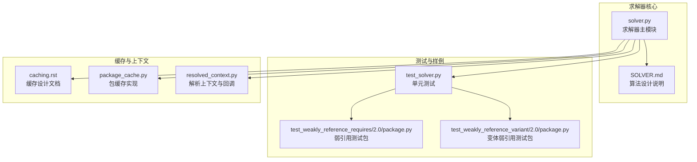
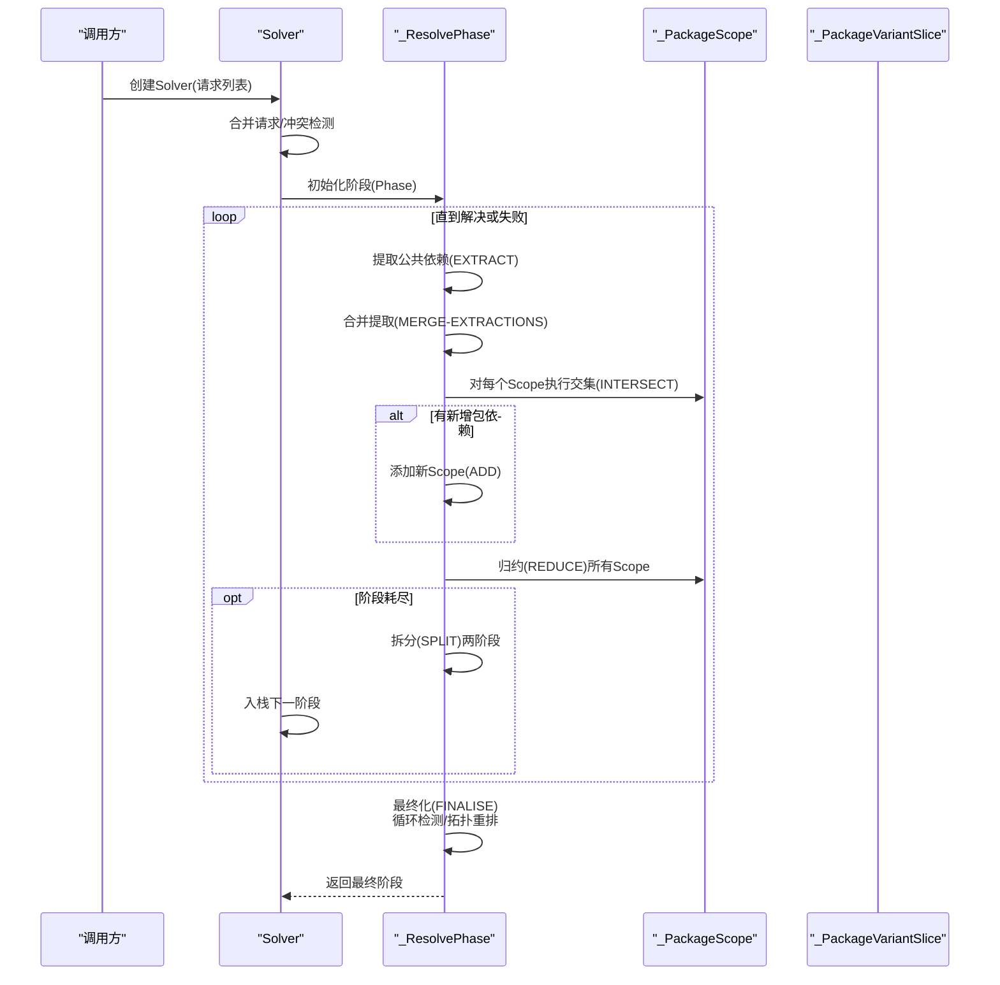
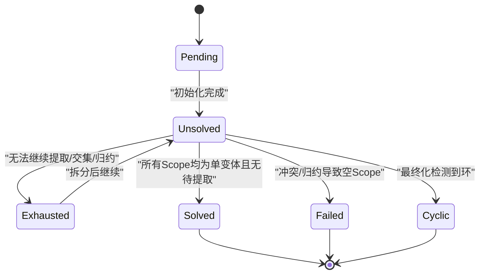
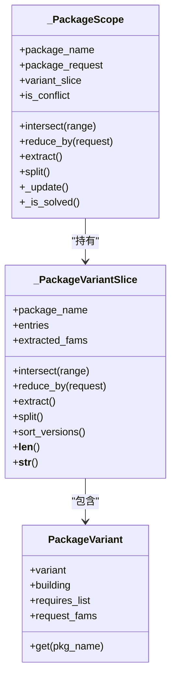
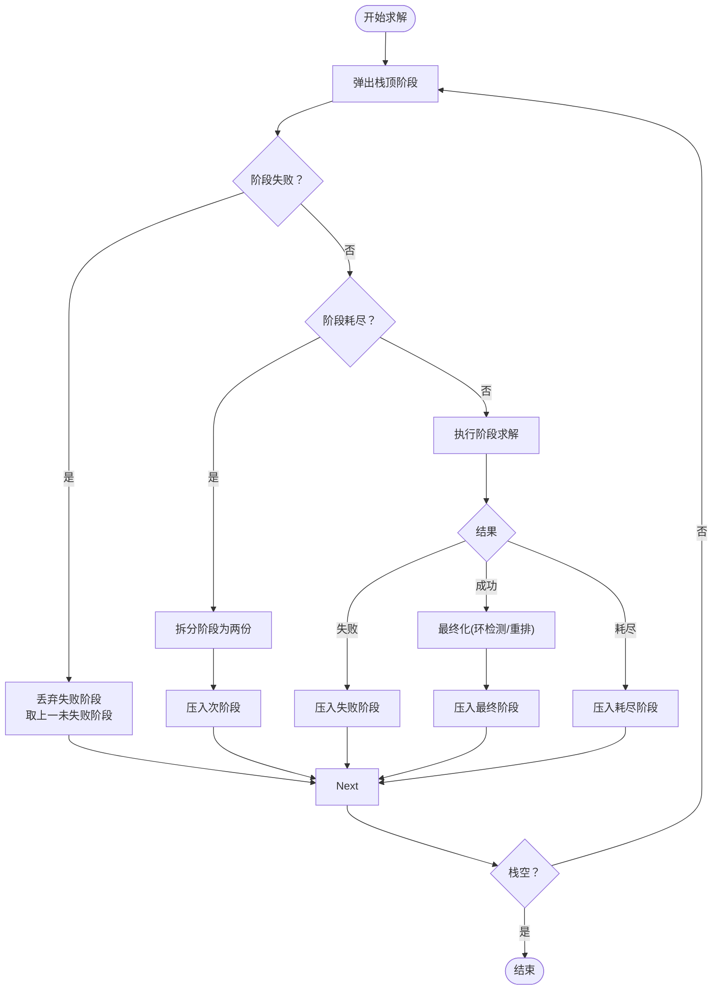
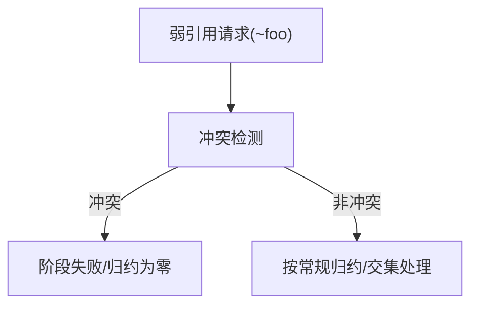
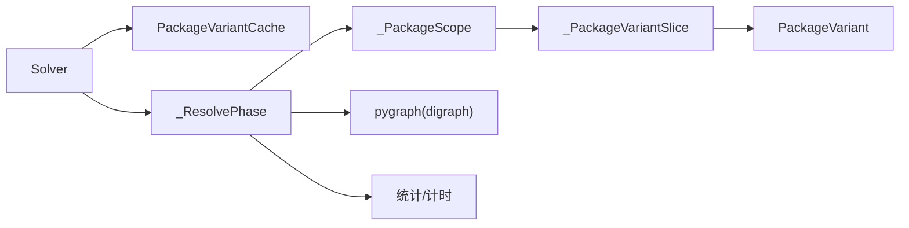

# 依赖解析算法

<cite>
**本文引用的文件**
- [solver.py](file://rez-3.3.0/src/rez/solver.py)
- [SOLVER.md](file://rez-3.3.0/src/rez/SOLVER.md)
- [test_solver.py](file://rez-3.3.0/src/rez/tests/test_solver.py)
- [package.py（弱引用测试包）](file://rez-3.3.0/src/rez/data/tests/solver/packages/test_weakly_reference_requires/2.0/package.py)
- [package.py（变体弱引用测试包）](file://rez-3.3.0/src/rez/data/tests/solver/packages/test_weakly_reference_variant/2.0/package.py)
- [caching.rst](file://rez-3.3.0/docs/source/caching.rst)
- [package_cache.py](file://rez-3.3.0/src/rez/package_cache.py)
- [resolved_context.py](file://rez-3.3.0/src/rez/resolved_context.py)
</cite>

## 目录
1. [简介](#简介)
2. [项目结构](#项目结构)
3. [核心组件](#核心组件)
4. [架构总览](#架构总览)
5. [详细组件分析](#详细组件分析)
6. [依赖关系分析](#依赖关系分析)
7. [性能考量](#性能考量)
8. [故障排查指南](#故障排查指南)
9. [结论](#结论)
10. [附录](#附录)

## 简介
本文件面向Rez依赖求解器的实现进行系统化技术解读，围绕“约束满足问题（CSP）”视角，梳理变量（包版本）、约束（requires声明）、搜索策略（回溯与剪枝）与动态预处理逻辑，解释其在大规模依赖图中的工作机理与优化手段（缓存、统计与回调控制）。文档同时结合SOLVER.md的设计说明，给出关键流程的时序与数据流图示，并提供可定位到源码路径的“代码片段路径”，便于读者对照实现细节。

## 项目结构
Rez求解器位于src/rez/solver.py，配套设计说明位于src/rez/SOLVER.md；测试覆盖位于src/rez/tests/test_solver.py，包含弱引用与变体相关测试包位于src/rez/data/tests/solver/packages。缓存与上下文集成位于docs/source/caching.rst、src/rez/package_cache.py与src/rez/resolved_context.py。

图表来源
- [solver.py](file://rez-3.3.0/src/rez/solver.py#L1-L120)
- [SOLVER.md](file://rez-3.3.0/src/rez/SOLVER.md#L1-L60)
- [test_solver.py](file://rez-3.3.0/src/rez/tests/test_solver.py#L1-L60)
- [package.py（弱引用测试包）](file://rez-3.3.0/src/rez/data/tests/solver/packages/test_weakly_reference_requires/2.0/package.py#L1-L5)
- [package.py（变体弱引用测试包）](file://rez-3.3.0/src/rez/data/tests/solver/packages/test_weakly_reference_variant/2.0/package.py#L1-L7)
- [caching.rst](file://rez-3.3.0/docs/source/caching.rst#L1-L29)
- [package_cache.py](file://rez-3.3.0/src/rez/package_cache.py#L702-L738)
- [resolved_context.py](file://rez-3.3.0/src/rez/resolved_context.py#L139-L168)

章节来源
- [solver.py](file://rez-3.3.0/src/rez/solver.py#L1-L120)
- [SOLVER.md](file://rez-3.3.0/src/rez/SOLVER.md#L1-L60)

## 核心组件
- 变量与域：以“包名+版本范围”为变量，每个变量对应一个或多个“包变体（PackageVariant）”构成的候选集合。求解过程中通过“交集（Intersect）”缩小版本范围，“提取（Extract）”得到公共依赖，“归约（Reduce）”剔除冲突变体。
- 约束：来自包的requires声明，形成“请求（Requirement）”对象；支持冲突请求（如~foo）与弱引用（前缀~）。
- 搜索与剪枝：采用阶段（Phase）栈式推进，当无法进一步提取/交集/归约时进入“耗尽（Exhausted）”，触发“拆分（Split）”二分探索；通过缓存与不可变对象复制减少状态爆炸。
- 动态预处理：按需加载包变体、延迟计算依赖列表、根据请求合并与冲突检测提前失败。

章节来源
- [solver.py](file://rez-3.3.0/src/rez/solver.py#L1223-L1522)
- [SOLVER.md](file://rez-3.3.0/src/rez/SOLVER.md#L11-L53)

## 架构总览
下图展示了求解器从请求到最终解的高层流程，映射到源码中的阶段推进、提取/交集/归约、拆分与最终化等步骤。

图表来源
- [solver.py](file://rez-3.3.0/src/rez/solver.py#L1223-L1522)
- [solver.py](file://rez-3.3.0/src/rez/solver.py#L1519-L1560)
- [solver.py](file://rez-3.3.0/src/rez/solver.py#L1941-L2000)
- [SOLVER.md](file://rez-3.3.0/src/rez/SOLVER.md#L54-L146)

## 详细组件分析

### 组件A：阶段（_ResolvePhase）与状态机
- 阶段状态：pending/solved/exhausted/failed/cyclic/unsolved，由状态枚举统一管理。
- 解析循环：在阶段内反复执行“提取—合并—交集—添加—归约”的迭代，直到无变化或进入耗尽。
- 最终化：检查环依赖、按依赖顺序重排包序列，生成最小依赖图用于诊断与可视化。

图表来源
- [solver.py](file://rez-3.3.0/src/rez/solver.py#L65-L90)
- [solver.py](file://rez-3.3.0/src/rez/solver.py#L1223-L1522)
- [solver.py](file://rez-3.3.0/src/rez/solver.py#L1482-L1518)

章节来源
- [solver.py](file://rez-3.3.0/src/rez/solver.py#L65-L90)
- [solver.py](file://rez-3.3.0/src/rez/solver.py#L1223-L1522)

### 组件B：包作用域（_PackageScope）与变体切片（_PackageVariantSlice）
- 包作用域：封装一个包的请求与可能的变体集合；支持交集（缩小版本范围）、归约（剔除冲突变体）、提取（抽取公共依赖）、拆分（二分选择）。
- 变体切片：对同一包的不同版本与变体进行分组与排序，提供高效的交集/归约/提取操作；内部维护“已交集/已归约”集合以避免重复计算。
- 弱引用与冲突：弱引用（前缀~）在归约中被识别为冲突请求，不参与常规变体列表；冲突请求直接导致交集为空时返回失败。

图表来源
- [solver.py](file://rez-3.3.0/src/rez/solver.py#L956-L1192)
- [solver.py](file://rez-3.3.0/src/rez/solver.py#L566-L923)
- [solver.py](file://rez-3.3.0/src/rez/solver.py#L291-L367)

章节来源
- [solver.py](file://rez-3.3.0/src/rez/solver.py#L956-L1192)
- [solver.py](file://rez-3.3.0/src/rez/solver.py#L566-L923)

### 组件C：求解器（Solver）与阶段栈
- 阶段栈：Solver维护阶段栈，每次弹出顶部阶段，若失败则丢弃并取上一未失败阶段；若耗尽则拆分为两个阶段入栈。
- 回调与限制：支持最大失败次数、时间限制、自定义回调；回调可强制失败或中止。
- 统计与调试：记录提取、交集、归约的次数与耗时，支持详细日志输出。

图表来源
- [solver.py](file://rez-3.3.0/src/rez/solver.py#L1941-L2000)
- [solver.py](file://rez-3.3.0/src/rez/solver.py#L2161-L2211)
- [solver.py](file://rez-3.3.0/src/rez/solver.py#L2361-L2383)

章节来源
- [solver.py](file://rez-3.3.0/src/rez/solver.py#L1941-L2000)
- [solver.py](file://rez-3.3.0/src/rez/solver.py#L2161-L2211)

### 组件D：算法步骤与关键实现（代码片段路径）
- 请求合并与冲突检测
  - 代码片段路径：[solver.py](file://rez-3.3.0/src/rez/solver.py#L1978-L1986)
- 提取公共依赖
  - 代码片段路径：[solver.py](file://rez-3.3.0/src/rez/solver.py#L730-L760)
- 合并提取（合并请求列表）
  - 代码片段路径：[solver.py](file://rez-3.3.0/src/rez/solver.py#L1731-L1744)
- 交集（缩小Scope范围）
  - 代码片段路径：[solver.py](file://rez-3.3.0/src/rez/solver.py#L987-L1058)
- 归约（剔除冲突变体）
  - 代码片段路径：[solver.py](file://rez-3.3.0/src/rez/solver.py#L1059-L1101)
- 拆分（二分探索）
  - 代码片段路径：[solver.py](file://rez-3.3.0/src/rez/solver.py#L803-L834)
- 最终化（环检测与拓扑重排）
  - 代码片段路径：[solver.py](file://rez-3.3.0/src/rez/solver.py#L1482-L1518)

章节来源
- [solver.py](file://rez-3.3.0/src/rez/solver.py#L730-L760)
- [solver.py](file://rez-3.3.0/src/rez/solver.py#L987-L1058)
- [solver.py](file://rez-3.3.0/src/rez/solver.py#L1059-L1101)
- [solver.py](file://rez-3.3.0/src/rez/solver.py#L1482-L1518)

### 组件E：弱引用与变体依赖
- 弱引用（前缀~）：在归约与冲突检测中被视为冲突请求，不参与常规变体列表；测试包中通过requires=["~foo"]表达弱依赖。
- 变体弱引用：包variants字段中可对其他包的变体进行弱引用，影响归约与拆分策略。
- 测试验证：单元测试覆盖弱引用导致的失败场景与多包组合。

图表来源
- [package.py（弱引用测试包）](file://rez-3.3.0/src/rez/data/tests/solver/packages/test_weakly_reference_requires/2.0/package.py#L1-L5)
- [package.py（变体弱引用测试包）](file://rez-3.3.0/src/rez/data/tests/solver/packages/test_weakly_reference_variant/2.0/package.py#L1-L7)
- [test_solver.py](file://rez-3.3.0/src/rez/tests/test_solver.py#L1-L120)

章节来源
- [package.py（弱引用测试包）](file://rez-3.3.0/src/rez/data/tests/solver/packages/test_weakly_reference_requires/2.0/package.py#L1-L5)
- [package.py（变体弱引用测试包）](file://rez-3.3.0/src/rez/data/tests/solver/packages/test_weakly_reference_variant/2.0/package.py#L1-L7)
- [test_solver.py](file://rez-3.3.0/src/rez/tests/test_solver.py#L1-L120)

## 依赖关系分析
- 模块耦合：
  - Solver依赖PackageVariantCache与PackageVariant，通过缓存减少重复加载。
  - _ResolvePhase依赖各Scope与其变体切片，负责阶段推进与状态转换。
  - 失败原因类（TotalReduction、DependencyConflicts、Cycle）用于诊断与可视化。
- 外部依赖：
  - 图算法库（cycles/accessibility）用于环检测与可达性分析。
  - 配置与包过滤器在变体加载与筛选阶段生效。

图表来源
- [solver.py](file://rez-3.3.0/src/rez/solver.py#L1941-L2000)
- [solver.py](file://rez-3.3.0/src/rez/solver.py#L1223-L1522)
- [solver.py](file://rez-3.3.0/src/rez/solver.py#L1828-L1854)

章节来源
- [solver.py](file://rez-3.3.0/src/rez/solver.py#L1223-L1522)
- [solver.py](file://rez-3.3.0/src/rez/solver.py#L1828-L1854)

## 性能考量
- 缓存机制：
  - 变体缓存（PackageVariantCache）按包名缓存变体列表，避免重复加载与过滤。
  - 文档缓存（caching.rst）描述了memcached缓存解析结果，显著降低重复求解时间。
  - 代码片段路径：[package_cache.py](file://rez-3.3.0/src/rez/package_cache.py#L702-L738)
- 不可变对象与复制：
  - 所有状态对象（Scope/Phase）在变更时创建浅拷贝副本，共享未变部分，降低深拷贝成本。
  - 代码片段路径：[solver.py](file://rez-3.3.0/src/rez/solver.py#L1519-L1560)
- 剪枝与早停：
  - 已交集/已归约集合避免重复计算；冲突检测与空Scope直接返回失败。
  - 代码片段路径：[solver.py](file://rez-3.3.0/src/rez/solver.py#L625-L654)
- 排序与选择策略：
  - 变体排序支持“版本优先/交集优先”，提升早期提取概率，加速收敛。
  - 代码片段路径：[solver.py](file://rez-3.3.0/src/rez/solver.py#L418-L459)
- 并行与异步：
  - 文档缓存支持异步缓存进程，减少阻塞；解析上下文支持回调与超时控制。
  - 代码片段路径：[caching.rst](file://rez-3.3.0/docs/source/caching.rst#L1-L29)，[resolved_context.py](file://rez-3.3.0/src/rez/resolved_context.py#L139-L168)

章节来源
- [package_cache.py](file://rez-3.3.0/src/rez/package_cache.py#L702-L738)
- [caching.rst](file://rez-3.3.0/docs/source/caching.rst#L1-L29)
- [resolved_context.py](file://rez-3.3.0/src/rez/resolved_context.py#L139-L168)
- [solver.py](file://rez-3.3.0/src/rez/solver.py#L418-L459)
- [solver.py](file://rez-3.3.0/src/rez/solver.py#L625-L654)
- [solver.py](file://rez-3.3.0/src/rez/solver.py#L1519-L1560)

## 故障排查指南
- 失败原因类型：
  - TotalReduction：某Scope全部变体被归约至空。
  - DependencyConflicts：Scope间存在冲突请求。
  - Cycle：最终化阶段检测到环依赖。
- 诊断工具：
  - 失败原因描述与涉及包列表可通过接口获取。
  - 代码片段路径：[solver.py](file://rez-3.3.0/src/rez/solver.py#L2212-L2253)
- 调试输出：
  - 通过命令行-verbose级别查看提取、交集、归约、拆分等步骤。
  - 代码片段路径：[SOLVER.md](file://rez-3.3.0/src/rez/SOLVER.md#L161-L254)
- 回调与限制：
  - 使用回调设置最大失败次数与时间限制，便于在CI中稳定运行。
  - 代码片段路径：[resolved_context.py](file://rez-3.3.0/src/rez/resolved_context.py#L139-L168)

章节来源
- [solver.py](file://rez-3.3.0/src/rez/solver.py#L2212-L2253)
- [SOLVER.md](file://rez-3.3.0/src/rez/SOLVER.md#L161-L254)
- [resolved_context.py](file://rez-3.3.0/src/rez/resolved_context.py#L139-L168)

## 结论
Rez求解器以CSP为核心思想，通过“提取—合并—交集—添加—归约—拆分”的迭代与阶段栈式推进，在大规模依赖图中实现确定性与可解释性。其关键优化包括：按需加载与缓存、不可变对象复制、冲突与空Scope早停、排序启发式与弱引用处理。配合缓存与回调控制，可在工程环境中获得稳定的性能表现与可运维性。

## 附录
- 关键流程代码片段路径汇总：
  - 请求合并与冲突检测：[solver.py](file://rez-3.3.0/src/rez/solver.py#L1978-L1986)
  - 提取公共依赖：[solver.py](file://rez-3.3.0/src/rez/solver.py#L730-L760)
  - 合并提取：[solver.py](file://rez-3.3.0/src/rez/solver.py#L1731-L1744)
  - 交集：[solver.py](file://rez-3.3.0/src/rez/solver.py#L987-L1058)
  - 归约：[solver.py](file://rez-3.3.0/src/rez/solver.py#L1059-L1101)
  - 拆分：[solver.py](file://rez-3.3.0/src/rez/solver.py#L803-L834)
  - 最终化（环检测/重排）：[solver.py](file://rez-3.3.0/src/rez/solver.py#L1482-L1518)
  - 变体缓存：[solver.py](file://rez-3.3.0/src/rez/solver.py#L925-L954)
  - 文档缓存：[caching.rst](file://rez-3.3.0/docs/source/caching.rst#L1-L29)
  - 异步缓存进程：[package_cache.py](file://rez-3.3.0/src/rez/package_cache.py#L702-L738)
  - 回调与限制：[resolved_context.py](file://rez-3.3.0/src/rez/resolved_context.py#L139-L168)