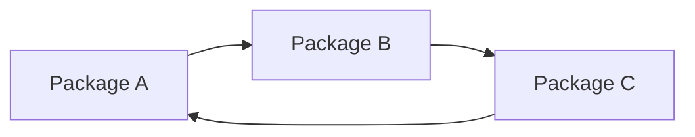
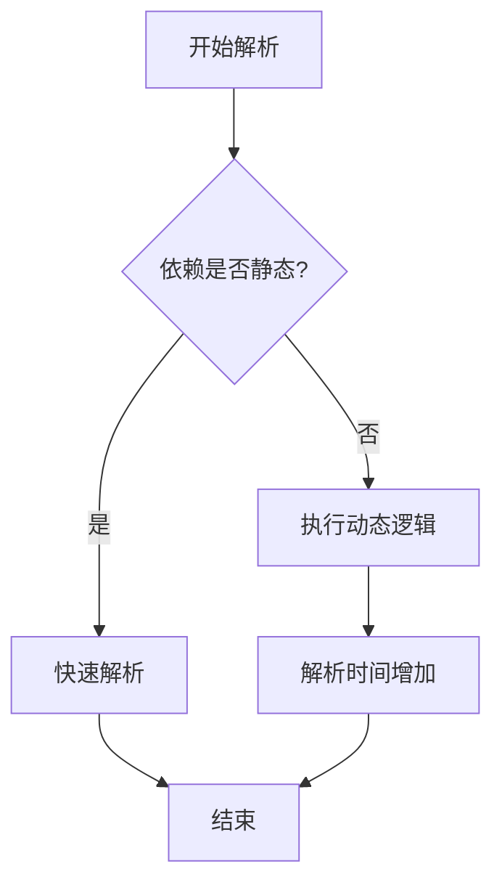

# 解析性能与基准测试

<cite>
**本文档中引用的文件**   
- [requests.json](file://rez-3.3.0\src\rez\data\benchmarking\requests.json)
- [summary.json](file://rez-3.3.0\metrics\benchmarking\artifacts\2021.05.18-3.7-2.88.1\summary.json)
- [benchmark.py](file://rez-3.3.0\src\rez\cli\benchmark.py)
- [solver.py](file://rez-3.3.0\src\rez\solver.py)
- [SOLVER.md](file://rez-3.3.0\src\rez\SOLVER.md)
- [package.py](file://my_packages\myapp\1.0.0\package.py)
- [package.py](file://my_packages\maya\2022\package.py)
- [package.py](file://my_packages\python\3.10.0\package.py)
- [package.py](file://rez-3.3.0\example_packages\hello_world\package.py)
- [package_resources.py](file://rez-3.3.0\src\rez\package_resources.py)
- [resolver.py](file://rez-3.3.0\src\rez\resolver.py)
- [test_solver.py](file://rez-3.3.0\src\rez\tests\test_solver.py)
- [RESULTS.md](file://rez-3.3.0\metrics\benchmarking\RESULTS.md)
</cite>

## 目录
1. [引言](#引言)
2. [基准测试数据概览](#基准测试数据概览)
3. [性能特征分析](#性能特征分析)
4. [影响性能的关键因素](#影响性能的关键因素)
5. [性能优化建议](#性能优化建议)
6. [运行基准测试](#运行基准测试)
7. [结论](#结论)

## 引言
本文档基于Rez包管理系统的实际基准测试数据，全面分析其依赖解析的性能特征。通过分析`requests.json`中的测试用例和`artifacts`目录下的`summary.json`结果文件，我们将展示不同规模项目（包数量、依赖深度、变体数量）下的解析时间、内存消耗和成功率。文档将深入探讨影响性能的关键因素，如依赖环、版本范围冲突和仓库扫描开销，并提供具体的性能优化建议，包括合理使用包缓存、减少动态requires逻辑、优化package.py定义结构。最后，将指导用户如何运行自己的基准测试并解读结果。

## 基准测试数据概览
Rez项目提供了一套完整的基准测试框架，用于评估依赖解析器的性能。该框架的核心数据位于`rez-3.3.0\metrics\benchmarking`目录下。

### 测试用例
基准测试的请求列表（即测试用例）定义在`rez-3.3.0\src\rez\data\benchmarking\requests.json`文件中。该文件包含一个由多个请求列表组成的数组，每个请求列表模拟了一次实际的解析请求。请求列表中的条目可以是：
- **包请求**：如`"integer-1.6.6"`，表示请求特定版本的包。
- **版本范围请求**：如`"integer-1+<2"`，表示请求版本在1.0到2.0之间的包。
- **弱引用**：以`~`开头，如`"~diam==linux"`，表示如果存在该包，则必须在指定范围内，但不强制要求其存在。
- **冲突请求**：以`!`开头，如`"!closing-5.11"`，表示请求环境中不能存在该版本的包。

这些测试用例设计得非常复杂，包含了大量包、深层依赖、版本范围和冲突请求，能够有效模拟真实生产环境中的挑战。

### 结果文件
每次基准测试运行后，都会在`rez-3.3.0\metrics\benchmarking\artifacts`目录下生成一个以时间戳和版本命名的子目录，其中包含`summary.json`文件。该文件记录了本次测试的详细性能指标，其结构如下：
```json
{
  "total_run_time": 543.5299191474915,
  "num_success_resolves": 188,
  "num_error_resolves": 0,
  "num_failed_resolves": 1,
  "rez_version": "2.88.1",
  "rez_solver_version": 2,
  "py_version": "3.7",
  "platform": "Linux-5.4.0-1047-azure-x86_64-with-debian-bullseye-sid",
  "num_cpu": 2,
  "cpu": "Intel(R) Xeon(R) Platinum 8171M CPU @ 2.60GHz",
  "median": 1.570080041885376,
  "mean": 2.88730104045665,
  "min": 0.0008590221405029297,
  "max": 10.341387510299683,
  "stddev": 2.959348755448426
}
```
关键指标包括：
- **`median` (中位数)**：所有成功解析请求的解析时间中位数，是衡量典型性能的最佳指标。
- **`mean` (平均值)**：所有成功解析请求的解析时间平均值。
- **`min` 和 `max` (最小值和最大值)**：解析时间的范围。
- **`stddev` (标准差)**：解析时间的波动性，标准差越大，性能越不稳定。
- **`num_success_resolves`**：成功解析的请求数量。
- **`num_failed_resolves`**：因依赖冲突而失败的请求数量。

此外，`rez-3.3.0\metrics\benchmarking\RESULTS.md`文件汇总了历史测试结果，以表格形式展示了不同Rez版本、Python版本和硬件配置下的性能数据，便于进行版本间的性能对比。

**Section sources**
- [requests.json](file://rez-3.3.0\src\rez\data\benchmarking\requests.json#L1-L8341)
- [summary.json](file://rez-3.3.0\metrics\benchmarking\artifacts\2021.05.18-3.7-2.88.1\summary.json#L1-L17)
- [RESULTS.md](file://rez-3.3.0\metrics\benchmarking\RESULTS.md#L1-L104)

## 性能特征分析
通过对`artifacts`目录下多个`summary.json`文件的分析，可以总结出Rez依赖解析器在不同条件下的性能特征。

### 解析时间
解析时间是衡量性能最直接的指标。从历史数据看，Rez的解析性能在不同版本间有显著差异。例如，在`RESULTS.md`的表格中，`rez_version`为`2.103.4`且`py_version`为`3.7`的测试，其`median`解析时间仅为`0.88`秒，而早期版本`2.98.1`的相同条件下，中位数时间高达`2.19`秒。这表明Rez团队在解析算法上进行了持续的优化。

解析时间与请求的复杂度高度相关。一个包含少量包的简单请求（如`["maya", "python-3.10"]`）可能在毫秒级内完成。然而，`requests.json`中的复杂请求，如包含数十个包、多层依赖和版本范围的请求，其解析时间会显著增加。`max`值（如`10.34`秒）反映了最坏情况下的性能，通常由最复杂的请求导致。

### 内存消耗
虽然`summary.json`文件未直接提供内存消耗数据，但`benchmark.py`脚本的实现逻辑表明，内存消耗主要与以下因素相关：
1.  **包仓库大小**：`benchmark.py`在运行前会解压一个`packages.tar.gz`文件，这个包仓库包含了所有可供解析的包。仓库越大，加载到内存中的包元数据就越多。
2.  **解析状态的维护**：解析器在求解过程中会维护一个“阶段”（phase）栈，每个阶段都包含当前的解析状态（`_ResolvePhase`对象）。在处理复杂依赖时，可能会产生大量的中间状态，占用可观的内存。
3.  **依赖图的构建**：最终的解析结果是一个有向无环图（DAG），图的规模直接取决于解析出的包数量。

### 成功率
`summary.json`中的`num_success_resolves`和`num_failed_resolves`字段直接反映了解析的成功率。在提供的基准测试中，成功率通常非常高（如188次成功，1次失败）。失败的请求通常是由于`requests.json`中故意设计的版本冲突（例如，同时请求两个互斥的包版本）。

**Section sources**
- [summary.json](file://rez-3.3.0\metrics\benchmarking\artifacts\2021.05.18-3.7-2.88.1\summary.json#L1-L17)
- [RESULTS.md](file://rez-3.3.0\metrics\benchmarking\RESULTS.md#L1-L104)
- [benchmark.py](file://rez-3.3.0\src\rez\cli\benchmark.py#L1-L304)

## 影响性能的关键因素
Rez的依赖解析性能受到多种因素的影响，理解这些因素是进行性能优化的前提。

### 依赖环（Cyclic Dependencies）
依赖环是导致解析失败或性能急剧下降的最严重问题。当包A依赖包B，而包B又依赖包A时，就形成了一个循环。Rez的解析器在`_ResolvePhase._check_cyclic`方法中会检测这种环。一旦发现，解析会立即失败，并返回一个`Cycle`对象作为失败原因。即使没有形成直接的环，深层的、复杂的依赖链也会显著增加解析器的搜索空间，导致解析时间呈指数级增长。



**Diagram sources **
- [solver.py](file://rez-3.3.0\src\rez\solver.py#L1489-L1503)

### 版本范围冲突（Version Range Conflicts）
这是最常见的解析失败原因。当两个或多个请求对同一个包提出了无法同时满足的版本要求时，就会发生冲突。例如，一个包要求`python-2.7`，而另一个包要求`python-3.7`，这两个请求无法共存。解析器在合并请求列表（`RequirementList`）时会进行冲突检测。`requests.json`文件中大量使用了`!`前缀的冲突请求，就是为了测试解析器处理此类情况的能力。

### 仓库扫描开销（Repository Scan Overhead）
Rez在解析时需要扫描配置的`package_paths`来查找所有可用的包。这个扫描过程本身就有开销，尤其是在包仓库非常大或包含大量子目录的情况下。每次解析请求都可能触发一次或多次的仓库扫描，这会成为性能瓶颈。使用包缓存（Package Cache）可以有效减少这种开销。

### 动态逻辑（Dynamic Logic in package.py）
`package.py`文件中的`requires`字段可以包含Python代码，用于根据环境变量或构建状态动态决定依赖。例如：
```python
requires = [
    "python-3.7" if platform.system() == "Windows" else "python-3.9"
]
```
这种动态逻辑在每次解析时都需要执行，增加了计算负担。过度复杂的逻辑会显著拖慢解析速度。

**Section sources**
- [solver.py](file://rez-3.3.0\src\rez\solver.py#L1489-L1503)
- [SOLVER.md](file://rez-3.3.0\src\rez\SOLVER.md#L1-L57)
- [package.py](file://my_packages\myapp\1.0.0\package.py#L1-L33)

## 性能优化建议
基于上述分析，可以采取以下措施来优化Rez的解析性能。

### 合理使用包缓存
包缓存是提升性能最有效的手段。它通过将远程或慢速存储的包仓库缓存到本地快速存储（如SSD）上来减少I/O开销。在`test_package_cache.py`的测试中，可以看到缓存对性能的显著提升。建议：
- 为团队配置一个中心化的、高性能的包缓存服务器。
- 确保`package_paths`的配置优先指向本地缓存路径。

### 减少动态requires逻辑
尽量避免在`requires`列表中使用复杂的Python表达式。应尽可能使用静态的、明确的依赖声明。如果必须使用动态逻辑，应确保其执行效率高且逻辑简单。

### 优化package.py定义结构
- **明确依赖**：清晰地列出所有直接依赖，避免过度依赖隐式依赖。
- **合理使用变体（Variants）**：变体可以减少包的数量，但过多的变体组合会增加解析的复杂度。应根据实际需求设计变体。
- **避免不必要的requires**：定期审查`package.py`文件，移除不再需要的依赖项。



**Diagram sources **
- [package.py](file://my_packages\myapp\1.0.0\package.py#L1-L33)

**Section sources**
- [package.py](file://my_packages\myapp\1.0.0\package.py#L1-L33)
- [test_package_cache.py](file://rez-3.3.0\src\rez\tests\test_package_cache.py#L178-L210)

## 运行基准测试
用户可以使用Rez内置的`benchmark`命令来运行自己的基准测试。

### 运行方法
1.  **准备包仓库**：确保有一个包含足够多包的`package_paths`目录。
2.  **定义测试用例**：创建一个类似`requests.json`的文件，列出要测试的解析请求。
3.  **执行命令**：在命令行中运行：
    ```bash
    rez benchmark --out my_results --iterations 3
    ```
    这会运行基准测试，将结果输出到`my_results`目录，并对每个请求重复3次取平均值。

### 解读结果
测试完成后，检查`my_results/summary.json`文件：
- **关注`median`值**：这是最能代表典型性能的指标。
- **检查`stddev`**：如果标准差很大，说明性能不稳定，可能某些请求特别慢。
- **分析`num_failed_resolves`**：了解失败的原因，是预期的冲突还是意外的错误。

通过对比不同配置（如开启/关闭缓存、不同版本的Rez）下的结果，可以量化优化措施的效果。

**Section sources**
- [benchmark.py](file://rez-3.3.0\src\rez\cli\benchmark.py#L1-L304)

## 结论
Rez的依赖解析器性能受多种因素影响，包括依赖环、版本冲突、仓库扫描和动态逻辑。通过分析`requests.json`和`summary.json`等基准测试数据，可以全面了解其性能特征。为了获得最佳性能，强烈建议使用包缓存，并尽量简化`package.py`中的依赖定义。定期运行基准测试是监控和优化系统性能的有效方法。随着Rez版本的迭代，其解析性能已得到显著提升，但仍需用户在包定义和环境配置上遵循最佳实践。