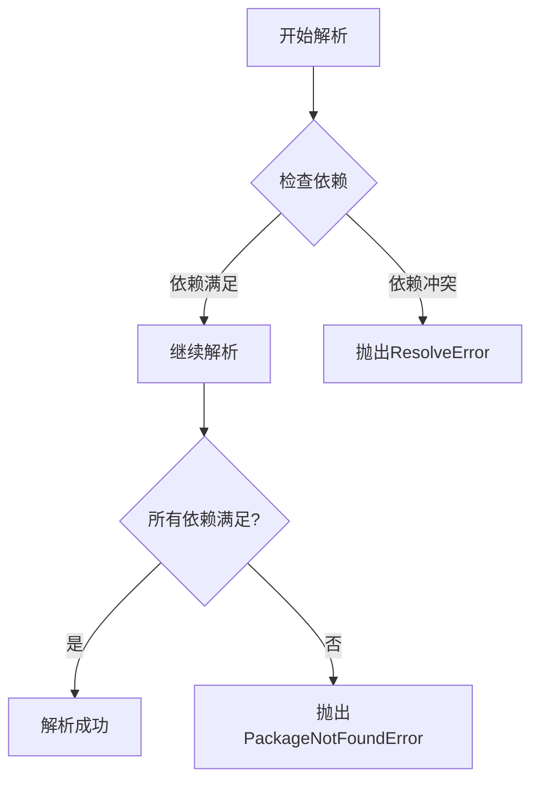

# 错误处理与调试

<cite>
**本文档中引用的文件**  
- [resolver.py](file://rez-3.3.0\src\rez\resolver.py)
- [exceptions.py](file://rez-3.3.0\src\rez\exceptions.py)
- [basic_concepts.rst](file://rez-3.3.0\docs\source\basic_concepts.rst)
- [solver.py](file://rez-3.3.0\src\rez\solver.py)
- [env.py](file://rez-3.3.0\src\rez\cli\env.py)
</cite>

## 目录
1. [引言](#引言)
2. [常见依赖解析错误类型](#常见依赖解析错误类型)
3. [错误传播机制](#错误传播机制)
4. [实用调试技巧](#实用调试技巧)
5. [基于核心概念的错误理解](#基于核心概念的错误理解)
6. [总结](#总结)

## 引言

Rez 是一个强大的包管理系统，用于管理复杂的软件依赖关系。在使用 Rez 进行依赖解析时，可能会遇到各种错误。本文档旨在系统性地记录这些错误类型及其诊断方法，帮助用户理解错误背后的系统原理，并提供实用的调试技巧。

**Section sources**
- [basic_concepts.rst](file://rez-3.3.0\docs\source\basic_concepts.rst#L1-L441)

## 常见依赖解析错误类型

在依赖解析过程中，可能会遇到多种错误类型。以下是几种常见的错误及其触发条件和错误信息含义。

### 版本冲突

版本冲突是最常见的错误类型之一。当请求的包之间存在不兼容的版本要求时，就会发生版本冲突。例如，一个包要求 `python-2.7`，而另一个包要求 `python-3.6`，这将导致无法解析的冲突。

### 包未找到

当指定的包在任何配置的包搜索路径中都找不到时，会抛出包未找到错误。这可能是由于包名称拼写错误、版本号不存在或包搜索路径配置不正确导致的。

### 循环依赖

循环依赖发生在两个或多个包相互依赖的情况下。例如，包 A 依赖于包 B，而包 B 又依赖于包 A。这种情况下，解析器无法确定加载顺序，从而导致解析失败。

### 变体不匹配

变体不匹配错误通常发生在包的变体（variant）之间存在不兼容的依赖关系时。例如，一个包的某个变体要求特定版本的依赖，而另一个变体要求不同的版本，这可能导致解析失败。

**Section sources**
- [resolver.py](file://rez-3.3.0\src\rez\resolver.py#L1-L475)
- [exceptions.py](file://rez-3.3.0\src\rez\exceptions.py#L1-L229)
- [solver.py](file://rez-3.3.0\src\rez\solver.py#L1-L400)

## 错误传播机制

Rez 的错误传播机制基于 `resolver.py` 中的异常抛出点和 `exceptions.py` 中定义的异常类。当解析过程中遇到问题时，相应的异常会被抛出，并通过调用栈传递到上层处理。

### 异常类定义

`exceptions.py` 文件中定义了多种异常类，如 `ResolveError`、`PackageNotFoundError` 等。这些异常类继承自基类 `RezError`，并提供了具体的错误描述。

### 异常抛出点

在 `resolver.py` 中，解析器会在检测到无法满足的依赖关系时抛出异常。例如，在 `_solve` 方法中，如果发现版本冲突或包未找到，会立即抛出相应的异常。

**Diagram sources**
- [resolver.py](file://rez-3.3.0\src\rez\resolver.py#L397-L413)
- [exceptions.py](file://rez-3.3.0\src\rez\exceptions.py#L40-L53)

## 实用调试技巧

为了有效诊断和解决依赖解析问题，可以采用以下几种实用的调试技巧。

### 使用 `rez-env --verbose` 查看解析日志

通过添加 `--verbose` 参数运行 `rez-env` 命令，可以获得详细的解析过程日志。这些日志可以帮助识别具体哪个步骤出现了问题。

### 利用 `rez search` 验证包可用性

使用 `rez search` 命令可以验证指定的包是否存在于配置的包搜索路径中。这对于确认包名称和版本号是否正确非常有用。

### 通过 `rez resolve --show-unresolved` 定位问题依赖

`rez resolve --show-unresolved` 命令可以显示未能解析的依赖项，帮助快速定位问题所在。

**Section sources**
- [env.py](file://rez-3.3.0\src\rez\cli\env.py#L1-L200)
- [basic_concepts.rst](file://rez-3.3.0\docs\source\basic_concepts.rst#L227-L254)

## 基于核心概念的错误理解

理解 Rez 的核心概念对于正确诊断和解决错误至关重要。以下是一些关键概念及其与错误处理的关系。

### 包请求

包请求是用户向 Rez 提出的包需求，可以包含版本范围和其他约束条件。理解包请求的语法和语义有助于避免常见的请求错误。

### 依赖解析

依赖解析是 Rez 核心功能之一，它通过算法确保所有依赖关系都能被满足且无冲突。了解解析算法的工作原理有助于预测和解决潜在的问题。

### 隐式包

隐式包是一组自动添加到每个请求中的包，用于确保环境的一致性和兼容性。理解隐式包的作用可以帮助避免因忽略这些包而导致的解析失败。

**Section sources**
- [basic_concepts.rst](file://rez-3.3.0\docs\source\basic_concepts.rst#L227-L350)

## 总结

本文档详细介绍了 Rez 依赖解析过程中可能出现的错误类型、错误传播机制以及实用的调试技巧。通过结合 `resolver.py` 和 `exceptions.py` 中的实现细节，以及 `basic_concepts.rst` 中的核心概念，用户可以更好地理解和解决依赖解析问题。希望这些信息能帮助您更高效地使用 Rez 管理复杂的软件依赖关系。

**Section sources**
- [resolver.py](file://rez-3.3.0\src\rez\resolver.py#L1-L475)
- [exceptions.py](file://rez-3.3.0\src\rez\exceptions.py#L1-L229)
- [basic_concepts.rst](file://rez-3.3.0\docs\source\basic_concepts.rst#L1-L441)