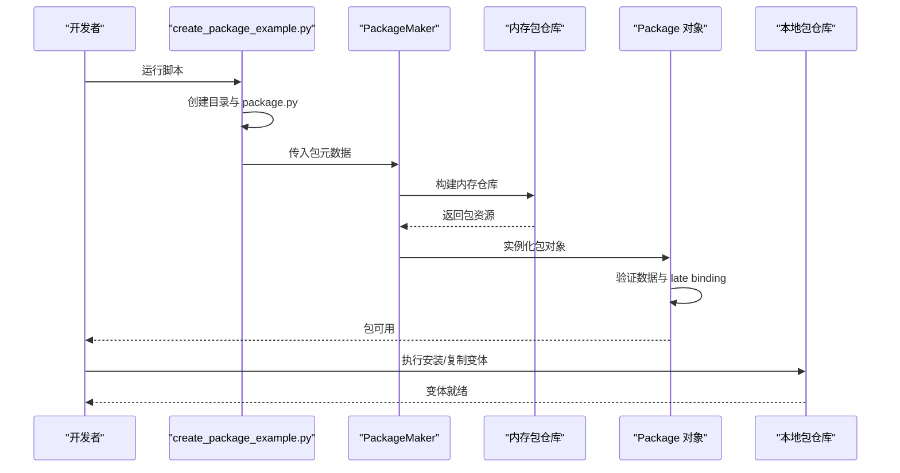
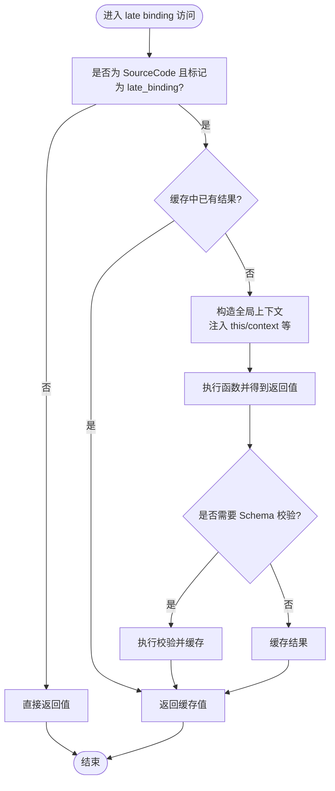
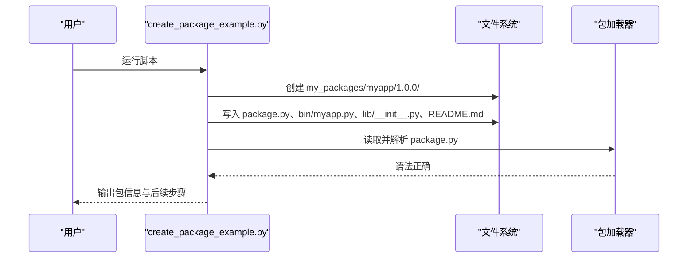
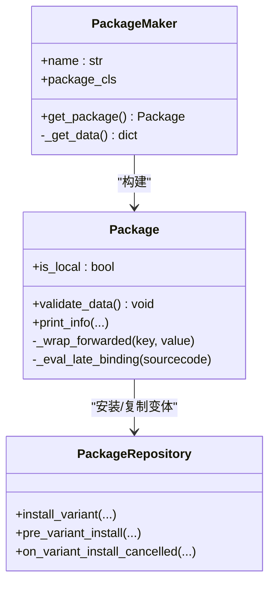
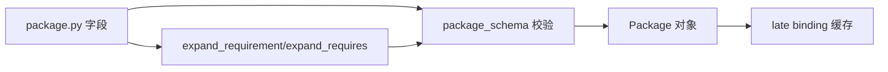

# 包创建

<cite>
**本文引用的文件**
- [create_package_example.py](file://create_package_example.py)
- [myapp 包定义](file://my_packages/myapp/1.0.0/package.py)
- [hello_world 包定义](file://rez-3.3.0/example_packages/hello_world/package.py)
- [maya 包定义](file://my_packages/maya/2022/package.py)
- [python 包定义](file://my_packages/python/3.10.0/package.py)
- [package_maker.py](file://rez-3.3.0/src/rez/package_maker.py)
- [package_py_utils.py](file://rez-3.3.0/src/rez/package_py_utils.py)
- [packages.py](file://rez-3.3.0/src/rez/packages.py)
- [package_definition.rst](file://rez-3.3.0/docs/source/package_definition.rst)
- [package_repository.py](file://rez-3.3.0/src/rez/package_repository.py)
</cite>

## 目录
1. [简介](#简介)
2. [项目结构](#项目结构)
3. [核心组件](#核心组件)
4. [架构总览](#架构总览)
5. [详细组件分析](#详细组件分析)
6. [依赖关系分析](#依赖关系分析)
7. [性能考量](#性能考量)
8. [故障排查指南](#故障排查指南)
9. [结论](#结论)
10. [附录](#附录)

## 简介
本文件围绕 Rez 的“包创建”能力展开，重点解释如何使用 package.py 定义 Rez 包，覆盖 name、version、requires、variants 等核心字段的语法与语义；结合 myapp 与 hello_world 示例，给出完整的 package.py 结构与最佳实践；讲解动态属性（late binding）在 requires 中的使用方式；说明 create_package_example.py 脚本如何通过 API 自动化创建包；并提供从零开始创建新包的分步指南、本地测试流程、常见错误与调试建议。

## 项目结构
本仓库包含：
- 示例包定义：my_packages 下的 myapp、maya、python 等包，以及 Rez 源码中的 hello_world 示例包。
- 自动化脚本：create_package_example.py，演示如何用 Python API 创建一个最小可用包。
- Rez 核心源码：package_maker.py、package_py_utils.py、packages.py、package_definition.rst、package_repository.py 等，用于理解包定义、动态属性、验证与安装流程。

```mermaid
graph TB
A["create_package_example.py"] --> B["my_packages/myapp/1.0.0/package.py"]
A --> C["my_packages/myapp/1.0.0/bin/myapp.py"]
A --> D["my_packages/myapp/1.0.0/lib/__init__.py"]
A --> E["my_packages/myapp/1.0.0/README.md"]
F["rez-3.3.0/example_packages/hello_world/package.py"] --> G["bin/hello"]
F --> H["python/hello_world.py"]
I["my_packages/maya/2022/package.py"] --> I2["variants 空列表占位"]
J["my_packages/python/3.10.0/package.py"] --> J2["外部占位包"]
K["package_maker.py"] --> L["packages.py"]
M["package_py_utils.py"] --> N["packages.py"]
O["package_definition.rst"] --> L
P["package_repository.py"] --> Q["安装/复制变体流程"]
```

图表来源
- [create_package_example.py](file://create_package_example.py#L1-L179)
- [myapp 包定义](file://my_packages/myapp/1.0.0/package.py#L1-L33)
- [hello_world 包定义](file://rez-3.3.0/example_packages/hello_world/package.py#L1-L29)
- [maya 包定义](file://my_packages/maya/2022/package.py#L1-L9)
- [python 包定义](file://my_packages/python/3.10.0/package.py#L1-L8)
- [package_maker.py](file://rez-3.3.0/src/rez/package_maker.py#L1-L200)
- [packages.py](file://rez-3.3.0/src/rez/packages.py#L1-L200)
- [package_py_utils.py](file://rez-3.3.0/src/rez/package_py_utils.py#L1-L200)
- [package_definition.rst](file://rez-3.3.0/docs/source/package_definition.rst#L1-L200)
- [package_repository.py](file://rez-3.3.0/src/rez/package_repository.py#L1-L200)

章节来源
- [create_package_example.py](file://create_package_example.py#L1-L179)
- [myapp 包定义](file://my_packages/myapp/1.0.0/package.py#L1-L33)
- [hello_world 包定义](file://rez-3.3.0/example_packages/hello_world/package.py#L1-L29)
- [maya 包定义](file://my_packages/maya/2022/package.py#L1-L9)
- [python 包定义](file://my_packages/python/3.10.0/package.py#L1-L8)

## 核心组件
- 包定义文件 package.py：定义包名、版本、描述、作者、依赖、变体、工具、构建命令、环境命令等。
- 动态属性（late binding）：允许在运行时按上下文计算属性值，如 requires、tools 等。
- 包创建 API：通过 PackageMaker 与 make_package 等接口，程序化地构建与安装包。
- 包验证与序列化：对 package.py 进行模式校验、Schema 校验与 late binding 缓存。
- 包仓库与安装：将包变体写入本地仓库，支持预安装标记、取消安装清理等。

章节来源
- [package_definition.rst](file://rez-3.3.0/docs/source/package_definition.rst#L1-L200)
- [package_maker.py](file://rez-3.3.0/src/rez/package_maker.py#L1-L200)
- [packages.py](file://rez-3.3.0/src/rez/packages.py#L1-L200)
- [package_py_utils.py](file://rez-3.3.0/src/rez/package_py_utils.py#L1-L200)
- [package_repository.py](file://rez-3.3.0/src/rez/package_repository.py#L1-L200)

## 架构总览
下图展示了从 package.py 到包对象、再到安装与使用的整体流程。

图表来源
- [create_package_example.py](file://create_package_example.py#L1-L179)
- [package_maker.py](file://rez-3.3.0/src/rez/package_maker.py#L1-L200)
- [packages.py](file://rez-3.3.0/src/rez/packages.py#L1-L200)
- [package_repository.py](file://rez-3.3.0/src/rez/package_repository.py#L1-L200)

## 详细组件分析

### package.py 字段与语义
- name：包名，字符串，必填。
- version：版本号，字符串或版本对象，可选。
- description：包描述，字符串。
- authors：作者列表，字符串数组。
- requires：运行时依赖，字符串数组；可使用通配符与范围表达式。
- build_requires/private_build_requires：构建期依赖。
- variants：变体列表，二维数组，每个子数组为一组约束集合。
- tools：工具名称列表，可延迟绑定。
- help/tests/pre_commands/commands/post_commands：帮助信息、测试配置、命令钩子。
- build_system/build_command：预构建包的构建系统与命令。
- 其他任意键：可扩展自定义字段。

章节来源
- [package_definition.rst](file://rez-3.3.0/docs/source/package_definition.rst#L1-L200)
- [myapp 包定义](file://my_packages/myapp/1.0.0/package.py#L1-L33)
- [hello_world 包定义](file://rez-3.3.0/example_packages/hello_world/package.py#L1-L29)
- [maya 包定义](file://my_packages/maya/2022/package.py#L1-L9)
- [python 包定义](file://my_packages/python/3.10.0/package.py#L1-L8)

### 动态属性（late binding）与条件依赖
- late binding：允许将某些属性定义为函数，在首次访问时惰性求值并缓存结果。适用于 requires、tools、help、任意自定义属性等。
- 在 requires 中使用 Python 函数进行条件依赖声明：例如根据环境变量、平台或上下文动态决定依赖集合。
- 早期绑定（@early）与命令函数（commands）例外：前者在构建时评估，后者始终晚绑定但不装饰。

图表来源
- [packages.py](file://rez-3.3.0/src/rez/packages.py#L143-L184)
- [package_definition.rst](file://rez-3.3.0/docs/source/package_definition.rst#L177-L244)

章节来源
- [package_definition.rst](file://rez-3.3.0/docs/source/package_definition.rst#L177-L244)
- [packages.py](file://rez-3.3.0/src/rez/packages.py#L143-L184)

### create_package_example.py：API 自动化创建包
该脚本演示了：
- 创建包目录结构与 package.py 内容；
- 生成 bin 与 lib 目录及示例文件；
- 读取并验证 package.py 的语法；
- 输出后续构建、加载与搜索包的命令提示。

图表来源
- [create_package_example.py](file://create_package_example.py#L1-L179)

章节来源
- [create_package_example.py](file://create_package_example.py#L1-L179)

### 包创建 API：PackageMaker 与 make_package
- PackageMaker：封装包数据，进行 Schema 校验，创建内存仓库并返回 Package 对象。
- make_package：上下文管理器，yield 一个 PackageMaker，块结束后构建包并可安装到仓库。
- 适用场景：程序化创建包、批量生成包定义、集成 CI/CD 流程。

图表来源
- [package_maker.py](file://rez-3.3.0/src/rez/package_maker.py#L1-L200)
- [packages.py](file://rez-3.3.0/src/rez/packages.py#L1-L200)
- [package_repository.py](file://rez-3.3.0/src/rez/package_repository.py#L1-L200)

章节来源
- [package_maker.py](file://rez-3.3.0/src/rez/package_maker.py#L1-L200)
- [packages.py](file://rez-3.3.0/src/rez/packages.py#L1-L200)
- [package_repository.py](file://rez-3.3.0/src/rez/package_repository.py#L1-L200)

### 示例包：myapp 与 hello_world
- myapp：最小可用示例，定义 name、version、commands、variants 等，便于理解字段作用。
- hello_world：展示 tools、requires、build_command、uuid 等字段，适合学习构建期命令与工具导出。

章节来源
- [myapp 包定义](file://my_packages/myapp/1.0.0/package.py#L1-L33)
- [hello_world 包定义](file://rez-3.3.0/example_packages/hello_world/package.py#L1-L29)

## 依赖关系分析
- 包字段与 Schema：package_maker.py 中定义了 package_schema，约束 name、version、requires、variants、tools、commands 等字段类型与可选性。
- late binding 与验证：packages.py 中对 late binding 属性进行缓存与可选 Schema 校验。
- 依赖解析与通配符：package_py_utils.py 提供 expand_requirement/expand_requires，支持通配符与版本范围展开。

图表来源
- [package_maker.py](file://rez-3.3.0/src/rez/package_maker.py#L48-L90)
- [packages.py](file://rez-3.3.0/src/rez/packages.py#L71-L90)
- [package_py_utils.py](file://rez-3.3.0/src/rez/package_py_utils.py#L1-L200)

章节来源
- [package_maker.py](file://rez-3.3.0/src/rez/package_maker.py#L48-L90)
- [packages.py](file://rez-3.3.0/src/rez/packages.py#L71-L90)
- [package_py_utils.py](file://rez-3.3.0/src/rez/package_py_utils.py#L1-L200)

## 性能考量
- late binding 的惰性求值与缓存：避免重复计算，提升运行时性能。
- early binding 的构建期计算：将可确定的值提前固化，减少运行时开销。
- 通配符展开：在构建期完成，避免运行时多次解析。

章节来源
- [package_definition.rst](file://rez-3.3.0/docs/source/package_definition.rst#L177-L244)
- [packages.py](file://rez-3.3.0/src/rez/packages.py#L143-L184)
- [package_py_utils.py](file://rez-3.3.0/src/rez/package_py_utils.py#L1-L200)

## 故障排查指南
常见问题与建议：
- 版本格式错误
  - 现象：版本字符串不符合规范导致解析失败。
  - 排查：检查 version 字段是否为字符串或合法版本对象；确保与 Rez 版本兼容。
  - 参考：package_maker.py 中对 version 的 Schema 校验。
- 依赖循环
  - 现象：requires 中形成环状依赖，导致解析失败。
  - 排查：使用解析失败报告定位冲突链路；拆分依赖或引入中间层。
  - 参考：packages.py 中 late binding 的上下文注入与 this 引用。
- late binding 未生效或报错
  - 现象：函数未被调用或返回值未缓存。
  - 排查：确认属性是否允许 late binding；检查函数内导入是否在函数体内；查看缓存命中情况。
  - 参考：packages.py 中 _wrap_forwarded 与 _eval_late_binding。
- 通配符展开异常
  - 现象：requires 中通配符无法展开或产生无效范围。
  - 排查：使用 expand_requirement/expand_requires 检查展开结果；修正通配符位置与范围。
  - 参考：package_py_utils.py 中 expand_requirement/expand_requires。
- 安装/复制变体失败
  - 现象：安装过程中取消或失败。
  - 排查：关注 pre_variant_install/on_variant_install_cancelled 生命周期钩子；检查构建命令与测试配置。
  - 参考：package_repository.py 中相关方法与插件流程。

章节来源
- [package_maker.py](file://rez-3.3.0/src/rez/package_maker.py#L48-L90)
- [packages.py](file://rez-3.3.0/src/rez/packages.py#L143-L184)
- [package_py_utils.py](file://rez-3.3.0/src/rez/package_py_utils.py#L1-L200)
- [package_repository.py](file://rez-3.3.0/src/rez/package_repository.py#L294-L330)

## 结论
通过 package.py 可以清晰地定义 Rez 包的元数据与行为；借助 late binding 可实现灵活的条件依赖与动态属性；create_package_example.py 展示了如何用 API 自动化创建包；结合 myapp 与 hello_world 示例，可以快速上手并掌握最佳实践。在实际工程中，应重视版本格式、依赖关系与 late binding 的正确使用，并利用内置的验证与安装流程保障稳定性。

## 附录

### 从零开始创建新包的分步指南
- 步骤一：规划包结构
  - 在 my_packages/<pkg>/<ver>/ 下创建目录。
  - 准备 bin、lib、python 等资源目录（按需）。
- 步骤二：编写 package.py
  - 填写 name、version、description、authors。
  - 定义 requires、variants、tools、commands 等。
  - 如需动态依赖，使用 late binding 函数。
- 步骤三：本地验证
  - 使用 create_package_example.py 生成并验证 package.py。
  - 通过 Rez CLI 搜索与加载包，确认环境变量与 PATH 设置正确。
- 步骤四：安装与发布
  - 将包安装到本地仓库或发布到远端仓库。
  - 配置 REZ_PACKAGES_PATH 以便 Rez 搜索本地包。

章节来源
- [create_package_example.py](file://create_package_example.py#L1-L179)
- [myapp 包定义](file://my_packages/myapp/1.0.0/package.py#L1-L33)
- [hello_world 包定义](file://rez-3.3.0/example_packages/hello_world/package.py#L1-L29)