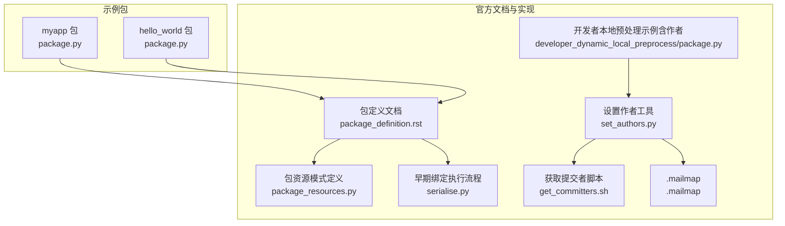
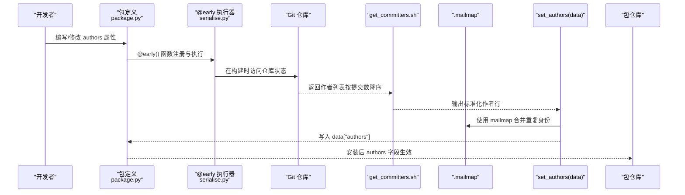
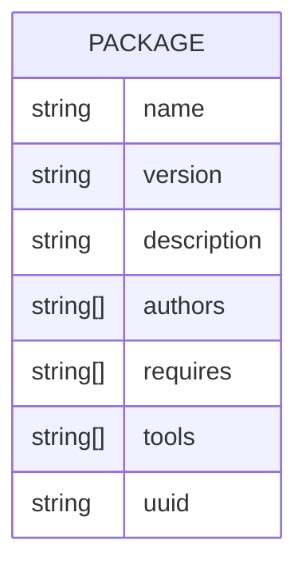
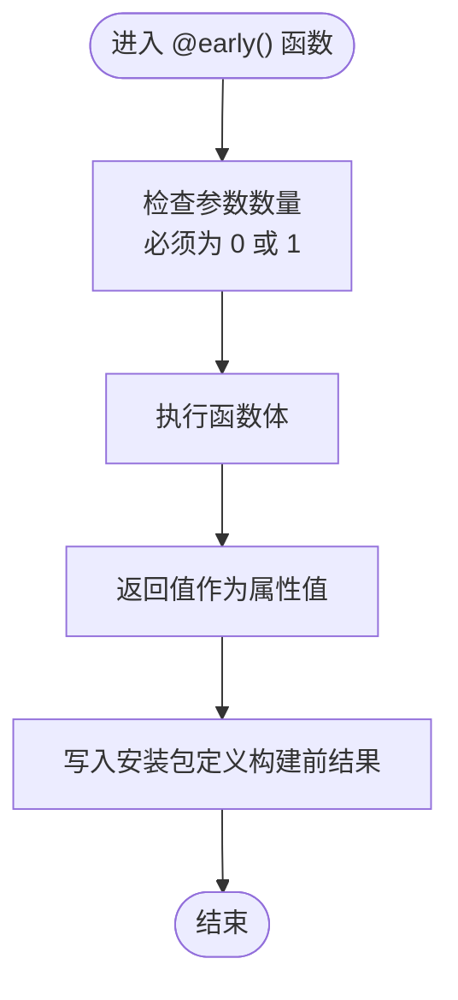
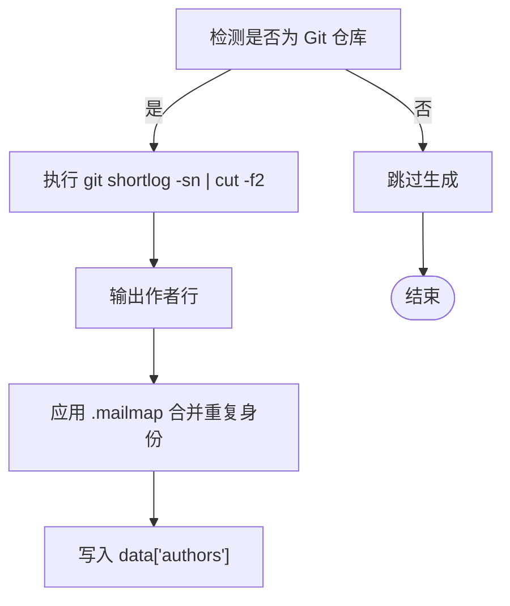
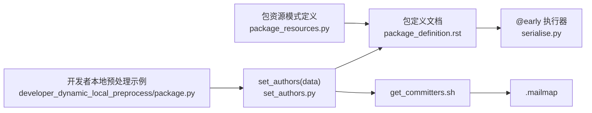

# 作者 (authors)

<cite>
**本文引用的文件**
- [myapp 包定义](file://my_packages/myapp/1.0.0/package.py)
- [hello_world 包定义](file://rez-3.3.0/example_packages/hello_world/package.py)
- [包定义文档](file://rez-3.3.0/docs/source/package_definition.rst)
- [包资源模式定义](file://rez-3.3.0/src/rez/package_resources.py)
- [早期绑定函数执行流程](file://rez-3.3.0/src/rez/serialise.py)
- [获取提交者脚本](file://rez-3.3.0/src/support/package_utils/get_committers.sh)
- [.mailmap 文件](file://rez-3.3.0/.mailmap)
- [设置作者工具](file://rez-3.3.0/src/support/package_utils/set_authors.py)
- [开发者本地预处理示例（含作者）](file://rez-3.3.0/src/rez/data/tests/packages/developer_dynamic_local_preprocess/package.py)
</cite>

## 目录
1. [简介](#简介)
2. [项目结构](#项目结构)
3. [核心组件](#核心组件)
4. [架构总览](#架构总览)
5. [详细组件分析](#详细组件分析)
6. [依赖关系分析](#依赖关系分析)
7. [性能考量](#性能考量)
8. [故障排查指南](#故障排查指南)
9. [结论](#结论)
10. [附录](#附录)

## 简介
本章节聚焦于 Rez 包定义中的 authors 字段，说明其用途、数据格式与排序规则，并结合仓库中的示例包与官方文档，演示如何通过 @early() 装饰器与 git 命令自动填充作者列表。同时讨论维护准确作者信息对项目可追溯性与协作的价值。

## 项目结构
- 示例包：
  - myapp 包：包含一个基础的 authors 列表字段，便于理解字段的基本用法。
  - hello_world 包：包含一个 authors 列表字段，作为另一个示例。
- 官方文档与实现：
  - 包定义文档明确指出 authors 是标准字段之一，并提供 @early() 的使用场景与注意事项。
  - 包资源模式定义将 authors 规定为字符串列表类型，确保数据一致性。
  - 支持脚本与工具展示了如何基于 VCS 提交历史自动生成作者列表，并通过 .mailmap 进行去重与规范化。

图表来源
- [myapp 包定义](file://my_packages/myapp/1.0.0/package.py#L1-L33)
- [hello_world 包定义](file://rez-3.3.0/example_packages/hello_world/package.py#L1-L29)
- [包定义文档](file://rez-3.3.0/docs/source/package_definition.rst#L90-L110)
- [包资源模式定义](file://rez-3.3.0/src/rez/package_resources.py#L115-L125)
- [早期绑定函数执行流程](file://rez-3.3.0/src/rez/serialise.py#L321-L353)
- [获取提交者脚本](file://rez-3.3.0/src/support/package_utils/get_committers.sh#L1-L17)
- [.mailmap 文件](file://rez-3.3.0/.mailmap#L1-L168)
- [设置作者工具](file://rez-3.3.0/src/support/package_utils/set_authors.py#L1-L25)
- [开发者本地预处理示例（含作者）](file://rez-3.3.0/src/rez/data/tests/packages/developer_dynamic_local_preprocess/package.py#L1-L20)

章节来源
- [myapp 包定义](file://my_packages/myapp/1.0.0/package.py#L1-L33)
- [hello_world 包定义](file://rez-3.3.0/example_packages/hello_world/package.py#L1-L29)
- [包定义文档](file://rez-3.3.0/docs/source/package_definition.rst#L90-L110)
- [包资源模式定义](file://rez-3.3.0/src/rez/package_resources.py#L115-L125)

## 核心组件
- authors 字段
  - 作用：记录包的主要贡献者，通常按贡献程度或团队角色排序。
  - 数据格式：字符串列表（字符串数组），每个元素代表一位作者标识（如用户名或全名）。
  - 示例：
    - myapp 包：authors = ["Your Name"]（单人示例）
    - hello_world 包：authors = ["ajohns"]（单人示例）

- @early() 装饰器与自动填充
  - 用途：在构建阶段（build time）执行函数，返回值写入安装后的包定义。
  - 文档示例：通过 git shortlog 获取作者列表，适合自动化生成 authors。
  - 实现要点：
    - 早期绑定函数仅能访问 this 暴露的包属性，不能直接使用环境变量。
    - 不建议在早期绑定函数中引用其他早期/晚期绑定属性，否则会报错。
    - 早期绑定函数会在构建前与每个变体构建时各执行一次，最终写入安装包定义的是“构建前”那次的结果。

- 自动化工具链
  - get_committers.sh：在当前工作目录为 Git 仓库时，输出按提交数降序的作者列表。
  - set_authors(data)：调用脚本并把结果写入 data["authors"]，若 data 已存在 authors 则跳过。
  - .mailmap：用于合并重复作者身份，确保同一作者的不同邮箱/名称被统一为规范形式。

章节来源
- [myapp 包定义](file://my_packages/myapp/1.0.0/package.py#L1-L33)
- [hello_world 包定义](file://rez-3.3.0/example_packages/hello_world/package.py#L1-L29)
- [包定义文档](file://rez-3.3.0/docs/source/package_definition.rst#L90-L110)
- [包资源模式定义](file://rez-3.3.0/src/rez/package_resources.py#L115-L125)
- [早期绑定函数执行流程](file://rez-3.3.0/src/rez/serialise.py#L321-L353)
- [获取提交者脚本](file://rez-3.3.0/src/support/package_utils/get_committers.sh#L1-L17)
- [设置作者工具](file://rez-3.3.0/src/support/package_utils/set_authors.py#L1-L25)
- [.mailmap 文件](file://rez-3.3.0/.mailmap#L1-L168)

## 架构总览
下图展示了从包定义到作者信息生成的整体流程，包括 @early() 执行、VCS 查询与规范化处理。

图表来源
- [包定义文档](file://rez-3.3.0/docs/source/package_definition.rst#L90-L110)
- [早期绑定函数执行流程](file://rez-3.3.0/src/rez/serialise.py#L321-L353)
- [获取提交者脚本](file://rez-3.3.0/src/support/package_utils/get_committers.sh#L1-L17)
- [.mailmap 文件](file://rez-3.3.0/.mailmap#L1-L168)
- [设置作者工具](file://rez-3.3.0/src/support/package_utils/set_authors.py#L1-L25)

## 详细组件分析

### 组件一：authors 字段的数据模型与约束
- 类型约束：字符串列表（[str]），保证每个作者标识为字符串。
- 可扩展性：除标准字段外，包定义允许任意自定义键，但 authors 由模式显式声明。
- 与变体无关：authors 作为基础元数据，不随变体变化。

图表来源
- [包资源模式定义](file://rez-3.3.0/src/rez/package_resources.py#L115-L125)

章节来源
- [包资源模式定义](file://rez-3.3.0/src/rez/package_resources.py#L115-L125)

### 组件二：@early() 装饰器与 authors 自动填充流程
- 执行时机：构建前与每个变体构建时执行，最终写入安装包定义的是构建前那次的结果。
- 可用对象：this（仅暴露包属性）、building、build_variant_index 等。
- 注意事项：不要在早期绑定函数中引用其他早期/晚期绑定属性；不要在早期绑定函数中使用环境变量。

图表来源
- [早期绑定函数执行流程](file://rez-3.3.0/src/rez/serialise.py#L321-L353)
- [包定义文档](file://rez-3.3.0/docs/source/package_definition.rst#L90-L110)

章节来源
- [早期绑定函数执行流程](file://rez-3.3.0/src/rez/serialise.py#L321-L353)
- [包定义文档](file://rez-3.3.0/docs/source/package_definition.rst#L90-L110)

### 组件三：基于 git 的作者列表生成与规范化
- get_committers.sh：在当前目录为 Git 仓库时，使用 git shortlog -sn | cut -f2 输出作者列表（按提交数降序）。
- set_authors(data)：若 data 中不存在 authors，则调用脚本并将结果写入 data["authors"]；若脚本返回非零码则跳过。
- .mailmap：通过邮件映射合并重复作者身份，避免同一个人因不同邮箱/名称导致重复计数。

图表来源
- [获取提交者脚本](file://rez-3.3.0/src/support/package_utils/get_committers.sh#L1-L17)
- [.mailmap 文件](file://rez-3.3.0/.mailmap#L1-L168)
- [设置作者工具](file://rez-3.3.0/src/support/package_utils/set_authors.py#L1-L25)

章节来源
- [获取提交者脚本](file://rez-3.3.0/src/support/package_utils/get_committers.sh#L1-L17)
- [.mailmap 文件](file://rez-3.3.0/.mailmap#L1-L168)
- [设置作者工具](file://rez-3.3.0/src/support/package_utils/set_authors.py#L1-L25)

### 组件四：示例包中的 authors 字段
- myapp 包：authors = ["Your Name"]，体现单人维护场景。
- hello_world 包：authors = ["ajohns"]，体现单人维护场景。

章节来源
- [myapp 包定义](file://my_packages/myapp/1.0.0/package.py#L1-L33)
- [hello_world 包定义](file://rez-3.3.0/example_packages/hello_world/package.py#L1-L29)

### 组件五：开发者本地预处理示例（含作者）
- 示例包通过 preprocess(this, data) 将 authors 注入 data，再由安装流程写入包定义。
- 该方式与 @early() 等价，均可在构建期生成 authors 并写入安装包。

章节来源
- [开发者本地预处理示例（含作者）](file://rez-3.3.0/src/rez/data/tests/packages/developer_dynamic_local_preprocess/package.py#L1-L20)

## 依赖关系分析
- authors 字段受包资源模式约束，确保类型正确。
- @early() 执行依赖 serialise 流程，构建期执行并写入安装包定义。
- 自动化生成依赖 get_committers.sh 与 .mailmap，形成“查询 -> 规范化 -> 写入”的闭环。
- 开发者本地预处理示例与 set_authors 工具共享相同的目标：在构建期生成 authors。

图表来源
- [包资源模式定义](file://rez-3.3.0/src/rez/package_resources.py#L115-L125)
- [包定义文档](file://rez-3.3.0/docs/source/package_definition.rst#L90-L110)
- [早期绑定函数执行流程](file://rez-3.3.0/src/rez/serialise.py#L321-L353)
- [设置作者工具](file://rez-3.3.0/src/support/package_utils/set_authors.py#L1-L25)
- [获取提交者脚本](file://rez-3.3.0/src/support/package_utils/get_committers.sh#L1-L17)
- [.mailmap 文件](file://rez-3.3.0/.mailmap#L1-L168)
- [开发者本地预处理示例（含作者）](file://rez-3.3.0/src/rez/data/tests/packages/developer_dynamic_local_preprocess/package.py#L1-L20)

章节来源
- [包资源模式定义](file://rez-3.3.0/src/rez/package_resources.py#L115-L125)
- [包定义文档](file://rez-3.3.0/docs/source/package_definition.rst#L90-L110)
- [早期绑定函数执行流程](file://rez-3.3.0/src/rez/serialise.py#L321-L353)
- [设置作者工具](file://rez-3.3.0/src/support/package_utils/set_authors.py#L1-L25)
- [获取提交者脚本](file://rez-3.3.0/src/support/package_utils/get_committers.sh#L1-L17)
- [.mailmap 文件](file://rez-3.3.0/.mailmap#L1-L168)
- [开发者本地预处理示例（含作者）](file://rez-3.3.0/src/rez/data/tests/packages/developer_dynamic_local_preprocess/package.py#L1-L20)

## 性能考量
- 早期绑定函数只在构建期执行，避免运行时开销。
- 若 authors 可在构建期确定且稳定，优先使用 @early() 或本地预处理注入，减少运行时计算。
- 使用 .mailmap 合并重复身份，避免后续查询与统计时的重复开销。

## 故障排查指南
- @early() 函数报错
  - 现象：在早期绑定函数中引用其他早期/晚期绑定属性或使用环境变量。
  - 处理：遵循早期绑定限制，仅使用 this 暴露的包属性；将动态逻辑移至晚期绑定函数。
  - 参考：包定义文档关于早期绑定限制与可用对象的说明。

- git 命令失败
  - 现象：get_committers.sh 返回非零码，set_authors(data) 跳过写入。
  - 处理：确认当前目录为有效 Git 仓库；检查 git 命令权限与网络代理；必要时手动指定 authors。
  - 参考：set_authors 工具对返回码的处理逻辑。

- 作者重复或不一致
  - 现象：同一作者因不同邮箱/名称出现多次。
  - 处理：在 .mailmap 中添加映射，统一 Canonical 形式；重新生成 authors。
  - 参考：.mailmap 文件格式与使用说明。

章节来源
- [包定义文档](file://rez-3.3.0/docs/source/package_definition.rst#L90-L110)
- [设置作者工具](file://rez-3.3.0/src/support/package_utils/set_authors.py#L1-L25)
- [.mailmap 文件](file://rez-3.3.0/.mailmap#L1-L168)

## 结论
authors 字段是 Rez 包的重要元数据，用于记录主要贡献者并体现项目可追溯性。通过 @early() 装饰器与 git 命令，可在构建期自动填充 authors，并借助 .mailmap 实现身份规范化。维护准确的 authors 信息有助于：
- 明确责任归属与贡献者识别；
- 优化问题定位与协作沟通；
- 提升发布与审计的透明度。

## 附录
- 示例字段与排序建议
  - myapp 示例：authors = ["Your Name"]（单人维护）
  - hello_world 示例：authors = ["ajohns"]（单人维护）
  - 排序建议：按贡献程度或团队角色排序，便于读者快速识别关键维护者。

章节来源
- [myapp 包定义](file://my_packages/myapp/1.0.0/package.py#L1-L33)
- [hello_world 包定义](file://rez-3.3.0/example_packages/hello_world/package.py#L1-L29)