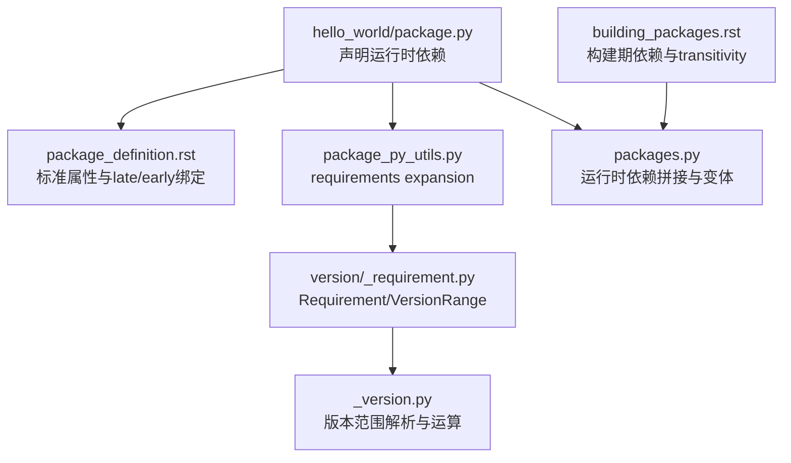
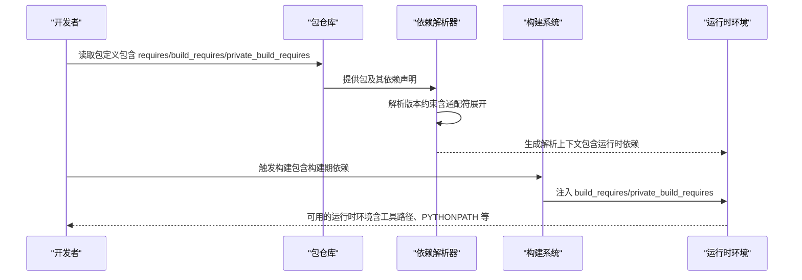
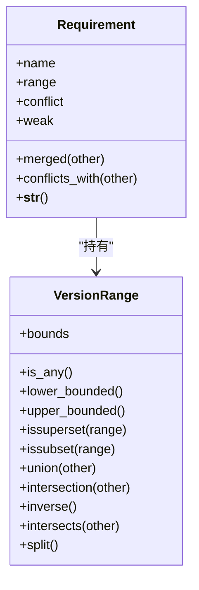
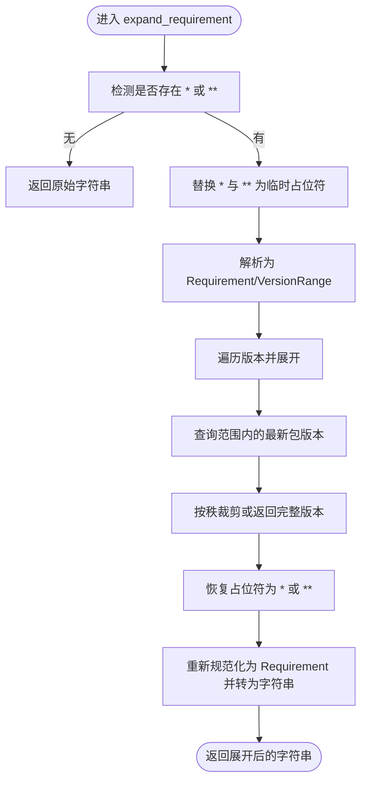
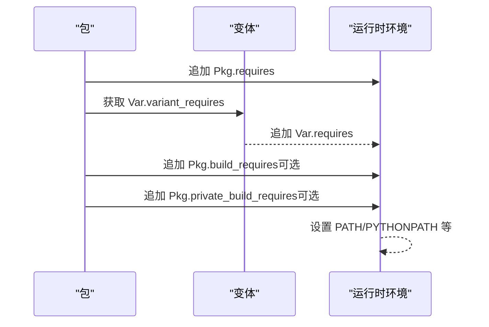

# 依赖项 (requires)

<cite>
**本文引用的文件列表**
- [hello_world/package.py](file://rez-3.3.0/example_packages/hello_world/package.py)
- [package_definition.rst](file://rez-3.3.0/docs/source/package_definition.rst)
- [building_packages.rst](file://rez-3.3.0/docs/source/building_packages.rst)
- [_requirement.py](file://rez-3.3.0/src/rez/version/_requirement.py)
- [_version.py](file://rez-3.3.0/src/rez/version/_version.py)
- [package_py_utils.py](file://rez-3.3.0/src/rez/package_py_utils.py)
- [packages.py](file://rez-3.3.0/src/rez/packages.py)
- [python/3.10.0/package.py](file://my_packages/python/3.10.0/package.py)
</cite>

## 目录
1. [简介](#简介)
2. [项目结构与定位](#项目结构与定位)
3. [核心组件：requires 字段与依赖解析](#核心组件requires-字段与依赖解析)
4. [架构总览](#架构总览)
5. [详细组件分析](#详细组件分析)
6. [依赖关系与变体扩展](#依赖关系与变体扩展)
7. [性能与可维护性考量](#性能与可维护性考量)
8. [故障排查与常见问题](#故障排查与常见问题)
9. [结论](#结论)

## 简介
本章节围绕 Rez 包定义中的“依赖项”（requires）进行系统化说明，重点涵盖：
- 如何通过 requires 声明包的运行时依赖，作为依赖解析器的核心输入；
- 基于 hello_world 示例，说明如何指定“python”等基础依赖；
- 版本约束表达式的语法与逻辑（如 python-3.7+<4）；
- 结合 requirements expansion 机制，解释通配符（* 和 **）在构建时与运行时的差异；
- build_requires、private_build_requires 等变体的使用场景与最佳实践。

## 项目结构与定位
- hello_world 示例位于 example_packages/hello_world，其 package.py 中通过 requires 指定运行时依赖；
- 文档层面对 requires、build_requires、private_build_requires 的行为有明确说明；
- 版本解析与范围运算由 version 子模块提供；
- requirements expansion 由 package_py_utils 提供；
- 运行时依赖拼接与变体要求由 packages 层负责。

图表来源
- [hello_world/package.py](file://rez-3.3.0/example_packages/hello_world/package.py#L1-L29)
- [package_definition.rst](file://rez-3.3.0/docs/source/package_definition.rst#L396-L477)
- [building_packages.rst](file://rez-3.3.0/docs/source/building_packages.rst#L38-L64)
- [_requirement.py](file://rez-3.3.0/src/rez/version/_requirement.py#L106-L365)
- [_version.py](file://rez-3.3.0/src/rez/version/_version.py#L850-L950)
- [package_py_utils.py](file://rez-3.3.0/src/rez/package_py_utils.py#L38-L166)
- [packages.py](file://rez-3.3.0/src/rez/packages.py#L375-L421)

章节来源
- [hello_world/package.py](file://rez-3.3.0/example_packages/hello_world/package.py#L1-L29)
- [package_definition.rst](file://rez-3.3.0/docs/source/package_definition.rst#L396-L477)
- [building_packages.rst](file://rez-3.3.0/docs/source/building_packages.rst#L38-L64)

## 核心组件：requires 字段与依赖解析
- requires 是包的“运行时依赖”声明入口，用于驱动依赖解析器选择满足条件的包版本组合。
- 在 hello_world 示例中，requires 明确列出“python”，表示该包需要一个可用的 Python 环境才能运行。
- 版本约束表达式由 Requirement/VersionRange 解析，支持多种边界与连接符（如 >=、<=、|、逗号分隔等），并在内部进行优化与合并。

章节来源
- [hello_world/package.py](file://rez-3.3.0/example_packages/hello_world/package.py#L18-L20)
- [_requirement.py](file://rez-3.3.0/src/rez/version/_requirement.py#L106-L365)
- [_version.py](file://rez-3.3.0/src/rez/version/_version.py#L850-L950)

## 架构总览
下面的序列图展示了从包定义到运行时环境构建的关键流程，强调 requires 与 build_requires 的不同阶段作用。

图表来源
- [package_definition.rst](file://rez-3.3.0/docs/source/package_definition.rst#L396-L477)
- [building_packages.rst](file://rez-3.3.0/docs/source/building_packages.rst#L38-L64)
- [packages.py](file://rez-3.3.0/src/rez/packages.py#L414-L421)

## 详细组件分析

### 1) requires 字段与版本约束语法
- Requirement 支持多种前缀与分隔符，例如：
  - “!” 表示冲突需求（即某版本范围不得出现）；
  - “~” 表示弱引用（若存在则必须在范围内，否则无影响）；
  - 名称与版本范围之间可使用 -、@、# 分隔；
  - 版本范围可由多个边界组成，并支持 | 连接与逗号分隔以提升可读性。
- VersionRange 对范围进行解析、优化与集合运算（交、并、补、包含判断等），确保最终范围简洁且逻辑正确。

图表来源
- [_requirement.py](file://rez-3.3.0/src/rez/version/_requirement.py#L106-L365)
- [_version.py](file://rez-3.3.0/src/rez/version/_version.py#L850-L1049)

章节来源
- [_requirement.py](file://rez-3.3.0/src/rez/version/_requirement.py#L106-L365)
- [_version.py](file://rez-3.3.0/src/rez/version/_version.py#L850-L1049)

### 2) 版本约束表达式示例与逻辑
- 示例：python-3.7+<4
  - 含义：要求 python 的版本大于等于 3.7，同时小于 4；
  - 解析后由 VersionRange 表达为“3.7+ 且 <4”，内部会进行优化与合并；
  - 若与其它范围冲突（如另一个包请求 >=4），解析器会报告冲突或尝试合并。
- 其它常见形式：
  - foo-1.0、foo@1.0、foo#1.0（名称与版本分隔符）；
  - foo-1+、foo<3、foo==1.0.1；
  - 多范围连接：foo-3+<6|4+<8，会被优化为 foo-3+<8。

章节来源
- [_requirement.py](file://rez-3.3.0/src/rez/version/_requirement.py#L106-L137)
- [_version.py](file://rez-3.3.0/src/rez/version/_version.py#L850-L950)

### 3) requirements expansion 与通配符（* 与 **）
- 通配符用于在构建时根据仓库中最新可用版本进行“展开”，从而将模糊的依赖声明转化为具体版本。
- 两种通配符：
  - *：匹配末尾若干位，展开为该范围内的最新版本；
  - **：匹配整个版本，展开为完整版本（如 1.** 展开为 1.55.1）。
- 展开过程：
  - 将 * 与 ** 替换为临时占位符，解析为 Requirement/VersionRange；
  - 遍历版本，调用 get_latest_package 获取范围内的最新包版本；
  - 将占位符还原为原符号，再次规范化输出。
- 构建时 vs 运行时差异：
  - 构建时：通常使用 expand_requires/expand_requirement 在构建阶段将 */** 展开为确定版本，避免运行时不确定性；
  - 运行时：直接使用 requires 中的已展开版本，解析器按精确版本进行匹配。

图表来源
- [package_py_utils.py](file://rez-3.3.0/src/rez/package_py_utils.py#L38-L166)

章节来源
- [package_py_utils.py](file://rez-3.3.0/src/rez/package_py_utils.py#L38-L166)
- [package_definition.rst](file://rez-3.3.0/docs/source/package_definition.rst#L398-L431)

### 4) build_requires 与 private_build_requires 的使用场景
- build_requires：
  - 仅在构建阶段生效，且具有“传递性”：构建环境中所有包的 build_requires 会被纳入构建环境；
  - 适合构建工具链类依赖（如 cmake、doxygen、sphinx 等）。
- private_build_requires：
  - 仅对当前包生效，不向其他包传播；
  - 适合文档生成、特定构建脚本等仅当前包需要的工具。
- 运行时依赖拼接：
  - 运行时环境会先拼接包自身的 requires，再追加当前变体的 variant_requires，最后追加构建期依赖（取决于是否启用 build_requires/private_build_requires）。

图表来源
- [building_packages.rst](file://rez-3.3.0/docs/source/building_packages.rst#L38-L64)
- [packages.py](file://rez-3.3.0/src/rez/packages.py#L375-L421)

章节来源
- [building_packages.rst](file://rez-3.3.0/docs/source/building_packages.rst#L38-L64)
- [packages.py](file://rez-3.3.0/src/rez/packages.py#L375-L421)

### 5) 基于 hello_world 的实际应用
- hello_world 的 requires 指定了“python”，表明该包在运行时需要一个可用的 Python 环境；
- 实际运行时，hello_world 会将自身 bin 与 python 路径加入环境变量，以便执行工具与导入模块；
- 若需要更严格的 Python 版本约束，可在 requires 中使用版本范围（如 python-3.7+<4）。

章节来源
- [hello_world/package.py](file://rez-3.3.0/example_packages/hello_world/package.py#L18-L29)

### 6) 与系统 Python 的关系
- my_packages/python/3.10.0/package.py 展示了系统 Python 的“原生”安装方式，通过早期绑定函数动态确定版本与工具集；
- 这种方式常用于将系统 Python 绑定为 Rez 包，避免重复安装，同时保持解析一致性。

章节来源
- [python/3.10.0/package.py](file://my_packages/python/3.10.0/package.py)

## 依赖关系与变体扩展
- requires 与变体的关系：
  - 变体（variants）允许同一包的不同版本组合具备不同的依赖子集；
  - packages 层提供 variant_requires 与 requires 的拼接，形成最终运行时依赖。
- 通配符在变体中的应用：
  - 可在变体定义中使用 expand_requires/expand_requirement，将 */** 展开为具体版本，保证变体的一致性与可缓存性。

章节来源
- [packages.py](file://rez-3.3.0/src/rez/packages.py#L375-L421)
- [package_definition.rst](file://rez-3.3.0/docs/source/package_definition.rst#L528-L591)

## 性能与可维护性考量
- 使用通配符（*、**）在构建期展开，有助于减少运行时解析成本，提高稳定性；
- 将构建期依赖拆分为 build_requires 与 private_build_requires，可避免不必要的传递依赖污染运行时环境；
- 对于高变体数量的包，建议优先使用 expand_requires，降低变体爆炸带来的存储与解析压力。

[本节为通用指导，无需列出章节来源]

## 故障排查与常见问题
- 冲突需求（!）与弱引用（~）误用：
  - 若将 ~foo 与 foo-1 同时引入，需注意弱引用不会强制安装，解析器可能忽略；
  - 冲突需求用于排除某些版本，若范围不当可能导致无法解析。
- 版本范围语法错误：
  - 如 3+<2 的无效范围会导致异常；应使用 VersionRange 的 invalid_bound_error 参数控制报错策略；
  - 多范围连接时注意顺序与优化，必要时显式规范化。
- 通配符展开失败：
  - 当范围中无可用版本时，展开可能回退为原始版本；检查仓库中是否存在匹配版本；
  - 注意 ** 与 * 的混用规则，避免非法语法（如 “**.*”）。

章节来源
- [_requirement.py](file://rez-3.3.0/src/rez/version/_requirement.py#L156-L184)
- [_version.py](file://rez-3.3.0/src/rez/version/_version.py#L870-L900)
- [package_py_utils.py](file://rez-3.3.0/src/rez/package_py_utils.py#L38-L166)

## 结论
- requires 是依赖解析器的核心输入，承载包的运行时依赖意图；
- 通过 Requirement/VersionRange，Rez 提供了强大而灵活的版本约束表达能力；
- requirements expansion 使 * 与 ** 在构建期完成“确定化”，显著提升运行时稳定性；
- build_requires 与 private_build_requires 明确区分构建期与运行期依赖，配合变体系统，可实现复杂工程的精细化依赖管理。