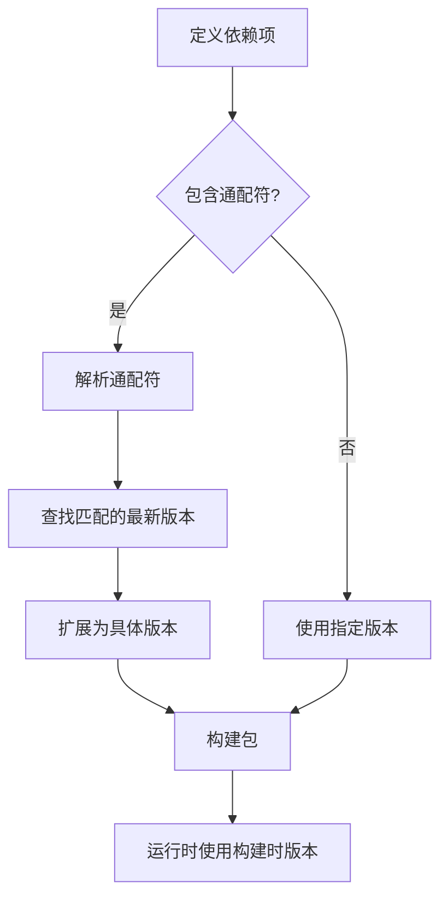
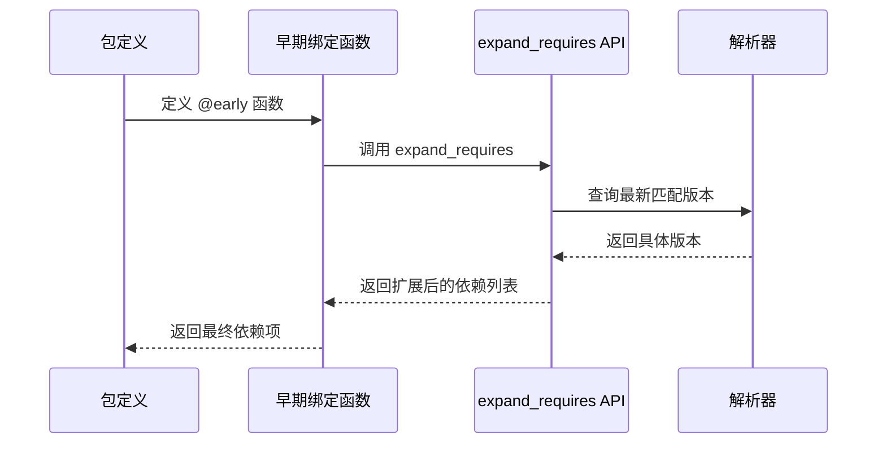
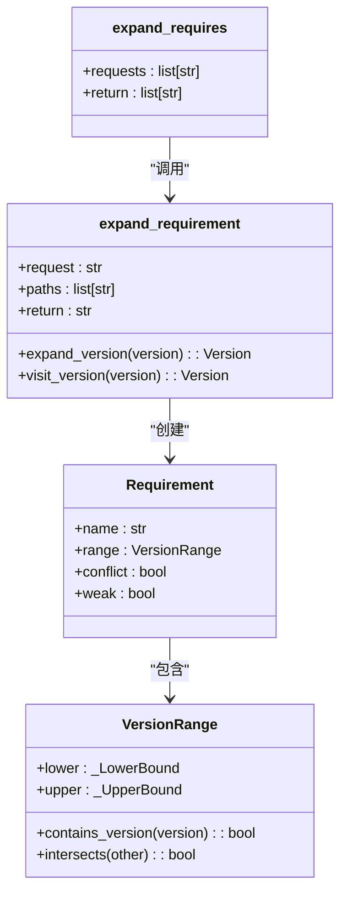

# 依赖项扩展

<cite>
**本文档中引用的文件**   
- [package_py_utils.py](file://rez-3.3.0\src\rez\package_py_utils.py)
- [package_definition.rst](file://rez-3.3.0\docs\source\package_definition.rst)
- [version\_version.py](file://rez-3.3.0\src\rez\version\_version.py)
- [packages.py](file://rez-3.3.0\src\rez\packages.py)
- [serialise.py](file://rez-3.3.0\src\rez\serialise.py)
- [package_maker.py](file://rez-3.3.0\src\rez\package_maker.py)
</cite>

## 目录
1. [通配符依赖扩展机制](#通配符依赖扩展机制)
2. [早期绑定函数与依赖扩展](#早期绑定函数与依赖扩展)
3. [依赖扩展的程序化实现](#依赖扩展的程序化实现)
4. [构建时与运行时版本兼容性矛盾的解决](#构建时与运行时版本兼容性矛盾的解决)

## 通配符依赖扩展机制

Rez 包管理系统中的依赖项扩展机制通过通配符 `*` 和 `**` 实现了构建时兼容范围广而运行时需要精确版本的矛盾解决。该机制允许在包定义中使用通配符来指定依赖项的版本范围，然后在构建时自动扩展为具体的版本号。

通配符 `*` 用于匹配单个数字段，例如 `boost-1.*` 将匹配 `boost-1.x` 系列中的最新版本。通配符 `**` 用于匹配完整的版本号，例如 `boost-1.**` 将扩展为 `boost-1.55.0` 这样的完整版本。这种机制确保了在构建时可以使用最新的兼容版本，而在运行时则使用构建时确定的具体版本，从而保证了环境的一致性和可重复性。

**Diagram sources**
- [package_py_utils.py](file://rez-3.3.0\src\rez\package_py_utils.py#L18-L144)

**Section sources**
- [package_py_utils.py](file://rez-3.3.0\src\rez\package_py_utils.py#L18-L144)
- [package_definition.rst](file://rez-3.3.0\docs\source\package_definition.rst#L391-L425)

## 早期绑定函数与依赖扩展

早期绑定函数（early binding functions）是 Rez 包定义中的一个重要特性，它们使用 `@early` 装饰器，并在构建时进行求值。这些函数在包安装前就被评估，因此它们的定义会持久化在安装的 `package.py` 文件中。早期绑定函数只能访问包属性，不能访问任何 rez 设置的环境变量。

在依赖项扩展的上下文中，早期绑定函数可以用来动态生成依赖项列表。例如，可以通过早期绑定函数调用 `expand_requires` API 来程序化地扩展依赖项。这种方式允许在构建时根据当前环境和可用包动态确定依赖项的具体版本，从而解决了构建时兼容范围广而运行时需要精确版本的矛盾。

**Diagram sources**
- [package_py_utils.py](file://rez-3.3.0\src\rez\package_py_utils.py#L147-L164)
- [serialise.py](file://rez-3.3.0\src\rez\serialise.py#L319-L348)

**Section sources**
- [package_py_utils.py](file://rez-3.3.0\src\rez\package_py_utils.py#L147-L164)
- [serialise.py](file://rez-3.3.0\src\rez\serialise.py#L319-L348)
- [package_definition.rst](file://rez-3.3.0\docs\source\package_definition.rst#L78-L138)

## 依赖扩展的程序化实现

依赖项扩展的程序化实现主要通过 `expand_requirement` 和 `expand_requires` 函数完成。`expand_requirement` 函数负责扩展单个依赖项请求，而 `expand_requires` 函数则用于处理依赖项列表。这两个函数都位于 `package_py_utils.py` 模块中。

`expand_requirement` 函数首先检查请求字符串中是否包含通配符，如果包含，则通过替换临时唯一标识符的方式处理 `**` 和 `*` 通配符。然后创建 `Requirement` 对象并遍历版本，最终返回扩展后的请求字符串。`expand_requires` 函数则简单地对列表中的每个请求调用 `expand_requirement` 函数。

这种实现方式确保了依赖项扩展的灵活性和可靠性，允许开发者在包定义中使用通配符来指定依赖项的版本范围，并在构建时自动扩展为具体的版本号。

**Diagram sources**
- [package_py_utils.py](file://rez-3.3.0\src\rez\package_py_utils.py#L18-L164)
- [version\_version.py](file://rez-3.3.0\src\rez\version\_version.py#L496-L576)

**Section sources**
- [package_py_utils.py](file://rez-3.3.0\src\rez\package_py_utils.py#L18-L164)
- [version\_version.py](file://rez-3.3.0\src\rez\version\_version.py#L496-L576)

## 构建时与运行时版本兼容性矛盾的解决

依赖项扩展机制有效地解决了构建时兼容范围广而运行时需要精确版本的矛盾。在构建时，包可以声明对某个依赖项系列的广泛兼容性，例如 `boost-1.*`，这允许使用该系列中的任何版本。然而，在运行时，包需要链接到构建时使用的具体版本，以确保二进制兼容性。

通过使用通配符依赖扩展机制，Rez 在构建时自动将 `boost-1.*` 扩展为具体的 `boost-1.55` 版本。这样，构建过程可以利用最新的兼容版本，而运行时环境则使用构建时确定的具体版本，从而保证了环境的一致性和可重复性。这种方法避免了为每个依赖项版本创建单独分支的复杂性，简化了包管理和版本控制。

**Diagram sources**
- [package_py_utils.py](file://rez-3.3.0\src\rez\package_py_utils.py#L18-L144)
- [package_definition.rst](file://rez-3.3.0\docs\source\package_definition.rst#L391-L425)

**Section sources**
- [package_py_utils.py](file://rez-3.3.0\src\rez\package_py_utils.py#L18-L144)
- [package_definition.rst](file://rez-3.3.0\docs\source\package_definition.rst#L391-L425)