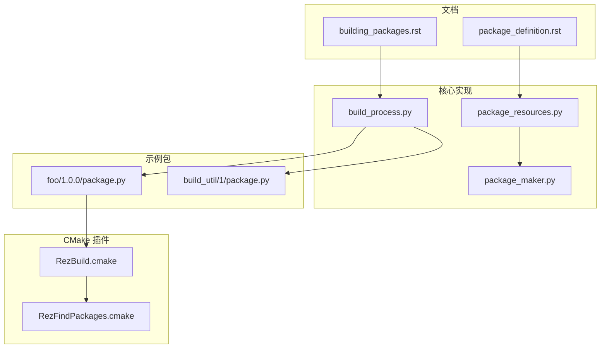
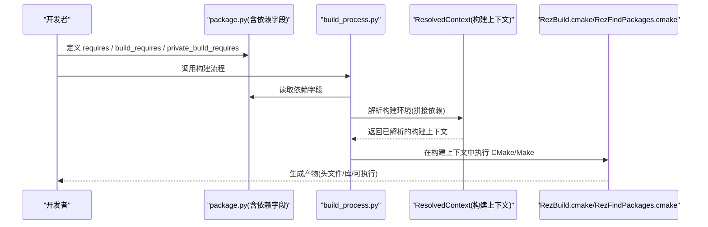
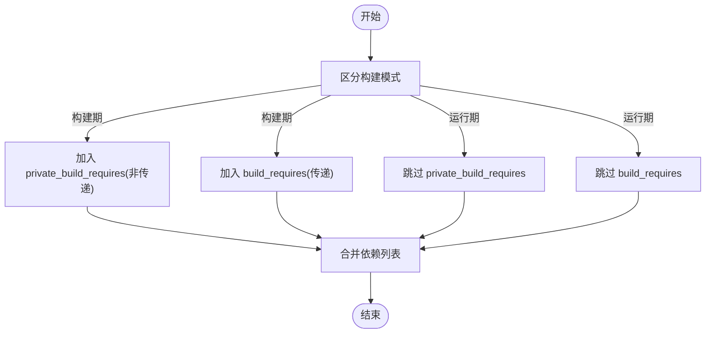

# 构建时依赖

<cite>
**本文引用的文件**
- [building_packages.rst](file://rez-3.3.0/docs/source/building_packages.rst)
- [package_definition.rst](file://rez-3.3.0/docs/source/package_definition.rst)
- [build_process.py](file://rez-3.3.0/src/rez/build_process.py)
- [package_resources.py](file://rez-3.3.0/src/rez/package_resources.py)
- [package_maker.py](file://rez-3.3.0/src/rez/package_maker.py)
- [foo_1.0.0_package.py](file://rez-3.3.0/src/rez/data/tests/builds/packages/foo/1.0.0/package.py)
- [build_util_1_package.py](file://rez-3.3.0/src/rez/data/tests/builds/packages/build_util/1/package.py)
- [RezBuild.cmake](file://rez-3.3.0/src/rezplugins/build_system/cmake_files/RezBuild.cmake)
- [RezFindPackages.cmake](file://rez-3.3.0/src/rezplugins/build_system/cmake_files/RezFindPackages.cmake)
</cite>

## 目录
1. [引言](#引言)
2. [项目结构](#项目结构)
3. [核心组件](#核心组件)
4. [架构总览](#架构总览)
5. [详细组件分析](#详细组件分析)
6. [依赖关系分析](#依赖关系分析)
7. [性能考量](#性能考量)
8. [故障排查指南](#故障排查指南)
9. [结论](#结论)
10. [附录](#附录)

## 引言
本篇文档围绕 Rez 的“构建时依赖”展开，系统讲解 build_requires 与 private_build_requires 字段的用途、区别与使用场景，并结合官方文档与示例包，说明它们在构建过程中的激活方式与对运行时环境的影响。同时，结合 C++ 包依赖 Boost 的示例，展示如何通过这两个字段实现更精确的依赖管理，从而提升环境的纯净度与可维护性。

## 项目结构
本仓库包含 Rez 官方源码与示例包，其中与构建时依赖直接相关的内容主要分布在：
- 官方文档：building_packages.rst、package_definition.rst
- 核心实现：build_process.py、package_resources.py、package_maker.py
- 示例包：foo 与 build_util 的 package.py
- CMake 构建插件：RezBuild.cmake、RezFindPackages.cmake

图表来源
- [building_packages.rst](file://rez-3.3.0/docs/source/building_packages.rst#L28-L46)
- [build_process.py](file://rez-3.3.0/src/rez/build_process.py#L233-L275)
- [package_resources.py](file://rez-3.3.0/src/rez/package_resources.py#L120-L130)
- [package_maker.py](file://rez-3.3.0/src/rez/package_maker.py#L55-L65)
- [foo_1.0.0_package.py](file://rez-3.3.0/src/rez/data/tests/builds/packages/foo/1.0.0/package.py#L1-L18)
- [build_util_1_package.py](file://rez-3.3.0/src/rez/data/tests/builds/packages/build_util/1/package.py#L1-L13)
- [RezBuild.cmake](file://rez-3.3.0/src/rezplugins/build_system/cmake_files/RezBuild.cmake#L1-L120)
- [RezFindPackages.cmake](file://rez-3.3.0/src/rezplugins/build_system/cmake_files/RezFindPackages.cmake#L1-L258)

章节来源
- [building_packages.rst](file://rez-3.3.0/docs/source/building_packages.rst#L28-L46)
- [build_process.py](file://rez-3.3.0/src/rez/build_process.py#L233-L275)

## 核心组件
- 构建环境构造流程：在构建前，系统会按顺序拼接依赖列表并解析为构建上下文，确保构建所需的工具链与辅助包可用。
- 依赖字段定义：requires、build_requires、private_build_requires 在模式校验与数据结构层面均被显式支持。
- 示例包：foo 与 build_util 展示了 build_requires 与 private_build_requires 的组合使用。

章节来源
- [building_packages.rst](file://rez-3.3.0/docs/source/building_packages.rst#L28-L46)
- [package_resources.py](file://rez-3.3.0/src/rez/package_resources.py#L120-L130)
- [package_maker.py](file://rez-3.3.0/src/rez/package_maker.py#L55-L65)
- [foo_1.0.0_package.py](file://rez-3.3.0/src/rez/data/tests/builds/packages/foo/1.0.0/package.py#L1-L18)
- [build_util_1_package.py](file://rez-3.3.0/src/rez/data/tests/builds/packages/build_util/1/package.py#L1-L13)

## 架构总览
下图展示了构建时依赖在 Rez 中的生效路径：从 package.py 的字段定义，到构建流程解析依赖，再到 CMake 插件在构建时注入环境变量与查找包。

图表来源
- [build_process.py](file://rez-3.3.0/src/rez/build_process.py#L233-L275)
- [building_packages.rst](file://rez-3.3.0/docs/source/building_packages.rst#L28-L46)
- [RezBuild.cmake](file://rez-3.3.0/src/rezplugins/build_system/cmake_files/RezBuild.cmake#L1-L120)
- [RezFindPackages.cmake](file://rez-3.3.0/src/rezplugins/build_system/cmake_files/RezFindPackages.cmake#L1-L258)

## 详细组件分析

### 构建环境的依赖拼接顺序
- 依赖拼接顺序：先 requires，再 build_requires（具有传递性，包含构建环境中所有包的构建依赖），再 private_build_requires（非传递，仅用于被构建的包本身），最后附加当前变体的特定要求。
- 该顺序决定了构建时工具链与辅助包的可见性，避免将构建期工具引入运行时环境。

章节来源
- [building_packages.rst](file://rez-3.3.0/docs/source/building_packages.rst#L28-L46)

### 构建流程如何使用依赖字段
- 构建流程在创建构建上下文时，调用 variant.get_requires(build_requires=True, private_build_requires=True)，从而将上述三类依赖全部纳入解析。
- 构建上下文解析成功后，保存为 build.rxt，便于调试与复现。

章节来源
- [build_process.py](file://rez-3.3.0/src/rez/build_process.py#L233-L275)

### 依赖字段的数据结构与校验
- 在模式校验层，build_requires 与 private_build_requires 明确列为可选字段，且类型为延迟绑定的包请求列表。
- package_maker 与 package_resources 对应位置均声明了这两个字段，确保在包定义与序列化阶段得到一致处理。

章节来源
- [package_resources.py](file://rez-3.3.0/src/rez/package_resources.py#L120-L130)
- [package_resources.py](file://rez-3.3.0/src/rez/package_resources.py#L212-L224)
- [package_maker.py](file://rez-3.3.0/src/rez/package_maker.py#L55-L65)

### 示例包：foo 与 build_util 的依赖组合
- foo 包：
  - build_requires：指向 floob（示例包）
  - private_build_requires：包含 build_util 与 python
- build_util 包：
  - private_build_requires：包含 python
- 这种组合体现了“构建期工具链”与“构建期私有工具”的分离：前者影响到依赖树中其他包的构建，后者仅作用于被构建的包本身。

章节来源
- [foo_1.0.0_package.py](file://rez-3.3.0/src/rez/data/tests/builds/packages/foo/1.0.0/package.py#L1-L18)
- [build_util_1_package.py](file://rez-3.3.0/src/rez/data/tests/builds/packages/build_util/1/package.py#L1-L13)

### C++ 包依赖 Boost 的示例与通信机制
- 官方文档明确指出：C++ 包与 Boost 的通信由各自包的 commands/pre_build_commands 控制，Rez 不强制具体构建系统，但提供了 CMake 支持与工具。
- 当处于构建态时，环境变量 building 会被置为真，包可通过该变量在 commands 中设置构建期专用路径（如 CMAKE_MODULE_PATH）。
- 官方示例展示了通过 FindBoost.cmake 与 CMakeLists.txt 的协作，使 C++ 包在构建时找到 Boost 的头文件与库目录。

章节来源
- [building_packages.rst](file://rez-3.3.0/docs/source/building_packages.rst#L74-L104)
- [building_packages.rst](file://rez-3.3.0/docs/source/building_packages.rst#L105-L132)

### CMake 插件如何在构建时注入信息
- RezBuild.cmake 在构建环境中设置 REZ_BUILD_ALL_PKGS、REZ_BUILD_PROJECT_NAME/VERSION 等变量，并将各包版本暴露为 <PKG>_VERSION 系列变量，供 CMake 使用。
- RezFindPackages.cmake 提供 find_rez_package 宏，自动合并 include、link、definitions 等标志，支持 cmake 模块与 pkg-config 两种发现路径。

章节来源
- [RezBuild.cmake](file://rez-3.3.0/src/rezplugins/build_system/cmake_files/RezBuild.cmake#L1-L120)
- [RezFindPackages.cmake](file://rez-3.3.0/src/rezplugins/build_system/cmake_files/RezFindPackages.cmake#L1-L258)

## 依赖关系分析
- build_requires 的传递性：当某包声明 build_requires 时，构建该包及其依赖树中所有包的构建环境都会包含这些构建期依赖。这适用于“头文件库”等需要被上层间接使用的场景。
- private_build_requires 的非传递性：仅在“被构建的包本身”构建时才包含，不会影响其依赖者的构建环境。这适用于“构建工具链”“文档生成器”“静态链接库”等仅在构建期需要的依赖。
- 组合策略：将“构建期工具链”放入 private_build_requires，将“被上层间接依赖的构建期库”放入 build_requires，可最大化减少运行时污染。

图表来源
- [building_packages.rst](file://rez-3.3.0/docs/source/building_packages.rst#L28-L46)
- [build_process.py](file://rez-3.3.0/src/rez/build_process.py#L233-L275)

章节来源
- [building_packages.rst](file://rez-3.3.0/docs/source/building_packages.rst#L28-L46)
- [build_process.py](file://rez-3.3.0/src/rez/build_process.py#L233-L275)

## 性能考量
- 仅在构建期引入必要工具链，有助于缩小运行时环境体积，降低启动时间与内存占用。
- 将“构建期工具链”置于 private_build_requires，可避免对依赖树中其他包产生不必要的依赖膨胀。
- 通过 variants 与变体隔离不同版本的第三方库（如 Boost），可减少分支与冲突，提高整体稳定性。

章节来源
- [building_packages.rst](file://rez-3.3.0/docs/source/building_packages.rst#L47-L88)
- [variants.rst](file://rez-3.3.0/docs/source/variants.rst#L254-L261)

## 故障排查指南
- 构建上下文解析失败：检查构建流程是否正确传入 build_requires 与 private_build_requires，确认依赖名称与版本约束合法。
- 构建期工具不可用：确认包的 commands/pre_build_commands 是否在构建态设置了必要的环境变量（如 CMAKE_MODULE_PATH）。
- CMake 查找不到依赖：确认 RezFindPackages.cmake 的查找路径与包提供的 cmake 模块或 pkg-config 文件是否正确配置。

章节来源
- [build_process.py](file://rez-3.3.0/src/rez/build_process.py#L233-L275)
- [building_packages.rst](file://rez-3.3.0/docs/source/building_packages.rst#L74-L104)
- [RezFindPackages.cmake](file://rez-3.3.0/src/rezplugins/build_system/cmake_files/RezFindPackages.cmake#L1-L258)

## 结论
- build_requires 与 private_build_requires 是 Rez 精准控制“构建期依赖”的关键。前者具有传递性，适用于需要被上层间接使用的构建期库；后者非传递，仅作用于被构建包本身，适用于构建工具链与一次性任务。
- 结合官方文档与示例包，可以将“构建期工具链”与“构建期库”清晰分离，显著提升运行时环境的纯净度与可维护性。
- 在 C++ 场景中，通过 commands/pre_build_commands 与 CMake 插件配合，可实现对 Boost 等外部库的精准定位与链接。

## 附录
- 字段定义与校验：在 package_resources.py 与 package_maker.py 中，build_requires 与 private_build_requires 均被列为可选字段，类型为延迟绑定的包请求列表。
- 示例包字段：foo 与 build_util 的 package.py 展示了二者的组合使用方式。
- CMake 插件：RezBuild.cmake 与 RezFindPackages.cmake 提供了构建期变量注入与包查找能力。

章节来源
- [package_resources.py](file://rez-3.3.0/src/rez/package_resources.py#L120-L130)
- [package_resources.py](file://rez-3.3.0/src/rez/package_resources.py#L212-L224)
- [package_maker.py](file://rez-3.3.0/src/rez/package_maker.py#L55-L65)
- [foo_1.0.0_package.py](file://rez-3.3.0/src/rez/data/tests/builds/packages/foo/1.0.0/package.py#L1-L18)
- [build_util_1_package.py](file://rez-3.3.0/src/rez/data/tests/builds/packages/build_util/1/package.py#L1-L13)
- [RezBuild.cmake](file://rez-3.3.0/src/rezplugins/build_system/cmake_files/RezBuild.cmake#L1-L120)
- [RezFindPackages.cmake](file://rez-3.3.0/src/rezplugins/build_system/cmake_files/RezFindPackages.cmake#L1-L258)