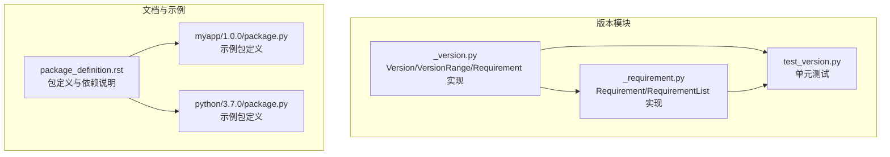
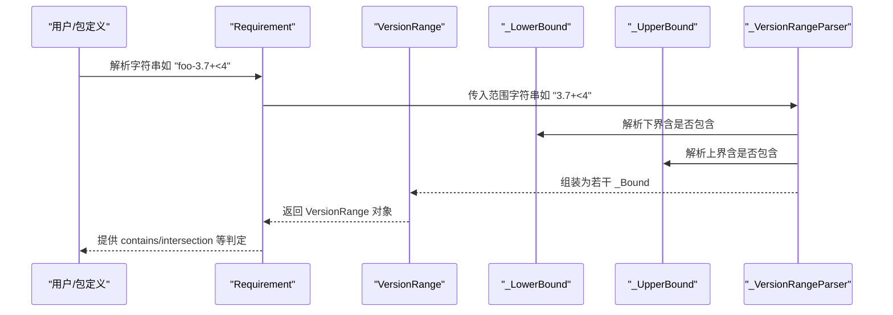
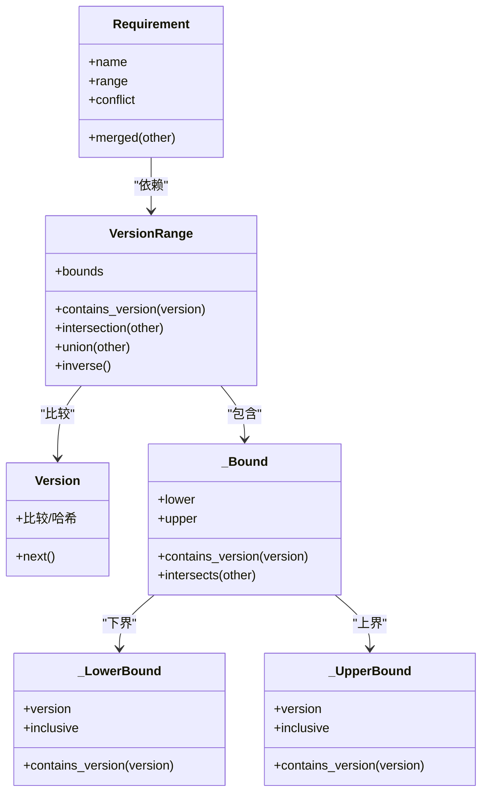

# 版本约束

<cite>
**本文引用的文件**
- [版本范围实现 _version.py](file://rez-3.3.0/src/rez/version/_version.py)
- [版本需求实现 _requirement.py](file://rez-3.3.0/src/rez/version/_requirement.py)
- [版本单元测试 test_version.py](file://rez-3.3.0/src/rez/tests/test_version.py)
- [包定义文档 package_definition.rst](file://rez-3.3.0/docs/source/package_definition.rst)
- [示例包 myapp/1.0.0/package.py](file://my_packages/myapp/1.0.0/package.py)
- [示例包 python/3.7.0/package.py](file://my_packages/python/3.7.0/package.py)
</cite>

## 目录
1. [引言](#引言)
2. [项目结构](#项目结构)
3. [核心组件](#核心组件)
4. [架构总览](#架构总览)
5. [详细组件分析](#详细组件分析)
6. [依赖关系分析](#依赖关系分析)
7. [性能考量](#性能考量)
8. [故障排查指南](#故障排查指南)
9. [结论](#结论)
10. [附录](#附录)

## 引言
本篇文档围绕 Rez 的“版本约束表达式”进行系统化说明，目标是帮助读者理解并正确使用形如“python-3.7+<4”的约束语法，掌握比较操作符（>, <, >=, <=, ==）的组合规则、版本匹配逻辑、以及如何通过精确控制依赖版本范围避免兼容性问题。同时给出宽松约束与严格约束的适用场景与最佳实践建议。

## 项目结构
与版本约束直接相关的代码位于版本模块中，核心实现集中在版本范围与版本需求两个类；文档与示例包展示了在实际包定义中如何使用这些约束。

图表来源
- [版本范围实现 _version.py](file://rez-3.3.0/src/rez/version/_version.py#L813-L1542)
- [版本需求实现 _requirement.py](file://rez-3.3.0/src/rez/version/_requirement.py#L106-L365)
- [版本单元测试 test_version.py](file://rez-3.3.0/src/rez/tests/test_version.py#L172-L444)
- [包定义文档 package_definition.rst](file://rez-3.3.0/docs/source/package_definition.rst#L1-L120)
- [示例包 myapp/1.0.0/package.py](file://my_packages/myapp/1.0.0/package.py#L1-L33)
- [示例包 python/3.7.0/package.py](file://my_packages/python/3.7.0/package.py#L1-L8)

章节来源
- [版本范围实现 _version.py](file://rez-3.3.0/src/rez/version/_version.py#L813-L1542)
- [版本需求实现 _requirement.py](file://rez-3.3.0/src/rez/version/_requirement.py#L106-L365)
- [版本单元测试 test_version.py](file://rez-3.3.0/src/rez/tests/test_version.py#L172-L444)
- [包定义文档 package_definition.rst](file://rez-3.3.0/docs/source/package_definition.rst#L1-L120)
- [示例包 myapp/1.0.0/package.py](file://my_packages/myapp/1.0.0/package.py#L1-L33)
- [示例包 python/3.7.0/package.py](file://my_packages/python/3.7.0/package.py#L1-L8)

## 核心组件
- 版本对象 Version：用于表示单个版本号，支持比较、哈希等操作，并提供“下一个版本”等工具方法。
- 版本范围 VersionRange：描述一个或多个连续版本区间，支持交集、并集、补集、包含判断、跨度合并等集合运算。
- 版本需求 Requirement：描述对某个包的版本要求，支持冲突前缀“!”、弱引用前缀“~”，以及与版本范围的交互。
- 版本需求列表 RequirementList：对同一对象的多个需求进行合并与冲突检测。

章节来源
- [版本范围实现 _version.py](file://rez-3.3.0/src/rez/version/_version.py#L265-L423)
- [版本范围实现 _version.py](file://rez-3.3.0/src/rez/version/_version.py#L813-L1277)
- [版本需求实现 _requirement.py](file://rez-3.3.0/src/rez/version/_requirement.py#L106-L365)

## 架构总览
版本约束由“语法解析器 + 边界对象 + 范围对象 + 需求对象”构成，形成从字符串到可计算集合的完整链路。

图表来源
- [版本需求实现 _requirement.py](file://rez-3.3.0/src/rez/version/_requirement.py#L140-L184)
- [版本范围实现 _version.py](file://rez-3.3.0/src/rez/version/_version.py#L579-L811)
- [版本范围实现 _version.py](file://rez-3.3.0/src/rez/version/_version.py#L813-L1277)

## 详细组件分析

### 1) 版本范围语法与边界
- 下界与上界：
  - 下界支持“包含式下界”（如“3.7+”）与“排除式下界”（如“>3.7”），分别对应“>=”与“>”。
  - 上界支持“包含式上界”（如“<=3.9”）与“排除式上界”（如“<3.9”），分别对应“<=”与“<”。
  - 单点精确匹配用“==x.y.z”。
  - 连续区间可用“..”连接，或用逗号分隔的逆序形式（如“<=4,>2”）。
- 语法解析器：
  - 支持多段“或”连接（“|”），自动优化重叠区间。
  - 对非法范围（如下界大于上界）与非法语法（如顺序错误、多余操作符）抛出异常。
- 字符串表示：
  - 空字符串代表“任意版本”（全集）。
  - “3”表示“包含该主版本的所有子版本集合”（超集）。

章节来源
- [版本范围实现 _version.py](file://rez-3.3.0/src/rez/version/_version.py#L826-L869)
- [版本范围实现 _version.py](file://rez-3.3.0/src/rez/version/_version.py#L579-L811)
- [版本范围实现 _version.py](file://rez-3.3.0/src/rez/version/_version.py#L813-L1277)
- [版本单元测试 test_version.py](file://rez-3.3.0/src/rez/tests/test_version.py#L305-L336)

### 2) 比较操作符与组合规则
- 基本操作符：
  - “>”、“>=”、“<”、“<=”、“==”。
- 组合规则：
  - 同时出现“>x”与“<y”时，若 x < y 则形成有界区间；若 x ≥ y 则为空集。
  - “>=x”与“<=y”等价于“x..y”。
  - “x+”等价于“>=x”。
  - 多段“或”（“|”）自动合并重叠区间。
- 逆序写法：
  - “<=4,>2”与“>2<=4”等价，逗号仅用于提升可读性。

章节来源
- [版本范围实现 _version.py](file://rez-3.3.0/src/rez/version/_version.py#L826-L869)
- [版本单元测试 test_version.py](file://rez-3.3.0/src/rez/tests/test_version.py#L305-L336)

### 3) 版本匹配逻辑
- 版本比较：
  - Version 对象支持严格弱序（==、!=、<、<=、>、>=），并能按“令牌序列”进行字典序比较。
  - 版本“空”是最小版本，常用于边界。
- 范围包含：
  - VersionRange.contains_version 判断某具体版本是否落入范围。
  - 对大范围采用二分查找优化，小范围直接遍历。
- 集合运算：
  - 并集（|）、交集（&）、补集（~）、差集（-）。
  - superset/issubset 用于判断范围包含关系。

章节来源
- [版本范围实现 _version.py](file://rez-3.3.0/src/rez/version/_version.py#L265-L423)
- [版本范围实现 _version.py](file://rez-3.3.0/src/rez/version/_version.py#L1132-L1204)
- [版本范围实现 _version.py](file://rez-3.3.0/src/rez/version/_version.py#L1278-L1390)

### 4) 版本需求与冲突/弱引用
- 基本语法：
  - “foo-3.7+<4” 表示对 foo 的版本要求。
  - “!foo” 表示冲突（禁止出现 foo 的任何版本）。
  - “~foo” 表示弱引用（不强制需要，若存在则必须满足范围）。
- 合并与冲突检测：
  - RequirementList 将同名对象的需求合并，若冲突则返回 None。
  - Requirement.conflicts_with 用于判定两个需求是否冲突。

章节来源
- [版本需求实现 _requirement.py](file://rez-3.3.0/src/rez/version/_requirement.py#L106-L274)
- [版本需求实现 _requirement.py](file://rez-3.3.0/src/rez/version/_requirement.py#L275-L365)

### 5) 实际使用示例与最佳实践
- 在包定义中声明依赖：
  - 文档示例展示了“python-2.6+<3”作为依赖约束。
  - 示例包 myapp 中声明了 variants 使用不同 Python 版本，体现对运行时 Python 的约束。
- 最佳实践：
  - 严格约束：明确指定上界，避免引入破坏性变更（如“>=3.7,<4”）。
  - 宽松约束：仅指定下界，允许后续小版本/补丁更新（如“3.7+”）。
  - 使用“|”表达多版本并列，但注意合并后可能被优化。
  - 对关键依赖优先使用“==x.y.z”确保锁定版本，再配合“|”添加备选。

章节来源
- [包定义文档 package_definition.rst](file://rez-3.3.0/docs/source/package_definition.rst#L1-L120)
- [示例包 myapp/1.0.0/package.py](file://my_packages/myapp/1.0.0/package.py#L1-L33)
- [示例包 python/3.7.0/package.py](file://my_packages/python/3.7.0/package.py#L1-L8)

## 依赖关系分析
- Requirement 依赖 VersionRange 与 Version。
- VersionRange 内部使用 _LowerBound/_UpperBound/_Bound 表达上下界与闭区间。
- _VersionRangeParser 将字符串解析为边界对象，再组装为 VersionRange。
- 测试覆盖了常见等价写法、非法范围与非法语法、包含/交并/跨度等行为。

图表来源
- [版本范围实现 _version.py](file://rez-3.3.0/src/rez/version/_version.py#L429-L577)
- [版本范围实现 _version.py](file://rez-3.3.0/src/rez/version/_version.py#L813-L1277)
- [版本需求实现 _requirement.py](file://rez-3.3.0/src/rez/version/_requirement.py#L106-L274)

章节来源
- [版本范围实现 _version.py](file://rez-3.3.0/src/rez/version/_version.py#L429-L577)
- [版本范围实现 _version.py](file://rez-3.3.0/src/rez/version/_version.py#L813-L1277)
- [版本需求实现 _requirement.py](file://rez-3.3.0/src/rez/version/_requirement.py#L106-L274)

## 性能考量
- 小范围直接遍历，大范围使用二分查找定位，减少不必要的比较次数。
- 交并运算会先排序并合并相邻边界，降低复杂度。
- 合并“或”区间时自动去重与压缩，避免冗余边界导致的性能下降。

章节来源
- [版本范围实现 _version.py](file://rez-3.3.0/src/rez/version/_version.py#L1132-L1204)
- [版本范围实现 _version.py](file://rez-3.3.0/src/rez/version/_version.py#L1288-L1350)

## 故障排查指南
- 常见非法范围：
  - 下界大于上界（如“3+<2”）。
  - 同一端点同时出现“>”与“<=”或“<”与“>=”等矛盾。
- 常见非法语法：
  - 顺序错误（如“<4>3”未用逗号分隔）。
  - 操作符位置错误（如“1>=”、“+1”、“4<”）。
  - 多于两个边界（如“1+<2<3”）。
- 排查步骤：
  - 先确认范围字符串是否符合“下界[,上界]”或“上界[,下界]”的顺序与逗号分隔。
  - 若使用“|”，检查各段是否可合并且不会产生空集。
  - 使用 contains_version 或 intersect 判定具体版本是否命中。

章节来源
- [版本单元测试 test_version.py](file://rez-3.3.0/src/rez/tests/test_version.py#L305-L336)
- [版本范围实现 _version.py](file://rez-3.3.0/src/rez/version/_version.py#L579-L658)

## 结论
Rez 的版本约束体系以“字符串语法 + 边界对象 + 集合运算”为核心，既保证了表达力（支持多种比较符与组合），又提供了严格的校验与优化。在工程实践中，应根据稳定性与演进策略选择“严格约束”或“宽松约束”，并通过测试与迭代逐步收敛到最优范围，从而有效避免兼容性问题。

## 附录

### A. 语法规则速查
- 基本形式
  - “x”：包含该主版本的所有子版本（超集）。
  - “x+”或“>=x”：包含 x 及其更高版本。
  - “>x”：仅包含 x 以上版本。
  - “<=x”：包含 x 及其以下版本。
  - “<x”：仅包含 x 以下版本。
  - “==x.y.z”：仅包含该精确版本。
- 区间与组合
  - “x+<y”或“>=x<y”：包含 x 以上、y 以下的版本（不含 y）。
  - “x..y”或“>=x<=y”：包含 x 以上、y 以下的版本（含 x 与 y）。
  - “<=y,>x”：逆序写法，等价于“>x<=y”。
  - “a|b|c”：多段并列，自动合并重叠区间。
- 特殊情况
  - 空字符串：表示任意版本（全集）。
  - “>”：等价于“>''”，表示大于空版本的所有版本。

章节来源
- [版本范围实现 _version.py](file://rez-3.3.0/src/rez/version/_version.py#L826-L869)
- [版本单元测试 test_version.py](file://rez-3.3.0/src/rez/tests/test_version.py#L305-L336)

### B. 实战建议
- 严格约束（推荐用于关键库）：固定上界，防止破坏性升级。
  - 示例：python-3.7+<4
- 宽松约束（推荐用于通用库）：仅限制下界，允许小版本更新。
  - 示例：python-3.7+
- 明确冲突与弱引用：
  - 使用“!foo”禁止特定版本。
  - 使用“~foo”弱引用，避免强约束导致解析失败。
- 在包定义中：
  - 文档示例展示了“python-2.6+<3”。
  - 示例包 myapp 的 variants 展示了对不同 Python 版本的兼容策略。

章节来源
- [包定义文档 package_definition.rst](file://rez-3.3.0/docs/source/package_definition.rst#L1-L120)
- [示例包 myapp/1.0.0/package.py](file://my_packages/myapp/1.0.0/package.py#L1-L33)