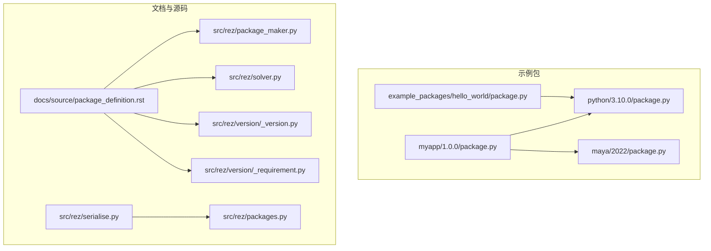
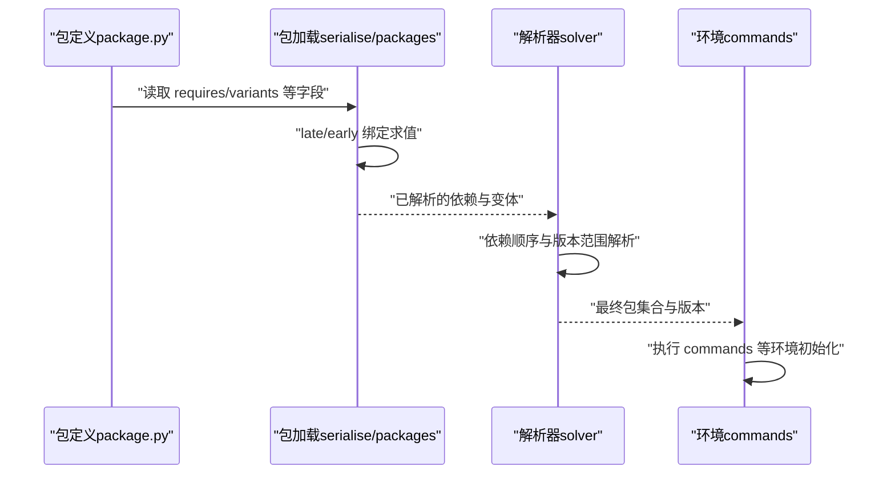
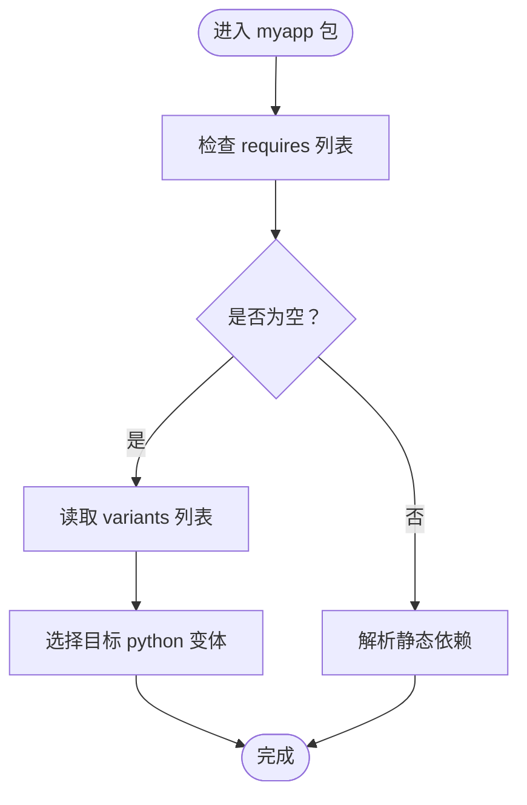
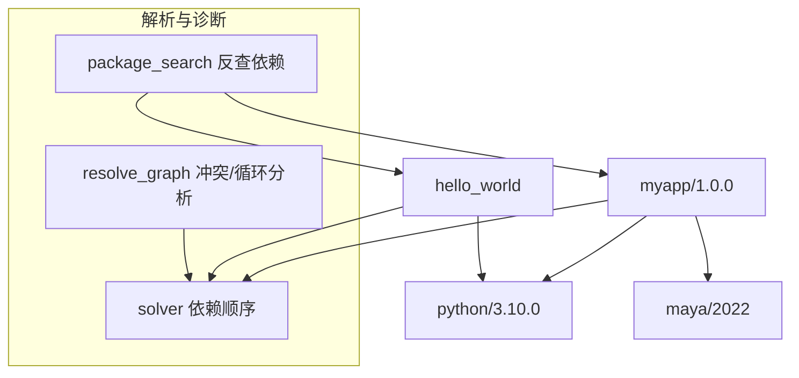

# 静态依赖

<cite>
**本文引用的文件**
- [myapp 包定义](file://my_packages/myapp/1.0.0/package.py)
- [python 基础包定义](file://my_packages/python/3.10.0/package.py)
- [maya 基础包定义](file://my_packages/maya/2022/package.py)
- [hello_world 示例包定义](file://rez-3.3.0/example_packages/hello_world/package.py)
- [包定义文档（英文）](file://rez-3.3.0/docs/source/package_definition.rst)
- [包定义模式（requirments 字段）](file://rez-3.3.0/src/rez/package_maker.py)
- [解析器实现（依赖顺序）](file://rez-3.3.0/src/rez/solver.py)
- [版本范围解析（版本语法）](file://rez-3.3.0/src/rez/version/_version.py)
- [包加载与早期绑定（late/early 绑定）](file://rez-3.3.0/src/rez/serialise.py)
- [包属性延迟求值（late 绑定）](file://rez-3.3.0/src/rez/packages.py)
- [包请求语法与版本范围](file://rez-3.3.0/src/rez/version/_requirement.py)
- [包搜索与反向依赖树](file://rez-3.3.0/src/rez/package_search.py)
- [版本冲突图分析](file://rez-3.3.0/src/rez/utils/resolve_graph.py)
- [测试用版本范围（无效语法）](file://rez-3.3.0/src/rez/tests/test_version.py)
</cite>

## 目录
1. [简介](#简介)
2. [项目结构](#项目结构)
3. [核心组件](#核心组件)
4. [架构总览](#架构总览)
5. [详细组件分析](#详细组件分析)
6. [依赖关系分析](#依赖关系分析)
7. [性能考量](#性能考量)
8. [故障排查指南](#故障排查指南)
9. [结论](#结论)

## 简介
本章节聚焦于 Rez 包定义中的“静态依赖”概念，即通过 package.py 中的 requires 列表显式声明的依赖项。我们将结合 myapp 与 hello_world 示例，说明如何声明 python、maya 等基础包依赖；解释静态依赖在包构建与解析阶段的作用机制，并与动态依赖进行区分；最后给出常见错误与排查方法，包括拼写错误、版本格式错误等。

## 项目结构
- my_packages 下包含多个示例包：
  - myapp/1.0.0：演示了 requires 为空列表的情况，以及 variants 指向 python 版本。
  - python/3.10.0：占位型基础包，用于作为 myapp 的运行时依赖。
  - maya/2022：占位型基础包，用于演示 maya 依赖。
- example_packages/hello_world：展示了 requires 中声明 python 依赖的最小示例。
- 文档与源码：
  - package_definition.rst：官方包定义文档，涵盖 requires、late/early 绑定、版本范围等。
  - package_maker.py：包定义模式（schema），明确 requires 属于可晚绑定字段之一。
  - solver.py：解析器内部实现，体现依赖顺序与解析流程。
  - version/_version.py 与 _requirement.py：版本范围与请求语法的基础实现。
  - serialise.py 与 packages.py：包加载、早期/晚期绑定求值路径。



图表来源
- [myapp 包定义](file://my_packages/myapp/1.0.0/package.py#L1-L33)
- [python 基础包定义](file://my_packages/python/3.10.0/package.py#L1-L8)
- [maya 基础包定义](file://my_packages/maya/2022/package.py#L1-L9)
- [hello_world 示例包定义](file://rez-3.3.0/example_packages/hello_world/package.py#L1-L29)
- [包定义文档（英文）](file://rez-3.3.0/docs/source/package_definition.rst#L800-L940)
- [包定义模式（requirments 字段）](file://rez-3.3.0/src/rez/package_maker.py#L48-L72)
- [解析器实现（依赖顺序）](file://rez-3.3.0/src/rez/solver.py#L1181-L1224)
- [版本范围解析（版本语法）](file://rez-3.3.0/src/rez/version/_version.py#L477-L772)
- [包请求语法与版本范围](file://rez-3.3.0/src/rez/version/_requirement.py#L444-L476)
- [包加载与早期绑定（late/early 绑定）](file://rez-3.3.0/src/rez/serialise.py#L247-L287)
- [包属性延迟求值（late 绑定）](file://rez-3.3.0/src/rez/packages.py#L142-L182)

章节来源
- [myapp 包定义](file://my_packages/myapp/1.0.0/package.py#L1-L33)
- [hello_world 示例包定义](file://rez-3.3.0/example_packages/hello_world/package.py#L1-L29)
- [包定义文档（英文）](file://rez-3.3.0/docs/source/package_definition.rst#L800-L940)

## 核心组件
- requires 列表：在 package.py 中以字符串列表形式声明包的静态依赖。这些依赖在包构建与解析阶段被纳入考虑，决定环境构建与版本选择。
- late/early 绑定：requires 可以是早绑定或晚绑定函数，分别在构建期与运行期按需求值。
- 版本范围与请求语法：支持形如 “python-3.7+<3.12”、“maya-2022” 等表达式，由版本范围解析器与请求语法解析器共同处理。
- 解析器与依赖顺序：解析器在解决依赖时会考虑依赖顺序，确保父依赖先于子依赖被满足。

章节来源
- [包定义文档（英文）](file://rez-3.3.0/docs/source/package_definition.rst#L800-L940)
- [包定义模式（requirments 字段）](file://rez-3.3.0/src/rez/package_maker.py#L48-L72)
- [解析器实现（依赖顺序）](file://rez-3.3.0/src/rez/solver.py#L1181-L1224)
- [版本范围解析（版本语法）](file://rez-3.3.0/src/rez/version/_version.py#L477-L772)
- [包请求语法与版本范围](file://rez-3.3.0/src/rez/version/_requirement.py#L444-L476)

## 架构总览
静态依赖在 Rez 中的生命周期如下：
- 定义阶段：package.py 中的 requires 列表（或 late/early 函数）描述依赖。
- 加载阶段：serialise 与 packages 模块负责加载与求值（含 late/early 绑定）。
- 解析阶段：solver 根据依赖关系与版本范围进行解析，确定最终版本组合。
- 构建阶段：根据解析结果生成环境，执行 commands 等命令。



图表来源
- [包加载与早期绑定（late/early 绑定）](file://rez-3.3.0/src/rez/serialise.py#L247-L287)
- [包属性延迟求值（late 绑定）](file://rez-3.3.0/src/rez/packages.py#L142-L182)
- [解析器实现（依赖顺序）](file://rez-3.3.0/src/rez/solver.py#L1181-L1224)

## 详细组件分析

### myapp 包的静态依赖
- requires 为空列表，表示该包当前不强制依赖其他包。
- variants 显式指向 python 版本，表明该包可与不同 python 变体共存。
- 这种设计常用于“占位”包，实际运行时通过环境注入或外部工具链满足依赖。



图表来源
- [myapp 包定义](file://my_packages/myapp/1.0.0/package.py#L1-L33)

章节来源
- [myapp 包定义](file://my_packages/myapp/1.0.0/package.py#L1-L33)

### hello_world 包的静态依赖
- requires 中声明对 python 的依赖，体现了“静态依赖”的基本用法。
- 该示例简洁地展示了如何在 requires 中添加基础包依赖。

```mermaid
flowchart TD
A["hello_world/package.py"] --> B["requires = [\"python\"]"]
B --> C["解析器在解决时寻找可用 python 包"]
C --> D["生成环境并执行 commands"]
```

图表来源
- [hello_world 示例包定义](file://rez-3.3.0/example_packages/hello_world/package.py#L1-L29)

章节来源
- [hello_world 示例包定义](file://rez-3.3.0/example_packages/hello_world/package.py#L1-L29)

### python 与 maya 占位包
- python/3.10.0 与 maya/2022 均以占位方式存在，用于演示静态依赖的声明与解析。
- 这些包通常不包含实际二进制，而是作为“虚拟基础包”供其他包引用。

章节来源
- [python 基础包定义](file://my_packages/python/3.10.0/package.py#L1-L8)
- [maya 基础包定义](file://my_packages/maya/2022/package.py#L1-L9)

### 静态依赖与动态依赖的区别
- 静态依赖：在 package.py 中以 requires 列表或 late/early 函数形式显式声明，构建与解析阶段即纳入考虑。
- 动态依赖：通常指在 late/early 函数中基于上下文（如 in_context、request、this 等）动态生成的依赖，仅在求值时生效。
- 文档与源码明确指出 requires 可为 late/early 绑定函数，从而在构建期或运行期按需扩展依赖。

章节来源
- [包定义文档（英文）](file://rez-3.3.0/docs/source/package_definition.rst#L177-L248)
- [包定义模式（requirments 字段）](file://rez-3.3.0/src/rez/package_maker.py#L48-L72)

### 版本范围与请求语法
- 支持形如 “python-3.7+<3.12”、“maya-2022” 等表达式，解析器会将其转换为版本范围并参与解析。
- 测试用例覆盖了无效语法与边界情况，有助于理解合法/非法输入。

章节来源
- [包定义文档（英文）](file://rez-3.3.0/docs/source/package_definition.rst#L800-L940)
- [版本范围解析（版本语法）](file://rez-3.3.0/src/rez/version/_version.py#L477-L772)
- [测试用版本范围（无效语法）](file://rez-3.3.0/src/rez/tests/test_version.py#L332-L417)
- [包请求语法与版本范围](file://rez-3.3.0/src/rez/version/_requirement.py#L444-L476)

## 依赖关系分析
- 依赖顺序：解析器在计算依赖顺序时，会尽量将子依赖排在父依赖之后，保证解析稳定性。
- 反向依赖搜索：可通过包名反查依赖它的包族，深度可选，便于诊断依赖环或冲突来源。
- 冲突与循环检测：解析图分析模块可输出从初始请求到冲突/循环路径的详细信息，辅助定位问题。



图表来源
- [解析器实现（依赖顺序）](file://rez-3.3.0/src/rez/solver.py#L1181-L1224)
- [包搜索与反向依赖树](file://rez-3.3.0/src/rez/package_search.py#L35-L69)
- [版本冲突图分析](file://rez-3.3.0/src/rez/utils/resolve_graph.py#L40-L80)

章节来源
- [解析器实现（依赖顺序）](file://rez-3.3.0/src/rez/solver.py#L1181-L1224)
- [包搜索与反向依赖树](file://rez-3.3.0/src/rez/package_search.py#L35-L69)
- [版本冲突图分析](file://rez-3.3.0/src/rez/utils/resolve_graph.py#L40-L80)

## 性能考量
- late/early 绑定的选择会影响运行时开销：若依赖可在构建期确定，优先使用早绑定；若依赖需要运行期上下文信息，则使用晚绑定。
- 复杂的版本范围与大量变体会增加解析时间，建议合理拆分变体与范围，避免过度膨胀。

## 故障排查指南
- 拼写错误
  - 现象：解析失败或找不到包。
  - 排查：核对 requires 中的包名与版本是否正确；确认包名大小写与命名规范。
  - 参考：包定义文档对标准属性与命名规则有明确说明。
- 版本格式错误
  - 现象：版本范围语法不合法导致解析异常。
  - 排查：对照版本范围与请求语法，确保使用正确的范围表达式；参考测试用例中的无效语法示例，避免类似错误。
- 依赖冲突
  - 现象：两个包同时要求同一包的不同版本，引发冲突。
  - 排查：使用解析图分析输出的路径，定位冲突来源；必要时调整版本范围或引入中间层包。
- 变体不匹配
  - 现象：variants 与依赖不一致导致解析失败。
  - 排查：检查 variants 列表中的依赖是否与 requires 一致；必要时精简或合并变体。

章节来源
- [包定义文档（英文）](file://rez-3.3.0/docs/source/package_definition.rst#L800-L940)
- [测试用版本范围（无效语法）](file://rez-3.3.0/src/rez/tests/test_version.py#L332-L417)
- [版本冲突图分析](file://rez-3.3.0/src/rez/utils/resolve_graph.py#L40-L80)

## 结论
静态依赖通过 package.py 中的 requires 列表或 late/early 绑定函数，在包构建与解析阶段明确声明依赖关系。结合 myapp 与 hello_world 示例，可以清晰看到 python、maya 等基础包的声明方式。与动态依赖相比，静态依赖更稳定、可预测，适合大多数场景。通过版本范围语法与解析器的依赖顺序控制，Rez 能够在复杂依赖网络中找到可行解。遇到问题时，借助解析图分析与反向依赖搜索，可快速定位并修复冲突与不匹配。