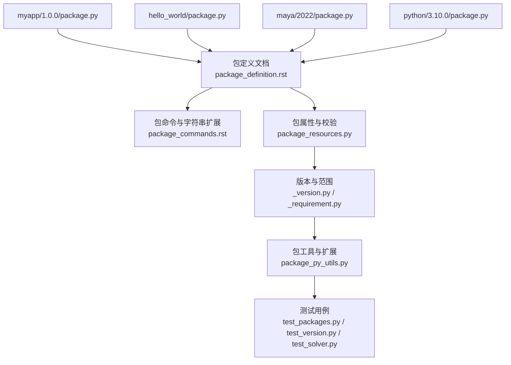
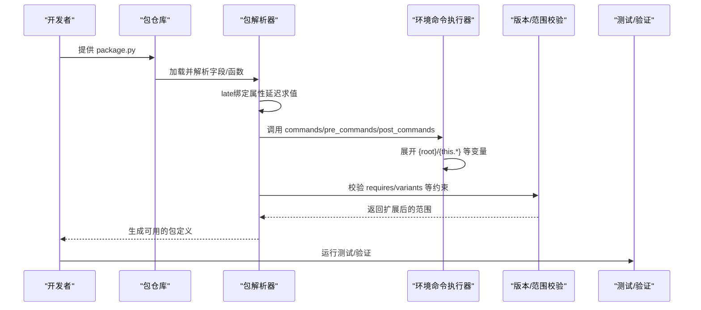
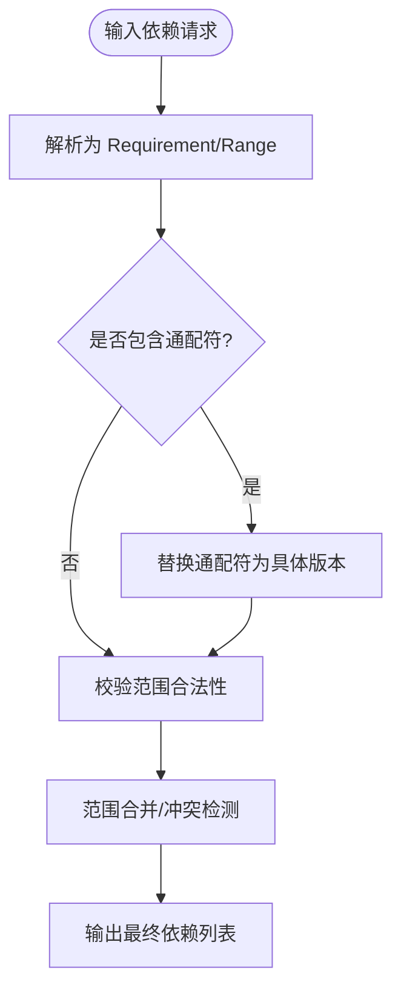

# 包定义

<cite>
**本文引用的文件**
- [myapp/1.0.0/package.py](file://my_packages/myapp/1.0.0/package.py)
- [hello_world/package.py](file://example_packages/hello_world/package.py)
- [maya/2022/package.py](file://my_packages/maya/2022/package.py)
- [python/3.10.0/package.py](file://my_packages/python/3.10.0/package.py)
- [package_definition.rst](file://rez-3.3.0/docs/source/package_definition.rst)
- [package_commands.rst](file://rez-3.3.0/docs/source/package_commands.rst)
- [package_py_utils.py](file://rez-3.3.0/src/rez/package_py_utils.py)
- [package_resources.py](file://rez-3.3.0/src/rez/package_resources.py)
- [_version.py](file://rez-3.3.0/src/rez/version/_version.py)
- [_requirement.py](file://rez-3.3.0/src/rez/version/_requirement.py)
- [test_packages.py](file://rez-3.3.0/src/rez/tests/test_packages.py)
- [test_version.py](file://rez-3.3.0/src/rez/tests/test_version.py)
- [test_solver.py](file://rez-3.3.0/src/rez/tests/test_solver.py)
</cite>

## 目录
1. [简介](#简介)
2. [项目结构](#项目结构)
3. [核心组件](#核心组件)
4. [架构总览](#架构总览)
5. [详细组件分析](#详细组件分析)
6. [依赖关系分析](#依赖关系分析)
7. [性能考量](#性能考量)
8. [故障排查指南](#故障排查指南)
9. [结论](#结论)
10. [附录](#附录)

## 简介
本文件围绕 Rez 包定义文件 package.py 的字段与语义进行系统化说明，重点覆盖以下方面：
- 字段语义与用法：name、version、description、authors、requires、variants、commands 等
- 基于 myapp 与 hello_world 示例的字段解析与行为说明
- {root} 变量替换机制与 env 对象在环境配置中的使用方式
- 版本约束表达式（如 python-2.7,3.7+<4）的编写规则与扩展机制
- 字段验证的最佳实践与常见配置错误及修复建议

## 项目结构
仓库包含多个示例包与 Rez 官方文档/源码，其中与包定义直接相关的关键位置如下：
- 示例包定义：my_packages/myapp/1.0.0/package.py、example_packages/hello_world/package.py、my_packages/maya/2022/package.py、my_packages/python/3.10.0/package.py
- 官方文档：rez-3.3.0/docs/source/package_definition.rst、rez-3.3.0/docs/source/package_commands.rst
- 核心实现与校验：rez-3.3.0/src/rez/package_py_utils.py、rez-3.3.0/src/rez/package_resources.py、rez-3.3.0/src/rez/version/*、测试用例

图表来源
- [myapp/1.0.0/package.py](file://my_packages/myapp/1.0.0/package.py#L1-L33)
- [hello_world/package.py](file://example_packages/hello_world/package.py#L1-L200)
- [maya/2022/package.py](file://my_packages/maya/2022/package.py#L1-L9)
- [python/3.10.0/package.py](file://my_packages/python/3.10.0/package.py#L1-L8)
- [package_definition.rst](file://rez-3.3.0/docs/source/package_definition.rst#L1-L200)
- [package_commands.rst](file://rez-3.3.0/docs/source/package_commands.rst#L100-L187)
- [package_resources.py](file://rez-3.3.0/src/rez/package_resources.py#L95-L171)
- [_version.py](file://rez-3.3.0/src/rez/version/_version.py#L393-L480)
- [_requirement.py](file://rez-3.3.0/src/rez/version/_requirement.py#L251-L285)
- [package_py_utils.py](file://rez-3.3.0/src/rez/package_py_utils.py#L1-L200)
- [test_packages.py](file://rez-3.3.0/src/rez/tests/test_packages.py#L409-L447)
- [test_version.py](file://rez-3.3.0/src/rez/tests/test_version.py#L332-L361)
- [test_solver.py](file://rez-3.3.0/src/rez/tests/test_solver.py#L122-L160)

章节来源
- [myapp/1.0.0/package.py](file://my_packages/myapp/1.0.0/package.py#L1-L33)
- [hello_world/package.py](file://example_packages/hello_world/package.py#L1-L200)
- [maya/2022/package.py](file://my_packages/maya/2022/package.py#L1-L9)
- [python/3.10.0/package.py](file://my_packages/python/3.10.0/package.py#L1-L8)
- [package_definition.rst](file://rez-3.3.0/docs/source/package_definition.rst#L1-L200)

## 核心组件
- 包名与版本：name、version 是包标识的核心，必须满足命名与版本规范
- 描述与作者：description、authors 提供元信息，便于检索与归属
- 依赖声明：requires、build_requires、private_build_requires 定义运行时与构建期依赖
- 变体：variants 定义不同依赖组合的变体，支持多 Python 版本等场景
- 环境命令：commands（以及 pre_commands/post_commands）定义进入包环境时的环境变更逻辑
- 工具列表：tools 为包提供的可发现工具
- 其他：config、uuid、help、tests 等辅助属性

章节来源
- [package_definition.rst](file://rez-3.3.0/docs/source/package_definition.rst#L606-L1127)
- [package_resources.py](file://rez-3.3.0/src/rez/package_resources.py#L95-L171)

## 架构总览
包定义文件在 Rez 中的处理流程大致如下：
- 解析 package.py，提取字段与函数属性
- 对 late 绑定属性（如 requires、tools 等）延迟求值
- 执行 commands/pre_commands/post_commands 等环境命令
- 使用 {root}、{this.*} 等变量进行字符串展开
- 校验与约束扩展（wildcard、范围合并）

图表来源
- [package_definition.rst](file://rez-3.3.0/docs/source/package_definition.rst#L606-L1127)
- [package_commands.rst](file://rez-3.3.0/docs/source/package_commands.rst#L100-L187)
- [package_py_utils.py](file://rez-3.3.0/src/rez/package_py_utils.py#L1-L200)
- [test_packages.py](file://rez-3.3.0/src/rez/tests/test_packages.py#L409-L447)

## 详细组件分析

### 字段：name、version、description、authors
- name：包名，大小写敏感，建议使用字母数字与下划线
- version：包版本，遵循 Rez 版本规范；可由早期绑定函数动态生成
- description：包的通用描述，不包含特定版本细节
- authors：作者列表，顺序通常以主要贡献者为首

示例参考
- myapp 包：name、version、description、authors 字段均在 package.py 中直接赋值
- hello_world 包：同样包含这些字段，作为最小示例

章节来源
- [myapp/1.0.0/package.py](file://my_packages/myapp/1.0.0/package.py#L1-L33)
- [hello_world/package.py](file://example_packages/hello_world/package.py#L1-L200)
- [package_definition.rst](file://rez-3.3.0/docs/source/package_definition.rst#L740-L900)

### 字段：requires、build_requires、private_build_requires
- requires：运行时依赖，支持通配符与范围表达式
- build_requires：仅在构建时包含的依赖
- private_build_requires：仅当本包被构建时才包含的依赖

版本约束与扩展
- 支持形如 python-2.7、python-2+<4 的范围表达式
- 支持通配符与特殊符号（如 **），通过工具函数进行扩展
- 测试用例覆盖了多种合法/非法表达式的扩展结果

章节来源
- [package_definition.rst](file://rez-3.3.0/docs/source/package_definition.rst#L806-L840)
- [package_py_utils.py](file://rez-3.3.0/src/rez/package_py_utils.py#L1-L200)
- [test_packages.py](file://rez-3.3.0/src/rez/tests/test_packages.py#L409-L447)
- [test_version.py](file://rez-3.3.0/src/rez/tests/test_version.py#L332-L361)
- [_requirement.py](file://rez-3.3.0/src/rez/version/_requirement.py#L251-L285)

### 字段：variants
- variants：定义包的不同变体，每项是一个依赖要求列表
- 可用于按 Python 版本、平台等维度切分变体
- 示例中 myapp 定义了多 Python 版本变体，maya/2022 与 python/3.10.0 使用空变体占位

章节来源
- [myapp/1.0.0/package.py](file://my_packages/myapp/1.0.0/package.py#L24-L33)
- [maya/2022/package.py](file://my_packages/maya/2022/package.py#L1-L9)
- [python/3.10.0/package.py](file://my_packages/python/3.10.0/package.py#L1-L8)
- [package_definition.rst](file://rez-3.3.0/docs/source/package_definition.rst#L920-L940)

### 字段：commands（以及 pre_commands/post_commands）
- commands：在进入包环境时执行的环境命令，常用于设置 PATH、PYTHONPATH 等
- {root} 代表包安装根目录，{this.*} 可访问包属性
- 支持字符串展开与环境变量扩展（$VAR 或 ${VAR}）

示例参考
- myapp 的 commands 中使用 env 对象设置 MYAPP_ROOT、PATH、PYTHONPATH
- hello_world 的 package.py 中也展示了基本的 commands 结构

章节来源
- [myapp/1.0.0/package.py](file://my_packages/myapp/1.0.0/package.py#L16-L23)
- [hello_world/package.py](file://example_packages/hello_world/package.py#L1-L200)
- [package_commands.rst](file://rez-3.3.0/docs/source/package_commands.rst#L100-L187)

### 字段：tools、help、uuid、config、tests
- tools：包提供的工具列表，用于套件与工具发现
- help：帮助链接或命令，支持多条目
- uuid：包家族唯一标识，用于发布冲突检测
- config：覆盖 Rez 配置设置（需使用作用域函数）
- tests：测试命令与运行时机控制

章节来源
- [package_definition.rst](file://rez-3.3.0/docs/source/package_definition.rst#L884-L1127)

## 依赖关系分析
- 字段类型与校验：包资源模式定义了字段类型与可选性，如 requires、build_requires、private_build_requires、tools、help 等
- 约束扩展：通过工具函数对通配符进行扩展，确保依赖范围可解析
- 版本范围：LowerBound/UpperBound 与 Range 表达式用于范围合并与冲突判断

图表来源
- [package_resources.py](file://rez-3.3.0/src/rez/package_resources.py#L95-L171)
- [package_py_utils.py](file://rez-3.3.0/src/rez/package_py_utils.py#L1-L200)
- [_version.py](file://rez-3.3.0/src/rez/version/_version.py#L393-L480)
- [_requirement.py](file://rez-3.3.0/src/rez/version/_requirement.py#L251-L285)

章节来源
- [package_resources.py](file://rez-3.3.0/src/rez/package_resources.py#L95-L171)
- [package_py_utils.py](file://rez-3.3.0/src/rez/package_py_utils.py#L1-L200)
- [_version.py](file://rez-3.3.0/src/rez/version/_version.py#L393-L480)
- [_requirement.py](file://rez-3.3.0/src/rez/version/_requirement.py#L251-L285)

## 性能考量
- 将昂贵计算放入早期绑定函数（@early），避免每次进入环境时重复计算
- 使用 late 绑定函数时，注意导入应在函数内部进行，减少全局开销
- 合理使用 tools 的 late 绑定，避免在构建期做不必要的 IO

章节来源
- [package_definition.rst](file://rez-3.3.0/docs/source/package_definition.rst#L177-L248)

## 故障排查指南
常见问题与修复建议
- 依赖范围无效或冲突
  - 症状：解析失败或范围冲突
  - 修复：检查范围表达式语法，使用测试用例中的合法形式；必要时拆分或合并范围
  - 参考：测试用例覆盖了合法/非法表达式
- 通配符使用不当
  - 症状：扩展失败或产生非法范围
  - 修复：遵循通配符放置规则（仅出现在版本末尾、不能与 ** 混用等）
  - 参考：工具函数对通配符的扩展规则
- 环境变量未正确展开
  - 症状：PATH/PYTHONPATH 缺失或路径错误
  - 修复：确认使用 {root}、{this.*} 并在命令中正确设置；必要时使用显式展开
  - 参考：命令文档中的字符串展开说明
- late 绑定函数导入位置错误
  - 症状：运行时报错或无法导入模块
  - 修复：将 import 移至函数内部，避免在顶层导入
  - 参考：文档对 late 绑定函数的要求
- 变体定义不匹配
  - 症状：变体选择异常或平台不兼容
  - 修复：确保变体列表与实际依赖一致；必要时使用空变体占位

章节来源
- [test_packages.py](file://rez-3.3.0/src/rez/tests/test_packages.py#L409-L447)
- [test_version.py](file://rez-3.3.0/src/rez/tests/test_version.py#L332-L361)
- [test_solver.py](file://rez-3.3.0/src/rez/tests/test_solver.py#L122-L160)
- [package_commands.rst](file://rez-3.3.0/docs/source/package_commands.rst#L100-L187)
- [package_definition.rst](file://rez-3.3.0/docs/source/package_definition.rst#L177-L248)

## 结论
- package.py 是 Rez 包定义的核心，字段与函数共同决定了包的行为与环境注入
- 通过 {root}、{this.*} 等变量与 env 对象，可以灵活地配置环境
- 版本约束与通配符扩展提供了强大的依赖表达能力，但需要遵循严格的语法规则
- 最佳实践强调早期绑定与延迟绑定的合理使用、严格的字段校验与错误定位

## 附录

### 字段与示例对照
- name、version、description、authors：见 myapp 与 hello_world 示例
- requires：见示例中的依赖声明与范围表达式
- variants：见 myapp 的多 Python 变体与占位变体
- commands：见 myapp 的环境变量设置
- tools、help、uuid、config、tests：见文档标准属性说明

章节来源
- [myapp/1.0.0/package.py](file://my_packages/myapp/1.0.0/package.py#L1-L33)
- [hello_world/package.py](file://example_packages/hello_world/package.py#L1-L200)
- [package_definition.rst](file://rez-3.3.0/docs/source/package_definition.rst#L606-L1127)