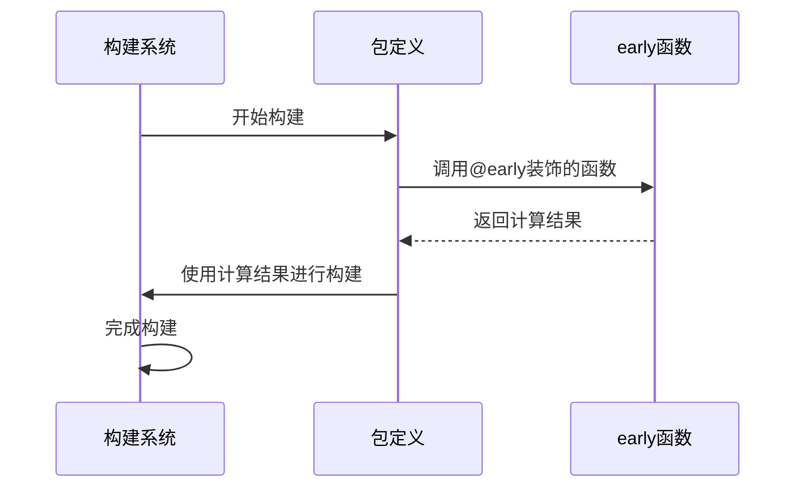
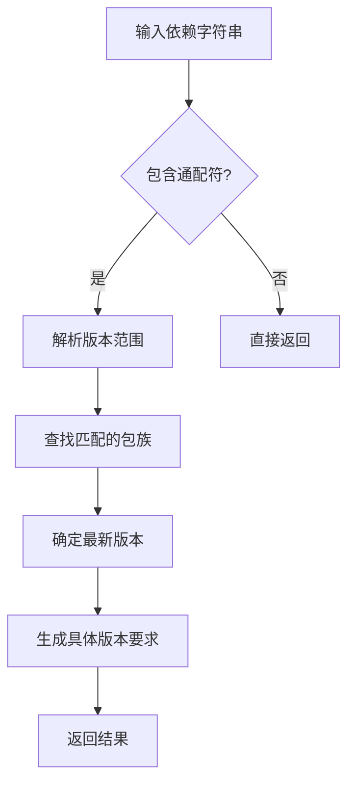
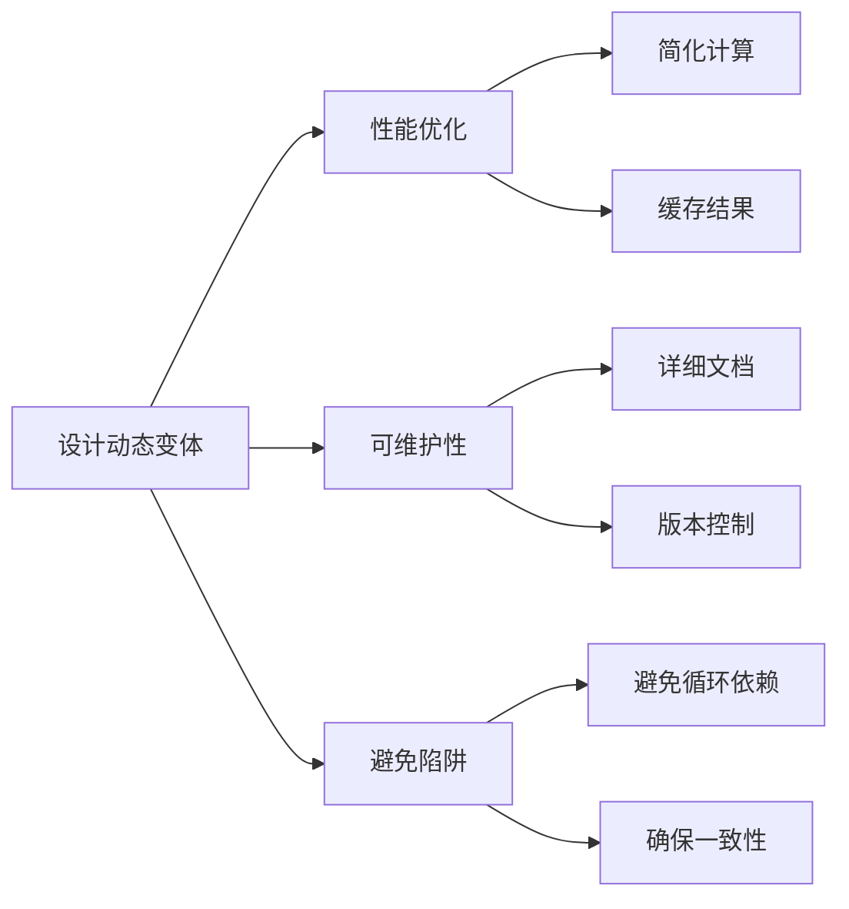

# 动态变体生成

<cite>
**本文档中引用的文件**  
- [package.py](file://my_packages/myapp/1.0.0/package.py)
- [package.py](file://my_packages/python/3.10.0/package.py)
- [package.py](file://my_packages/maya/2022/package.py)
- [system.py](file://rez-3.3.0/src/rez/system.py)
- [package_py_utils.py](file://rez-3.3.0/src/rez/package_py_utils.py)
- [serialise.py](file://rez-3.3.0/src/rez/serialise.py)
- [sourcecode.py](file://rez-3.3.0/src/rez/utils/sourcecode.py)
- [package_definition.rst](file://rez-3.3.0/docs/source/package_definition.rst)
- [variants.rst](file://rez-3.3.0/docs/source/variants.rst)
</cite>

## 目录
1. [引言](#引言)
2. [动态变体生成基础](#动态变体生成基础)
3. [@early()函数详解](#early函数详解)
4. [rez.package_py_utils.expand_requires()详解](#rezpackage_py_utilsexpand_requires详解)
5. [动态变体在跨平台构建中的应用](#动态变体在跨平台构建中的应用)
6. [从静态到动态变体的迁移实践](#从静态到动态变体的迁移实践)
7. [最佳实践与注意事项](#最佳实践与注意事项)
8. [结论](#结论)

## 引言

动态变体生成是Rez包管理系统中的核心功能之一，它允许开发者根据系统属性（如platform、arch、os等）动态构造变体需求。这种机制在跨平台构建和自动依赖扩展中具有显著优势。通过使用@early()函数和rez.package_py_utils.expand_requires()，开发者可以创建更加灵活和智能的包定义，从而简化复杂的依赖管理。

**本文档中引用的文件**  
- [package_definition.rst](file://rez-3.3.0/docs/source/package_definition.rst)
- [variants.rst](file://rez-3.3.0/docs/source/variants.rst)

## 动态变体生成基础

变体（Variants）是Rez系统中用于管理不同配置和依赖关系的核心概念。传统的静态变体需要在包定义中预先声明所有可能的配置组合，这在面对复杂的跨平台需求时会变得难以维护。动态变体生成通过在构建时动态计算变体需求，解决了这一问题。

在Rez系统中，变体通常以列表形式定义，每个变体代表一组特定的依赖要求。例如，一个包可能需要为不同的Python版本、操作系统或硬件架构提供不同的变体。动态变体生成允许这些需求在构建时根据实际环境动态确定，而不是在包定义时静态指定。

```mermaid
graph TD
A[包定义] --> B{是否需要动态变体?}
B --> |是| C[使用@early()函数]
B --> |否| D[使用静态变体]
C --> E[动态计算变体需求]
D --> F[预定义变体列表]
E --> G[构建时确定最终变体]
F --> G
G --> H[生成最终包]
```

**图源**  
- [system.py](file://rez-3.3.0/src/rez/system.py)
- [package_definition.rst](file://rez-3.3.0/docs/source/package_definition.rst)

## @early()函数详解

@early()函数是Rez系统中用于实现早期绑定（early binding）的核心装饰器。它允许在包构建时（而非运行时）执行函数，从而将计算结果固化到包定义中。这对于需要根据构建环境动态生成变体需求的场景尤为重要。

### 早期绑定函数的工作原理

早期绑定函数在包构建前被评估，其返回值被直接写入安装的package.py文件中。这意味着函数只在构建时执行一次，其结果成为包定义的静态部分。这种机制确保了包的可重现性和一致性。



**图源**  
- [serialise.py](file://rez-3.3.0/src/rez/serialise.py)
- [sourcecode.py](file://rez-3.3.0/src/rez/utils/sourcecode.py)

### 可用对象和限制

在@early()函数中，可以访问一些特殊的对象和变量，但也有严格的限制：

- **this**: 当前包对象，可以访问包的属性
- **building**: 布尔值，指示是否处于构建模式
- **build_variant_index**: 当前正在构建的变体索引
- **build_variant_requires**: 当前变体的依赖要求

需要注意的是，@early()函数不能引用其他早期或晚期绑定函数，也不能访问Rez设置的环境变量。这些限制确保了早期绑定函数的纯净性和可预测性。

```python
@early()
def requires():
    if building:
        return ["python-2"]
    else:
        return ["python-3"]
```

**代码片段路径**  
- [package_definition.rst](file://rez-3.3.0/docs/source/package_definition.rst#L166-L170)

## rez.package_py_utils.expand_requires()详解

rez.package_py_utils.expand_requires()是一个强大的工具函数，用于扩展包含通配符的依赖要求。它能够将模糊的依赖声明（如"python-2.*"）转换为具体的版本要求，从而实现更灵活的依赖管理。

### 函数功能和用法

该函数接受一个或多个包含通配符的依赖字符串，返回扩展后的具体版本要求。支持的通配符包括：

- `*`: 匹配单个版本号段的最新版本
- `**`: 匹配完整版本号

```python
from rez.package_py_utils import expand_requires

# 扩展Python 2.x系列的最新版本
expanded = expand_requires(["python-2.*"])
# 结果: ["python-2.7"]

# 扩展Boost库的最新版本
expanded = expand_requires(["boost-1.*.*"])
# 结果: ["boost-1.55.0"]
```

### 实现原理

expand_requires()函数通过以下步骤实现其功能：

1. 解析输入的依赖字符串
2. 在包路径中查找匹配的包族
3. 确定符合条件的最新版本
4. 返回扩展后的具体版本要求

这个过程确保了依赖要求的准确性和最新性，同时保持了包定义的简洁性。



**图源**  
- [package_py_utils.py](file://rez-3.3.0/src/rez/package_py_utils.py)
- [system.py](file://rez-3.3.0/src/rez/system.py)

## 动态变体在跨平台构建中的应用

动态变体生成在跨平台构建中发挥着关键作用。通过结合@early()函数和系统属性，可以创建适应不同平台环境的智能包定义。

### 平台相关的变体生成

Rez系统提供了丰富的系统属性，包括platform、arch和os，这些属性可以用于动态生成平台相关的变体需求。

```python
from rez.system import system

@early()
def variants():
    return [system.variant]
```

这种方法的优势在于：
- 自动适应目标平台
- 减少手动维护的变体列表
- 提高包的可移植性

### 实际应用示例

考虑一个需要在不同操作系统上使用不同依赖的包：

```python
@early()
def requires():
    if system.platform == "windows":
        return ["windows-sdk-10.0", "msvc-14.2"]
    elif system.platform == "linux":
        return ["gcc-9", "glibc-2.28"]
    else:  # osx
        return ["xcode-12", "darwin-20"]
```

这种动态依赖管理方式使得同一个包定义可以在不同平台上正确解析和构建，大大简化了跨平台开发的复杂性。

**代码片段路径**  
- [system.py](file://rez-3.3.0/src/rez/system.py#L54-L60)
- [package_definition.rst](file://rez-3.3.0/docs/source/package_definition.rst#L166-L170)

## 从静态到动态变体的迁移实践

将现有的静态变体迁移到动态变体需要系统的规划和实施。以下是推荐的迁移步骤和最佳实践。

### 迁移步骤

1. **评估现有变体**: 分析当前包的静态变体列表，识别可以动态生成的部分
2. **识别模式**: 找出变体之间的规律和模式，确定哪些属性可以参数化
3. **重构包定义**: 使用@early()函数和系统属性重构变体生成逻辑
4. **测试验证**: 在不同平台上测试新包定义，确保行为符合预期
5. **逐步部署**: 逐步替换旧的静态变体包，监控使用情况

### 迁移示例

假设有一个为不同DCC（数字内容创作）软件版本提供支持的库包：

**迁移前（静态变体）**:
```python
variants = [
    ["maya-2017"],
    ["maya-2018"],
    ["maya-2019"],
    ["nuke-11"],
    ["nuke-12"],
    ["houdini-17"],
    ["houdini-18"]
]
```

**迁移后（动态变体）**:
```python
@early()
def variants():
    dcc_variants = []
    if "maya" in this.requires:
        dcc_variants.extend(["maya-%d" % year for year in range(2017, 2020)])
    if "nuke" in this.requires:
        dcc_variants.extend(["nuke-%d" % version for version in range(11, 13)])
    if "houdini" in this.requires:
        dcc_variants.extend(["houdini-%d" % version for version in range(17, 19)])
    return [dcc_variants] if dcc_variants else [[]]
```

这种迁移不仅减少了代码量，还提高了包的灵活性和可维护性。

**代码片段路径**  
- [package.py](file://my_packages/myapp/1.0.0/package.py)
- [package_definition.rst](file://rez-3.3.0/docs/source/package_definition.rst)

## 最佳实践与注意事项

在使用动态变体生成时，遵循一些最佳实践可以确保包的稳定性和可维护性。

### 性能考虑

- **避免复杂的计算**: @early()函数在构建时执行，复杂的计算可能影响构建性能
- **缓存结果**: 对于耗时的计算，考虑缓存结果以提高效率
- **最小化依赖**: 减少@early()函数中的外部依赖，确保构建环境的纯净性

### 可维护性

- **清晰的文档**: 为动态变体逻辑提供详细的文档说明
- **版本控制**: 将包定义文件纳入版本控制，跟踪变更历史
- **测试覆盖**: 为动态变体逻辑编写全面的测试用例

### 常见陷阱

- **循环依赖**: 避免在@early()函数中创建可能导致循环依赖的逻辑
- **环境敏感性**: 确保动态变体逻辑在不同构建环境中行为一致
- **向后兼容**: 在修改现有包的变体逻辑时，考虑向后兼容性



**图源**  
- [package_py_utils.py](file://rez-3.3.0/src/rez/package_py_utils.py)
- [package_definition.rst](file://rez-3.3.0/docs/source/package_definition.rst)

## 结论

动态变体生成是Rez包管理系统中的一项强大功能，它通过@early()函数和rez.package_py_utils.expand_requires()等工具，实现了灵活、智能的依赖管理。这种机制在跨平台构建和复杂依赖场景中具有显著优势，能够显著提高开发效率和包的可维护性。

通过合理使用动态变体生成，开发者可以：
- 减少手动维护的变体列表
- 提高包的可移植性和适应性
- 简化复杂的依赖管理
- 实现更智能的构建逻辑

从静态到动态变体的迁移虽然需要一定的投入，但其带来的长期收益远超初期成本。建议在新项目中优先考虑使用动态变体生成，并逐步将现有项目迁移到这一更先进的模式。