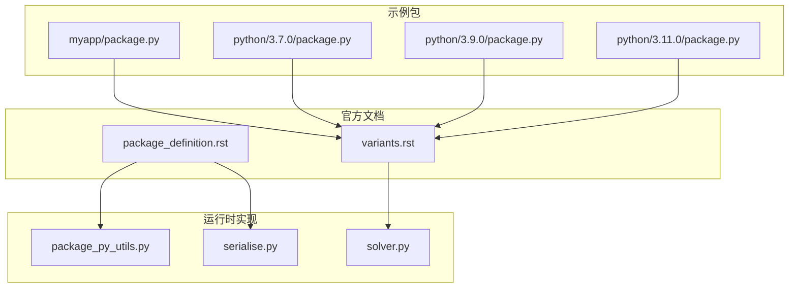
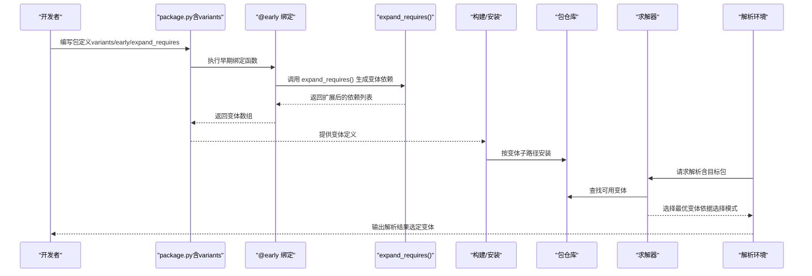
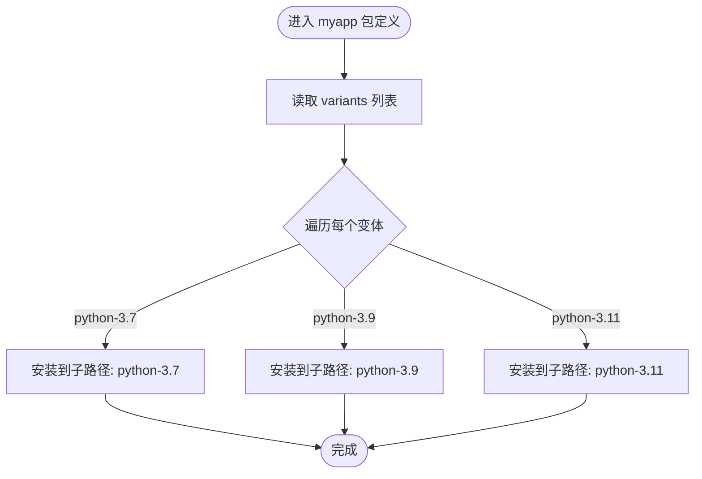
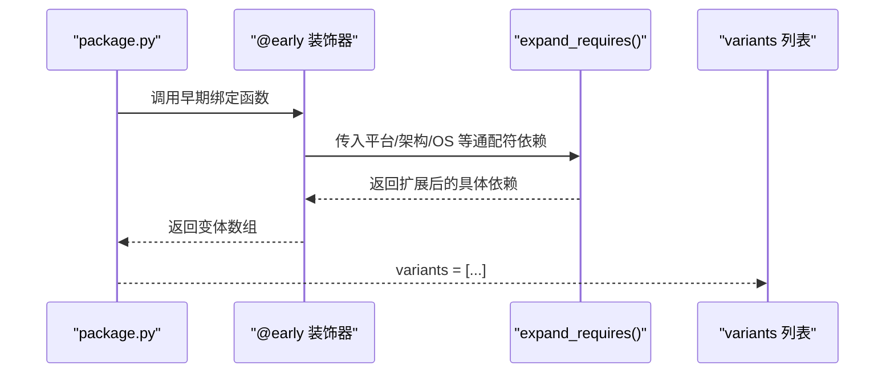
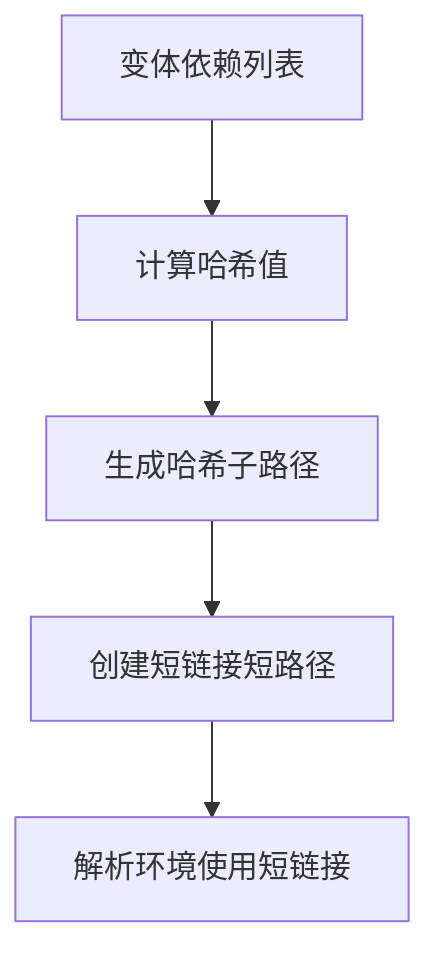
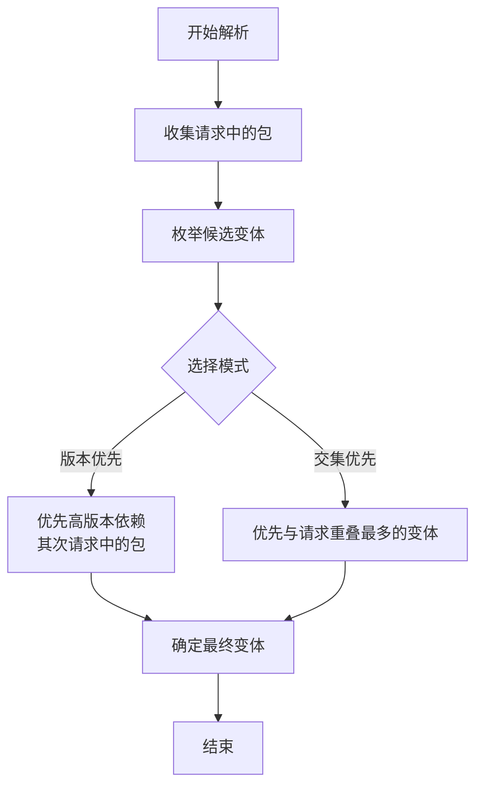
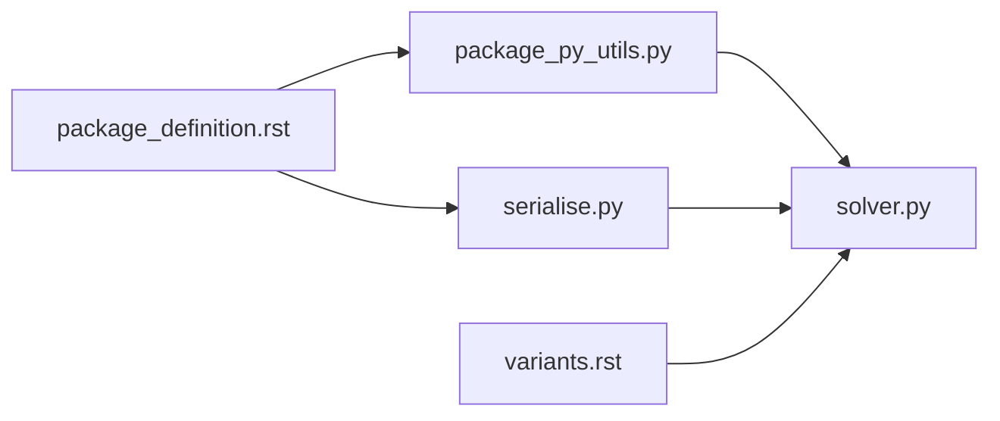

# 变体 (variants)

<cite>
**本文引用的文件**
- [variants.rst](file://rez-3.3.0/docs/source/variants.rst)
- [package_definition.rst](file://rez-3.3.0/docs/source/package_definition.rst)
- [package_py_utils.py](file://rez-3.3.0/src/rez/package_py_utils.py)
- [serialise.py](file://rez-3.3.0/src/rez/serialise.py)
- [solver.py](file://rez-3.3.0/src/rez/solver.py)
- [myapp package.py](file://my_packages/myapp/1.0.0/package.py)
- [python-3.7 package.py](file://my_packages/python/3.7.0/package.py)
- [python-3.9 package.py](file://my_packages/python/3.9.0/package.py)
- [python-3.11 package.py](file://my_packages/python/3.11.0/package.py)
</cite>

## 目录
1. [引言](#引言)
2. [项目结构](#项目结构)
3. [核心组件](#核心组件)
4. [架构总览](#架构总览)
5. [详细组件分析](#详细组件分析)
6. [依赖关系分析](#依赖关系分析)
7. [性能考量](#性能考量)
8. [故障排查指南](#故障排查指南)
9. [结论](#结论)
10. [附录](#附录)

## 引言
本篇文档围绕 Rez 包定义中的“变体（variants）”字段展开，系统阐述：
- 变体如何让单个包源码构建出多个具有不同依赖配置的安装版本（例如针对不同 Python 版本）
- 基于 myapp 示例中对 python-3.7、python-3.9、python-3.11 的变体列表的基本用法
- 结合文档中的动态变体示例，展示如何使用 @early() 函数与 expand_requires() 根据平台或架构动态生成变体
- 讨论 hashed_variants 选项在处理复杂依赖时的作用与收益

## 项目结构
本仓库包含 Rez 官方文档与示例包。与变体主题直接相关的文件包括：
- 官方文档：variants.rst、package_definition.rst
- 变体工具函数：package_py_utils.py
- 变体求解与选择逻辑：solver.py
- 变体早期绑定执行机制：serialise.py
- 示例包：myapp 与多 Python 版本占位包

图表来源
- [variants.rst](file://rez-3.3.0/docs/source/variants.rst#L1-L262)
- [package_definition.rst](file://rez-3.3.0/docs/source/package_definition.rst#L420-L619)
- [package_py_utils.py](file://rez-3.3.0/src/rez/package_py_utils.py#L1-L200)
- [serialise.py](file://rez-3.3.0/src/rez/serialise.py#L321-L353)
- [solver.py](file://rez-3.3.0/src/rez/solver.py#L429-L459)
- [myapp package.py](file://my_packages/myapp/1.0.0/package.py#L1-L33)
- [python-3.7 package.py](file://my_packages/python/3.7.0/package.py#L1-L8)
- [python-3.9 package.py](file://my_packages/python/3.9.0/package.py#L1-L8)
- [python-3.11 package.py](file://my_packages/python/3.11.0/package.py#L1-L8)

章节来源
- [variants.rst](file://rez-3.3.0/docs/source/variants.rst#L1-L262)
- [package_definition.rst](file://rez-3.3.0/docs/source/package_definition.rst#L420-L619)

## 核心组件
- 变体定义与存储
  - 变体是同一版本包的不同“风味”，每个变体拥有一个或多个与其它变体不同的依赖集合。这些依赖会附加到该变体的 requires 列表中。
  - 安装时，变体会被存储在以变体依赖为子路径的目录下；也可启用 hashed_variants 将子路径替换为哈希值，并通过短链接映射到解析环境。
- 动态变体生成
  - 使用 @early() 装饰器在构建期计算变体，结合 expand_requires() 根据平台、架构等条件动态生成变体列表。
- 变体选择策略
  - 默认按“版本优先”模式选择变体；也可设置为“交集优先”模式，优先选择与请求中包重叠最多的变体。
- 复杂依赖场景
  - 当变体之间不互斥时，选择行为可能不确定；可通过明确请求或调整选择模式降低歧义。

章节来源
- [variants.rst](file://rez-3.3.0/docs/source/variants.rst#L1-L262)
- [package_definition.rst](file://rez-3.3.0/docs/source/package_definition.rst#L420-L619)

## 架构总览
下图展示了从包定义到变体生成、存储与解析的整体流程。

图表来源
- [package_definition.rst](file://rez-3.3.0/docs/source/package_definition.rst#L420-L619)
- [package_py_utils.py](file://rez-3.3.0/src/rez/package_py_utils.py#L147-L165)
- [serialise.py](file://rez-3.3.0/src/rez/serialise.py#L321-L353)
- [solver.py](file://rez-3.3.0/src/rez/solver.py#L429-L459)

## 详细组件分析

### myapp 示例：基于 Python 版本的静态变体
- 示例要点
  - 在包定义中以 variants 字段列出多个变体，每个变体是一个依赖列表。
  - 该示例针对 python-3.7、python-3.9、python-3.11 三个变体，分别代表不同 Python 运行时的安装版本。
- 使用建议
  - 静态变体适合已知且稳定的依赖组合；若需随平台/架构变化而动态生成，可改用动态变体。

图表来源
- [myapp package.py](file://my_packages/myapp/1.0.0/package.py#L1-L33)

章节来源
- [myapp package.py](file://my_packages/myapp/1.0.0/package.py#L1-L33)

### 动态变体：@early() 与 expand_requires() 的组合
- @early() 的作用
  - 在构建期执行函数，允许在 package.py 中以早期绑定的方式计算属性（如 variants），避免每次解析环境时重复计算。
- expand_requires() 的作用
  - 将带有通配符的依赖请求扩展为具体版本，支持 “*” 和 “**” 等通配符，返回扩展后的依赖列表。
- 实践示例（来自官方文档）
  - 在 package.py 中定义 @early() 的 variants 函数，使用 expand_requires() 生成平台、架构、操作系统等维度的变体组合。
  - 该方式可自动适配当前平台与架构，减少手工维护成本。

图表来源
- [package_definition.rst](file://rez-3.3.0/docs/source/package_definition.rst#L420-L619)
- [package_py_utils.py](file://rez-3.3.0/src/rez/package_py_utils.py#L147-L165)
- [serialise.py](file://rez-3.3.0/src/rez/serialise.py#L321-L353)

章节来源
- [package_definition.rst](file://rez-3.3.0/docs/source/package_definition.rst#L420-L619)
- [package_py_utils.py](file://rez-3.3.0/src/rez/package_py_utils.py#L147-L165)
- [serialise.py](file://rez-3.3.0/src/rez/serialise.py#L321-L353)

### hashed_variants：复杂依赖下的路径与可维护性
- 问题背景
  - 当变体依赖较多或包含特殊字符时，变体子路径可能过长或不可作为文件系统路径。
- 解决方案
  - 启用 hashed_variants，将变体子路径替换为依赖的哈希值；同时通过短链接（shortlinks）在解析环境中使用更友好的路径。
- 适用场景
  - 多平台、多架构、多依赖组合的复杂包；需要稳定安装路径与可读性之间的平衡。

图表来源
- [variants.rst](file://rez-3.3.0/docs/source/variants.rst#L69-L106)

章节来源
- [variants.rst](file://rez-3.3.0/docs/source/variants.rst#L69-L106)

### 变体选择与冲突避免
- 选择模式
  - 默认“版本优先”：优先选择更高版本的依赖；若请求中包含特定包，则优先考虑请求中的包。
  - “交集优先”：优先选择与请求中包重叠最多的变体。
- 不互斥变体的风险
  - 当变体之间不互斥（如不同 DCC 支持）时，选择行为可能不确定；建议通过明确请求或调整模式降低歧义。

图表来源
- [solver.py](file://rez-3.3.0/src/rez/solver.py#L429-L459)
- [variants.rst](file://rez-3.3.0/docs/source/variants.rst#L143-L206)

章节来源
- [solver.py](file://rez-3.3.0/src/rez/solver.py#L429-L459)
- [variants.rst](file://rez-3.3.0/docs/source/variants.rst#L143-L206)

### 平台作为变体：跨平台包的实践
- 典型做法
  - 将 platform、arch、os 等隐式包纳入变体，确保安装路径包含平台信息，便于在多平台上区分安装。
- 注意事项
  - 通常通过隐式包限制仅选择当前平台的变体，避免跨平台冲突。

章节来源
- [variants.rst](file://rez-3.3.0/docs/source/variants.rst#L106-L142)

## 依赖关系分析
- 文档层依赖
  - variants.rst 与 package_definition.rst 协同说明变体语义、动态生成与早期绑定。
- 工具层依赖
  - package_py_utils.py 提供 expand_requires()，serialise.py 提供 @early() 执行机制。
- 求解层依赖
  - solver.py 根据变体选择模式进行排序与选择，决定最终使用的变体。

图表来源
- [package_definition.rst](file://rez-3.3.0/docs/source/package_definition.rst#L420-L619)
- [package_py_utils.py](file://rez-3.3.0/src/rez/package_py_utils.py#L147-L165)
- [serialise.py](file://rez-3.3.0/src/rez/serialise.py#L321-L353)
- [solver.py](file://rez-3.3.0/src/rez/solver.py#L429-L459)
- [variants.rst](file://rez-3.3.0/docs/source/variants.rst#L1-L262)

章节来源
- [package_definition.rst](file://rez-3.3.0/docs/source/package_definition.rst#L420-L619)
- [package_py_utils.py](file://rez-3.3.0/src/rez/package_py_utils.py#L147-L165)
- [serialise.py](file://rez-3.3.0/src/rez/serialise.py#L321-L353)
- [solver.py](file://rez-3.3.0/src/rez/solver.py#L429-L459)
- [variants.rst](file://rez-3.3.0/docs/source/variants.rst#L1-L262)

## 性能考量
- 早期绑定与缓存
  - 使用 @early() 在构建期计算昂贵操作（如外部命令、版本探测），并将结果缓存在包属性中，避免每次解析环境时重复开销。
- 通配符扩展
  - expand_requires() 会在构建期将通配符扩展为具体版本，减少运行时解析成本。
- 变体数量与选择复杂度
  - 变体越多，解析时的选择空间越大；合理设计变体粒度与选择模式有助于提升解析效率。

章节来源
- [package_definition.rst](file://rez-3.3.0/docs/source/package_definition.rst#L505-L604)
- [package_py_utils.py](file://rez-3.3.0/src/rez/package_py_utils.py#L147-L165)

## 故障排查指南
- 变体未生效或解析异常
  - 检查 variants 是否正确声明为依赖列表；确认变体依赖与现有包仓库一致。
  - 若使用 @early()，确保函数签名合法（零参或一参 data），并在 serialise 流程中正确执行。
- 通配符扩展失败
  - expand_requires() 对通配符语法有严格要求；检查是否使用了非法组合（如 “**” 与 “*” 混用）。
- 安装路径过长或包含非法字符
  - 启用 hashed_variants，并确保短链接功能正常工作，以便在解析环境中使用短路径。
- 变体选择不符合预期
  - 调整 variant_select_mode（版本优先 vs 交集优先），或在请求中显式指定目标包以消除歧义。

章节来源
- [variants.rst](file://rez-3.3.0/docs/source/variants.rst#L69-L106)
- [serialise.py](file://rez-3.3.0/src/rez/serialise.py#L321-L353)
- [package_py_utils.py](file://rez-3.3.0/src/rez/package_py_utils.py#L147-L165)
- [solver.py](file://rez-3.3.0/src/rez/solver.py#L429-L459)

## 结论
- 变体是 Rez 中实现“同一源码、多依赖配置”的关键机制，既可用于静态场景（如不同 Python 版本），也可通过 @early() 与 expand_requires() 动态生成。
- hashed_variants 在复杂依赖与跨平台场景中显著改善安装路径与可维护性。
- 正确选择变体选择模式与合理设计变体粒度，有助于在稳定性与灵活性之间取得平衡。

## 附录
- 示例包参考
  - myapp：展示静态变体（python-3.7/3.9/3.11）
  - python 各版本占位包：展示空变体列表的占位用法

章节来源
- [myapp package.py](file://my_packages/myapp/1.0.0/package.py#L1-L33)
- [python-3.7 package.py](file://my_packages/python/3.7.0/package.py#L1-L8)
- [python-3.9 package.py](file://my_packages/python/3.9.0/package.py#L1-L8)
- [python-3.11 package.py](file://my_packages/python/3.11.0/package.py#L1-L8)