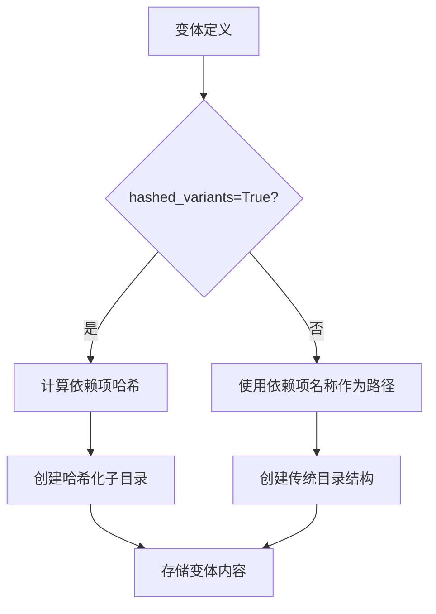
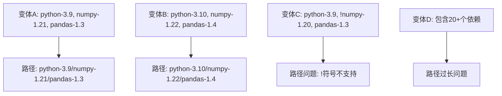
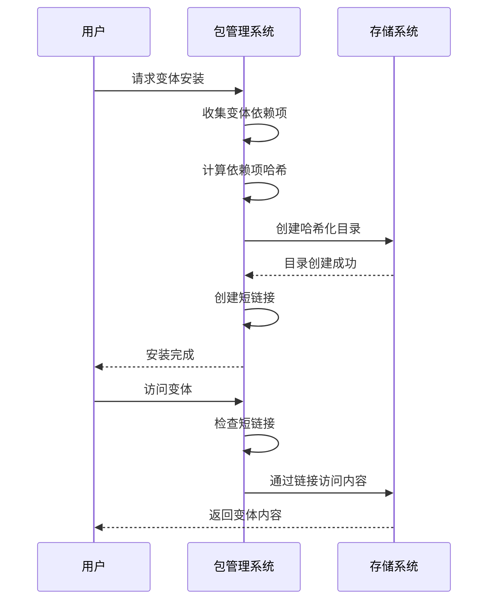
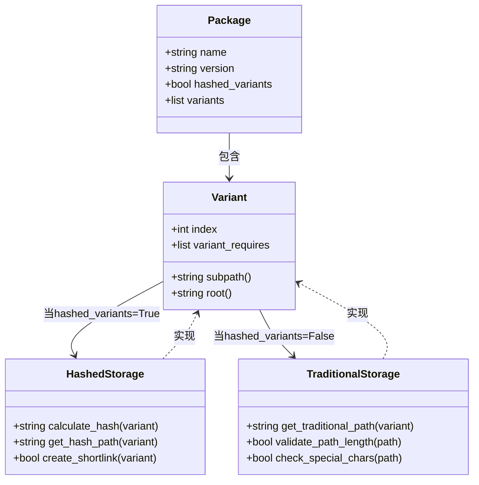

# 哈希化变体存储

<cite>
**本文档中引用的文件**  
- [package_resources.py](file://rez-3.3.0\src\rez\package_resources.py)
- [package_copy.py](file://rez-3.3.0\src\rez\package_copy.py)
- [rezconfig.py](file://rez-3.3.0\src\rez\rezconfig.py)
- [package.py](file://rez-3.3.0\src\rez\data\tests\builds\packages\bah\2.1\package.py)
- [package_definition.rst](file://rez-3.3.0\docs\source\package_definition.rst)
</cite>

## 目录
1. [简介](#简介)
2. [hashed_variants属性的作用](#hashed_variants属性的作用)
3. [传统目录结构的局限性](#传统目录结构的局限性)
4. [哈希化存储的工作原理](#哈希化存储的工作原理)
5. [复杂依赖场景示例](#复杂依赖场景示例)
6. [安装路径变化分析](#安装路径变化分析)
7. [对包管理的影响](#对包管理的影响)
8. [配置与最佳实践](#配置与最佳实践)
9. [结论](#结论)

## 简介
在包管理系统中，变体（variants）是一种强大的机制，用于管理同一软件包的不同配置和依赖组合。然而，当变体包含大量依赖或冲突需求时，传统的基于目录的存储结构可能会遇到严重问题。`hashed_variants`布尔属性提供了一种创新的解决方案，通过内容哈希来组织变体存储，从而克服了传统方法的局限性。本文将深入探讨`hashed_variants`的作用、使用场景以及在复杂依赖情况下的实际影响。

## hashed_variants属性的作用
`hashed_variants`是一个布尔类型的配置属性，用于指示包管理系统是否应该基于变体内容的哈希值来组织其存储结构。当设置为`True`时，系统会使用变体依赖项的内容哈希作为子目录名称，而不是直接使用依赖项的名称作为路径。

该属性的主要作用包括：
- **解决路径长度限制**：避免因依赖项过多导致的文件路径过长问题
- **处理特殊字符**：防止依赖项名称中包含文件系统不支持的特殊字符
- **支持冲突需求**：能够正确处理包含冲突需求（如`!package`）的变体
- **避免路径冲突**：确保不同变体组合不会产生相同的路径



**图示来源**
- [package_resources.py](file://rez-3.3.0\src\rez\package_resources.py#L464-L485)

## 传统目录结构的局限性
传统的变体存储方法直接将变体的依赖项名称用作目录路径，这种方法在简单场景下工作良好，但在复杂情况下会遇到多种问题。

### 路径长度问题
当变体包含大量依赖项时，生成的路径可能会超出操作系统的限制。例如，一个包含10个以上依赖项的变体可能会产生超过260个字符的路径，在Windows系统上这将导致文件操作失败。

### 特殊字符问题
某些依赖项名称可能包含文件系统不支持的特殊字符，如`*`、`?`、`<`、`>`等，这些字符在路径中是非法的，会导致存储失败。

### 冲突需求处理
传统方法难以处理包含冲突需求的变体。例如，一个变体可能要求"非特定版本的包"，这种否定形式的需求无法直接映射到文件系统路径。

### 路径冲突
不同的变体组合可能会意外地产生相同的路径名称，导致存储冲突和数据覆盖。



**图示来源**
- [package_resources.py](file://rez-3.3.0\src\rez\package_resources.py#L486-L489)

## 哈希化存储的工作原理
哈希化存储通过将变体的依赖项内容转换为固定长度的哈希值来解决传统方法的问题。这个过程包括几个关键步骤：

### 哈希计算
系统使用SHA-1算法计算变体依赖项列表的哈希值。这个哈希值作为变体的唯一标识符，用于创建存储目录。

### 短链接优化
为了提高可读性和便利性，系统还创建了短链接（shortlinks）机制。这些链接存储在专门的`_v`目录中，指向实际的哈希化目录。

### 路径解析
当需要访问特定变体时，系统首先检查短链接，如果存在则使用短链接路径；否则直接使用哈希化路径。



**图示来源**
- [package_resources.py](file://rez-3.3.0\src\rez\package_resources.py#L464-L485)
- [rezconfig.py](file://rez-3.3.0\src\rez\rezconfig.py#L804-L809)

## 复杂依赖场景示例
考虑一个复杂的软件开发环境，其中包含多个相互依赖的包和冲突需求。以下是一个典型的复杂场景：

### 示例配置
```python
name = 'bah'
version = '2.1'
hashed_variants = True
variants = [
    ["foo-1.0", "bar-2.0", "baz-3.0", "qux-4.0"],
    ["foo-1.1", "!bar-1.9", "baz-3.1", "quux-5.0"]
]
```

在这个示例中：
- 第一个变体需要特定版本的四个包
- 第二个变体需要`foo-1.1`，但明确排除`bar-1.9`，同时需要其他两个包的特定版本
- 由于使用了`!bar-1.9`这样的冲突需求，传统目录结构无法正确表示

### 哈希化解决方案
系统会为每个变体计算唯一的哈希值：
- 变体1的依赖项列表转换为哈希值，如`a1b2c3d4`
- 变体2的依赖项列表转换为另一个哈希值，如`e5f6g7h8`
- 实际存储路径为`/bah/2.1/a1b2c3d4`和`/bah/2.1/e5f6g7h8`

**本节来源**
- [package.py](file://rez-3.3.0\src\rez\data\tests\builds\packages\bah\2.1\package.py#L1-L16)
- [package_resources.py](file://rez-3.3.0\src\rez\package_resources.py#L464-L485)

## 安装路径变化分析
当`hashed_variants=True`时，变体的安装路径会发生显著变化，这种变化带来了多方面的影响。

### 路径结构对比
| 场景 | 传统路径 | 哈希化路径 |
|------|---------|----------|
| 简单变体 | `/package/1.0/python-3.9/numpy-1.21` | `/package/1.0/a1b2c3d4` |
| 复杂变体 | 路径过长或无效 | `/package/1.0/e5f6g7h8` |
| 冲突需求 | 无法表示 | `/package/1.0/i9j0k1l2` |

### 性能影响
哈希化存储对系统性能有双重影响：
- **存储性能**：哈希计算增加了少量CPU开销，但避免了路径验证的复杂性
- **访问性能**：短链接机制确保了快速访问，同时保持了路径的简洁性
- **磁盘使用**：略微增加元数据存储，但避免了路径冲突导致的重复存储

### 可维护性
哈希化路径提高了系统的可维护性：
- 避免了因路径问题导致的安装失败
- 简化了变体管理的复杂性
- 提高了系统的健壮性和可靠性

**本节来源**
- [package_resources.py](file://rez-3.3.0\src\rez\package_resources.py#L464-L485)
- [package_copy.py](file://rez-3.3.0\src\rez\package_copy.py#L356-L372)

## 对包管理的影响
`hashed_variants`属性的引入对整个包管理系统产生了深远的影响，改变了变体管理和依赖解析的方式。

### 变体管理
哈希化存储使得变体管理更加灵活和可靠：
- 支持任意复杂的依赖组合
- 能够处理以前无法表示的冲突需求
- 提高了变体创建的成功率

### 依赖解析
在依赖解析过程中，哈希化存储提供了更稳定的环境：
- 避免了因路径问题导致的解析失败
- 确保了依赖关系的准确表示
- 提高了解析过程的可预测性

### 系统兼容性
哈希化存储增强了系统的跨平台兼容性：
- 避免了不同文件系统对路径的限制
- 统一了不同操作系统的存储方式
- 提高了包在不同环境间的可移植性



**图示来源**
- [package_resources.py](file://rez-3.3.0\src\rez\package_resources.py#L464-L485)
- [package_copy.py](file://rez-3.3.0\src\rez\package_copy.py#L294-L308)

## 配置与最佳实践
正确配置和使用`hashed_variants`属性对于确保系统稳定运行至关重要。

### 配置建议
- **复杂包**：对于包含5个以上依赖项的包，建议设置`hashed_variants=True`
- **冲突需求**：只要变体包含冲突需求（`!`前缀），必须设置`hashed_variants=True`
- **跨平台包**：为了确保跨平台兼容性，建议启用哈希化存储

### 最佳实践
1. **评估需求**：在设置`hashed_variants`之前，评估包的复杂性和依赖结构
2. **测试验证**：在生产环境部署前，充分测试哈希化存储的行为
3. **文档记录**：记录所有使用哈希化存储的包及其原因
4. **监控性能**：监控哈希计算对构建性能的影响

### 配置示例
```python
# 在rezconfig.py中配置默认行为
variant_shortlinks_dirname = "_v"
use_variant_shortlinks = True

# 在package.py中启用哈希化
name = "complex_package"
version = "1.0.0"
hashed_variants = True
variants = [
    ["dep1-1.0", "dep2-2.0", "dep3-3.0"],
    ["dep1-1.1", "!dep2-1.9", "dep4-4.0"]
]
```

**本节来源**
- [rezconfig.py](file://rez-3.3.0\src\rez\rezconfig.py#L801-L809)
- [package_definition.rst](file://rez-3.3.0\docs\source\package_definition.rst#L710-L721)

## 结论
`hashed_variants`布尔属性是Rez包管理系统中的一项重要创新，它通过内容哈希解决了传统目录结构在处理复杂变体时的诸多局限性。这项技术不仅能够处理包含大量依赖或冲突需求的复杂场景，还提高了系统的可靠性、兼容性和可维护性。

通过哈希化存储，包管理系统能够：
- 有效避免路径长度限制问题
- 正确处理包含特殊字符和冲突需求的依赖
- 提供更稳定和可预测的变体管理
- 增强跨平台兼容性和包的可移植性

在现代软件开发环境中，随着依赖关系的日益复杂，`hashed_variants`属性的重要性愈发凸显。合理使用这一特性，可以显著提升包管理系统的效率和可靠性，为复杂的软件项目提供坚实的基础支持。