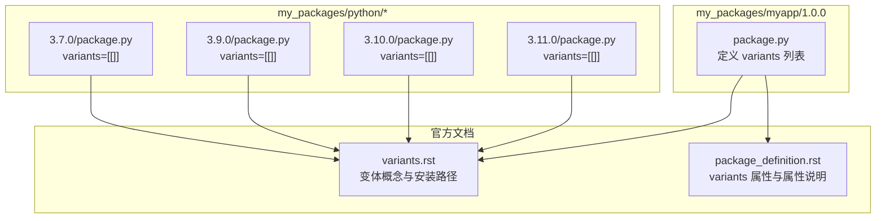
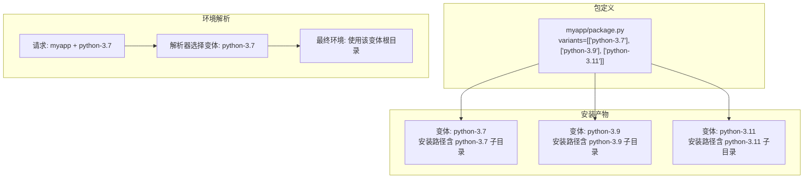
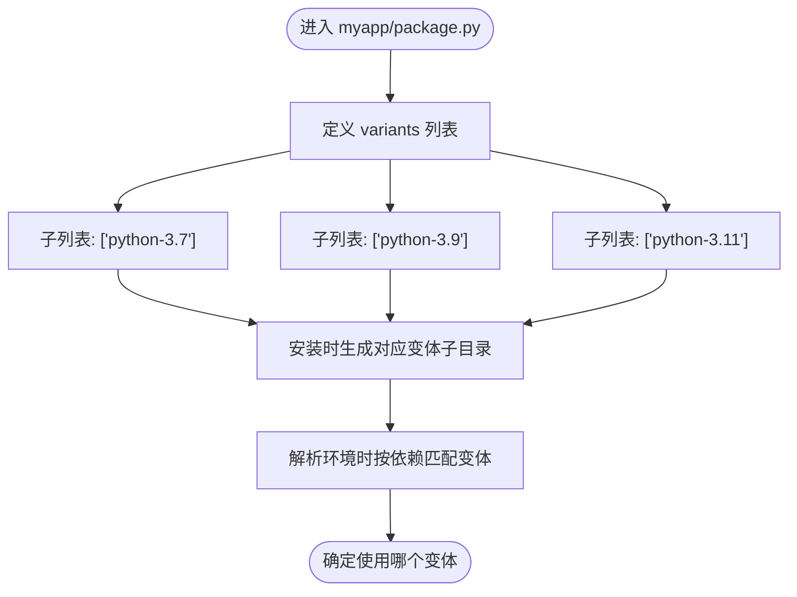
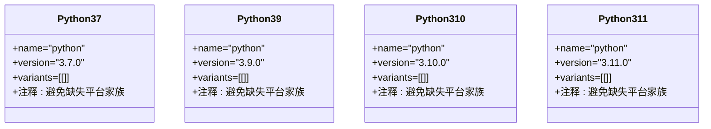
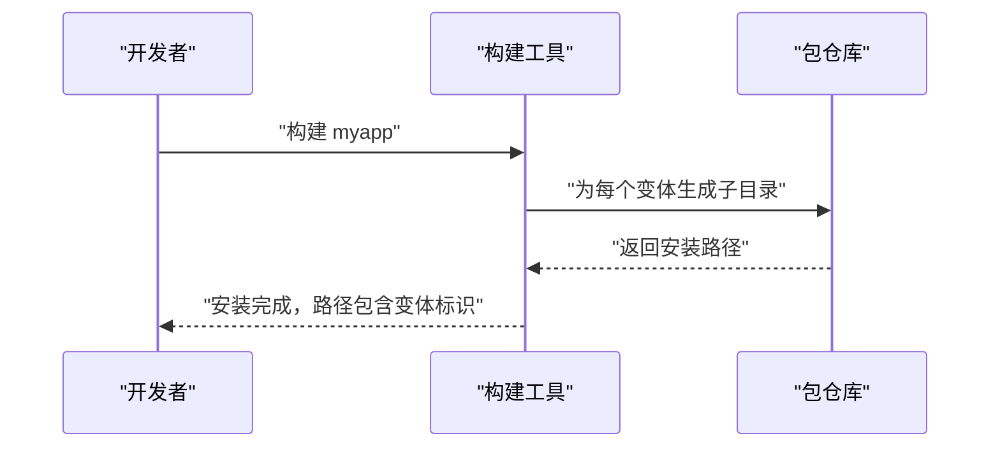
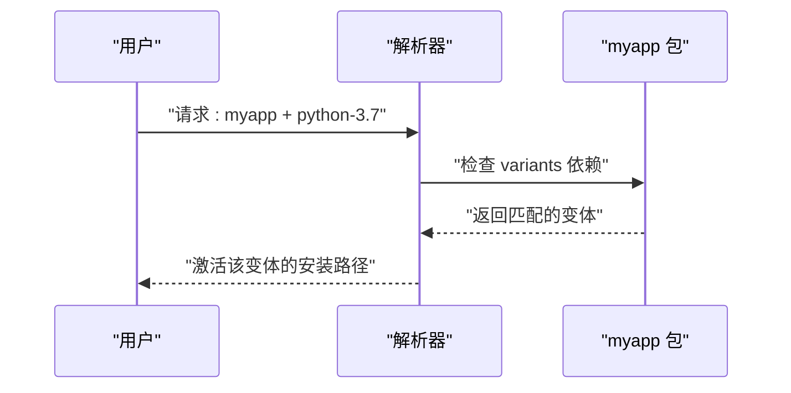
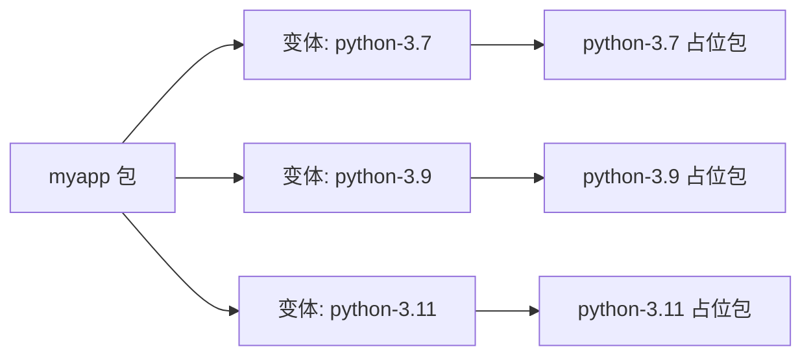

# 静态变体定义

<cite>
**本文引用的文件**
- [my_packages/myapp/1.0.0/package.py](file://my_packages/myapp/1.0.0/package.py)
- [my_packages/python/3.7.0/package.py](file://my_packages/python/3.7.0/package.py)
- [my_packages/python/3.9.0/package.py](file://my_packages/python/3.9.0/package.py)
- [my_packages/python/3.10.0/package.py](file://my_packages/python/3.10.0/package.py)
- [my_packages/python/3.11.0/package.py](file://my_packages/python/3.11.0/package.py)
- [rez-3.3.0/docs/source/variants.rst](file://rez-3.3.0/docs/source/variants.rst)
- [rez-3.3.0/docs/source/package_definition.rst](file://rez-3.3.0/docs/source/package_definition.rst)
</cite>

## 目录
1. [引言](#引言)
2. [项目结构](#项目结构)
3. [核心组件](#核心组件)
4. [架构总览](#架构总览)
5. [详细组件分析](#详细组件分析)
6. [依赖关系分析](#依赖关系分析)
7. [性能考量](#性能考量)
8. [故障排查指南](#故障排查指南)
9. [结论](#结论)

## 引言
本篇文档围绕 Rez 包定义中的“静态变体”进行系统化讲解，重点说明如何在 package.py 中通过 variants 列表静态声明变体；以 myapp 包对 python-3.7、3.9、3.11 的变体配置为实际示例，阐明变体列表的语法结构与嵌套格式；并解释每个变体如何代表不同的依赖组合，以及这些组合如何影响包的安装路径与环境解析结果。最后总结静态变体适用于已知且固定的构建配置场景，例如多 Python 版本支持。

## 项目结构
本次分析聚焦于以下与“静态变体”直接相关的关键文件：
- myapp 包的 package.py：展示 variants 的静态定义与基本环境命令
- 多个 Python 占位包的 package.py：展示 variants 的最小化写法与平台约束
- 官方文档 variants.rst 与 package_definition.rst：提供变体概念、安装路径、变体选择等权威说明

图表来源
- [my_packages/myapp/1.0.0/package.py](file://my_packages/myapp/1.0.0/package.py#L1-L33)
- [my_packages/python/3.7.0/package.py](file://my_packages/python/3.7.0/package.py#L1-L8)
- [my_packages/python/3.9.0/package.py](file://my_packages/python/3.9.0/package.py#L1-L8)
- [my_packages/python/3.10.0/package.py](file://my_packages/python/3.10.0/package.py#L1-L8)
- [my_packages/python/3.11.0/package.py](file://my_packages/python/3.11.0/package.py#L1-L8)
- [rez-3.3.0/docs/source/variants.rst](file://rez-3.3.0/docs/source/variants.rst#L1-L262)
- [rez-3.3.0/docs/source/package_definition.rst](file://rez-3.3.0/docs/source/package_definition.rst#L920-L935)

章节来源
- [my_packages/myapp/1.0.0/package.py](file://my_packages/myapp/1.0.0/package.py#L1-L33)
- [my_packages/python/3.7.0/package.py](file://my_packages/python/3.7.0/package.py#L1-L8)
- [my_packages/python/3.9.0/package.py](file://my_packages/python/3.9.0/package.py#L1-L8)
- [my_packages/python/3.10.0/package.py](file://my_packages/python/3.10.0/package.py#L1-L8)
- [my_packages/python/3.11.0/package.py](file://my_packages/python/3.11.0/package.py#L1-L8)
- [rez-3.3.0/docs/source/variants.rst](file://rez-3.3.0/docs/source/variants.rst#L1-L262)
- [rez-3.3.0/docs/source/package_definition.rst](file://rez-3.3.0/docs/source/package_definition.rst#L920-L935)

## 核心组件
- 变体列表 variants：在 package.py 中以二维列表形式声明，每个子列表代表一个变体的依赖集合
- 变体与安装路径：每个变体对应一个安装子目录，安装路径由变体依赖决定
- 环境解析与选择：当解析环境时，Rez 会根据请求与变体依赖自动选择合适的变体
- 占位包与平台约束：Python 占位包通常使用 variants=[[]] 并通过平台约束避免缺失平台家族

章节来源
- [my_packages/myapp/1.0.0/package.py](file://my_packages/myapp/1.0.0/package.py#L24-L29)
- [rez-3.3.0/docs/source/variants.rst](file://rez-3.3.0/docs/source/variants.rst#L44-L91)
- [rez-3.3.0/docs/source/package_definition.rst](file://rez-3.3.0/docs/source/package_definition.rst#L920-L935)
- [my_packages/python/3.7.0/package.py](file://my_packages/python/3.7.0/package.py#L1-L8)

## 架构总览
下图展示了 myapp 包通过 variants 指定不同 Python 版本依赖，从而在安装时生成对应的变体子目录，并在解析环境时按需选择变体。

图表来源
- [my_packages/myapp/1.0.0/package.py](file://my_packages/myapp/1.0.0/package.py#L24-L29)
- [rez-3.3.0/docs/source/variants.rst](file://rez-3.3.0/docs/source/variants.rst#L44-L91)

## 详细组件分析

### myapp 包的静态变体定义
- 位置与作用：在 myapp/1.0.0/package.py 中通过 variants 列表静态声明三个变体，分别指向 python-3.7、python-3.9、python-3.11
- 语法结构：variants 是一个二维列表，每个元素是一个子列表，表示一个变体所需的依赖集合
- 嵌套格式：每个子列表内为字符串形式的包请求，如 ["python-3.7"]，多个依赖可并列在同一子列表中
- 影响范围：变体直接影响安装路径（每个变体对应一个子目录），也影响环境解析时的选择

图表来源
- [my_packages/myapp/1.0.0/package.py](file://my_packages/myapp/1.0.0/package.py#L24-L29)
- [rez-3.3.0/docs/source/variants.rst](file://rez-3.3.0/docs/source/variants.rst#L44-L91)

章节来源
- [my_packages/myapp/1.0.0/package.py](file://my_packages/myapp/1.0.0/package.py#L24-L29)

### Python 占位包的最小化变体写法
- 占位包通常不包含实际功能，仅用于满足依赖解析与安装路径要求
- 常见写法 variants=[[]] 表示“无额外依赖”的变体，常配合平台约束使用
- 平台约束：通过注释提示避免缺失平台家族，确保跨平台解析稳定

图表来源
- [my_packages/python/3.7.0/package.py](file://my_packages/python/3.7.0/package.py#L1-L8)
- [my_packages/python/3.9.0/package.py](file://my_packages/python/3.9.0/package.py#L1-L8)
- [my_packages/python/3.10.0/package.py](file://my_packages/python/3.10.0/package.py#L1-L8)
- [my_packages/python/3.11.0/package.py](file://my_packages/python/3.11.0/package.py#L1-L8)

章节来源
- [my_packages/python/3.7.0/package.py](file://my_packages/python/3.7.0/package.py#L1-L8)
- [my_packages/python/3.9.0/package.py](file://my_packages/python/3.9.0/package.py#L1-L8)
- [my_packages/python/3.10.0/package.py](file://my_packages/python/3.10.0/package.py#L1-L8)
- [my_packages/python/3.11.0/package.py](file://my_packages/python/3.11.0/package.py#L1-L8)

### 变体与安装路径的关系
- 安装路径结构：每个变体对应一个子目录，子目录名由变体依赖构成
- 路径含义：安装路径中体现变体依赖，便于区分不同变体的产物
- 短链接与哈希变体：文档还介绍了哈希变体与短链接，用于解决长路径或非法字符问题

图表来源
- [rez-3.3.0/docs/source/variants.rst](file://rez-3.3.0/docs/source/variants.rst#L44-L91)

章节来源
- [rez-3.3.0/docs/source/variants.rst](file://rez-3.3.0/docs/source/variants.rst#L44-L91)

### 环境解析与变体选择
- 解析行为：当请求包含 myapp 时，Rez 将根据变体依赖与请求内容选择最合适的变体
- 优先策略：默认按版本优先选择更高版本的包；若变体依赖相同，可能受请求中显式包的影响
- 不互斥变体：当变体之间不互斥时，选择可能不确定，应谨慎设计以避免歧义

图表来源
- [rez-3.3.0/docs/source/variants.rst](file://rez-3.3.0/docs/source/variants.rst#L143-L195)

章节来源
- [rez-3.3.0/docs/source/variants.rst](file://rez-3.3.0/docs/source/variants.rst#L143-L195)

## 依赖关系分析
- myapp 依赖 python 各版本：variants 中的每个子列表都指向一个特定的 python 变体
- 占位包的作用：python-* 占位包提供平台与版本信息，但本身不包含业务逻辑
- 变体之间的互斥性：在多 Python 版本场景中，变体通常互斥，避免冲突

图表来源
- [my_packages/myapp/1.0.0/package.py](file://my_packages/myapp/1.0.0/package.py#L24-L29)
- [my_packages/python/3.7.0/package.py](file://my_packages/python/3.7.0/package.py#L1-L8)
- [my_packages/python/3.9.0/package.py](file://my_packages/python/3.9.0/package.py#L1-L8)
- [my_packages/python/3.11.0/package.py](file://my_packages/python/3.11.0/package.py#L1-L8)

章节来源
- [my_packages/myapp/1.0.0/package.py](file://my_packages/myapp/1.0.0/package.py#L24-L29)
- [my_packages/python/3.7.0/package.py](file://my_packages/python/3.7.0/package.py#L1-L8)
- [my_packages/python/3.9.0/package.py](file://my_packages/python/3.9.0/package.py#L1-L8)
- [my_packages/python/3.11.0/package.py](file://my_packages/python/3.11.0/package.py#L1-L8)

## 性能考量
- 变体数量与解析成本：变体越多，解析器需要比较的候选越多，可能增加解析时间
- 哈希变体与短链接：对于依赖较多或包含特殊字符的变体，启用哈希变体可避免路径问题，同时通过短链接提升可读性
- 单一变体的未来规划：即使当前只有一个变体，也可为将来新增变体预留空间，避免升级版本号

章节来源
- [rez-3.3.0/docs/source/variants.rst](file://rez-3.3.0/docs/source/variants.rst#L69-L106)
- [rez-3.3.0/docs/source/variants.rst](file://rez-3.3.0/docs/source/variants.rst#L126-L142)

## 故障排查指南
- 变体路径过长或包含非法字符：启用哈希变体与短链接，减少路径长度与非法字符风险
- 平台家族缺失：在占位包中添加平台约束注释，避免因平台家族缺失导致解析失败
- 变体选择不确定：当变体之间不互斥时，解析结果可能不确定，建议重新设计变体以明确互斥关系

章节来源
- [rez-3.3.0/docs/source/variants.rst](file://rez-3.3.0/docs/source/variants.rst#L69-L106)
- [my_packages/python/3.7.0/package.py](file://my_packages/python/3.7.0/package.py#L1-L8)

## 结论
- 静态变体适用于已知且固定的构建配置场景，如多 Python 版本支持
- 在 package.py 中通过 variants 列表声明变体，每个子列表代表一种依赖组合
- 变体直接影响安装路径与环境解析结果，合理设计变体有助于清晰区分不同构建产物
- 对于复杂或多依赖场景，可考虑启用哈希变体与短链接，以优化路径与可维护性