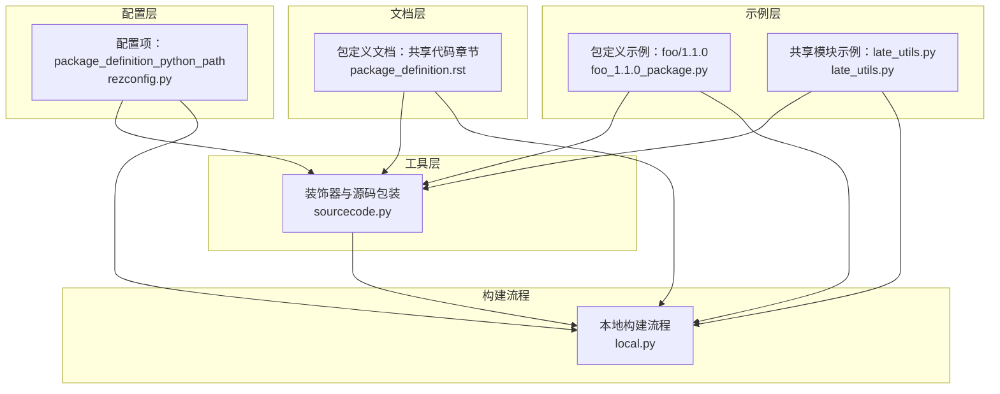
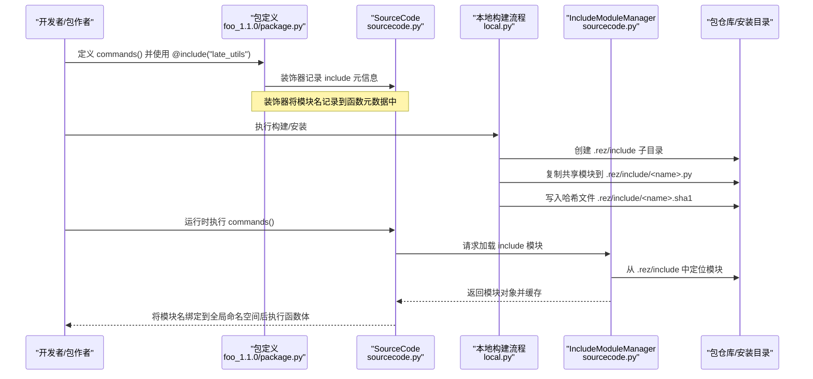
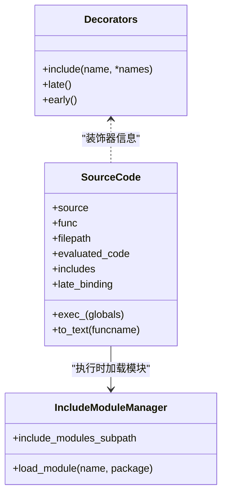
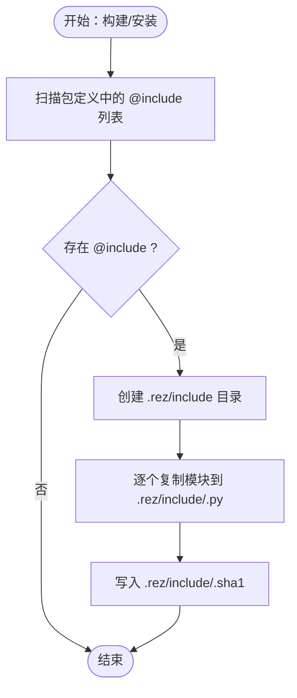
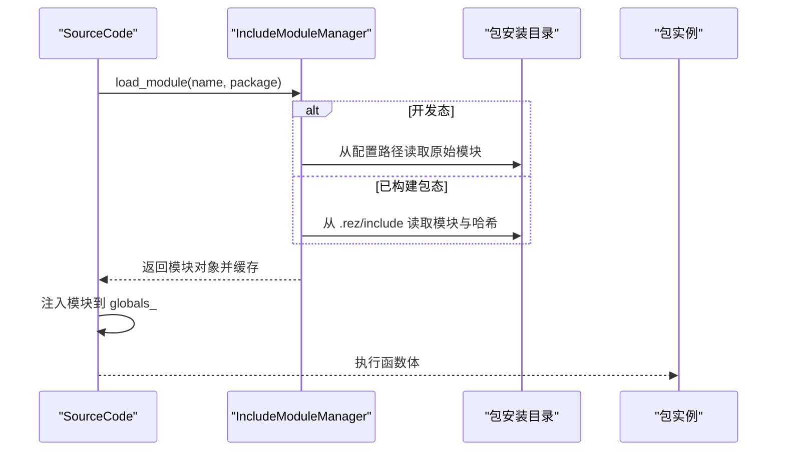
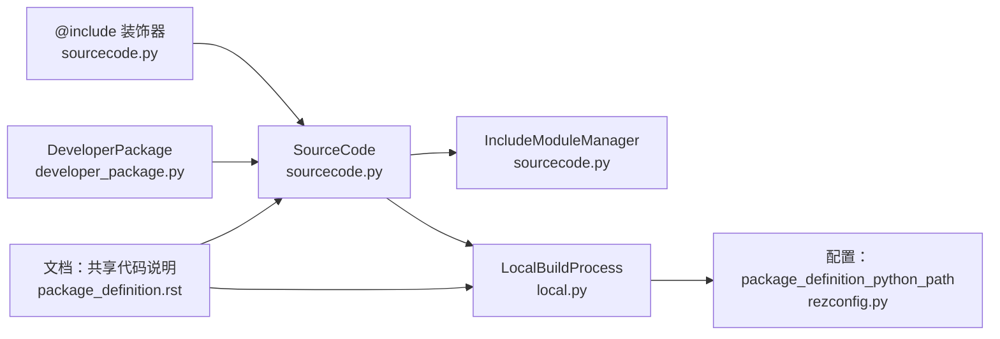

# 代码共享

<cite>
**本文引用的文件**
- [sourcecode.py](file://rez-3.3.0/src/rez/utils/sourcecode.py)
- [developer_package.py](file://rez-3.3.0/src/rez/developer_package.py)
- [local.py](file://rez-3.3.0/src/rezplugins/build_process/local.py)
- [package_definition.rst](file://rez-3.3.0/docs/source/package_definition.rst)
- [rezconfig.py](file://rez-3.3.0/src/rez/rezconfig.py)
- [foo_1.1.0_package.py](file://rez-3.3.0/src/rez/data/tests/builds/packages/foo/1.1.0/package.py)
- [late_utils.py](file://rez-3.3.0/src/rez/data/tests/python/late_bind/late_utils.py)
</cite>

## 目录
1. [引言](#引言)
2. [项目结构](#项目结构)
3. [核心组件](#核心组件)
4. [架构总览](#架构总览)
5. [详细组件分析](#详细组件分析)
6. [依赖关系分析](#依赖关系分析)
7. [性能考量](#性能考量)
8. [故障排查指南](#故障排查指南)
9. [结论](#结论)
10. [附录](#附录)

## 引言
本文件系统化阐述在 Rez 包定义中使用 @include 装饰器实现“代码共享”的最佳实践。重点说明：
- @include 如何从共享路径导入模块，并将模块内容嵌入到包定义函数中执行；
- 共享代码的优势（减少重复、提升可维护性）与注意事项（模块自包含性、导入限制）；
- 通过文档示例展示如何组织共享代码库并正确使用 @include 进行模块复用。

## 项目结构
围绕 @include 的实现涉及以下关键模块：
- 工具层：装饰器与源码包装、模块加载管理
- 构建流程：安装阶段复制共享模块到包内
- 配置层：共享模块查找路径
- 文档层：使用说明与注意事项
- 示例层：实际包定义与共享模块

图表来源
- [sourcecode.py](file://rez-3.3.0/src/rez/utils/sourcecode.py#L56-L66)
- [local.py](file://rez-3.3.0/src/rezplugins/build_process/local.py#L286-L312)
- [rezconfig.py](file://rez-3.3.0/src/rez/rezconfig.py#L110-L125)
- [package_definition.rst](file://rez-3.3.0/docs/source/package_definition.rst#L370-L386)
- [foo_1.1.0_package.py](file://rez-3.3.0/src/rez/data/tests/builds/packages/foo/1.1.0/package.py#L11-L17)
- [late_utils.py](file://rez-3.3.0/src/rez/data/tests/python/late_bind/late_utils.py#L1-L3)

章节来源
- [sourcecode.py](file://rez-3.3.0/src/rez/utils/sourcecode.py#L56-L66)
- [local.py](file://rez-3.3.0/src/rezplugins/build_process/local.py#L286-L312)
- [rezconfig.py](file://rez-3.3.0/src/rez/rezconfig.py#L110-L125)
- [package_definition.rst](file://rez-3.3.0/docs/source/package_definition.rst#L370-L386)
- [foo_1.1.0_package.py](file://rez-3.3.0/src/rez/data/tests/builds/packages/foo/1.1.0/package.py#L11-L17)
- [late_utils.py](file://rez-3.3.0/src/rez/data/tests/python/late_bind/late_utils.py#L1-L3)

## 核心组件
- @include 装饰器：为包定义函数添加“包含”元信息，声明需要注入的共享模块名。
- SourceCode：封装函数体与装饰器信息，负责生成可执行代码文本并在运行时绑定 @include 模块。
- IncludeModuleManager：按包基路径下的固定子目录复制并缓存共享模块，支持开发态与已构建包态两种加载路径。
- LocalBuildProcess：在安装阶段将共享模块复制到包安装目录的固定子路径下，确保包自包含。
- 配置项 package_definition_python_path：指定共享模块的查找根路径。
- 文档与示例：提供使用说明、注意事项与最小可用示例。

章节来源
- [sourcecode.py](file://rez-3.3.0/src/rez/utils/sourcecode.py#L56-L66)
- [sourcecode.py](file://rez-3.3.0/src/rez/utils/sourcecode.py#L90-L247)
- [sourcecode.py](file://rez-3.3.0/src/rez/utils/sourcecode.py#L290-L361)
- [local.py](file://rez-3.3.0/src/rezplugins/build_process/local.py#L286-L312)
- [rezconfig.py](file://rez-3.3.0/src/rez/rezconfig.py#L110-L125)
- [package_definition.rst](file://rez-3.3.0/docs/source/package_definition.rst#L370-L386)
- [foo_1.1.0_package.py](file://rez-3.3.0/src/rez/data/tests/builds/packages/foo/1.1.0/package.py#L11-L17)
- [late_utils.py](file://rez-3.3.0/src/rez/data/tests/python/late_bind/late_utils.py#L1-L3)

## 架构总览
下面的序列图展示了从包定义到共享模块被复制进包、再到运行时注入并执行的关键流程。

图表来源
- [foo_1.1.0_package.py](file://rez-3.3.0/src/rez/data/tests/builds/packages/foo/1.1.0/package.py#L11-L17)
- [sourcecode.py](file://rez-3.3.0/src/rez/utils/sourcecode.py#L90-L247)
- [sourcecode.py](file://rez-3.3.0/src/rez/utils/sourcecode.py#L290-L361)
- [local.py](file://rez-3.3.0/src/rezplugins/build_process/local.py#L286-L312)

## 详细组件分析

### @include 装饰器与 SourceCode
- @include 接收一个或多个模块名，将其记录在函数元数据中，供 SourceCode 在编译与执行阶段识别。
- SourceCode 负责：
  - 提取函数体与装饰器信息；
  - 生成带装饰器的可执行代码文本；
  - 在执行前根据包上下文加载 @include 模块并注入到全局命名空间；
  - 编译并执行函数体，返回结果。

图表来源
- [sourcecode.py](file://rez-3.3.0/src/rez/utils/sourcecode.py#L56-L66)
- [sourcecode.py](file://rez-3.3.0/src/rez/utils/sourcecode.py#L90-L247)
- [sourcecode.py](file://rez-3.3.0/src/rez/utils/sourcecode.py#L290-L361)

章节来源
- [sourcecode.py](file://rez-3.3.0/src/rez/utils/sourcecode.py#L56-L66)
- [sourcecode.py](file://rez-3.3.0/src/rez/utils/sourcecode.py#L90-L247)
- [sourcecode.py](file://rez-3.3.0/src/rez/utils/sourcecode.py#L290-L361)

### 构建期复制共享模块
- LocalBuildProcess 在安装阶段扫描包定义中声明的 @include 模块集合；
- 将这些模块从配置的共享路径复制到包安装目录的固定子路径下；
- 同时写入模块的哈希文件，用于运行时定位与缓存。

图表来源
- [local.py](file://rez-3.3.0/src/rezplugins/build_process/local.py#L286-L312)

章节来源
- [local.py](file://rez-3.3.0/src/rezplugins/build_process/local.py#L286-L312)

### 运行时模块加载与注入
- IncludeModuleManager 根据包类型选择加载路径：
  - 开发态：从配置的共享路径直接加载；
  - 已构建包态：从包安装目录的固定子路径加载；
- 加载时计算哈希并缓存模块，避免重复 IO；
- SourceCode.exec_ 在执行前将模块注入到全局命名空间，使包定义函数可直接调用共享模块。

图表来源
- [sourcecode.py](file://rez-3.3.0/src/rez/utils/sourcecode.py#L290-L361)
- [sourcecode.py](file://rez-3.3.0/src/rez/utils/sourcecode.py#L206-L229)

章节来源
- [sourcecode.py](file://rez-3.3.0/src/rez/utils/sourcecode.py#L206-L229)
- [sourcecode.py](file://rez-3.3.0/src/rez/utils/sourcecode.py#L290-L361)

### 配置与文档要点
- 配置项 package_definition_python_path 指定共享模块根路径；未设置时会触发错误。
- 文档明确指出：模块会被复制到包安装目录，包保持自包含；但这些模块本身不能以同样方式再导入其他共享模块。

章节来源
- [rezconfig.py](file://rez-3.3.0/src/rez/rezconfig.py#L110-L125)
- [package_definition.rst](file://rez-3.3.0/docs/source/package_definition.rst#L370-L386)

### 示例：在 commands 函数中使用 @include
- 包定义中通过 @include("late_utils") 声明使用共享模块；
- 在 commands() 中直接调用共享模块导出的函数；
- 共享模块位于配置的 package_definition_python_path 下。

章节来源
- [foo_1.1.0_package.py](file://rez-3.3.0/src/rez/data/tests/builds/packages/foo/1.1.0/package.py#L11-L17)
- [late_utils.py](file://rez-3.3.0/src/rez/data/tests/python/late_bind/late_utils.py#L1-L3)

## 依赖关系分析
- 耦合关系
  - SourceCode 依赖 IncludeModuleManager 以完成运行时模块注入；
  - LocalBuildProcess 依赖配置项与包定义中的 @include 列表，负责构建期复制；
  - DeveloperPackage 在预处理阶段收集 @include 列表并校验路径有效性；
  - 文档与配置共同约束 @include 的使用边界。
- 内聚性
  - 每个组件职责清晰：装饰器解析、源码包装、模块加载、构建复制、配置与文档约束。

图表来源
- [sourcecode.py](file://rez-3.3.0/src/rez/utils/sourcecode.py#L56-L66)
- [sourcecode.py](file://rez-3.3.0/src/rez/utils/sourcecode.py#L90-L247)
- [sourcecode.py](file://rez-3.3.0/src/rez/utils/sourcecode.py#L290-L361)
- [local.py](file://rez-3.3.0/src/rezplugins/build_process/local.py#L286-L312)
- [developer_package.py](file://rez-3.3.0/src/rez/developer_package.py#L121-L135)
- [rezconfig.py](file://rez-3.3.0/src/rez/rezconfig.py#L110-L125)
- [package_definition.rst](file://rez-3.3.0/docs/source/package_definition.rst#L370-L386)

章节来源
- [sourcecode.py](file://rez-3.3.0/src/rez/utils/sourcecode.py#L56-L66)
- [sourcecode.py](file://rez-3.3.0/src/rez/utils/sourcecode.py#L90-L247)
- [sourcecode.py](file://rez-3.3.0/src/rez/utils/sourcecode.py#L290-L361)
- [local.py](file://rez-3.3.0/src/rezplugins/build_process/local.py#L286-L312)
- [developer_package.py](file://rez-3.3.0/src/rez/developer_package.py#L121-L135)
- [rezconfig.py](file://rez-3.3.0/src/rez/rezconfig.py#L110-L125)
- [package_definition.rst](file://rez-3.3.0/docs/source/package_definition.rst#L370-L386)

## 性能考量
- 模块缓存：IncludeModuleManager 使用哈希作为键缓存已加载模块，避免重复 IO 与解析。
- 构建期复制：一次性复制共享模块到包安装目录，运行时无需跨网络访问共享路径。
- 装饰器解析：SourceCode 仅解析当前文件内的装饰器，降低解析成本。
- 注意：共享模块不可再次使用 @include 导入其他共享模块，避免循环与复杂依赖链。

章节来源
- [sourcecode.py](file://rez-3.3.0/src/rez/utils/sourcecode.py#L347-L356)
- [sourcecode.py](file://rez-3.3.0/src/rez/utils/sourcecode.py#L290-L361)
- [package_definition.rst](file://rez-3.3.0/docs/source/package_definition.rst#L370-L386)

## 故障排查指南
- 未配置共享路径
  - 现象：使用 @include 时报错，提示未配置 package_definition_python_path。
  - 处理：在配置中设置 package_definition_python_path 指向共享模块根目录。
- 模块不存在
  - 现象：声明的模块名在共享路径下找不到。
  - 处理：确认模块文件名与路径一致，且扩展名为 .py。
- 包安装后模块缺失
  - 现象：包已安装但 .rez/include 下缺少模块或哈希文件。
  - 处理：检查构建日志，确认 LocalBuildProcess 是否成功复制；核对包定义中的 @include 列表。
- 运行时无法注入模块
  - 现象：SourceCode.exec_ 报错，无法绑定模块到全局命名空间。
  - 处理：确认 IncludeModuleManager 能从包安装目录正确读取模块与哈希；检查缓存键是否匹配。

章节来源
- [developer_package.py](file://rez-3.3.0/src/rez/developer_package.py#L155-L175)
- [local.py](file://rez-3.3.0/src/rezplugins/build_process/local.py#L286-L312)
- [sourcecode.py](file://rez-3.3.0/src/rez/utils/sourcecode.py#L206-L229)

## 结论
- @include 通过“复制+注入”的方式在包定义函数中复用共享代码，既保证了包的自包含性，又减少了重复代码。
- 最佳实践包括：集中管理共享模块、严格设置共享路径、避免在共享模块中再次使用 @include 导入其他共享模块。
- 若需进一步增强可维护性，可在团队内建立共享模块规范与示例模板，配合文档与 CI 校验。

## 附录
- 组织共享代码库建议
  - 在统一路径下按功能域划分共享模块，例如环境变量设置、工具函数等；
  - 为每个共享模块编写简要注释与最小示例，便于复用；
  - 在包定义中仅声明必要的模块名，避免不必要的复制。
- 使用 @include 的注意事项
  - 共享模块必须是纯 Python 文件，且不依赖其他以 @include 方式管理的模块；
  - 包安装后对原始共享模块的修改不会影响已安装包的行为；
  - 若需要更复杂的模块化，建议采用标准 Python 包结构并通过构建系统安装到包内，而非依赖 @include。

章节来源
- [package_definition.rst](file://rez-3.3.0/docs/source/package_definition.rst#L370-L386)
- [foo_1.1.0_package.py](file://rez-3.3.0/src/rez/data/tests/builds/packages/foo/1.1.0/package.py#L11-L17)
- [late_utils.py](file://rez-3.3.0/src/rez/data/tests/python/late_bind/late_utils.py#L1-L3)