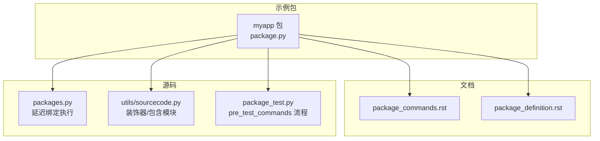
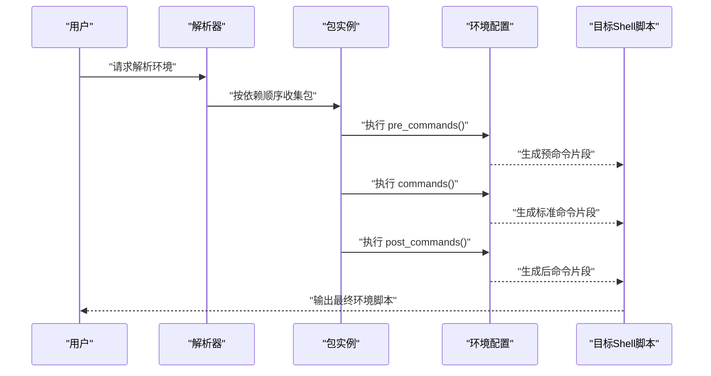
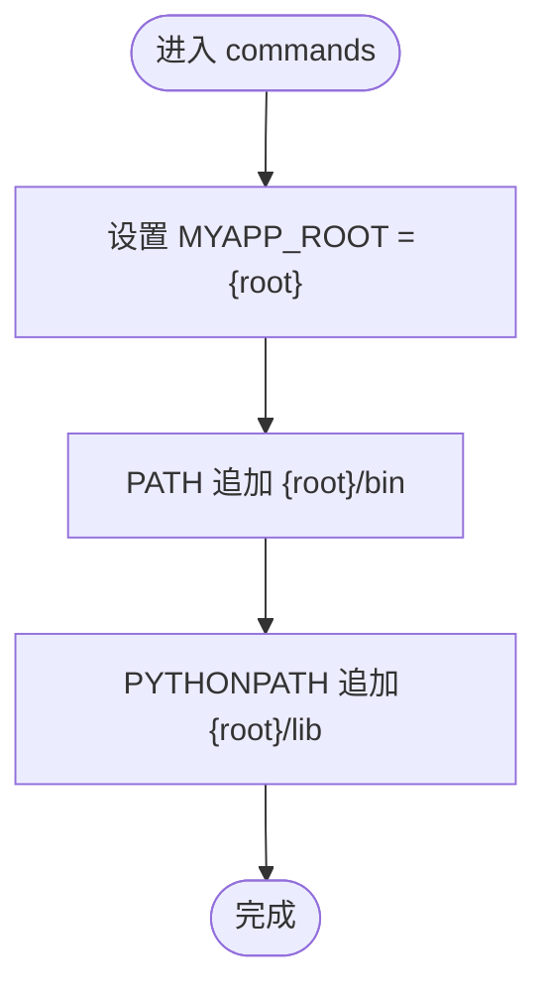
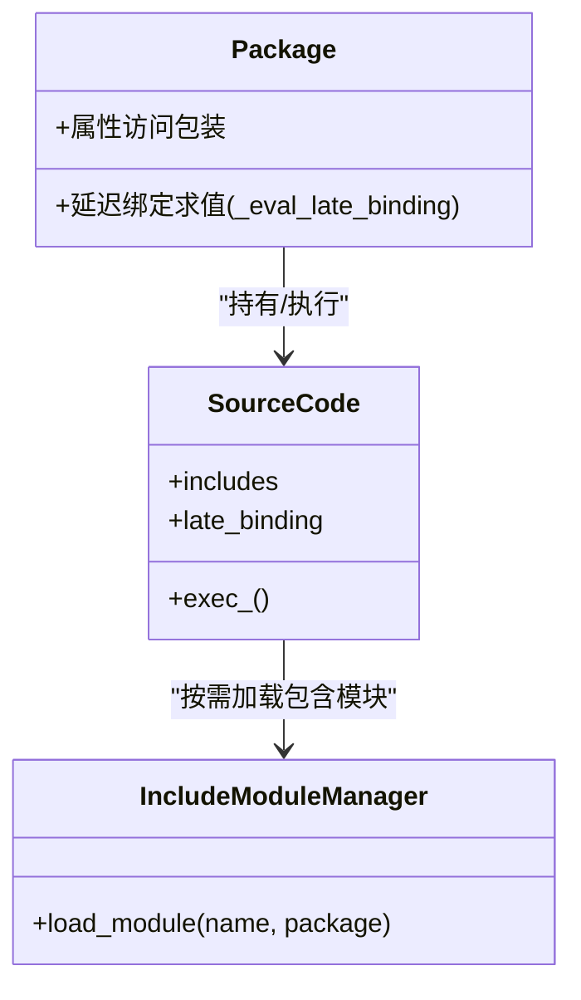
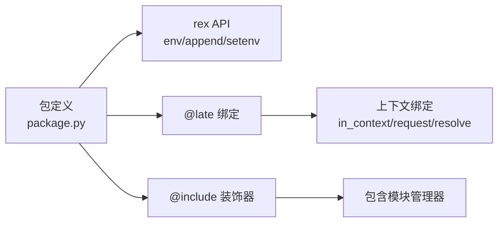

# 命令 (commands)

<cite>
**本文引用的文件**
- [myapp 包定义](file://my_packages/myapp/1.0.0/package.py)
- [包命令文档](file://rez-3.3.0/docs/source/package_commands.rst)
- [包定义与绑定函数文档](file://rez-3.3.0/docs/source/package_definition.rst)
- [包命令执行顺序示例](file://rez-3.3.0/docs/source/package_commands.rst)
- [早期绑定函数示例](file://rez-3.3.0/src/rez/data/tests/commands/py_packages/late_binding/1.0/package.py)
- [包属性包装与延迟绑定执行](file://rez-3.3.0/src/rez/packages.py)
- [源码包装与装饰器处理](file://rez-3.3.0/src/rez/utils/sourcecode.py)
- [包含模块管理器](file://rez-3.3.0/src/rez/utils/sourcecode.py)
- [测试前命令执行流程](file://rez-3.3.0/src/rez/package_test.py)
</cite>

## 目录
1. [简介](#简介)
2. [项目结构](#项目结构)
3. [核心组件](#核心组件)
4. [架构总览](#架构总览)
5. [详细组件分析](#详细组件分析)
6. [依赖关系分析](#依赖关系分析)
7. [性能考量](#性能考量)
8. [故障排查指南](#故障排查指南)
9. [结论](#结论)
10. [附录](#附录)

## 简介
本节聚焦于 Rez 包定义中的“commands”函数，解释其在环境激活时如何执行，用于修改环境变量（如 PATH、PYTHONPATH），使包内工具与模块在解析后的环境中可用。同时结合 myapp 示例，说明 env 对象的用法（如 env.PATH.append）与 {root} 变量的替换机制；并基于文档中的 pre_commands、post_commands、pre_build_commands、pre_test_commands，阐述命令执行的多个阶段及其应用场景。最后讨论 @late() 绑定与 @early() 绑定在性能与功能上的权衡，并给出使用 @include 共享代码的最佳实践。

## 项目结构
- my_packages/myapp/1.0.0/package.py 定义了一个最小化的包，其中包含 commands 函数，演示了如何设置 MYAPP_ROOT、PATH、PYTHONPATH。
- 文档目录下有两份关键文档：
  - package_commands.rst：详细说明命令执行顺序、变量追加/前置、字符串展开、预/后命令等。
  - package_definition.rst：说明早期绑定（@early）与延迟绑定（@late）的区别及适用场景。
- 源码中与命令执行、绑定与共享代码相关的关键模块：
  - packages.py：封装包属性访问与延迟绑定求值。
  - utils/sourcecode.py：装饰器与包含模块管理（@include、@late 等）。
  - package_test.py：测试前命令执行流程，体现 pre_test_commands 的调用时机。



图表来源
- [myapp 包定义](file://my_packages/myapp/1.0.0/package.py#L1-L33)
- [包命令文档](file://rez-3.3.0/docs/source/package_commands.rst#L1-L120)
- [包定义与绑定函数文档](file://rez-3.3.0/docs/source/package_definition.rst#L76-L275)
- [包属性包装与延迟绑定执行](file://rez-3.3.0/src/rez/packages.py#L140-L200)
- [源码包装与装饰器处理](file://rez-3.3.0/src/rez/utils/sourcecode.py#L150-L200)
- [测试前命令执行流程](file://rez-3.3.0/src/rez/package_test.py#L446-L467)

章节来源
- [myapp 包定义](file://my_packages/myapp/1.0.0/package.py#L1-L33)
- [包命令文档](file://rez-3.3.0/docs/source/package_commands.rst#L1-L120)
- [包定义与绑定函数文档](file://rez-3.3.0/docs/source/package_definition.rst#L76-L275)

## 核心组件
- commands 函数：在环境激活时被解释为 shell 代码并执行，负责设置 PATH、PYTHONPATH 等环境变量，使包内工具与模块可用。
- env 对象：用于设置/追加/前置环境变量，支持字符串展开（如 {root}）。
- {root} 变量：在命令解释过程中会被替换为包的安装根路径。
- 预/后命令：
  - pre_commands：在标准命令之前执行，适用于全局初始化。
  - post_commands：在标准命令之后执行，适用于收尾或覆盖。
  - pre_build_commands：构建前执行，适用于向构建系统传递信息。
  - pre_test_commands：测试前执行，适用于测试环境准备。
- 绑定函数：
  - @early()：构建时求值，适合静态计算或仅依赖包元数据的属性。
  - @late()：首次访问时惰性求值并缓存，适合动态依赖上下文或环境变量的属性。
- @include 装饰器：允许在包定义中包含共享模块，便于复用逻辑。

章节来源
- [包命令文档](file://rez-3.3.0/docs/source/package_commands.rst#L1-L120)
- [包命令文档](file://rez-3.3.0/docs/source/package_commands.rst#L215-L280)
- [包定义与绑定函数文档](file://rez-3.3.0/docs/source/package_definition.rst#L76-L275)
- [包含模块管理器](file://rez-3.3.0/src/rez/utils/sourcecode.py#L290-L349)

## 架构总览
下面的序列图展示了从包定义到命令执行的关键流程，包括命令解释、变量展开、以及不同阶段命令的执行顺序。



图表来源
- [包命令文档](file://rez-3.3.0/docs/source/package_commands.rst#L215-L280)
- [包命令文档](file://rez-3.3.0/docs/source/package_commands.rst#L39-L110)

章节来源
- [包命令文档](file://rez-3.3.0/docs/source/package_commands.rst#L39-L110)
- [包命令文档](file://rez-3.3.0/docs/source/package_commands.rst#L215-L280)

## 详细组件分析

### commands 函数与 env 对象
- 在 myapp 示例中，commands 函数通过 env 对象设置 MYAPP_ROOT、PATH 与 PYTHONPATH，使用 {root} 替换为包安装根路径。
- env 对象支持对路径类变量进行追加/前置，且在 PATH 上有特殊处理：首次追加会覆盖而非直接拼接，以避免污染旧值；随后再将系统 PATH 追回，确保基本工具可用。
- 字符串展开支持对象展开（如 {this.root}）与环境变量展开（如 $VAR 或 ${VAR}），并提供 literal/expandable/expandvars 控制展开行为。



图表来源
- [myapp 包定义](file://my_packages/myapp/1.0.0/package.py#L16-L23)
- [包命令文档](file://rez-3.3.0/docs/source/package_commands.rst#L1-L120)

章节来源
- [myapp 包定义](file://my_packages/myapp/1.0.0/package.py#L16-L23)
- [包命令文档](file://rez-3.3.0/docs/source/package_commands.rst#L1-L120)

### {root} 变量替换机制
- {root} 在命令解释时被替换为包的安装根路径（this.root）。文档还指出，对象展开通常发生在传入 rex 函数或 env 对象赋值时，也可通过 expandvars 显式展开。
- 为避免跨平台路径分隔符问题，建议使用 POSIX 风格路径并在必要时依赖自动规范化。

章节来源
- [包命令文档](file://rez-3.3.0/docs/source/package_commands.rst#L103-L215)

### 命令执行的三个阶段
- 预命令（pre_commands）：在所有包的标准命令之前执行，适合全局初始化或清理。
- 标准命令（commands）：按请求顺序与依赖关系执行，是环境配置的核心。
- 后命令（post_commands）：在所有包的标准命令之后执行，适合收尾或覆盖默认行为。

```mermaid
sequenceDiagram
participant P as "包A"
participant Q as "包B"
participant R as "包C"
Note over P,Q,R : "执行顺序：先依赖，再请求顺序"
P->>P : "pre_commands()"
Q->>Q : "pre_commands()"
R->>R : "pre_commands()"
P->>P : "commands()"
Q->>Q : "commands()"
R->>R : "commands()"
P->>P : "post_commands()"
Q->>Q : "post_commands()"
R->>R : "post_commands()"
```

图表来源
- [包命令文档](file://rez-3.3.0/docs/source/package_commands.rst#L39-L110)
- [包命令文档](file://rez-3.3.0/docs/source/package_commands.rst#L215-L280)

章节来源
- [包命令文档](file://rez-3.3.0/docs/source/package_commands.rst#L39-L110)
- [包命令文档](file://rez-3.3.0/docs/source/package_commands.rst#L215-L280)

### 构建与测试阶段的命令
- 构建前命令（pre_build_commands）：在构建开始前执行，可访问 build 对象（含 install/install_path/build_type 等）。
- 测试前命令（pre_test_commands）：在测试执行前调用，可访问 test 对象（含 name 等）。

章节来源
- [包命令文档](file://rez-3.3.0/docs/source/package_commands.rst#L231-L280)
- [测试前命令执行流程](file://rez-3.3.0/src/rez/package_test.py#L446-L467)

### @late() 与 @early() 绑定的权衡
- @early()：构建时求值，适合静态计算或仅依赖包元数据的属性，避免运行时开销。
- @late()：首次访问时惰性求值并缓存，适合依赖上下文（如 in_context、request、resolve）或环境变量的动态属性。
- 文档强调：@late 绑定函数必须在函数内部导入所需模块；@early 绑定函数不可引用其他早/晚绑定属性。



图表来源
- [包属性包装与延迟绑定执行](file://rez-3.3.0/src/rez/packages.py#L140-L200)
- [源码包装与装饰器处理](file://rez-3.3.0/src/rez/utils/sourcecode.py#L150-L200)
- [包含模块管理器](file://rez-3.3.0/src/rez/utils/sourcecode.py#L290-L349)

章节来源
- [包定义与绑定函数文档](file://rez-3.3.0/docs/source/package_definition.rst#L76-L275)
- [包属性包装与延迟绑定执行](file://rez-3.3.0/src/rez/packages.py#L140-L200)
- [源码包装与装饰器处理](file://rez-3.3.0/src/rez/utils/sourcecode.py#L150-L200)

### 使用 @include 共享代码的最佳实践
- 通过 @include("模块名") 将共享模块引入包定义，模块源文件会被复制到包安装包中，保证包自包含且不受外部变化影响。
- 文档建议使用 package_definition_python_path 配置暴露共享模块；@include 依赖此路径加载模块。
- 注意：被 @include 的模块不会自动导入，且它们自身不能再次通过 @include 引用其他模块（受实现限制）。

章节来源
- [包定义与绑定函数文档](file://rez-3.3.0/docs/source/package_definition.rst#L365-L397)
- [包含模块管理器](file://rez-3.3.0/src/rez/utils/sourcecode.py#L290-L349)

## 依赖关系分析
- 包定义中的 commands 依赖于 rex 执行语言（env 对象、append/prepend、setenv 等）。
- 延迟绑定（@late）依赖于包实例的上下文（in_context、request、resolve 等）。
- 共享代码（@include）依赖于包含模块管理器与包基础路径下的复制模块。



图表来源
- [包命令文档](file://rez-3.3.0/docs/source/package_commands.rst#L300-L796)
- [包定义与绑定函数文档](file://rez-3.3.0/docs/source/package_definition.rst#L76-L275)
- [包含模块管理器](file://rez-3.3.0/src/rez/utils/sourcecode.py#L290-L349)

章节来源
- [包命令文档](file://rez-3.3.0/docs/source/package_commands.rst#L300-L796)
- [包定义与绑定函数文档](file://rez-3.3.0/docs/source/package_definition.rst#L76-L275)
- [包含模块管理器](file://rez-3.3.0/src/rez/utils/sourcecode.py#L290-L349)

## 性能考量
- @early()：构建时一次性求值，避免运行时重复计算，适合静态或仅依赖包元数据的属性。
- @late()：惰性求值并缓存，适合动态属性（如依赖环境变量或上下文），但每次首次访问会有轻微开销。
- 延迟绑定执行时会注入上下文绑定（如 in_context/context/request/system 等），这些对象的构造与绑定可能带来额外成本，应避免在 @late 中做不必要的重计算。
- 共享模块通过复制到包内，避免外部依赖变化带来的不确定性，但也会增加包体积与加载时间。

章节来源
- [包定义与绑定函数文档](file://rez-3.3.0/docs/source/package_definition.rst#L76-L275)
- [包属性包装与延迟绑定执行](file://rez-3.3.0/src/rez/packages.py#L140-L200)
- [包含模块管理器](file://rez-3.3.0/src/rez/utils/sourcecode.py#L290-L349)

## 故障排查指南
- PATH 行为异常：首次追加 PATH 会覆盖而非拼接，随后再追回系统 PATH。若出现工具缺失，请检查是否被覆盖或未追回系统路径。
- 跨平台路径问题：使用 POSIX 风格路径（正斜杠），避免使用 os.pathsep 或硬编码列表（如 {root}/foo:{root}/bah）。
- 字符串展开不生效：确认字符串是否传入 rex 函数或 env 对象赋值；如需显式展开，使用 expandvars 或 expandable。
- @late 导入错误：确保在 @late 函数内部导入所需模块，而非在文件顶部导入。
- @early 属性引用：不要在 @early 函数中引用其他早/晚绑定属性，否则会触发错误。
- @include 模块未找到：检查 package_definition_python_path 配置与模块文件是否存在；确认模块已复制到包内（.rez/include）。

章节来源
- [包命令文档](file://rez-3.3.0/docs/source/package_commands.rst#L70-L215)
- [包命令文档](file://rez-3.3.0/docs/source/package_commands.rst#L300-L796)
- [包定义与绑定函数文档](file://rez-3.3.0/docs/source/package_definition.rst#L76-L275)
- [包含模块管理器](file://rez-3.3.0/src/rez/utils/sourcecode.py#L290-L349)

## 结论
commands 函数是 Rez 包环境激活的核心，通过 env 对象与 {root} 展开机制，将包内的工具与模块纳入解析后的环境。配合 pre_commands/post_commands，可实现更精细的环境初始化与收尾。@early 与 @late 绑定分别服务于构建期静态计算与运行期动态计算，应根据场景选择以平衡性能与灵活性。@include 提供了共享代码的便捷方式，但需注意模块复制与导入限制。遵循文档建议与最佳实践，可显著提升包的可移植性与可维护性。

## 附录
- myapp 示例展示了最简 commands 用法：设置 MYAPP_ROOT、PATH 与 PYTHONPATH，并使用 {root}。
- 早期绑定函数示例展示了 @late() 与 @early() 的混用，便于理解两者差异。

章节来源
- [myapp 包定义](file://my_packages/myapp/1.0.0/package.py#L16-L23)
- [早期绑定函数示例](file://rez-3.3.0/src/rez/data/tests/commands/py_packages/late_binding/1.0/package.py#L1-L10)