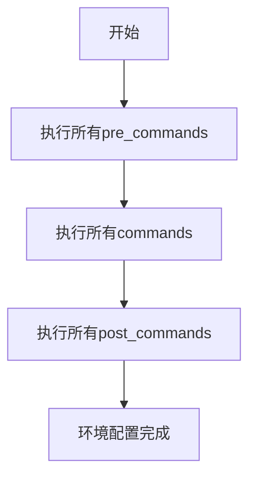

# 命令执行阶段

<cite>
**本文档引用的文件**   
- [package_commands.rst](file://rez-3.3.0\docs\source\package_commands.rst)
- [package_definition.rst](file://rez-3.3.0\docs\source\package_definition.rst)
- [resolved_context.py](file://rez-3.3.0\src\rez\resolved_context.py)
- [package.py](file://my_packages\myapp\1.0.0\package.py)
- [package.py](file://my_packages\maya\2022\package.py)
</cite>

## 目录
1. [引言](#引言)
2. [命令执行的三个阶段](#命令执行的三个阶段)
3. [执行顺序详解](#执行顺序详解)
4. [应用场景与最佳实践](#应用场景与最佳实践)
5. [实际示例分析](#实际示例分析)
6. [总结](#总结)

## 引言
在Rez包管理系统中，`commands`函数是定义包如何配置环境的核心机制。为了提供更灵活的环境配置能力，Rez引入了三个执行阶段：`pre_commands`、`commands`和`post_commands`。这种分阶段执行的设计允许包在环境配置过程中进行更精细的控制，确保环境变量的正确设置和依赖关系的合理处理。

## 命令执行的三个阶段
Rez包管理系统中的命令执行分为三个明确的阶段，每个阶段都有其特定的目的和应用场景。

### pre_commands阶段
`pre_commands`阶段是命令执行的第一个阶段。在这个阶段，所有包的`pre_commands`函数会按照标准执行顺序被调用。这个阶段的主要目的是进行环境的初始化设置，例如设置关键的环境变量或创建必要的目录结构。

### commands阶段
`commands`阶段是命令执行的第二个阶段。在这个阶段，所有包的`commands`函数会按照标准执行顺序被调用。这是最常用的命令执行阶段，通常用于配置包的主要环境变量，如将包的bin目录添加到PATH中，或将python模块路径添加到PYTHONPATH中。

### post_commands阶段
`post_commands`阶段是命令执行的最后一个阶段。在这个阶段，所有包的`post_commands`函数会按照标准执行顺序被调用。这个阶段的主要目的是进行最终的环境调整，例如根据前面阶段设置的环境变量进行进一步的配置。

**Section sources**
- [package_commands.rst](file://rez-3.3.0\docs\source\package_commands.rst#L215-L239)

## 执行顺序详解
命令的执行顺序是Rez包管理系统中的一个关键概念，它确保了环境配置的正确性和一致性。

### 标准执行顺序
命令的执行遵循一个明确的三阶段顺序：
1. 所有包的`pre_commands`被依次执行
2. 所有包的`commands`被依次执行  
3. 所有包的`post_commands`被依次执行

这种分阶段执行的机制确保了环境配置的逻辑性，使得某些配置可以作为其他配置的前提条件。

### 依赖关系的影响
除了上述的三阶段顺序外，包之间的依赖关系也会影响命令的执行顺序。如果包A依赖于包B，那么包B的命令会在包A之前执行，无论它们在请求中的顺序如何。这种机制确保了依赖包的环境配置先于依赖它的包完成。



**Diagram sources**
- [package_commands.rst](file://rez-3.3.0\docs\source\package_commands.rst#L223-L227)

## 应用场景与最佳实践
理解三个执行阶段的应用场景对于正确使用Rez包管理系统至关重要。

### pre_commands的应用场景
`pre_commands`阶段最适合用于环境的初始化工作。例如，设置一些关键的环境变量，这些变量可能会被后续的`commands`阶段使用。一个典型的例子是设置包的根目录路径，以便在后续的配置中引用。

### commands的应用场景
`commands`阶段是最常用的阶段，用于配置包的主要功能。这包括将可执行文件路径添加到PATH中，将库路径添加到相应的环境变量中，以及设置包特定的配置参数。

### post_commands的应用场景
`post_commands`阶段适合用于最终的环境调整。例如，根据前面阶段设置的变量进行条件性配置，或者进行一些清理工作。这个阶段也可以用于设置一些需要在所有其他配置完成后才能确定的环境变量。

**Section sources**
- [package_definition.rst](file://rez-3.3.0\docs\source\package_definition.rst#L761-L783)

## 实际示例分析
通过具体的代码示例，我们可以更好地理解三个执行阶段的实际应用。

### myapp包的配置
以`myapp`包为例，其`package.py`文件中的配置展示了`commands`阶段的典型用法：

```python
def commands():
    import os
    # 设置环境变量
    env.MYAPP_ROOT = "{root}"
    env.PATH.append("{root}/bin")
    env.PYTHONPATH.append("{root}/lib")
```

这个配置在`commands`阶段将包的根目录、bin目录和lib目录分别设置到相应的环境变量中。

### 复杂的多阶段配置
考虑一个更复杂的场景，其中需要使用所有三个阶段：

```python
def pre_commands():
    # 初始化环境
    env.INITIAL_SETUP = "true"
    env.TEMP_DIR = "/tmp/myapp"

def commands():
    # 主要配置
    env.MYAPP_HOME = "{root}"
    env.PATH.append("{root}/bin")
    if building:
        env.MYAPP_INCLUDE_PATH = "{root}/include"

def post_commands():
    # 最终调整
    if env.INITIAL_SETUP == "true":
        env.FINAL_SETUP = "completed"
```

这种配置展示了如何在不同阶段进行不同类型的环境设置。

**Section sources**
- [package.py](file://my_packages\myapp\1.0.0\package.py#L16-L21)
- [package.py](file://my_packages\maya\2022\package.py)

## 总结
Rez包管理系统的三阶段命令执行机制提供了一种强大而灵活的环境配置方式。通过将命令执行分为`pre_commands`、`commands`和`post_commands`三个阶段，系统能够确保环境配置的正确顺序和逻辑性。理解并合理利用这三个阶段，可以帮助用户创建更加可靠和可维护的包配置。