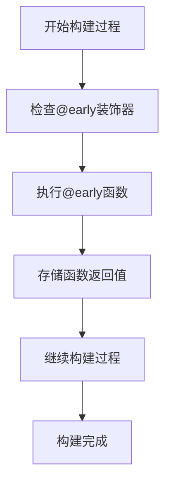
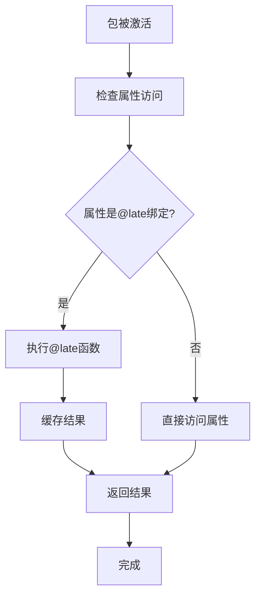
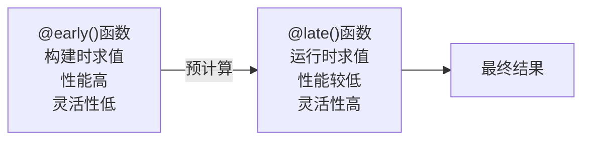

# 绑定模式

<cite>
**本文档中引用的文件**   
- [package_definition.rst](file://rez-3.3.0\docs\source\package_definition.rst)
- [sourcecode.py](file://rez-3.3.0\src\rez\utils\sourcecode.py)
- [packages.py](file://rez-3.3.0\src\rez\packages.py)
- [serialise.py](file://rez-3.3.0\src\rez\serialise.py)
- [late_binding\1.0\package.py](file://rez-3.3.0\src\rez\data\tests\packages\py_packages\late_binding\1.0\package.py)
</cite>

## 目录
1. [简介](#简介)
2. [@early()绑定模式](#early绑定模式)
3. [@late()绑定模式](#late绑定模式)
4. 性能影响与权衡
5. 使用场景与最佳实践
6. 结论

## 简介
在Rez包管理系统中，@early()和@late()是两种关键的绑定模式，用于定义包属性的求值时机。这两种模式在环境解析性能、功能灵活性和使用场景上有着显著的差异和权衡。@early()绑定在构建时求值，将函数执行结果固化为属性值；而@late()绑定则延迟执行，在属性首次被访问时才进行求值。本文档将详细分析这两种绑定模式在commands函数中的应用和性能影响，解释它们的特点和适用场景。

**Section sources**
- [package_definition.rst](file://rez-3.3.0\docs\source\package_definition.rst#L46-L244)

## @early()绑定模式
@early()绑定模式使用@early装饰器，其函数在构建时（build time）进行求值。这意味着函数的执行发生在解析发生之前，且在构建环境构建之前。因此，@early绑定函数具有一些重要特性：

- **this对象仅暴露包属性**：在@early绑定函数内部，只能访问包的属性，无法访问其他资源。
- **无法访问Rez设置的环境变量**：由于求值发生在环境构建之前，因此无法访问任何Rez设置的环境变量。

@early绑定函数的实现位于`sourcecode.py`文件中，其核心逻辑是通过`setattr(fn, "_early", True)`标记函数，使其在序列化过程中被识别为早期绑定函数。在构建过程中，这些函数会被立即执行，其返回值被存储为包属性的最终值。

**Diagram sources**
- [sourcecode.py](file://rez-3.3.0\src\rez\utils\sourcecode.py#L15-L25)
- [serialise.py](file://rez-3.3.0\src\rez\serialise.py#L321-L348)

**Section sources**
- [sourcecode.py](file://rez-3.3.0\src\rez\utils\sourcecode.py#L15-L25)
- [serialise.py](file://rez-3.3.0\src\rez\serialise.py#L321-L348)

## @late()绑定模式
@late()绑定模式使用@late装饰器，其函数保持为函数形式存储在已安装的包定义中，仅在属性首次被访问时惰性求值。这种模式允许在运行时根据环境状态动态计算属性值。

@late()绑定函数必须在函数内部执行必要的导入操作，而不是在`package.py`文件顶部进行导入。这是因为在运行时环境中，导入的模块可能与构建时不同。

**Diagram sources**
- [sourcecode.py](file://rez-3.3.0\src\rez\utils\sourcecode.py#L28-L52)
- [packages.py](file://rez-3.3.0\src\rez\packages.py#L142-L182)

**Section sources**
- [sourcecode.py](file://rez-3.3.0\src\rez\utils\sourcecode.py#L28-L52)
- [packages.py](file://rez-3.3.0\src\rez\packages.py#L142-L182)

## 性能影响与权衡
@early()和@late()绑定模式在性能上有显著差异：

- **@early()绑定**：由于在构建时求值，运行时无需额外计算，性能开销最小。但灵活性较低，无法根据运行时环境动态调整。
- **@late()绑定**：运行时求值带来一定的性能开销，但提供了更高的灵活性，可以根据环境变量等运行时信息动态计算属性值。

在实际应用中，可以结合使用两种模式来优化性能。例如，可以将静态部分的计算结果通过@early()绑定存储，然后在@late()函数中引用这些预计算结果，只对动态部分进行计算。

**Diagram sources**
- [package_definition.rst](file://rez-3.3.0\docs\source\package_definition.rst#L224-L242)

## 使用场景与最佳实践
选择@early()还是@late()绑定模式应基于具体需求：

- **使用@early()的情况**：当属性值在构建时即可确定，且不会随运行时环境变化时。例如，从版本控制系统获取作者列表。
- **使用@late()的情况**：当属性值依赖于运行时环境变量或需要动态计算时。例如，根据用户角色决定可用工具列表。

最佳实践包括：
1. 尽可能使用@early()绑定以提高性能
2. 在@late()函数中执行必要的导入操作
3. 结合使用两种模式，将静态计算部分@early()化，动态部分保留@late()

**Section sources**
- [package_definition.rst](file://rez-3.3.0\docs\source\package_definition.rst#L224-L242)

## 结论
@early()和@late()绑定模式为Rez包管理系统提供了灵活的属性求值机制。@early()绑定通过在构建时求值提供了最佳性能，而@late()绑定通过延迟执行提供了运行时灵活性。理解这两种模式的特点和权衡，可以帮助开发者根据具体需求选择合适的绑定模式，优化包的构建和环境激活过程。