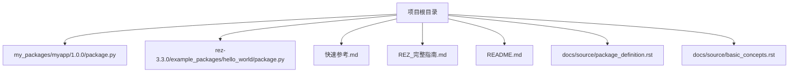
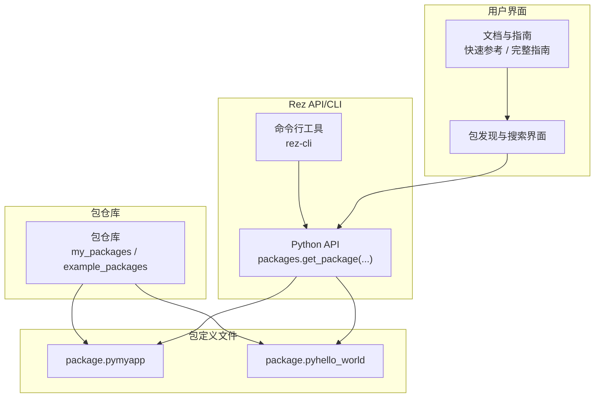
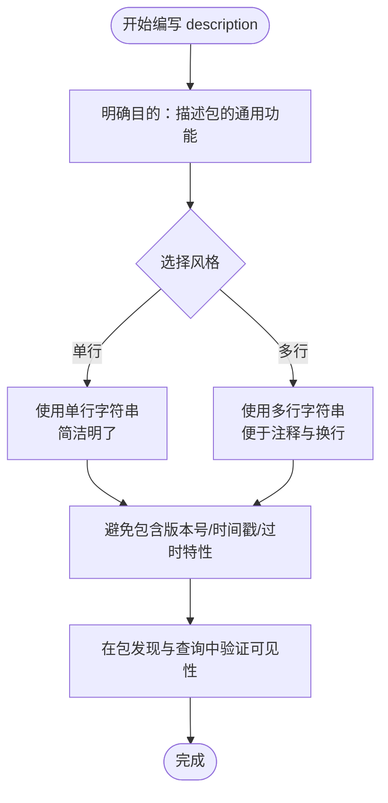
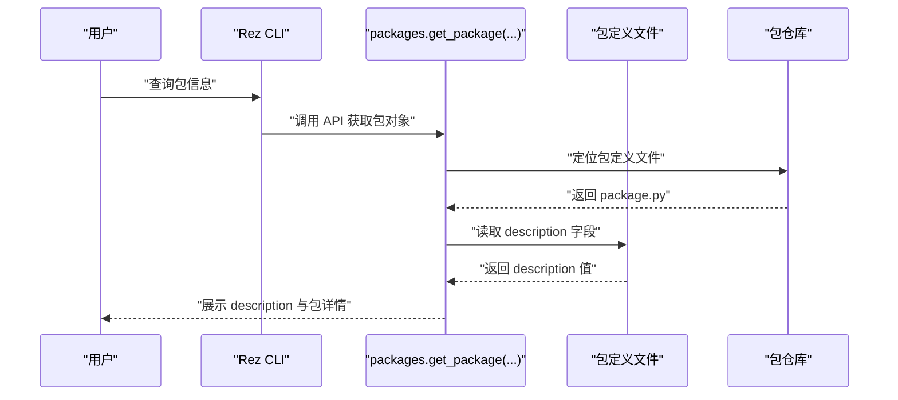
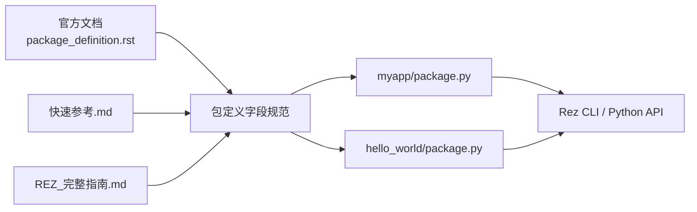

# 描述 (description)

<cite>
**本文引用的文件**
- [README.md](file://README.md)
- [快速参考.md](file://快速参考.md)
- [REZ_完整指南.md](file://REZ_完整指南.md)
- [package.py（myapp）](file://my_packages/myapp/1.0.0/package.py)
- [package.py（hello_world）](file://rez-3.3.0/example_packages/hello_world/package.py)
- [package_definition.rst](file://rez-3.3.0/docs/source/package_definition.rst)
- [basic_concepts.rst](file://rez-3.3.0/docs/source/basic_concepts.rst)
</cite>

## 目录
1. [引言](#引言)
2. [项目结构](#项目结构)
3. [核心组件](#核心组件)
4. [架构总览](#架构总览)
5. [详细组件分析](#详细组件分析)
6. [依赖分析](#依赖分析)
7. [性能考虑](#性能考虑)
8. [故障排查指南](#故障排查指南)
9. [结论](#结论)
10. [附录](#附录)

## 引言
本节聚焦 Rez 包定义中的“描述”字段（description），说明其用途与最佳实践。description 字段用于提供包的概要信息，应描述包的通用功能与用途，而不应包含特定版本细节或过时信息。通过 myapp 与 hello_world 的多行字符串示例，展示如何编写清晰、简洁且对团队协作友好的描述；同时强调良好描述在包发现与维护中的价值，并给出避免版本特定信息的注意事项。

## 项目结构
本仓库包含 Rez 学习与演示资源，以及两个具有典型 description 写法的示例包：
- myapp 包：位于 my_packages/myapp/1.0.0/package.py，提供单行字符串形式的 description。
- hello_world 包：位于 rez-3.3.0/example_packages/hello_world/package.py，提供多行字符串形式的 description。

此外，官方文档与快速参考也提供了 description 的规范与示例。

图表来源
- [package.py（myapp）](file://my_packages/myapp/1.0.0/package.py#L1-L33)
- [package.py（hello_world）](file://rez-3.3.0/example_packages/hello_world/package.py#L1-L29)
- [快速参考.md](file://快速参考.md#L1-L417)
- [REZ_完整指南.md](file://REZ_完整指南.md#L1-L380)
- [README.md](file://README.md#L1-L155)
- [package_definition.rst](file://rez-3.3.0/docs/source/package_definition.rst#L1-L120)
- [basic_concepts.rst](file://rez-3.3.0/docs/source/basic_concepts.rst#L97-L128)

章节来源
- [README.md](file://README.md#L1-L155)
- [快速参考.md](file://快速参考.md#L1-L417)
- [REZ_完整指南.md](file://REZ_完整指南.md#L1-L380)

## 核心组件
- description 字段：在包定义文件中声明，用于提供包的通用描述，帮助用户快速理解包的功能与用途。
- 示例包：
  - myapp：使用单行字符串作为 description，简洁明了。
  - hello_world：使用多行字符串作为 description，更便于扩展与注释。
- 官方规范与示例：
  - 官方文档明确要求 description 不应包含特定版本细节，而应描述包的一般功能。
  - 基本概念文档提供了标准 package.py 示例，其中包含 description 字段。

章节来源
- [package.py（myapp）](file://my_packages/myapp/1.0.0/package.py#L1-L33)
- [package.py（hello_world）](file://rez-3.3.0/example_packages/hello_world/package.py#L1-L29)
- [package_definition.rst](file://rez-3.3.0/docs/source/package_definition.rst#L690-L700)
- [basic_concepts.rst](file://rez-3.3.0/docs/source/basic_concepts.rst#L97-L128)

## 架构总览
下图展示了 Rez 包定义文件与 description 字段的关系，以及如何在包发现与查询中体现 description 的作用。

图表来源
- [package.py（myapp）](file://my_packages/myapp/1.0.0/package.py#L1-L33)
- [package.py（hello_world）](file://rez-3.3.0/example_packages/hello_world/package.py#L1-L29)
- [快速参考.md](file://快速参考.md#L150-L210)
- [REZ_完整指南.md](file://REZ_完整指南.md#L1-L380)

## 详细组件分析

### 组件 A：description 字段的职责与写法
- 职责
  - 提供包的通用功能描述，帮助用户快速判断是否满足需求。
  - 避免包含版本号、时间戳、过时特性等特定细节，以免误导后续维护者。
- 写法示例
  - 单行字符串：myapp 的 description 使用简洁短语，便于在搜索结果中快速识别。
  - 多行字符串：hello_world 的 description 使用三引号包裹的多行字符串，适合需要换行与注释的场景。
- 规范依据
  - 官方文档明确要求 description 描述包的一般功能，不应提及特定版本细节。
  - 基本概念文档提供了标准 package.py 示例，包含 description 字段。

图表来源
- [package.py（myapp）](file://my_packages/myapp/1.0.0/package.py#L1-L33)
- [package.py（hello_world）](file://rez-3.3.0/example_packages/hello_world/package.py#L1-L29)
- [package_definition.rst](file://rez-3.3.0/docs/source/package_definition.rst#L690-L700)
- [basic_concepts.rst](file://rez-3.3.0/docs/source/basic_concepts.rst#L97-L128)

章节来源
- [package.py（myapp）](file://my_packages/myapp/1.0.0/package.py#L1-L33)
- [package.py（hello_world）](file://rez-3.3.0/example_packages/hello_world/package.py#L1-L29)
- [package_definition.rst](file://rez-3.3.0/docs/source/package_definition.rst#L690-L700)
- [basic_concepts.rst](file://rez-3.3.0/docs/source/basic_concepts.rst#L97-L128)

### 组件 B：description 在包发现与查询中的作用
- 包发现
  - 用户通过命令行或 API 查询包信息时，description 会在搜索结果或包详情中显示，帮助快速筛选。
- 查询方式
  - 命令行：使用 Rez CLI 的包信息命令查看 description。
  - Python API：通过 packages.get_package 获取包对象后访问 description 属性。
- 实践建议
  - 保持 description 简洁、准确、与当前版本一致。
  - 避免在 description 中嵌入版本号或过时信息，防止误导使用者。

图表来源
- [快速参考.md](file://快速参考.md#L150-L210)
- [REZ_完整指南.md](file://REZ_完整指南.md#L1-L380)
- [package.py（myapp）](file://my_packages/myapp/1.0.0/package.py#L1-L33)
- [package.py（hello_world）](file://rez-3.3.0/example_packages/hello_world/package.py#L1-L29)

章节来源
- [快速参考.md](file://快速参考.md#L150-L210)
- [REZ_完整指南.md](file://REZ_完整指南.md#L1-L380)

### 组件 C：避免版本特定信息的注意事项
- 不要在 description 中包含：
  - 版本号（如 1.0.0、2022 等）。
  - 时间戳或发布日期。
  - 过时特性或已废弃的实现细节。
- 建议做法：
  - 使用通用描述，突出包的核心能力与适用场景。
  - 若需补充版本相关信息，可在 README 或 changelog 中说明，而非在 description 中重复。

章节来源
- [package_definition.rst](file://rez-3.3.0/docs/source/package_definition.rst#L690-L700)

## 依赖分析
- 包定义文件依赖
  - description 字段依赖于包定义文件的正确编写与安装。
  - Rez CLI 与 Python API 依赖于包定义文件中的字段值进行展示与查询。
- 文档与示例依赖
  - 官方文档与快速参考为 description 的编写提供规范与示例，指导用户正确使用。

图表来源
- [package_definition.rst](file://rez-3.3.0/docs/source/package_definition.rst#L690-L700)
- [快速参考.md](file://快速参考.md#L1-L417)
- [REZ_完整指南.md](file://REZ_完整指南.md#L1-L380)
- [package.py（myapp）](file://my_packages/myapp/1.0.0/package.py#L1-L33)
- [package.py（hello_world）](file://rez-3.3.0/example_packages/hello_world/package.py#L1-L29)

章节来源
- [package_definition.rst](file://rez-3.3.0/docs/source/package_definition.rst#L690-L700)
- [快速参考.md](file://快速参考.md#L1-L417)
- [REZ_完整指南.md](file://REZ_完整指南.md#L1-L380)

## 性能考虑
- description 字段本身不直接影响解析性能，但清晰的描述有助于减少用户在包选择上的试错成本，间接提升整体效率。
- 建议在包定义文件中保持 description 简洁，避免冗长文本导致 UI 展示拥挤。

## 故障排查指南
- 现象：description 未显示或显示为空
  - 检查包定义文件是否正确声明 description 字段。
  - 确认包已安装至包仓库，且 Rez 能够找到该包。
- 现象：description 显示了版本号或过时信息
  - 更新 description，移除版本号与过时特性描述，改为通用功能说明。
- 现象：包搜索结果中 description 不易识别
  - 优化 description 的表达，使其更直观、简洁，突出关键功能。

章节来源
- [快速参考.md](file://快速参考.md#L150-L210)
- [REZ_完整指南.md](file://REZ_完整指南.md#L1-L380)
- [package_definition.rst](file://rez-3.3.0/docs/source/package_definition.rst#L690-L700)

## 结论
description 字段是包元数据的重要组成部分，应专注于描述包的通用功能与用途，避免版本特定信息。通过 myapp 与 hello_world 的示例，可以学习到单行与多行字符串的写法差异；结合官方文档与快速参考，能够写出清晰、有用且利于团队协作的描述。良好的 description 不仅提升包发现体验，也有助于长期维护与知识传承。

## 附录
- 相关文件与路径
  - [myapp 包定义](file://my_packages/myapp/1.0.0/package.py#L1-L33)
  - [hello_world 包定义](file://rez-3.3.0/example_packages/hello_world/package.py#L1-L29)
  - [官方字段规范（description）](file://rez-3.3.0/docs/source/package_definition.rst#L690-L700)
  - [基本概念示例（包含 description）](file://rez-3.3.0/docs/source/basic_concepts.rst#L97-L128)
  - [快速参考（包信息查询）](file://快速参考.md#L150-L210)
  - [完整指南（包创建与属性）](file://REZ_完整指南.md#L1-L380)