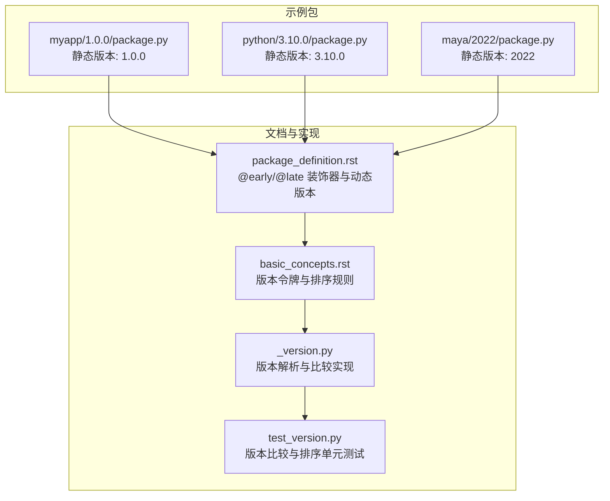
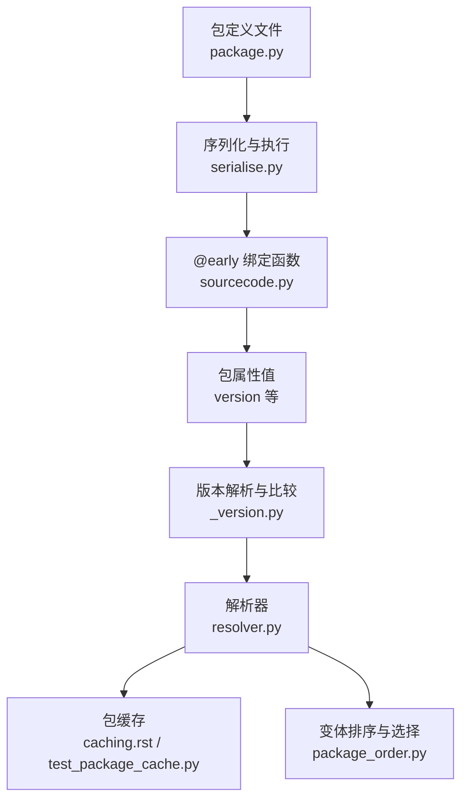
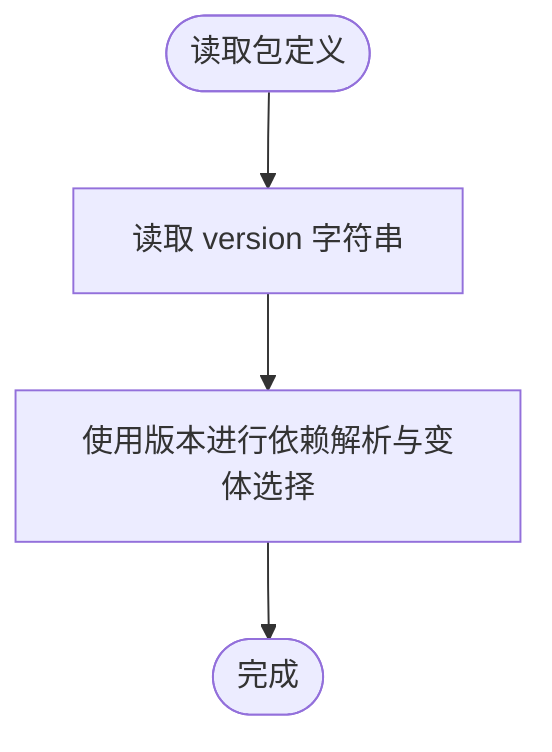
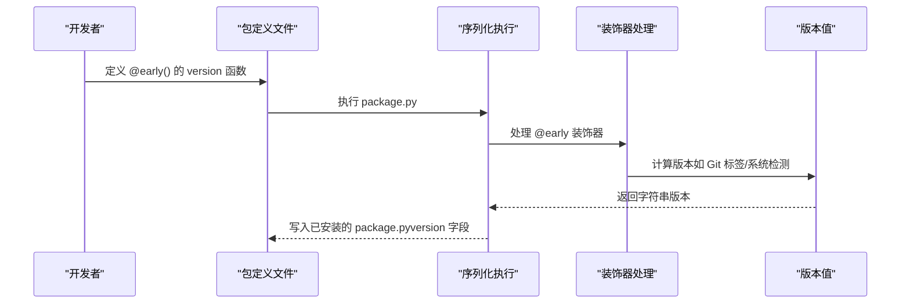
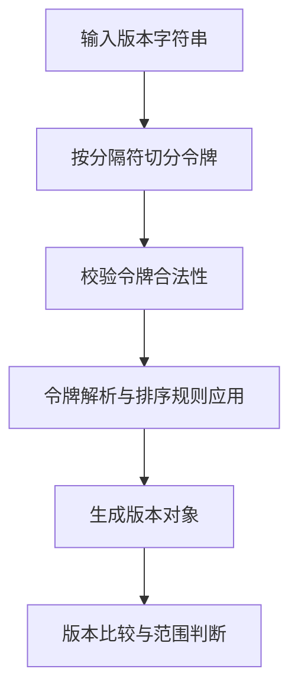
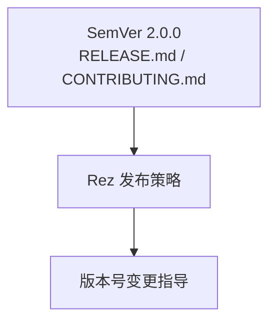
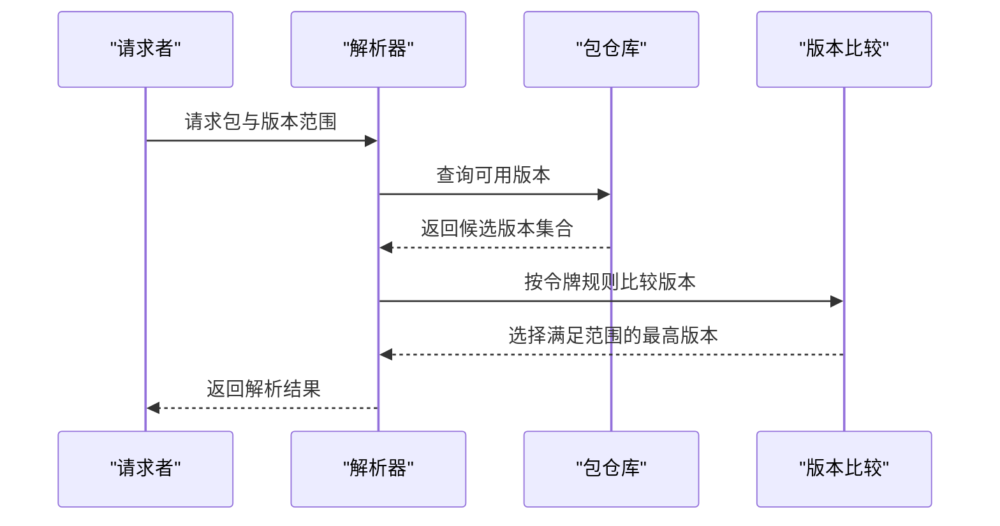
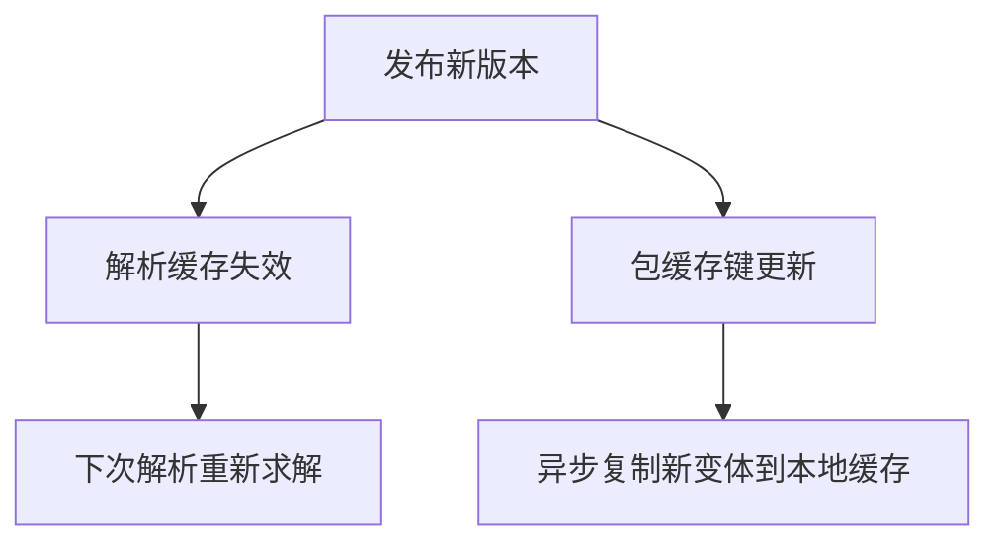
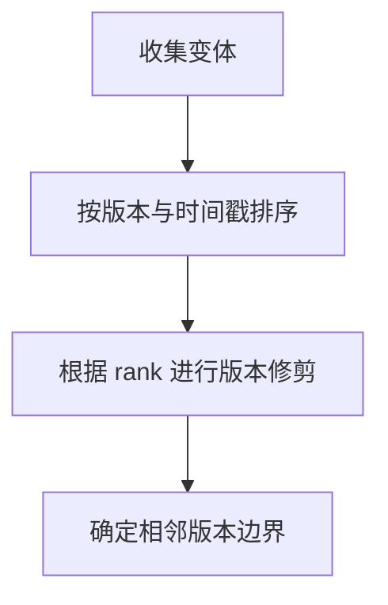

# 版本 (version)

<cite>
**本文引用的文件**
- [myapp/1.0.0/package.py](file://my_packages/myapp/1.0.0/package.py)
- [python/3.10.0/package.py](file://my_packages/python/3.10.0/package.py)
- [maya/2022/package.py](file://my_packages/maya/2022/package.py)
- [package_definition.rst](file://rez-3.3.0/docs/source/package_definition.rst)
- [basic_concepts.rst](file://rez-3.3.0/docs/source/basic_concepts.rst)
- [_version.py](file://rez-3.3.0/src/rez/version/_version.py)
- [test_version.py](file://rez-3.3.0/src/rez/tests/test_version.py)
- [resolver.py](file://rez-3.3.0/src/rez/resolver.py)
- [caching.rst](file://rez-3.3.0/docs/source/caching.rst)
- [test_package_cache.py](file://rez-3.3.0/src/rez/tests/test_package_cache.py)
- [serialise.py](file://rez-3.3.0/src/rez/serialise.py)
- [sourcecode.py](file://rez-3.3.0/src/rez/utils/sourcecode.py)
- [package_order.py](file://rez-3.3.0/src/rez/package_order.py)
- [releasing_packages.rst](file://rez-3.3.0/docs/source/releasing_packages.rst)
- [RELEASE.md](file://rez-3.3.0/RELEASE.md)
- [CONTRIBUTING.md](file://rez-3.3.0/CONTRIBUTING.md)
</cite>

## 目录
1. [简介](#简介)
2. [项目结构](#项目结构)
3. [核心组件](#核心组件)
4. [架构总览](#架构总览)
5. [详细组件分析](#详细组件分析)
6. [依赖关系与版本影响分析](#依赖关系与版本影响分析)
7. [性能考量](#性能考量)
8. [故障排查指南](#故障排查指南)
9. [结论](#结论)
10. [附录](#附录)

## 简介
本篇围绕 Rez 包定义中的 'version' 字段展开，系统阐述版本号在依赖解析、环境隔离、缓存与变体选择中的关键作用；解释语义化版本（SemVer）与 Rez 自身的版本令牌规则；通过 myapp 示例说明静态版本定义，并结合文档中的 @early 装饰器示例，展示如何实现动态版本（例如基于 Git 标签或系统检测）；最后总结版本变更对缓存与依赖关系的影响及版本管理最佳实践。

## 项目结构
- my_packages 下包含若干示例包，其中 myapp/1.0.0/package.py 展示了标准的静态版本定义方式；python 与 maya 各自以不同形式给出版本示例，便于理解版本在不同场景下的表达。
- 文档与源码中关于版本的权威说明集中在 package_definition.rst、basic_concepts.rst、version 模块实现与测试用例中。

**图表来源**
- [myapp/1.0.0/package.py](file://my_packages/myapp/1.0.0/package.py#L1-L33)
- [python/3.10.0/package.py](file://my_packages/python/3.10.0/package.py#L1-L8)
- [maya/2022/package.py](file://my_packages/maya/2022/package.py#L1-L9)
- [package_definition.rst](file://rez-3.3.0/docs/source/package_definition.rst#L1-L120)
- [basic_concepts.rst](file://rez-3.3.0/docs/source/basic_concepts.rst#L32-L73)
- [_version.py](file://rez-3.3.0/src/rez/version/_version.py#L1-L120)
- [test_version.py](file://rez-3.3.0/src/rez/tests/test_version.py#L86-L168)

**章节来源**
- [myapp/1.0.0/package.py](file://my_packages/myapp/1.0.0/package.py#L1-L33)
- [python/3.10.0/package.py](file://my_packages/python/3.10.0/package.py#L1-L8)
- [maya/2022/package.py](file://my_packages/maya/2022/package.py#L1-L9)
- [package_definition.rst](file://rez-3.3.0/docs/source/package_definition.rst#L1-L120)
- [basic_concepts.rst](file://rez-3.3.0/docs/source/basic_concepts.rst#L32-L73)
- [_version.py](file://rez-3.3.0/src/rez/version/_version.py#L1-L120)
- [test_version.py](file://rez-3.3.0/src/rez/tests/test_version.py#L86-L168)

## 核心组件
- 静态版本定义：在包定义文件中直接设置 version 字符串，如 myapp 的 "1.0.0"、python 的 "3.10.0"、maya 的 "2022"。
- 动态版本定义：通过 @early 装饰器在构建期计算版本，如文档示例中对 python 包的 version 实现，以及对 authors/description 的早期绑定示例。
- 版本令牌与排序：Rez 支持点号或短横线分隔的令牌序列，遵循严格的大小写与优先级规则；版本比较基于令牌列表。
- 解析与缓存：版本参与依赖求解、变体选择与缓存键生成；新版本发布会触发缓存失效与重新解析。

**章节来源**
- [myapp/1.0.0/package.py](file://my_packages/myapp/1.0.0/package.py#L1-L33)
- [package_definition.rst](file://rez-3.3.0/docs/source/package_definition.rst#L1-L120)
- [basic_concepts.rst](file://rez-3.3.0/docs/source/basic_concepts.rst#L32-L73)
- [_version.py](file://rez-3.3.0/src/rez/version/_version.py#L265-L423)
- [test_version.py](file://rez-3.3.0/src/rez/tests/test_version.py#L86-L168)

## 架构总览
下图展示了从包定义到解析与缓存的关键路径，强调 version 在其中的核心地位。

**图表来源**
- [serialise.py](file://rez-3.3.0/src/rez/serialise.py#L247-L353)
- [sourcecode.py](file://rez-3.3.0/src/rez/utils/sourcecode.py#L40-L90)
- [_version.py](file://rez-3.3.0/src/rez/version/_version.py#L265-L423)
- [resolver.py](file://rez-3.3.0/src/rez/resolver.py#L92-L238)
- [caching.rst](file://rez-3.3.0/docs/source/caching.rst#L1-L120)
- [test_package_cache.py](file://rez-3.3.0/src/rez/tests/test_package_cache.py#L144-L242)
- [package_order.py](file://rez-3.3.0/src/rez/package_order.py#L530-L566)

## 详细组件分析

### 静态版本定义（myapp 示例）
- myapp/1.0.0/package.py 中直接设置 version = "1.0.0"，作为该包的固定版本标识。
- 这是最常见的版本声明方式，适用于稳定、不随运行时变化的包。

**图表来源**
- [myapp/1.0.0/package.py](file://my_packages/myapp/1.0.0/package.py#L1-L33)

**章节来源**
- [myapp/1.0.0/package.py](file://my_packages/myapp/1.0.0/package.py#L1-L33)

### 动态版本定义（@early 装饰器）
- 文档提供了 @early 装饰器示例，可在构建期根据 Git 或系统信息动态确定版本与属性。
- 早期绑定函数在安装前执行，结果持久化到已安装的 package.py，避免运行时开销。
- 与 late 绑定不同，@early 不会延迟到首次访问才执行，且不能访问 rez 环境变量。

**图表来源**
- [package_definition.rst](file://rez-3.3.0/docs/source/package_definition.rst#L77-L138)
- [sourcecode.py](file://rez-3.3.0/src/rez/utils/sourcecode.py#L40-L90)
- [serialise.py](file://rez-3.3.0/src/rez/serialise.py#L247-L353)

**章节来源**
- [package_definition.rst](file://rez-3.3.0/docs/source/package_definition.rst#L77-L138)
- [sourcecode.py](file://rez-3.3.0/src/rez/utils/sourcecode.py#L40-L90)
- [serialise.py](file://rez-3.3.0/src/rez/serialise.py#L247-L353)

### 版本令牌与排序规则
- 版本由点号或短横线分隔的令牌组成，支持字母、数字与下划线。
- 令牌比较顺序：下划线 < 大小写字母 < 数字；数字零填充优先于非零填充；含数字字母混合的令牌会被拆分为子令牌再逐个比较。
- 版本对象内部以令牌列表存储，比较基于令牌序列。

**图表来源**
- [basic_concepts.rst](file://rez-3.3.0/docs/source/basic_concepts.rst#L32-L73)
- [_version.py](file://rez-3.3.0/src/rez/version/_version.py#L139-L223)
- [_version.py](file://rez-3.3.0/src/rez/version/_version.py#L265-L423)
- [test_version.py](file://rez-3.3.0/src/rez/tests/test_version.py#L86-L168)

**章节来源**
- [basic_concepts.rst](file://rez-3.3.0/docs/source/basic_concepts.rst#L32-L73)
- [_version.py](file://rez-3.3.0/src/rez/version/_version.py#L139-L223)
- [_version.py](file://rez-3.3.0/src/rez/version/_version.py#L265-L423)
- [test_version.py](file://rez-3.3.0/src/rez/tests/test_version.py#L86-L168)

### 语义化版本（SemVer）与 Rez 规则
- Rez 对版本的语义化理解体现在令牌解析与比较上：主/次/补丁等概念通过令牌位置与数值比较体现。
- 仓库发布策略遵循 SemVer 2.0.0，指导 MAJOR/MINOR/PATCH 的变更节奏与优先级。

**图表来源**
- [RELEASE.md](file://rez-3.3.0/RELEASE.md#L1-L33)
- [CONTRIBUTING.md](file://rez-3.3.0/CONTRIBUTING.md#L185-L193)

**章节来源**
- [RELEASE.md](file://rez-3.3.0/RELEASE.md#L1-L33)
- [CONTRIBUTING.md](file://rez-3.3.0/CONTRIBUTING.md#L185-L193)

## 依赖关系与版本影响分析

### 依赖解析中的版本作用
- 版本参与依赖求解：解析器根据请求与可用版本选择最优变体，版本比较决定“最新”或“满足范围”的版本。
- 版本范围与通配：支持形如 "1.*"、"1.**" 的扩展，@early 可在构建期生成精确要求列表。

**图表来源**
- [resolver.py](file://rez-3.3.0/src/rez/resolver.py#L92-L238)
- [_version.py](file://rez-3.3.0/src/rez/version/_version.py#L265-L423)
- [package_definition.rst](file://rez-3.3.0/docs/source/package_definition.rst#L398-L431)

**章节来源**
- [resolver.py](file://rez-3.3.0/src/rez/resolver.py#L92-L238)
- [_version.py](file://rez-3.3.0/src/rez/version/_version.py#L265-L423)
- [package_definition.rst](file://rez-3.3.0/docs/source/package_definition.rst#L398-L431)

### 缓存与版本变更
- 解析缓存：当新版本发布可能改变解析结果时，缓存会被自动失效并触发重新解析。
- 包缓存：变体被复制到本地缓存目录，缓存键与版本相关；版本变更会促使新的缓存条目生成。

**图表来源**
- [caching.rst](file://rez-3.3.0/docs/source/caching.rst#L1-L120)
- [test_package_cache.py](file://rez-3.3.0/src/rez/tests/test_package_cache.py#L144-L242)
- [resolver.py](file://rez-3.3.0/src/rez/resolver.py#L92-L238)

**章节来源**
- [caching.rst](file://rez-3.3.0/docs/source/caching.rst#L1-L120)
- [test_package_cache.py](file://rez-3.3.0/src/rez/tests/test_package_cache.py#L144-L242)
- [resolver.py](file://rez-3.3.0/src/rez/resolver.py#L92-L238)

### 变体排序与版本修剪
- 变体排序考虑版本与时间戳，版本修剪用于在给定排名下定位相邻版本，确保排序稳定性。

**图表来源**
- [package_order.py](file://rez-3.3.0/src/rez/package_order.py#L530-L566)

**章节来源**
- [package_order.py](file://rez-3.3.0/src/rez/package_order.py#L530-L566)

## 性能考量
- 早期绑定函数在构建期执行，避免运行时重复计算，降低环境激活成本。
- 解析缓存与包缓存显著减少网络与磁盘 IO，提升整体响应速度。
- 版本比较采用令牌解析与有序比较，复杂度与令牌数量线性相关，通常开销较小。

[本节为通用性能讨论，无需特定文件引用]

## 故障排查指南
- 版本语法错误：若版本字符串不符合令牌规则，将抛出异常；请检查分隔符与字符集。
- 排序异常：若版本比较结果与预期不符，检查令牌拆分与大小写规则。
- 缓存未命中：确认解析缓存是否启用、服务器地址配置正确；必要时手动清理缓存。
- 动态版本未生效：检查 @early 函数是否返回字符串版本，以及是否在构建期执行。

**章节来源**
- [_version.py](file://rez-3.3.0/src/rez/version/_version.py#L265-L423)
- [test_version.py](file://rez-3.3.0/src/rez/tests/test_version.py#L86-L168)
- [caching.rst](file://rez-3.3.0/docs/source/caching.rst#L1-L120)
- [serialise.py](file://rez-3.3.0/src/rez/serialise.py#L247-L353)

## 结论
- version 是 Rez 包定义的核心元数据，贯穿依赖解析、变体选择与缓存机制。
- 静态版本适合稳定包；动态版本可通过 @early 在构建期注入 Git/系统信息，兼顾灵活性与可重复性。
- 版本令牌规则与 SemVer 理念共同保证了版本比较的确定性与可预测性。
- 版本变更会触发解析与包缓存的失效与重建，需结合发布流程与缓存策略进行管理。

[本节为总结性内容，无需特定文件引用]

## 附录

### 版本管理最佳实践
- 使用语义化版本（SemVer），明确 MAJOR/MINOR/PATCH 的变更含义。
- 在 CI 中自动打标签并触发发布，确保版本与源码一致。
- 对于需要运行时检测的包，使用 @early 动态生成 version 与相关属性，避免运行时开销。
- 合理配置解析缓存与包缓存，平衡性能与一致性。
- 发布前运行测试，确保新版本不会破坏现有解析结果。

**章节来源**
- [RELEASE.md](file://rez-3.3.0/RELEASE.md#L1-L33)
- [CONTRIBUTING.md](file://rez-3.3.0/CONTRIBUTING.md#L185-L193)
- [package_definition.rst](file://rez-3.3.0/docs/source/package_definition.rst#L1-L120)
- [caching.rst](file://rez-3.3.0/docs/source/caching.rst#L1-L120)
- [releasing_packages.rst](file://rez-3.3.0/docs/source/releasing_packages.rst#L1-L28)