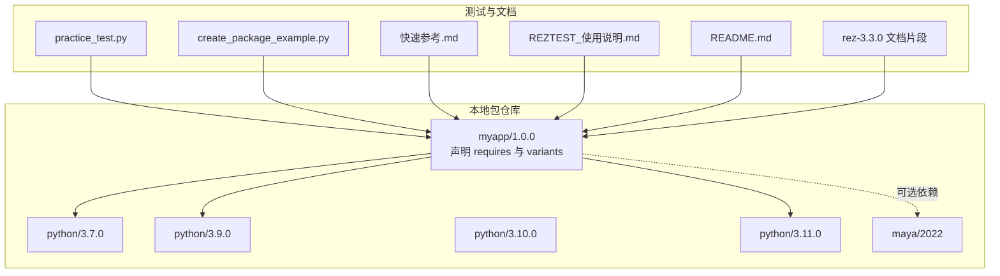
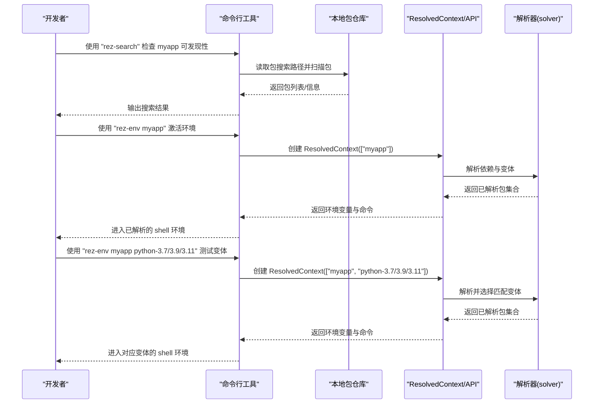
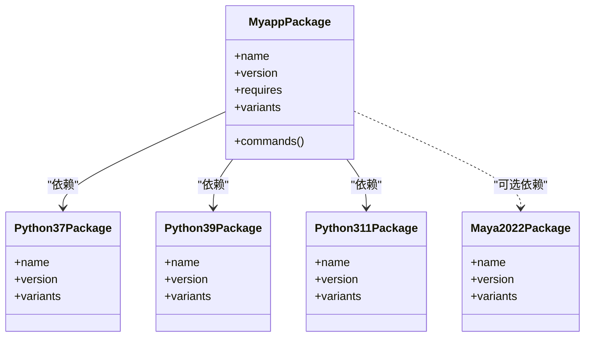
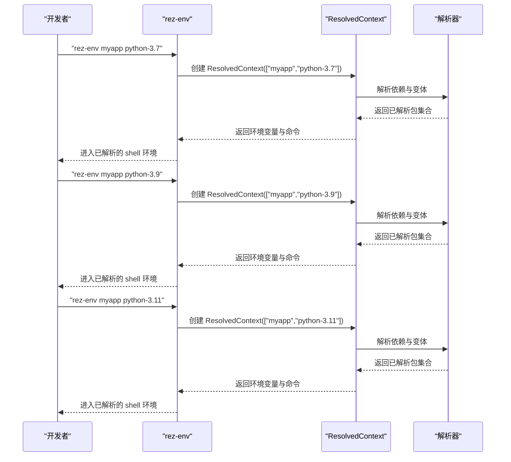
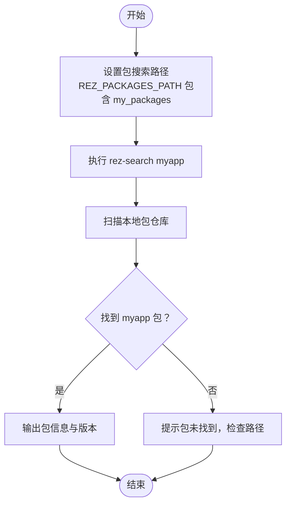
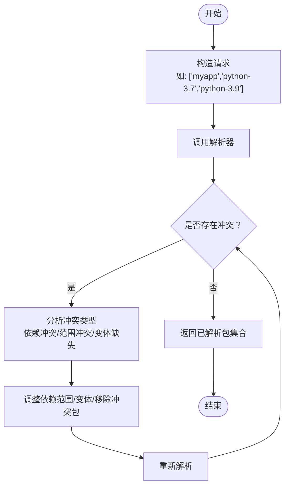
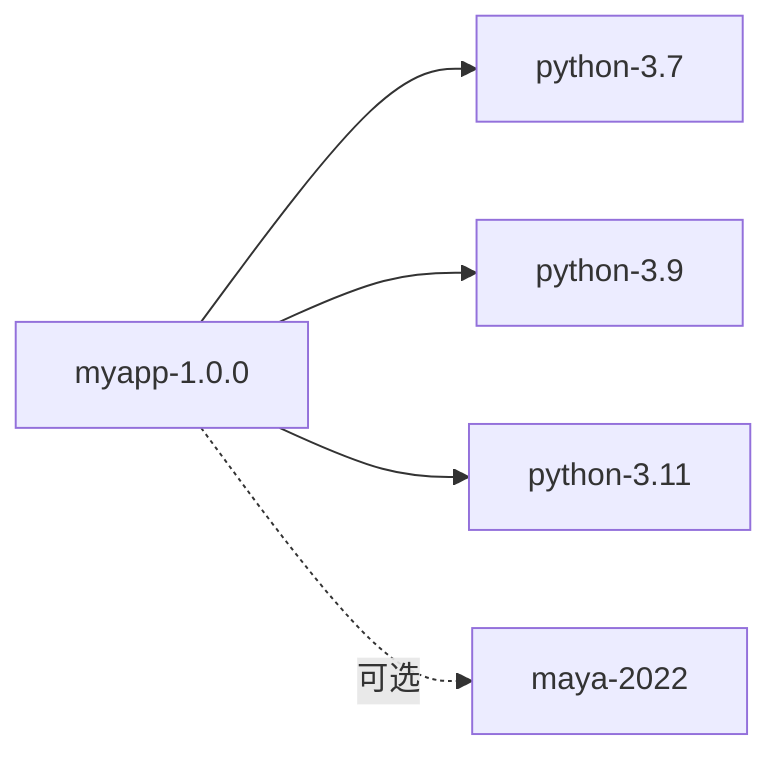

# 依赖解析测试

<cite>
**本文引用的文件**
- [myapp 包配置](file://my_packages/myapp/1.0.0/package.py)
- [Python 3.7 包配置](file://my_packages/python/3.7.0/package.py)
- [Python 3.9 包配置](file://my_packages/python/3.9.0/package.py)
- [Python 3.10 包配置](file://my_packages/python/3.10.0/package.py)
- [Python 3.11 包配置](file://my_packages/python/3.11.0/package.py)
- [Maya 2022 包配置](file://my_packages/maya/2022/package.py)
- [实践测试脚本](file://practice_test.py)
- [包创建示例脚本](file://create_package_example.py)
- [Rez 使用说明](file://REZTEST_使用说明.md)
- [快速参考](file://快速参考.md)
- [README](file://README.md)
- [Rez 官方示例与文档片段](file://rez-3.3.0/README.md)
- [Rez 基本概念文档](file://rez-3.3.0/docs/source/basic_concepts.rst)
- [Rez 命令行工具索引](file://rez-3.3.0/docs/source/commands_index.rst)
- [Rez 安装与限制说明](file://rez-3.3.0/docs/source/installation.rst)
- [Rez 补全脚本（bash/zsh/csh）](file://completion/complete.sh)
- [Rez 补全脚本（zsh）](file://completion/complete.zsh)
- [Rez 补全脚本（csh）](file://completion/complete.csh)
- [Rez 解析器错误类型与冲突处理](file://rez-3.3.0/src/rez/solver.py)
- [Rez 已解析上下文命令执行](file://rez-3.3.0/src/rez/resolved_context.py)
</cite>

## 目录
1. [简介](#简介)
2. [项目结构](#项目结构)
3. [核心组件](#核心组件)
4. [架构总览](#架构总览)
5. [详细组件分析](#详细组件分析)
6. [依赖关系分析](#依赖关系分析)
7. [性能考量](#性能考量)
8. [故障排查指南](#故障排查指南)
9. [结论](#结论)
10. [附录](#附录)

## 简介
本文件围绕“依赖解析测试”目标，系统化说明如何验证 Rez 包声明的依赖项（requires 字段）能否被正确解析与满足；以 myapp 包对 Python 版本的依赖为例，演示如何使用 rez-env 命令测试不同 Python 变体（python-3.7、python-3.9、python-3.11）的环境激活；同时给出使用 rez-search 检查依赖包可发现性、使用 rez-resolve（或通过 API）诊断版本冲突的方法，并提供常见问题排查指南（依赖包未找到、版本范围冲突、变体不兼容等）。

## 项目结构
本项目包含本地示例包与 Rez 源码文档，便于直接进行依赖解析测试与命令行演练。关键位置如下：
- my_packages/myapp/1.0.0：示例应用包，声明依赖与变体
- my_packages/python/*：占位型 Python 包，用于模拟不同 Python 变体
- my_packages/maya/2022：占位型 Maya 包，用于组合多依赖场景
- practice_test.py：Rez API 实践脚本，演示包搜索、版本约束、环境解析
- create_package_example.py：包创建示例脚本，可生成含依赖与变体的包
- 快速参考与使用说明：命令与配置要点
- Rez 官方文档与补全脚本：命令行工具与搜索路径等背景知识

图表来源
- [myapp 包配置](file://my_packages/myapp/1.0.0/package.py#L1-L33)
- [Python 3.7 包配置](file://my_packages/python/3.7.0/package.py#L1-L8)
- [Python 3.9 包配置](file://my_packages/python/3.9.0/package.py#L1-L8)
- [Python 3.10 包配置](file://my_packages/python/3.10.0/package.py#L1-L8)
- [Python 3.11 包配置](file://my_packages/python/3.11.0/package.py#L1-L8)
- [Maya 2022 包配置](file://my_packages/maya/2022/package.py#L1-L9)
- [实践测试脚本](file://practice_test.py#L1-L146)
- [包创建示例脚本](file://create_package_example.py#L1-L179)
- [快速参考](file://快速参考.md#L1-L417)
- [Rez 使用说明](file://REZTEST_使用说明.md#L1-L316)
- [README](file://README.md#L1-L155)
- [Rez 官方示例与文档片段](file://rez-3.3.0/README.md#L93-L138)
- [Rez 基本概念文档](file://rez-3.3.0/docs/source/basic_concepts.rst#L169-L198)

章节来源
- [myapp 包配置](file://my_packages/myapp/1.0.0/package.py#L1-L33)
- [Python 3.7 包配置](file://my_packages/python/3.7.0/package.py#L1-L8)
- [Python 3.9 包配置](file://my_packages/python/3.9.0/package.py#L1-L8)
- [Python 3.10 包配置](file://my_packages/python/3.10.0/package.py#L1-L8)
- [Python 3.11 包配置](file://my_packages/python/3.11.0/package.py#L1-L8)
- [Maya 2022 包配置](file://my_packages/maya/2022/package.py#L1-L9)
- [实践测试脚本](file://practice_test.py#L1-L146)
- [包创建示例脚本](file://create_package_example.py#L1-L179)
- [快速参考](file://快速参考.md#L1-L417)
- [Rez 使用说明](file://REZTEST_使用说明.md#L1-L316)
- [README](file://README.md#L1-L155)
- [Rez 官方示例与文档片段](file://rez-3.3.0/README.md#L93-L138)
- [Rez 基本概念文档](file://rez-3.3.0/docs/source/basic_concepts.rst#L169-L198)

## 核心组件
- myapp 包：声明 requires 与 variants，用于验证依赖解析与变体选择
- Python 占位包：提供 python-3.7、python-3.9、python-3.11 等变体，作为 myapp 的依赖
- Maya 占位包：用于组合多依赖场景（如 myapp + Maya 2022）
- Rez API 脚本：通过 practice_test.py 演示包搜索、版本约束、环境解析
- Rez 命令行：通过 completion 脚本可知支持 rez-env、rez-search 等命令

章节来源
- [myapp 包配置](file://my_packages/myapp/1.0.0/package.py#L1-L33)
- [Python 3.7 包配置](file://my_packages/python/3.7.0/package.py#L1-L8)
- [Python 3.9 包配置](file://my_packages/python/3.9.0/package.py#L1-L8)
- [Python 3.11 包配置](file://my_packages/python/3.11.0/package.py#L1-L8)
- [Maya 2022 包配置](file://my_packages/maya/2022/package.py#L1-L9)
- [实践测试脚本](file://practice_test.py#L1-L146)
- [Rez 命令行工具索引](file://rez-3.3.0/docs/source/commands_index.rst#L1-L7)
- [Rez 补全脚本（bash/zsh/csh）](file://completion/complete.sh#L1-L21)

## 架构总览
下图展示了依赖解析测试的关键流程：包定义（requires/variants）、包搜索路径、命令行工具（rez-env、rez-search）、API（ResolvedContext）与解析器（solver）之间的交互。

图表来源
- [Rez 基本概念文档](file://rez-3.3.0/docs/source/basic_concepts.rst#L169-L198)
- [Rez 官方示例与文档片段](file://rez-3.3.0/README.md#L93-L138)
- [Rez 解析器错误类型与冲突处理](file://rez-3.3.0/src/rez/solver.py#L221-L265)
- [Rez 已解析上下文命令执行](file://rez-3.3.0/src/rez/resolved_context.py#L2096-L2130)

## 详细组件分析

### myapp 包：依赖与变体
- requires：声明对 Python 的依赖范围（例如 python-3.7、python-3.9、python-3.11）
- variants：定义不同 Python 变体，用于在解析时选择合适的依赖组合
- commands：在环境激活时设置 PATH、PYTHONPATH 等

图表来源
- [myapp 包配置](file://my_packages/myapp/1.0.0/package.py#L1-L33)
- [Python 3.7 包配置](file://my_packages/python/3.7.0/package.py#L1-L8)
- [Python 3.9 包配置](file://my_packages/python/3.9.0/package.py#L1-L8)
- [Python 3.11 包配置](file://my_packages/python/3.11.0/package.py#L1-L8)
- [Maya 2022 包配置](file://my_packages/maya/2022/package.py#L1-L9)

章节来源
- [myapp 包配置](file://my_packages/myapp/1.0.0/package.py#L1-L33)
- [Python 3.7 包配置](file://my_packages/python/3.7.0/package.py#L1-L8)
- [Python 3.9 包配置](file://my_packages/python/3.9.0/package.py#L1-L8)
- [Python 3.11 包配置](file://my_packages/python/3.11.0/package.py#L1-L8)
- [Maya 2022 包配置](file://my_packages/maya/2022/package.py#L1-L9)

### 使用 rez-env 测试不同 Python 变体
- 基本用法：进入包含 myapp 的已解析环境
- 变体测试：分别传入 python-3.7、python-3.9、python-3.11，验证变体选择与环境变量生效
- 命令行帮助：可通过补全脚本确认支持的命令

图表来源
- [Rez 官方示例与文档片段](file://rez-3.3.0/README.md#L93-L138)
- [Rez 解析器错误类型与冲突处理](file://rez-3.3.0/src/rez/solver.py#L221-L265)
- [Rez 已解析上下文命令执行](file://rez-3.3.0/src/rez/resolved_context.py#L2096-L2130)
- [Rez 补全脚本（bash/zsh/csh）](file://completion/complete.sh#L1-L21)

章节来源
- [Rez 官方示例与文档片段](file://rez-3.3.0/README.md#L93-L138)
- [Rez 解析器错误类型与冲突处理](file://rez-3.3.0/src/rez/solver.py#L221-L265)
- [Rez 已解析上下文命令执行](file://rez-3.3.0/src/rez/resolved_context.py#L2096-L2130)
- [Rez 补全脚本（bash/zsh/csh）](file://completion/complete.sh#L1-L21)

### 使用 rez-search 检查依赖包可发现性
- 通过搜索路径（packages_path）扫描本地包仓库，确认 myapp、python、maya 等包可见
- 若包不可见，检查 REZ_PACKAGES_PATH 是否包含 my_packages 目录

图表来源
- [Rez 基本概念文档](file://rez-3.3.0/docs/source/basic_concepts.rst#L169-L198)
- [Rez 使用说明](file://REZTEST_使用说明.md#L1-L316)
- [快速参考](file://快速参考.md#L1-L417)

章节来源
- [Rez 基本概念文档](file://rez-3.3.0/docs/source/basic_concepts.rst#L169-L198)
- [Rez 使用说明](file://REZTEST_使用说明.md#L1-L316)
- [快速参考](file://快速参考.md#L1-L417)

### 使用 rez-resolve 诊断版本冲突
- 通过 ResolvedContext（或命令行）解析请求，若出现冲突，解析器会返回冲突原因
- 常见冲突类型包括：依赖冲突、范围不相容、变体缺失等
- 可结合解析器错误类型定位问题

图表来源
- [Rez 解析器错误类型与冲突处理](file://rez-3.3.0/src/rez/solver.py#L221-L265)
- [实践测试脚本](file://practice_test.py#L90-L100)

章节来源
- [Rez 解析器错误类型与冲突处理](file://rez-3.3.0/src/rez/solver.py#L221-L265)
- [实践测试脚本](file://practice_test.py#L90-L100)

### 基于 API 的依赖解析测试（进阶）
- 使用 ResolvedContext 创建环境，打印已解析包列表与环境变量
- 通过包搜索 API 验证 myapp 的 requires 与 variants 字段
- 通过版本约束对象验证范围表达式

章节来源
- [实践测试脚本](file://practice_test.py#L1-L146)
- [快速参考](file://快速参考.md#L1-L417)

## 依赖关系分析
- myapp 对 Python 的依赖通过 requires 声明，variants 决定变体选择
- Python 占位包提供不同版本变体，确保 myapp 的变体矩阵覆盖
- Maya 占位包用于组合多依赖场景，验证复合解析

图表来源
- [myapp 包配置](file://my_packages/myapp/1.0.0/package.py#L1-L33)
- [Python 3.7 包配置](file://my_packages/python/3.7.0/package.py#L1-L8)
- [Python 3.9 包配置](file://my_packages/python/3.9.0/package.py#L1-L8)
- [Python 3.11 包配置](file://my_packages/python/3.11.0/package.py#L1-L8)
- [Maya 2022 包配置](file://my_packages/maya/2022/package.py#L1-L9)

章节来源
- [myapp 包配置](file://my_packages/myapp/1.0.0/package.py#L1-L33)
- [Python 3.7 包配置](file://my_packages/python/3.7.0/package.py#L1-L8)
- [Python 3.9 包配置](file://my_packages/python/3.9.0/package.py#L1-L8)
- [Python 3.11 包配置](file://my_packages/python/3.11.0/package.py#L1-L8)
- [Maya 2022 包配置](file://my_packages/maya/2022/package.py#L1-L9)

## 性能考量
- 包搜索路径越长，扫描时间越长；建议将本地开发包置于路径前端
- 复杂依赖图可能导致解析时间增加；合理拆分依赖、缩小版本范围有助于提升性能
- 使用缓存与预构建包可减少解析成本（Rez 支持缓存机制）

章节来源
- [Rez 基本概念文档](file://rez-3.3.0/docs/source/basic_concepts.rst#L169-L198)

## 故障排查指南
- 依赖包未找到
  - 检查包搜索路径是否包含 my_packages
  - 使用 rez-search 验证包是否可见
  - 参考快速参考中的“包找不到？”问题解答
- 版本范围冲突
  - 同一依赖请求多个互斥版本（如 python-3.7 与 python-3.9 同时出现）
  - 解决：调整请求范围或移除冲突项
  - 参考解析器错误类型与冲突处理
- 变体不兼容
  - myapp 的 variants 未包含目标 Python 变体
  - 解决：在 myapp 的 variants 中添加对应变体
- 命令行工具限制
  - pip 安装的 Rez 在已解析环境中可能无法正确运行命令行工具
  - 建议使用原生安装方式或在非解析环境中使用命令行工具

章节来源
- [快速参考](file://快速参考.md#L1-L417)
- [Rez 使用说明](file://REZTEST_使用说明.md#L1-L316)
- [Rez 安装与限制说明](file://rez-3.3.0/docs/source/installation.rst#L35-L71)
- [Rez 解析器错误类型与冲突处理](file://rez-3.3.0/src/rez/solver.py#L221-L265)

## 结论
通过 myapp 包对 Python 变体的依赖声明与变体矩阵，结合 rez-env、rez-search、ResolvedContext 与解析器（solver），可以系统地验证 Rez 的依赖解析能力。实践中应优先保证包可发现性与变体完整性，遇到冲突时依据解析器错误类型进行针对性修复。配合 API 与命令行工具，可高效完成依赖解析测试与问题诊断。

## 附录
- 常用命令与路径
  - 设置包搜索路径：将 my_packages 加入 REZ_PACKAGES_PATH
  - 搜索包：使用 rez-search
  - 激活环境：使用 rez-env
  - 查看配置：使用 rez-config
- 参考文档
  - Rez 基本概念与搜索路径
  - Rez 命令行工具索引
  - Rez 安装与限制说明
  - 补全脚本（bash/zsh/csh）确认命令支持

章节来源
- [Rez 基本概念文档](file://rez-3.3.0/docs/source/basic_concepts.rst#L169-L198)
- [Rez 命令行工具索引](file://rez-3.3.0/docs/source/commands_index.rst#L1-L7)
- [Rez 安装与限制说明](file://rez-3.3.0/docs/source/installation.rst#L35-L71)
- [Rez 补全脚本（bash/zsh/csh）](file://completion/complete.sh#L1-L21)
- [Rez 补全脚本（zsh）](file://completion/complete.zsh#L1-L21)
- [Rez 补全脚本（csh）](file://completion/complete.csh#L1-L8)