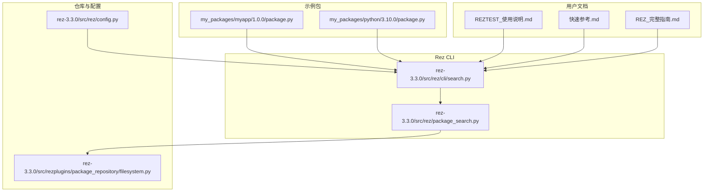
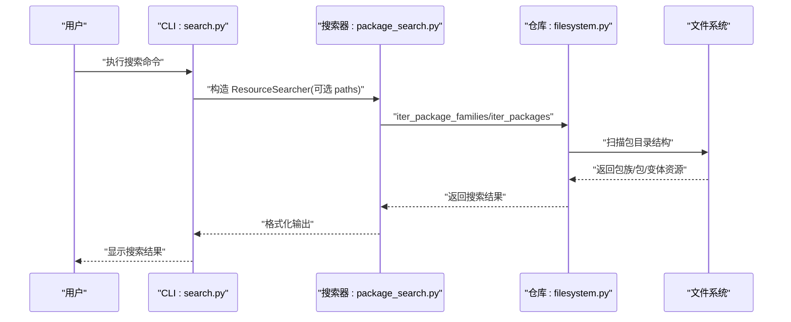
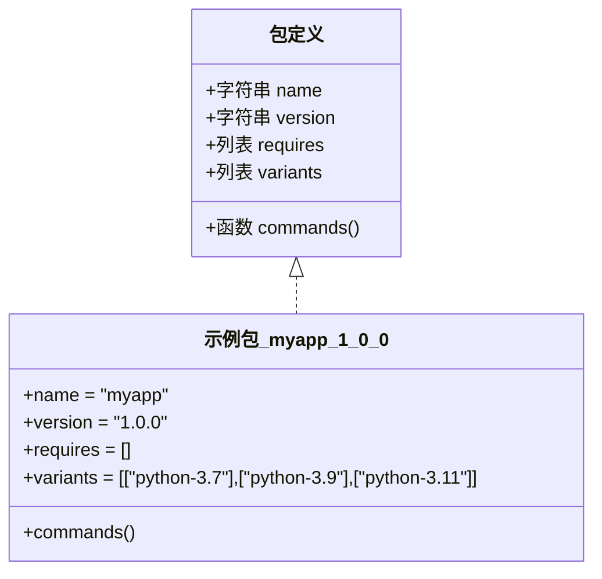
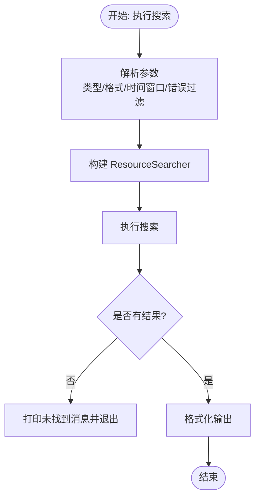
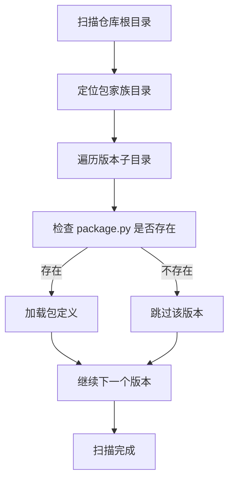
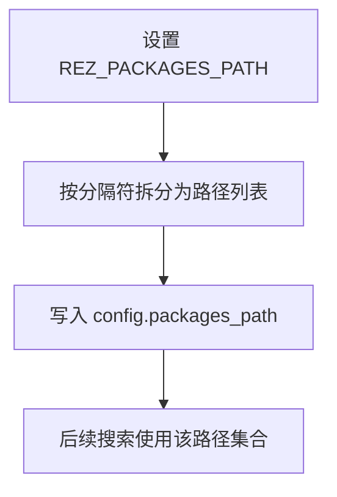
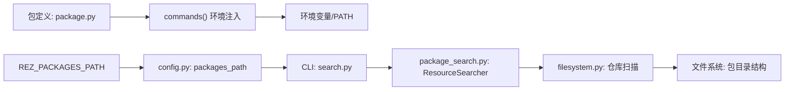

# 包可发现性测试

<cite>
**本文引用的文件**
- [create_package_example.py](file://create_package_example.py)
- [my_packages/myapp/1.0.0/package.py](file://my_packages/myapp/1.0.0/package.py)
- [my_packages/python/3.10.0/package.py](file://my_packages/python/3.10.0/package.py)
- [rez-3.3.0/src/rez/cli/search.py](file://rez-3.3.0/src/rez/cli/search.py)
- [rez-3.3.0/src/rez/package_search.py](file://rez-3.3.0/src/rez/package_search.py)
- [rez-3.3.0/src/rezplugins/package_repository/filesystem.py](file://rez-3.3.0/src/rezplugins/package_repository/filesystem.py)
- [rez-3.3.0/src/rez/config.py](file://rez-3.3.0/src/rez/config.py)
- [REZTEST_使用说明.md](file://REZTEST_使用说明.md)
- [快速参考.md](file://快速参考.md)
- [REZ_完整指南.md](file://REZ_完整指南.md)
</cite>

## 目录
1. [简介](#简介)
2. [项目结构](#项目结构)
3. [核心组件](#核心组件)
4. [架构总览](#架构总览)
5. [详细组件分析](#详细组件分析)
6. [依赖关系分析](#依赖关系分析)
7. [性能考量](#性能考量)
8. [故障排查指南](#故障排查指南)
9. [结论](#结论)

## 简介
本文件围绕“包可发现性测试”展开，目标是确保新创建的 Rez 包能够被 Rez 系统正确索引与发现。结合仓库中的示例脚本与现有实现，文档给出完整的验证流程：从配置 REZ_PACKAGES_PATH 环境变量、使用 rez-search 命令进行包发现，到预期输出格式与成功标志；并提供常见问题排查清单，覆盖环境变量配置错误、包目录结构不正确、缓存未刷新等典型场景。

## 项目结构
仓库包含一个示例包 myapp 以及 Rez 源码，后者提供了包搜索、配置与文件系统仓库插件等能力。关键位置如下：
- 示例包：my_packages/myapp/1.0.0/package.py
- 包搜索命令实现：rez-3.3.0/src/rez/cli/search.py
- 包搜索算法与资源搜索器：rez-3.3.0/src/rez/package_search.py
- 文件系统仓库插件：rez-3.3.0/src/rezplugins/package_repository/filesystem.py
- Rez 配置与环境变量解析：rez-3.3.0/src/rez/config.py
- 使用说明与快速参考：REZTEST_使用说明.md、快速参考.md、REZ_完整指南.md

图表来源
- [my_packages/myapp/1.0.0/package.py](file://my_packages/myapp/1.0.0/package.py#L1-L33)
- [my_packages/python/3.10.0/package.py](file://my_packages/python/3.10.0/package.py#L1-L8)
- [rez-3.3.0/src/rez/cli/search.py](file://rez-3.3.0/src/rez/cli/search.py#L1-L121)
- [rez-3.3.0/src/rez/package_search.py](file://rez-3.3.0/src/rez/package_search.py#L1-L200)
- [rez-3.3.0/src/rezplugins/package_repository/filesystem.py](file://rez-3.3.0/src/rezplugins/package_repository/filesystem.py#L75-L131)
- [rez-3.3.0/src/rez/config.py](file://rez-3.3.0/src/rez/config.py#L1-L200)
- [REZTEST_使用说明.md](file://REZTEST_使用说明.md#L232-L316)
- [快速参考.md](file://快速参考.md#L240-L302)
- [REZ_完整指南.md](file://REZ_完整指南.md#L218-L284)

章节来源
- [create_package_example.py](file://create_package_example.py#L1-L179)
- [my_packages/myapp/1.0.0/package.py](file://my_packages/myapp/1.0.0/package.py#L1-L33)
- [my_packages/python/3.10.0/package.py](file://my_packages/python/3.10.0/package.py#L1-L8)
- [rez-3.3.0/src/rez/cli/search.py](file://rez-3.3.0/src/rez/cli/search.py#L1-L121)
- [rez-3.3.0/src/rez/package_search.py](file://rez-3.3.0/src/rez/package_search.py#L1-L200)
- [rez-3.3.0/src/rezplugins/package_repository/filesystem.py](file://rez-3.3.0/src/rezplugins/package_repository/filesystem.py#L75-L131)
- [rez-3.3.0/src/rez/config.py](file://rez-3.3.0/src/rez/config.py#L1-L200)
- [REZTEST_使用说明.md](file://REZTEST_使用说明.md#L232-L316)
- [快速参考.md](file://快速参考.md#L240-L302)
- [REZ_完整指南.md](file://REZ_完整指南.md#L218-L284)

## 核心组件
- 包定义与命令注入：示例包 myapp/1.0.0/package.py 定义了 name、version、requires、variants 等字段，并在 commands 中设置环境变量与 PATH。
- 包搜索命令：CLI 层提供 search 子命令，支持类型过滤、格式化输出、时间窗口筛选、错误包过滤等。
- 搜索算法与资源搜索器：package_search 提供 ResourceSearcher，负责在指定路径集合上迭代包族、包与变体，支持校验与最新版本筛选。
- 文件系统仓库插件：filesystem 插件负责扫描文件系统上的包目录结构，识别包家族与版本目录，加载 package.py。
- 配置与环境变量：config 支持通过环境变量 REZ_* 注入配置，其中 REZ_PACKAGES_PATH 对应 packages_path 设置，影响包搜索路径。

章节来源
- [my_packages/myapp/1.0.0/package.py](file://my_packages/myapp/1.0.0/package.py#L1-L33)
- [rez-3.3.0/src/rez/cli/search.py](file://rez-3.3.0/src/rez/cli/search.py#L1-L121)
- [rez-3.3.0/src/rez/package_search.py](file://rez-3.3.0/src/rez/package_search.py#L1-L200)
- [rez-3.3.0/src/rezplugins/package_repository/filesystem.py](file://rez-3.3.0/src/rezplugins/package_repository/filesystem.py#L75-L131)
- [rez-3.3.0/src/rez/config.py](file://rez-3.3.0/src/rez/config.py#L1-L200)

## 架构总览
下图展示了从用户发起搜索到包被发现的整体流程，包括环境变量、配置、搜索命令、搜索算法与文件系统仓库之间的交互。

图表来源
- [rez-3.3.0/src/rez/cli/search.py](file://rez-3.3.0/src/rez/cli/search.py#L67-L121)
- [rez-3.3.0/src/rez/package_search.py](file://rez-3.3.0/src/rez/package_search.py#L176-L200)
- [rez-3.3.0/src/rezplugins/package_repository/filesystem.py](file://rez-3.3.0/src/rezplugins/package_repository/filesystem.py#L105-L131)

## 详细组件分析

### 组件A：包定义与命令注入
- 关键点
  - 包定义文件包含 name、version、requires、variants 等字段，commands 中设置环境变量与 PATH。
  - 示例包 myapp/1.0.0/package.py 展示了基本字段与变体列表。
- 影响
  - commands 中对 PATH/PYTHONPATH 的设置直接影响包被发现后的环境行为。
  - 变体列表决定包的可解析变体集合，影响搜索结果的变体维度。

图表来源
- [my_packages/myapp/1.0.0/package.py](file://my_packages/myapp/1.0.0/package.py#L1-L33)

章节来源
- [my_packages/myapp/1.0.0/package.py](file://my_packages/myapp/1.0.0/package.py#L1-L33)

### 组件B：包搜索命令与输出格式
- 关键点
  - CLI search 子命令支持类型选择（family/package/variant/auto）、格式化输出、错误包过滤、时间窗口筛选等。
  - 输出由 ResourceSearchResultFormatter 控制，支持多字段格式化。
- 预期输出
  - 成功时打印匹配的包族/包/变体及其元数据；当未找到匹配项时打印提示并退出非零状态码。
  - 错误模式下仅输出存在验证错误的资源。

图表来源
- [rez-3.3.0/src/rez/cli/search.py](file://rez-3.3.0/src/rez/cli/search.py#L1-L121)
- [rez-3.3.0/src/rez/package_search.py](file://rez-3.3.0/src/rez/package_search.py#L165-L200)

章节来源
- [rez-3.3.0/src/rez/cli/search.py](file://rez-3.3.0/src/rez/cli/search.py#L1-L121)
- [rez-3.3.0/src/rez/package_search.py](file://rez-3.3.0/src/rez/package_search.py#L165-L200)

### 组件C：文件系统仓库与包发现
- 关键点
  - 文件系统仓库插件通过扫描包家族目录与版本子目录，识别包定义文件并加载。
  - 支持未版本化包与组合包资源类型，具备缓存与忽略规则处理。
- 影响
  - 包目录结构必须符合“包家族/版本”的层次，且每个版本目录包含有效的 package.py。
  - 若目录结构不正确，仓库将无法识别包，导致搜索不到。

图表来源
- [rez-3.3.0/src/rezplugins/package_repository/filesystem.py](file://rez-3.3.0/src/rezplugins/package_repository/filesystem.py#L105-L131)

章节来源
- [rez-3.3.0/src/rezplugins/package_repository/filesystem.py](file://rez-3.3.0/src/rezplugins/package_repository/filesystem.py#L75-L131)

### 组件D：环境变量与配置注入
- 关键点
  - Rez 支持通过环境变量 REZ_PACKAGES_PATH 注入 packages_path，分隔符遵循 os.pathsep。
  - config 模块将环境变量映射为配置项，优先于默认值与 JSON 编码的环境变量。
- 影响
  - 若未正确设置 REZ_PACKAGES_PATH，搜索将无法定位本地包目录，导致包不可发现。
  - 不同平台的分隔符差异可能导致路径解析失败。

图表来源
- [rez-3.3.0/src/rez/config.py](file://rez-3.3.0/src/rez/config.py#L1-L200)
- [rez-3.3.0/src/rez/cli/search.py](file://rez-3.3.0/src/rez/cli/search.py#L81-L86)

章节来源
- [rez-3.3.0/src/rez/config.py](file://rez-3.3.0/src/rez/config.py#L1-L200)
- [rez-3.3.0/src/rez/cli/search.py](file://rez-3.3.0/src/rez/cli/search.py#L81-L86)

## 依赖关系分析
- 包定义依赖 commands 中的环境变量设置，影响包被发现后的可用性。
- 搜索命令依赖 ResourceSearcher，后者依赖 iter_package_families/iter_packages 等接口，最终由文件系统仓库插件提供资源。
- 配置层通过环境变量注入 packages_path，决定搜索路径集合。

图表来源
- [my_packages/myapp/1.0.0/package.py](file://my_packages/myapp/1.0.0/package.py#L1-L33)
- [rez-3.3.0/src/rez/cli/search.py](file://rez-3.3.0/src/rez/cli/search.py#L67-L121)
- [rez-3.3.0/src/rez/package_search.py](file://rez-3.3.0/src/rez/package_search.py#L176-L200)
- [rez-3.3.0/src/rezplugins/package_repository/filesystem.py](file://rez-3.3.0/src/rezplugins/package_repository/filesystem.py#L105-L131)
- [rez-3.3.0/src/rez/config.py](file://rez-3.3.0/src/rez/config.py#L1-L200)

章节来源
- [my_packages/myapp/1.0.0/package.py](file://my_packages/myapp/1.0.0/package.py#L1-L33)
- [rez-3.3.0/src/rez/cli/search.py](file://rez-3.3.0/src/rez/cli/search.py#L67-L121)
- [rez-3.3.0/src/rez/package_search.py](file://rez-3.3.0/src/rez/package_search.py#L176-L200)
- [rez-3.3.0/src/rezplugins/package_repository/filesystem.py](file://rez-3.3.0/src/rezplugins/package_repository/filesystem.py#L105-L131)
- [rez-3.3.0/src/rez/config.py](file://rez-3.3.0/src/rez/config.py#L1-L200)

## 性能考量
- 包搜索算法在未实现专用仓库插件时作为回退方案，可能不如数据库型仓库高效。
- 文件系统扫描涉及大量目录遍历与文件存在性检查，建议：
  - 合理组织包目录结构，避免过多层级与冗余文件。
  - 使用 --latest 选项减少变体数量，提升搜索速度。
  - 在 CI/本地开发中尽量缩小搜索路径集合，避免无关路径干扰。

## 故障排查指南
- 症状：使用搜索命令找不到新包
  - 检查 REZ_PACKAGES_PATH 是否包含本地包目录，且分隔符正确（不同平台不同）。
  - 确认包目录结构符合“包家族/版本”要求，每个版本目录包含有效的 package.py。
  - 使用 --validate 或 --errors 检查是否存在验证错误。
- 症状：环境变量未生效
  - 检查包定义中的 commands() 是否正确设置 PATH/PYTHONPATH。
  - 确认变体列表与实际可用 Python 版本一致。
- 症状：缓存导致搜索结果陈旧
  - 使用 --no-local 或 --paths 显式指定搜索路径，绕过缓存。
  - 在需要时手动清理 Rez 缓存（根据官方文档指引）。
- 症状：跨平台路径问题
  - 注意 Windows 与类 Unix 的路径分隔符差异，确保环境变量设置正确。
  - 参考快速参考与使用说明中的平台差异提示。

章节来源
- [REZTEST_使用说明.md](file://REZTEST_使用说明.md#L232-L316)
- [快速参考.md](file://快速参考.md#L240-L302)
- [REZ_完整指南.md](file://REZ_完整指南.md#L218-L284)
- [rez-3.3.0/src/rez/cli/search.py](file://rez-3.3.0/src/rez/cli/search.py#L1-L121)
- [rez-3.3.0/src/rezplugins/package_repository/filesystem.py](file://rez-3.3.0/src/rezplugins/package_repository/filesystem.py#L105-L131)

## 结论
要确保新创建的包能在 Rez 系统中被正确索引与发现，需要：
- 正确编写包定义文件并设置 commands() 环境变量；
- 通过 REZ_PACKAGES_PATH 指向包含本地包的目录；
- 使用搜索命令进行验证，并关注输出格式与错误提示；
- 遇到问题时依据环境变量、目录结构、缓存与跨平台差异进行逐项排查。