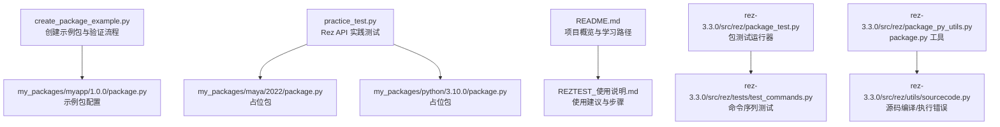
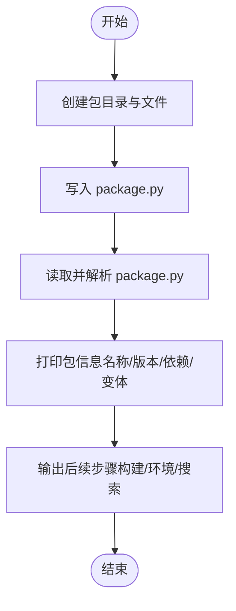
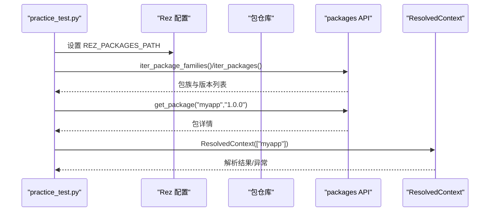
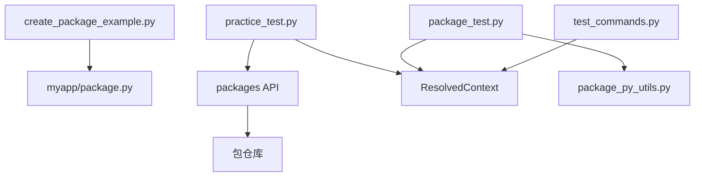

# 包测试与验证

<cite>
**本文引用的文件**
- [create_package_example.py](file://create_package_example.py)
- [practice_test.py](file://practice_test.py)
- [my_packages/myapp/1.0.0/package.py](file://my_packages/myapp/1.0.0/package.py)
- [my_packages/maya/2022/package.py](file://my_packages/maya/2022/package.py)
- [my_packages/python/3.10.0/package.py](file://my_packages/python/3.10.0/package.py)
- [README.md](file://README.md)
- [REZTEST_使用说明.md](file://REZTEST_使用说明.md)
- [rez-3.3.0/src/rez/package_test.py](file://rez-3.3.0/src/rez/package_test.py)
- [rez-3.3.0/src/rez/package_py_utils.py](file://rez-3.3.0/src/rez/package_py_utils.py)
- [rez-3.3.0/src/rez/utils/sourcecode.py](file://rez-3.3.0/src/rez/utils/sourcecode.py)
- [rez-3.3.0/src/rez/tests/test_commands.py](file://rez-3.3.0/src/rez/tests/test_commands.py)
- [rez-3.3.0/docs/source/getting_started.rst](file://rez-3.3.0/docs/source/getting_started.rst)
</cite>

## 目录
1. [简介](#简介)
2. [项目结构](#项目结构)
3. [核心组件](#核心组件)
4. [架构总览](#架构总览)
5. [详细组件分析](#详细组件分析)
6. [依赖关系分析](#依赖关系分析)
7. [性能考量](#性能考量)
8. [故障排查指南](#故障排查指南)
9. [结论](#结论)
10. [附录](#附录)

## 简介
本文件围绕“包测试与验证”的目标，系统梳理如何验证新创建的 Rez 包的正确性，包括：
- 语法检查与依赖解析测试
- 环境激活验证（PATH、PYTHONPATH 等）
- 通过程序化方式加载与解析 package.py
- 使用 rez-env 命令测试环境变量设置
- 使用 rez-search 检查包的可发现性
- 常见问题排查（PATH 未正确设置、PYTHONPATH 缺失、版本冲突等）

## 项目结构
本仓库包含演示脚本、示例包与文档，便于从创建、验证到使用的全流程学习。



图表来源
- [create_package_example.py](file://create_package_example.py#L1-L179)
- [practice_test.py](file://practice_test.py#L1-L146)
- [my_packages/myapp/1.0.0/package.py](file://my_packages/myapp/1.0.0/package.py#L1-L33)
- [my_packages/maya/2022/package.py](file://my_packages/maya/2022/package.py#L1-L9)
- [my_packages/python/3.10.0/package.py](file://my_packages/python/3.10.0/package.py#L1-L8)
- [README.md](file://README.md#L1-L155)
- [REZTEST_使用说明.md](file://REZTEST_使用说明.md#L1-L316)
- [rez-3.3.0/src/rez/package_test.py](file://rez-3.3.0/src/rez/package_test.py#L1-L200)
- [rez-3.3.0/src/rez/tests/test_commands.py](file://rez-3.3.0/src/rez/tests/test_commands.py#L39-L102)
- [rez-3.3.0/src/rez/package_py_utils.py](file://rez-3.3.0/src/rez/package_py_utils.py#L1-L200)
- [rez-3.3.0/src/rez/utils/sourcecode.py](file://rez-3.3.0/src/rez/utils/sourcecode.py#L40-L90)

章节来源
- [README.md](file://README.md#L1-L155)
- [REZTEST_使用说明.md](file://REZTEST_使用说明.md#L1-L316)

## 核心组件
- 包创建与验证脚本：通过程序化方式创建示例包并进行基础验证（语法、包信息、后续构建与环境加载建议）。
- Rez API 实践脚本：演示如何通过 Python API 搜索包、获取包信息、尝试环境解析、打印命令速查与建议。
- 示例包：包含 myapp、maya、python 占位包，用于演示与测试。
- Rez 内核测试与工具：提供包测试运行器、package.py 工具函数、源码编译/执行错误类型等，支撑包验证与环境解析。

章节来源
- [create_package_example.py](file://create_package_example.py#L1-L179)
- [practice_test.py](file://practice_test.py#L1-L146)
- [my_packages/myapp/1.0.0/package.py](file://my_packages/myapp/1.0.0/package.py#L1-L33)
- [my_packages/maya/2022/package.py](file://my_packages/maya/2022/package.py#L1-L9)
- [my_packages/python/3.10.0/package.py](file://my_packages/python/3.10.0/package.py#L1-L8)
- [rez-3.3.0/src/rez/package_test.py](file://rez-3.3.0/src/rez/package_test.py#L1-L200)
- [rez-3.3.0/src/rez/package_py_utils.py](file://rez-3.3.0/src/rez/package_py_utils.py#L1-L200)
- [rez-3.3.0/src/rez/utils/sourcecode.py](file://rez-3.3.0/src/rez/utils/sourcecode.py#L40-L90)

## 架构总览
下图展示了从“创建包”到“验证包”的端到端流程，以及 Rez 内核如何参与包解析与环境生成。

```mermaid
sequenceDiagram
participant Dev as "开发者"
participant Create as "create_package_example.py"
participant Pack as "my_packages/myapp/1.0.0/package.py"
participant Practice as "practice_test.py"
participant RezAPI as "Rez Python API"
participant Resolver as "ResolvedContext"
participant CLI as "rez-env / rez-search"
Dev->>Create : 运行创建脚本
Create->>Pack : 生成 package.py 与目录结构
Create-->>Dev : 输出包信息与后续步骤
Dev->>Practice : 运行实践脚本
Practice->>RezAPI : 搜索包、获取包信息
Practice->>Resolver : 尝试解析环境
Resolver-->>Practice : 返回解析结果/错误
Dev->>CLI : 使用 rez-search 检查包可发现性
Dev->>CLI : 使用 rez-env 测试环境变量设置
```

图表来源
- [create_package_example.py](file://create_package_example.py#L1-L179)
- [practice_test.py](file://practice_test.py#L1-L146)
- [my_packages/myapp/1.0.0/package.py](file://my_packages/myapp/1.0.0/package.py#L1-L33)
- [rez-3.3.0/src/rez/package_test.py](file://rez-3.3.0/src/rez/package_test.py#L1-L200)

## 详细组件分析

### 组件A：包创建与验证（create_package_example.py）
- 功能要点
  - 自动生成示例包目录与 package.py
  - 输出包结构树
  - 程序化读取并解析 package.py（模拟语法检查）
  - 提供后续构建与环境加载建议（含 REZ_PACKAGES_PATH 配置）

- 关键流程
  - 创建目录与文件
  - 写入 package.py
  - 读取并打印包信息（名称、版本、依赖、变体）
  - 输出构建与环境命令建议

- 验证点
  - package.py 语法正确性（读取成功即视为语法通过）
  - 包信息字段完整性（name、version、requires、variants 等）



图表来源
- [create_package_example.py](file://create_package_example.py#L1-L179)

章节来源
- [create_package_example.py](file://create_package_example.py#L1-L179)

### 组件B：Rez API 实践测试（practice_test.py）
- 功能要点
  - 配置本地包搜索路径
  - 列出可用包族与版本
  - 获取特定包信息（名称、版本、描述、作者、依赖、变体）
  - 演示版本约束语法
  - 尝试解析环境（可能因依赖缺失而失败，属预期）
  - 提供命令速查与建议

- 关键流程
  - 设置 REZ_PACKAGES_PATH
  - 调用 packages.iter_package_families()/iter_packages()
  - 调用 packages.get_package() 获取包详情
  - 使用 ResolvedContext 解析环境
  - 打印命令速查与建议



图表来源
- [practice_test.py](file://practice_test.py#L1-L146)

章节来源
- [practice_test.py](file://practice_test.py#L1-L146)

### 组件C：示例包（my_packages/myapp/1.0.0/package.py）
- 字段说明
  - name、version、description、authors
  - requires（依赖）、system_requires（系统需求）
  - commands（环境加载时执行的命令，设置 PATH、PYTHONPATH 等）
  - variants（变体）
  - tools（工具）

- 验证要点
  - commands 函数中对 PATH、PYTHONPATH 的设置是否符合预期
  - variants 是否满足多 Python 版本场景

章节来源
- [my_packages/myapp/1.0.0/package.py](file://my_packages/myapp/1.0.0/package.py#L1-L33)

### 组件D：占位包（maya/2022、python/3.10.0）
- 作用
  - 作为依赖占位，便于演示多包依赖与变体解析
  - 保持 variants 为空以避免平台家族要求

章节来源
- [my_packages/maya/2022/package.py](file://my_packages/maya/2022/package.py#L1-L9)
- [my_packages/python/3.10.0/package.py](file://my_packages/python/3.10.0/package.py#L1-L8)

### 组件E：包测试运行器（rez-3.3.0/src/rez/package_test.py）
- 功能要点
  - 运行包内 tests 字段定义的测试
  - 支持在解析环境中运行测试（可附加额外依赖）
  - 处理测试结果与失败停止策略

- 关键接口
  - PackageTestRunner.get_package_test_names()
  - PackageTestRunner.get_test_names()

章节来源
- [rez-3.3.0/src/rez/package_test.py](file://rez-3.3.0/src/rez/package_test.py#L1-L200)

### 组件F：package.py 工具与错误类型（rez-3.3.0/src/rez/package_py_utils.py、utils/sourcecode.py）
- package_py_utils
  - expand_requirement / expand_requires：展开通配符与版本范围
  - exec_command / exec_python：在子进程中计算包属性，失败抛出 InvalidPackageError
- utils/sourcecode
  - SourceCodeCompileError / SourceCodeExecError：源码编译/执行错误类型

章节来源
- [rez-3.3.0/src/rez/package_py_utils.py](file://rez-3.3.0/src/rez/package_py_utils.py#L1-L200)
- [rez-3.3.0/src/rez/utils/sourcecode.py](file://rez-3.3.0/src/rez/utils/sourcecode.py#L40-L90)

### 组件G：命令序列测试（rez-3.3.0/src/rez/tests/test_commands.py）
- 功能要点
  - 验证解析上下文生成的命令序列
  - 忽略无关环境变量（如 PATH）以聚焦关键命令
  - 对比期望命令与实际命令序列

章节来源
- [rez-3.3.0/src/rez/tests/test_commands.py](file://rez-3.3.0/src/rez/tests/test_commands.py#L39-L102)

## 依赖关系分析
- 包创建脚本依赖于示例包目录结构与 package.py
- 实践脚本依赖于 Rez 配置与包仓库
- Rez 内核通过 package_test.py 与 package_py_utils.py 提供测试与解析能力
- 命令序列测试依赖于解析上下文生成的命令动作



图表来源
- [create_package_example.py](file://create_package_example.py#L1-L179)
- [practice_test.py](file://practice_test.py#L1-L146)
- [rez-3.3.0/src/rez/package_test.py](file://rez-3.3.0/src/rez/package_test.py#L1-L200)
- [rez-3.3.0/src/rez/package_py_utils.py](file://rez-3.3.0/src/rez/package_py_utils.py#L1-L200)
- [rez-3.3.0/src/rez/tests/test_commands.py](file://rez-3.3.0/src/rez/tests/test_commands.py#L39-L102)

章节来源
- [create_package_example.py](file://create_package_example.py#L1-L179)
- [practice_test.py](file://practice_test.py#L1-L146)
- [rez-3.3.0/src/rez/package_test.py](file://rez-3.3.0/src/rez/package_test.py#L1-L200)
- [rez-3.3.0/src/rez/package_py_utils.py](file://rez-3.3.0/src/rez/package_py_utils.py#L1-L200)
- [rez-3.3.0/src/rez/tests/test_commands.py](file://rez-3.3.0/src/rez/tests/test_commands.py#L39-L102)

## 性能考量
- 包解析与环境生成涉及依赖求解，复杂度与依赖数量、版本范围、变体数量相关。建议：
  - 合理拆分包与变体，减少不必要的组合
  - 使用精确的版本范围，避免过宽导致求解空间过大
  - 在 CI 中缓存解析结果，减少重复解析时间

## 故障排查指南

### 1. 语法检查与依赖解析测试
- 语法检查
  - 使用 create_package_example.py 的“读取并解析 package.py”流程，确保读取成功即通过语法检查
  - 若需更严格的语法校验，可在本地引入第三方 Python 语法检查工具（不在本仓库范围内）
- 依赖解析测试
  - 使用 practice_test.py 的 ResolvedContext 尝试解析环境，若失败，记录异常类型与简短信息，定位依赖缺失或版本不匹配
  - 结合 package_py_utils 的 expand_requirement/expand_requires 展开通配符，确认最终依赖范围

章节来源
- [create_package_example.py](file://create_package_example.py#L137-L174)
- [practice_test.py](file://practice_test.py#L90-L100)
- [rez-3.3.0/src/rez/package_py_utils.py](file://rez-3.3.0/src/rez/package_py_utils.py#L1-L200)

### 2. 环境激活验证（PATH、PYTHONPATH 等）
- 使用 rez-env 命令进入环境并打印环境变量，验证 PATH、PYTHONPATH 等是否按 package.py 的 commands 设置正确
- 参考官方文档示例，使用单次命令形式验证环境变量生效

章节来源
- [rez-3.3.0/docs/source/getting_started.rst](file://rez-3.3.0/docs/source/getting_started.rst#L175-L188)
- [my_packages/myapp/1.0.0/package.py](file://my_packages/myapp/1.0.0/package.py#L16-L23)

### 3. 包的可发现性（rez-search）
- 在本地包路径配置完成后，使用 rez-search 搜索包名，确认包被正确识别
- 若未发现，检查 REZ_PACKAGES_PATH 是否包含示例包所在目录

章节来源
- [REZTEST_使用说明.md](file://REZTEST_使用说明.md#L86-L108)

### 4. 常见问题与诊断步骤
- PATH 未正确设置
  - 现象：命令不可用或 PATH 不包含 {root}/bin
  - 诊断：使用 rez-env 打印环境变量，确认 PATH 是否包含包 bin 目录
  - 处理：在 package.py 的 commands 中使用 env.PATH.prepend 或 append，确保路径顺序正确
- PYTHONPATH 缺失
  - 现象：Python 模块导入失败
  - 诊断：使用 rez-env 打印环境变量，确认 PYTHONPATH 是否包含包 lib 目录
  - 处理：在 package.py 的 commands 中设置 env.PYTHONPATH.append
- 版本冲突
  - 现象：ResolvedContext 解析失败或提示冲突
  - 诊断：查看解析错误信息，定位冲突的包与版本范围
  - 处理：调整 requires 或 variants，缩小版本范围或增加兼容性约束

章节来源
- [practice_test.py](file://practice_test.py#L90-L100)
- [my_packages/myapp/1.0.0/package.py](file://my_packages/myapp/1.0.0/package.py#L16-L23)
- [rez-3.3.0/src/rez/tests/test_commands.py](file://rez-3.3.0/src/rez/tests/test_commands.py#L39-L102)

## 结论
通过本仓库提供的脚本与示例包，可以系统地完成 Rez 包的创建、语法检查、依赖解析与环境激活验证。结合 Rez 内核的测试与工具模块，能够进一步提升包质量与稳定性。建议在团队中推广使用这些流程与工具，形成标准化的包测试与验证规范。

## 附录
- 快速参考
  - 创建包：运行 create_package_example.py
  - 验证包：运行 practice_test.py 并使用 rez-env、rez-search
  - 文档与指南：README.md、REZTEST_使用说明.md、快速参考与完整指南

章节来源
- [README.md](file://README.md#L1-L155)
- [REZTEST_使用说明.md](file://REZTEST_使用说明.md#L1-L316)