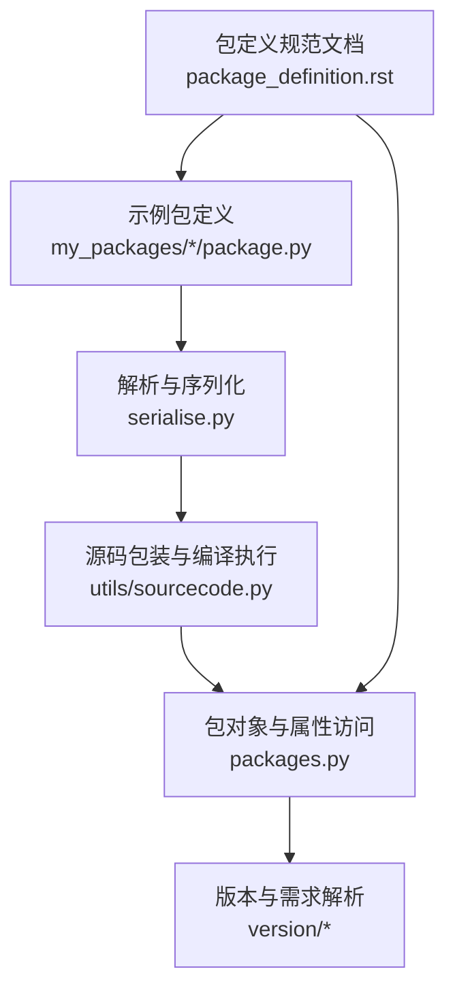
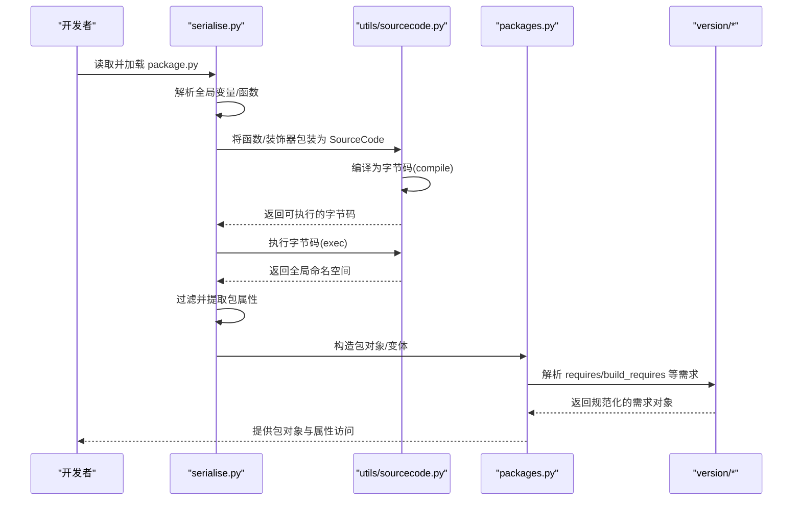
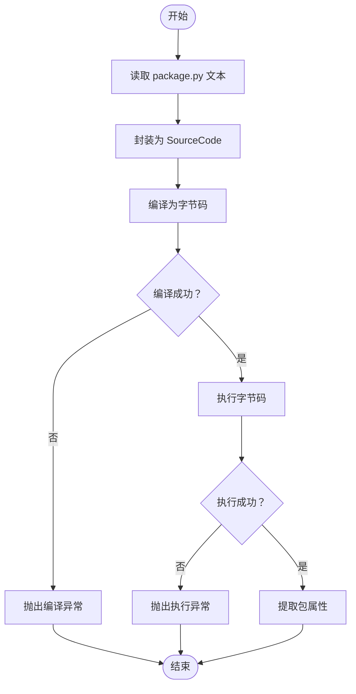
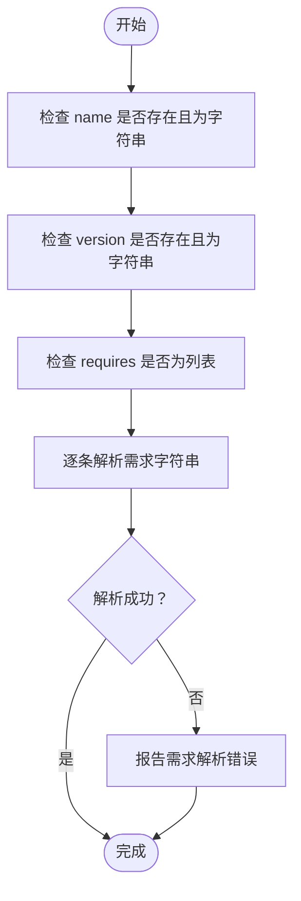
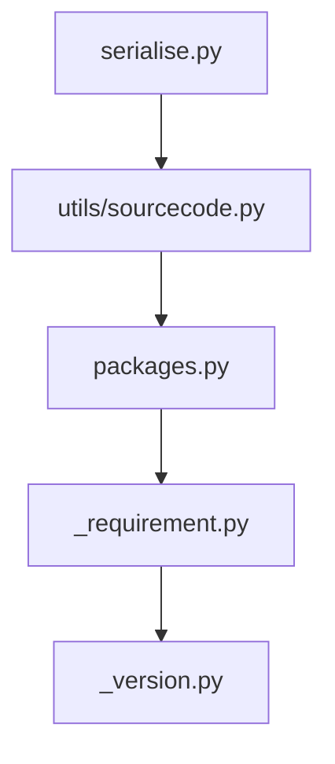

# 包语法验证

<cite>
**本文引用的文件**
- [create_package_example.py](file://create_package_example.py)
- [my_packages/maya/2022/package.py](file://my_packages/maya/2022/package.py)
- [my_packages/myapp/1.0.0/package.py](file://my_packages/myapp/1.0.0/package.py)
- [rez-3.3.0/src/rez/utils/sourcecode.py](file://rez-3.3.0/src/rez/utils/sourcecode.py)
- [rez-3.3.0/src/rez/serialise.py](file://rez-3.3.0/src/rez/serialise.py)
- [rez-3.3.0/src/rez/packages.py](file://rez-3.3.0/src/rez/packages.py)
- [rez-3.3.0/src/rez/version/_requirement.py](file://rez-3.3.0/src/rez/version/_requirement.py)
- [rez-3.3.0/src/rez/version/_version.py](file://rez-3.3.0/src/rez/version/_version.py)
- [rez-3.3.0/src/rez/package_py_utils.py](file://rez-3.3.0/src/rez/package_py_utils.py)
- [rez-3.3.0/docs/source/package_definition.rst](file://rez-3.3.0/docs/source/package_definition.rst)
</cite>

## 目录
1. [简介](#简介)
2. [项目结构](#项目结构)
3. [核心组件](#核心组件)
4. [架构总览](#架构总览)
5. [详细组件分析](#详细组件分析)
6. [依赖关系分析](#依赖关系分析)
7. [性能考量](#性能考量)
8. [故障排查指南](#故障排查指南)
9. [结论](#结论)
10. [附录](#附录)

## 简介
本文件围绕“包语法验证”主题，系统阐述如何对 Rez 的 package.py 文件进行语法正确性与语义一致性验证，确保不存在语法错误、拼写错误、保留关键字误用、括号不匹配、缺失引号等常见问题。文档基于仓库中现有的包定义规范与解析实现，给出可编程的验证流程与诊断方法，并结合 Python 内置 ast 模块进行静态分析思路指导，帮助开发者在构建与发布包前主动发现并修复问题。

## 项目结构
- 示例包定义文件位于 my_packages 下，便于直接观察标准字段与结构。
- Rez 核心解析与验证逻辑集中在 utils/sourcecode.py、serialise.py、packages.py、version/* 等模块中。
- 文档化的包定义规范位于 docs/source/package_definition.rst，明确 name、version、requires 等关键字段的含义与约束。

图表来源
- [my_packages/myapp/1.0.0/package.py](file://my_packages/myapp/1.0.0/package.py#L1-L33)
- [rez-3.3.0/src/rez/serialise.py](file://rez-3.3.0/src/rez/serialise.py#L247-L287)
- [rez-3.3.0/src/rez/utils/sourcecode.py](file://rez-3.3.0/src/rez/utils/sourcecode.py#L90-L212)
- [rez-3.3.0/src/rez/packages.py](file://rez-3.3.0/src/rez/packages.py#L140-L184)
- [rez-3.3.0/src/rez/version/_requirement.py](file://rez-3.3.0/src/rez/version/_requirement.py#L121-L166)
- [rez-3.3.0/docs/source/package_definition.rst](file://rez-3.3.0/docs/source/package_definition.rst#L740-L800)

章节来源
- [my_packages/maya/2022/package.py](file://my_packages/maya/2022/package.py#L1-L9)
- [my_packages/myapp/1.0.0/package.py](file://my_packages/myapp/1.0.0/package.py#L1-L33)
- [rez-3.3.0/docs/source/package_definition.rst](file://rez-3.3.0/docs/source/package_definition.rst#L740-L800)

## 核心组件
- 源码包装与编译执行：封装 package.py 的源码，支持装饰器处理、延迟绑定、编译与执行，并在编译/执行阶段抛出结构化异常，便于定位问题。
- 序列化与加载：将 package.py 中的全局变量与函数转换为包对象属性，同时过滤掉不应作为包属性的变量（如模块、未装饰的函数、下划线开头等）。
- 包对象与属性访问：对 late 绑定属性进行惰性求值与缓存；对 early 绑定属性在构建期求值并固化到安装包中。
- 版本与需求解析：对 requires、build_requires 等字段进行需求字符串解析与范围校验，支持通配符展开与非法范围检测。

章节来源
- [rez-3.3.0/src/rez/utils/sourcecode.py](file://rez-3.3.0/src/rez/utils/sourcecode.py#L90-L212)
- [rez-3.3.0/src/rez/serialise.py](file://rez-3.3.0/src/rez/serialise.py#L247-L287)
- [rez-3.3.0/src/rez/packages.py](file://rez-3.3.0/src/rez/packages.py#L140-L184)
- [rez-3.3.0/src/rez/version/_requirement.py](file://rez-3.3.0/src/rez/version/_requirement.py#L121-L166)

## 架构总览
下面的序列图展示了从读取 package.py 到生成包对象的关键流程，包括语法编译、执行与属性提取过程。

图表来源
- [rez-3.3.0/src/rez/serialise.py](file://rez-3.3.0/src/rez/serialise.py#L247-L287)
- [rez-3.3.0/src/rez/utils/sourcecode.py](file://rez-3.3.0/src/rez/utils/sourcecode.py#L194-L228)
- [rez-3.3.0/src/rez/packages.py](file://rez-3.3.0/src/rez/packages.py#L140-L184)
- [rez-3.3.0/src/rez/version/_requirement.py](file://rez-3.3.0/src/rez/version/_requirement.py#L121-L166)

## 详细组件分析

### 组件A：包定义文件的读取与解析
- 读取策略：通过路径读取 package.py 文本，随后交由序列化模块进行解析。
- 属性提取：仅保留符合规范的变量与函数返回值，过滤掉模块、未装饰函数、以下划线开头的变量等。
- 关键点：
  - 全局变量会被收集为包属性。
  - 函数属性需按早/晚绑定规则处理，否则不会成为包属性。
  - commands 等特殊函数有独立的执行机制。

章节来源
- [my_packages/myapp/1.0.0/package.py](file://my_packages/myapp/1.0.0/package.py#L1-L33)
- [rez-3.3.0/src/rez/serialise.py](file://rez-3.3.0/src/rez/serialise.py#L247-L287)
- [rez-3.3.0/docs/source/package_definition.rst](file://rez-3.3.0/docs/source/package_definition.rst#L60-L80)

### 组件B：语法与执行阶段的编译与异常
- 编译阶段：将包装后的源码编译为字节码，若编译失败会抛出结构化异常，包含堆栈信息与简短提示。
- 执行阶段：在预设的全局命名空间中执行，捕获执行异常并抛出结构化异常，便于定位具体属性与错误原因。
- 异常类型：
  - SourceCodeCompileError：编译失败。
  - SourceCodeExecError：执行失败。
- 建议：在自动化验证中捕获上述异常，输出短消息与详细堆栈，辅助快速修复。

图表来源
- [rez-3.3.0/src/rez/utils/sourcecode.py](file://rez-3.3.0/src/rez/utils/sourcecode.py#L194-L228)

章节来源
- [rez-3.3.0/src/rez/utils/sourcecode.py](file://rez-3.3.0/src/rez/utils/sourcecode.py#L90-L212)

### 组件C：关键字段验证（name、version、requires）
- name 字段：必须存在且为字符串，用于标识包名。
- version 字段：必须存在且为字符串，用于标识版本。
- requires 字段：列表形式，每个元素为需求字符串，支持通配符与范围表达式；非法范围会在解析阶段报错。
- 变体与工具：variants、tools 等字段可选，但应遵循规范格式。

图表来源
- [rez-3.3.0/src/rez/version/_requirement.py](file://rez-3.3.0/src/rez/version/_requirement.py#L121-L166)
- [rez-3.3.0/src/rez/version/_version.py](file://rez-3.3.0/src/rez/version/_version.py#L877-L913)
- [rez-3.3.0/docs/source/package_definition.rst](file://rez-3.3.0/docs/source/package_definition.rst#L740-L800)

章节来源
- [my_packages/maya/2022/package.py](file://my_packages/maya/2022/package.py#L1-L9)
- [my_packages/myapp/1.0.0/package.py](file://my_packages/myapp/1.0.0/package.py#L1-L33)
- [rez-3.3.0/src/rez/version/_requirement.py](file://rez-3.3.0/src/rez/version/_requirement.py#L121-L166)
- [rez-3.3.0/src/rez/version/_version.py](file://rez-3.3.0/src/rez/version/_version.py#L877-L913)
- [rez-3.3.0/docs/source/package_definition.rst](file://rez-3.3.0/docs/source/package_definition.rst#L740-L800)

### 组件D：基于 ast 的静态分析思路
- 适用场景：在不执行 package.py 的前提下，利用 Python ast 模块进行静态检查，识别如下问题：
  - 缺少引号：字符串字面量未加引号。
  - 括号不匹配：列表/字典/函数调用括号未闭合。
  - 保留关键字误用：将保留关键字作为变量名或函数名。
  - 未定义变量：引用了未声明的变量。
  - 不合法的赋值目标：如将表达式作为赋值目标。
- 实施建议：
  - 使用 ast.parse 对 package.py 进行解析，捕获 SyntaxError 并输出行号与上下文。
  - 遍历 AST 节点，检查赋值语句的目标是否为合法标识符，避免保留关键字。
  - 检查字符串节点是否带引号，列表/字典/调用节点的括号是否闭合。
  - 对 requires 等字段的字面量进行简单正则校验，确保基本格式正确。
- 注意：静态分析无法替代运行时解析（如需求字符串合法性），但能有效发现语法层面的低级错误。

章节来源
- [create_package_example.py](file://create_package_example.py#L138-L156)

## 依赖关系分析
- serialise.py 依赖 utils/sourcecode.py 进行源码包装与执行。
- packages.py 在访问 late 绑定属性时，委托 utils/sourcecode.py 执行并缓存结果。
- version/* 模块负责需求字符串的解析与范围校验，贯穿于包对象构造与属性访问阶段。

图表来源
- [rez-3.3.0/src/rez/serialise.py](file://rez-3.3.0/src/rez/serialise.py#L247-L287)
- [rez-3.3.0/src/rez/utils/sourcecode.py](file://rez-3.3.0/src/rez/utils/sourcecode.py#L90-L212)
- [rez-3.3.0/src/rez/packages.py](file://rez-3.3.0/src/rez/packages.py#L140-L184)
- [rez-3.3.0/src/rez/version/_requirement.py](file://rez-3.3.0/src/rez/version/_requirement.py#L121-L166)
- [rez-3.3.0/src/rez/version/_version.py](file://rez-3.3.0/src/rez/version/_version.py#L877-L913)

章节来源
- [rez-3.3.0/src/rez/serialise.py](file://rez-3.3.0/src/rez/serialise.py#L247-L287)
- [rez-3.3.0/src/rez/utils/sourcecode.py](file://rez-3.3.0/src/rez/utils/sourcecode.py#L90-L212)
- [rez-3.3.0/src/rez/packages.py](file://rez-3.3.0/src/rez/packages.py#L140-L184)
- [rez-3.3.0/src/rez/version/_requirement.py](file://rez-3.3.0/src/rez/version/_requirement.py#L121-L166)
- [rez-3.3.0/src/rez/version/_version.py](file://rez-3.3.0/src/rez/version/_version.py#L877-L913)

## 性能考量
- 源码包装与编译：SourceCode 在首次访问时才编译，后续复用字节码，减少重复开销。
- late 绑定属性：首次访问时执行并缓存，避免重复计算。
- 需求解析：VersionRange 与 Requirement 解析在包对象构造与属性访问时发生，建议在 CI 中提前触发以尽早暴露问题。

[本节为通用建议，无需列出章节来源]

## 故障排查指南
- 缺少引号
  - 现象：语法错误，编译失败。
  - 排查：使用 ast.parse 检查字符串字面量是否带引号；在 CI 中加入语法检查步骤。
  - 参考：[create_package_example.py](file://create_package_example.py#L138-L156)
- 括号不匹配
  - 现象：语法错误，编译失败。
  - 排查：使用 ast.parse 捕获 SyntaxError，定位行号；检查列表/字典/函数调用的括号闭合情况。
  - 参考：[rez-3.3.0/src/rez/utils/sourcecode.py](file://rez-3.3.0/src/rez/utils/sourcecode.py#L194-L204)
- 使用保留关键字
  - 现象：语法错误或运行时异常。
  - 排查：遍历 AST 赋值目标，避免使用保留关键字；在 CI 中加入关键字检查。
  - 参考：[create_package_example.py](file://create_package_example.py#L138-L156)
- name、version 缺失或类型不符
  - 现象：包对象构造失败或属性缺失。
  - 排查：在解析阶段显式检查 name、version 是否存在且为字符串；参考包定义规范。
  - 参考：[rez-3.3.0/docs/source/package_definition.rst](file://rez-3.3.0/docs/source/package_definition.rst#L740-L800)
- requires 语法错误或非法范围
  - 现象：需求解析异常。
  - 排查：对 requires 中的每一条需求字符串进行解析，捕获 VersionError；必要时在本地先用工具验证。
  - 参考：[rez-3.3.0/src/rez/version/_requirement.py](file://rez-3.3.0/src/rez/version/_requirement.py#L121-L166), [rez-3.3.0/src/rez/version/_version.py](file://rez-3.3.0/src/rez/version/_version.py#L877-L913)
- late 装饰器误用
  - 现象：运行时抛出 ValueError。
  - 排查：检查 @late 装饰器是否用于允许的属性；参考装饰器实现。
  - 参考：[rez-3.3.0/src/rez/utils/sourcecode.py](file://rez-3.3.0/src/rez/utils/sourcecode.py#L40-L53)
- include 装饰器与模块加载
  - 现象：模块加载失败或路径错误。
  - 排查：确认 @include 引入的模块路径与配置一致；检查模块哈希与文件存在性。
  - 参考：[rez-3.3.0/src/rez/utils/sourcecode.py](file://rez-3.3.0/src/rez/utils/sourcecode.py#L290-L361)

章节来源
- [rez-3.3.0/src/rez/utils/sourcecode.py](file://rez-3.3.0/src/rez/utils/sourcecode.py#L40-L53)
- [rez-3.3.0/src/rez/utils/sourcecode.py](file://rez-3.3.0/src/rez/utils/sourcecode.py#L194-L228)
- [rez-3.3.0/src/rez/version/_requirement.py](file://rez-3.3.0/src/rez/version/_requirement.py#L121-L166)
- [rez-3.3.0/src/rez/version/_version.py](file://rez-3.3.0/src/rez/version/_version.py#L877-L913)
- [rez-3.3.0/src/rez/utils/sourcecode.py](file://rez-3.3.0/src/rez/utils/sourcecode.py#L290-L361)
- [create_package_example.py](file://create_package_example.py#L138-L156)
- [rez-3.3.0/docs/source/package_definition.rst](file://rez-3.3.0/docs/source/package_definition.rst#L740-L800)

## 结论
通过对 Rez 包定义文件的解析链路与验证机制进行系统梳理，可以建立一套完整的包语法验证流程：先用 ast 静态检查语法与基本格式，再通过 SourceCode 编译与执行捕获更深层的问题；最后对关键字段（name、version、requires）进行语义校验。配合 CI 流水线，可在早期发现并修复常见问题，显著提升包的质量与稳定性。

[本节为总结，无需列出章节来源]

## 附录
- 参考示例包定义文件
  - [my_packages/maya/2022/package.py](file://my_packages/maya/2022/package.py#L1-L9)
  - [my_packages/myapp/1.0.0/package.py](file://my_packages/myapp/1.0.0/package.py#L1-L33)
- 包定义规范
  - [rez-3.3.0/docs/source/package_definition.rst](file://rez-3.3.0/docs/source/package_definition.rst#L740-L800)

[本节为补充材料，无需列出章节来源]