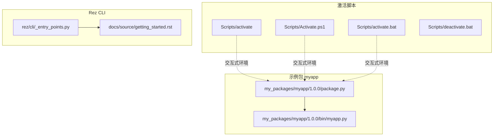
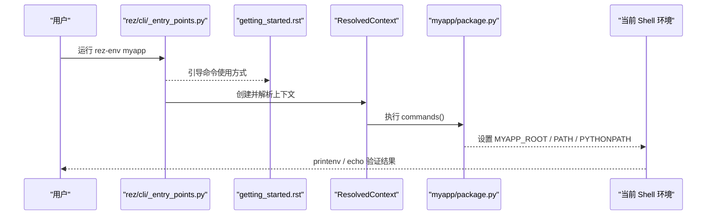
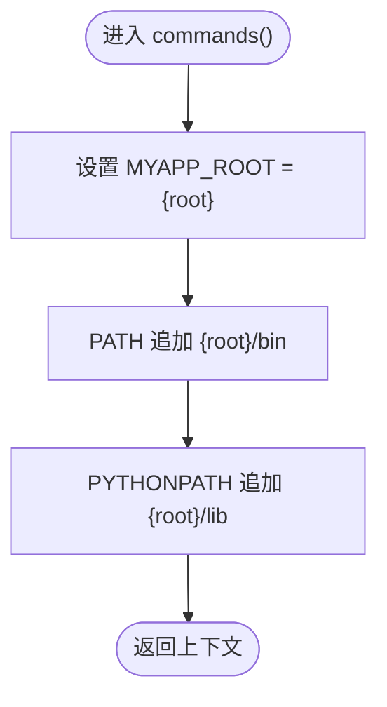
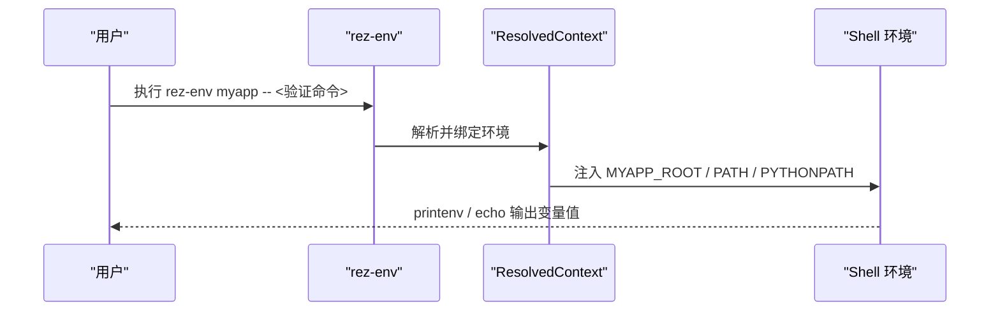
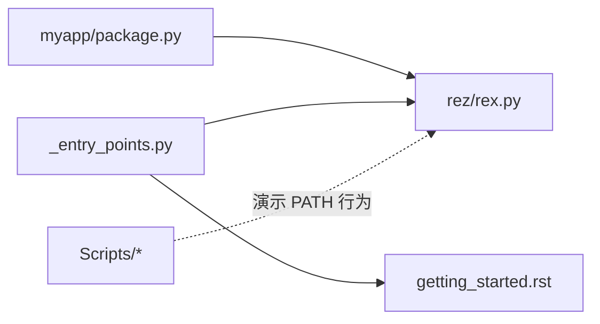

# 环境变量验证

<cite>
**本文引用的文件**
- [myapp/package.py](file://my_packages/myapp/1.0.0/package.py)
- [myapp/bin/myapp.py](file://my_packages/myapp/1.0.0/bin/myapp.py)
- [Scripts/activate](file://Scripts/activate)
- [Scripts/Activate.ps1](file://Scripts/Activate.ps1)
- [Scripts/activate.bat](file://Scripts/activate.bat)
- [Scripts/deactivate.bat](file://Scripts/deactivate.bat)
- [REZTEST_使用说明.md](file://REZTEST_使用说明.md)
- [README.md](file://README.md)
- [test.py](file://test.py)
- [rez/cli/_entry_points.py](file://rez-3.3.0/src/rez/cli/_entry_points.py)
- [getting_started.rst](file://rez-3.3.0/docs/source/getting_started.rst)
- [package_commands.rst](file://rez-3.3.0/docs/source/package_commands.rst)
- [rex.py](file://rez-3.3.0/src/rez/rex.py)
- [test_rex.py](file://rez-3.3.0/src/rez/tests/test_rex.py)
</cite>

## 目录
1. [简介](#简介)
2. [项目结构](#项目结构)
3. [核心组件](#核心组件)
4. [架构总览](#架构总览)
5. [详细组件分析](#详细组件分析)
6. [依赖分析](#依赖分析)
7. [性能考虑](#性能考虑)
8. [故障排查指南](#故障排查指南)
9. [结论](#结论)
10. [附录](#附录)

## 简介
本章节聚焦于“环境变量验证”的开发实践，围绕 myapp 包示例，系统讲解如何验证 package.py 中 commands() 函数定义的环境变量（如 MYAPP_ROOT、PATH、PYTHONPATH）是否正确生效；如何使用 rez-env 命令激活环境后，通过 printenv 或 echo 检查实际值；以及如何在 CI/CD 流程中以脚本方式自动化校验环境变量。同时给出常见问题的诊断与修复方法，覆盖 PATH 未正确追加、{root} 变量未替换、PYTHONPATH 路径错误等典型场景。

## 项目结构
本项目包含一个示例包 myapp，其 package.py 定义了环境变量注入逻辑；同时提供多平台激活脚本（bash、PowerShell、cmd），用于演示环境变量在交互式 shell 中的加载行为。README 和使用说明文档提供了快速开始与调试建议。

图表来源
- [myapp/package.py](file://my_packages/myapp/1.0.0/package.py#L1-L33)
- [myapp/bin/myapp.py](file://my_packages/myapp/1.0.0/bin/myapp.py#L1-L6)
- [Scripts/activate](file://Scripts/activate#L1-L67)
- [Scripts/Activate.ps1](file://Scripts/Activate.ps1#L1-L438)
- [Scripts/activate.bat](file://Scripts/activate.bat#L1-L34)
- [Scripts/deactivate.bat](file://Scripts/deactivate.bat#L1-L22)
- [rez/cli/_entry_points.py](file://rez-3.3.0/src/rez/cli/_entry_points.py#L52-L104)
- [getting_started.rst](file://rez-3.3.0/docs/source/getting_started.rst#L170-L189)

章节来源
- [README.md](file://README.md#L1-L155)
- [REZTEST_使用说明.md](file://REZTEST_使用说明.md#L1-L316)

## 核心组件
- myapp 包的 commands()：负责在环境激活时设置 MYAPP_ROOT、PATH、PYTHONPATH。
- Rez CLI 入口与命令：通过 rez-env 等命令创建并进入受控环境。
- 多平台激活脚本：演示交互式 shell 中 PATH、PYTHONHOME 等变量的处理方式。
- 环境变量控制流与路径拼接规则：由 Rez 的 REX 引擎与配置共同决定。

章节来源
- [myapp/package.py](file://my_packages/myapp/1.0.0/package.py#L16-L30)
- [rez/cli/_entry_points.py](file://rez-3.3.0/src/rez/cli/_entry_points.py#L52-L104)
- [getting_started.rst](file://rez-3.3.0/docs/source/getting_started.rst#L170-L189)
- [package_commands.rst](file://rez-3.3.0/docs/source/package_commands.rst#L52-L88)
- [rex.py](file://rez-3.3.0/src/rez/rex.py#L543-L617)

## 架构总览
下图展示了从命令行到环境变量生效的关键路径：CLI 入口 -> 解析上下文 -> 执行 package.py 的 commands() -> 应用到当前 shell 环境。

图表来源
- [rez/cli/_entry_points.py](file://rez-3.3.0/src/rez/cli/_entry_points.py#L52-L104)
- [getting_started.rst](file://rez-3.3.0/docs/source/getting_started.rst#L170-L189)
- [myapp/package.py](file://my_packages/myapp/1.0.0/package.py#L16-L30)

## 详细组件分析

### 组件A：myapp 包的 commands() 与环境变量注入
- MYAPP_ROOT：通过 env.MYAPP_ROOT = "{root}" 注入根目录占位符。
- PATH：env.PATH.append("{root}/bin") 将可执行目录追加到 PATH。
- PYTHONPATH：env.PYTHONPATH.append("{root}/lib") 将库目录追加到 PYTHONPATH。
- 变体：variants 字段声明了 Python 版本变体，影响解析后的上下文。

图表来源
- [myapp/package.py](file://my_packages/myapp/1.0.0/package.py#L16-L30)

章节来源
- [myapp/package.py](file://my_packages/myapp/1.0.0/package.py#L16-L30)

### 组件B：使用 rez-env 激活环境并验证
- 使用方式：根据官方文档，可通过单命令形式创建并运行命令，随后退出。
- 验证方式：在激活的环境中使用 printenv 或 echo 输出相关变量，确认值是否符合预期。

图表来源
- [getting_started.rst](file://rez-3.3.0/docs/source/getting_started.rst#L170-L189)

章节来源
- [getting_started.rst](file://rez-3.3.0/docs/source/getting_started.rst#L170-L189)

### 组件C：多平台激活脚本对 PATH 的影响
- Bash：在 activate 中将虚拟环境 Scripts 目录追加到 PATH，并清理旧值。
- PowerShell：在 Activate.ps1 中复制并修改 PATH，同时处理提示符与 PYTHONHOME。
- cmd：在 activate.bat 中设置 VIRTUAL_ENV 并将 Scripts 目录前置到 PATH。

这些脚本展示了 PATH 的“追加/前置”策略，有助于理解 PATH 变量在不同 shell 中的行为差异。

章节来源
- [Scripts/activate](file://Scripts/activate#L1-L67)
- [Scripts/Activate.ps1](file://Scripts/Activate.ps1#L1-L438)
- [Scripts/activate.bat](file://Scripts/activate.bat#L1-L34)
- [Scripts/deactivate.bat](file://Scripts/deactivate.bat#L1-L22)

### 组件D：PATH 追加与预置规则（REZ 内部机制）
- Rez 对 PATH 类变量的追加/预置有明确规则：首次 append/prepend 实际上会覆盖变量，而非简单拼接，以避免污染历史环境。
- REX 引擎支持路径规范化与 shell 特定转换，确保跨平台兼容。

章节来源
- [package_commands.rst](file://rez-3.3.0/docs/source/package_commands.rst#L52-L88)
- [rex.py](file://rez-3.3.0/src/rez/rex/rex.py#L543-L617)
- [test_rex.py](file://rez-3.3.0/src/rez/tests/test_rex.py#L102-L206)

## 依赖分析
- myapp/package.py 依赖 Rez 的 REX 引擎与配置系统，通过 env.* API 注入环境变量。
- Rez CLI 入口负责将用户命令转发至解析器与上下文构建器。
- 多平台激活脚本与 Rez 的 PATH 处理策略相互印证，帮助理解 PATH 的最终形态。

图表来源
- [myapp/package.py](file://my_packages/myapp/1.0.0/package.py#L16-L30)
- [rez/cli/_entry_points.py](file://rez-3.3.0/src/rez/cli/_entry_points.py#L52-L104)
- [getting_started.rst](file://rez-3.3.0/docs/source/getting_started.rst#L170-L189)
- [rex.py](file://rez-3.3.0/src/rez/rex.py#L543-L617)
- [Scripts/activate](file://Scripts/activate#L1-L67)

章节来源
- [myapp/package.py](file://my_packages/myapp/1.0.0/package.py#L16-L30)
- [rez/cli/_entry_points.py](file://rez-3.3.0/src/rez/cli/_entry_points.py#L52-L104)
- [getting_started.rst](file://rez-3.3.0/docs/source/getting_started.rst#L170-L189)
- [rex.py](file://rez-3.3.0/src/rez/rex.py#L543-L617)

## 性能考虑
- 环境变量注入通常开销极低，主要成本在于上下文解析与依赖计算。
- 在 CI/CD 中，建议仅在必要阶段进行环境变量验证，避免重复执行。
- 对于大型包集合，优先使用最小化请求（只包含待验证包）以减少解析时间。

## 故障排查指南

### 场景一：PATH 未正确追加
- 现象：执行 myapp 的可执行文件时报找不到命令。
- 排查要点：
  - 确认 package.py 中是否使用 env.PATH.append("{root}/bin")。
  - 在激活的环境中使用 printenv 或 echo 检查 PATH 是否包含 {root}/bin。
  - 若使用 Rez 的 PATH 规则，注意首次 append/prepend 会覆盖变量，后续再 append 会按顺序拼接。
- 修复建议：
  - 确保 {root} 占位符被正确解析为包根目录。
  - 在 CI/CD 中显式打印 PATH，定位缺失路径。

章节来源
- [myapp/package.py](file://my_packages/myapp/1.0.0/package.py#L16-L30)
- [package_commands.rst](file://rez-3.3.0/docs/source/package_commands.rst#L52-L88)
- [test_rex.py](file://rez-3.3.0/src/rez/tests/test_rex.py#L102-L206)

### 场景二：{root} 变量未替换
- 现象：PATH/PYTHONPATH 中出现原始字符串 {root}，而非真实路径。
- 排查要点：
  - 确认 package.py 中使用的是 env.PATH.append("{root}/bin") 形式。
  - 在 CI/CD 中打印环境变量，确认 {root} 是否被替换。
- 修复建议：
  - 检查包解析是否成功，确认包路径与版本满足要求。
  - 使用 Rez 的上下文导出能力（如导出环境配置文件）辅助定位。

章节来源
- [myapp/package.py](file://my_packages/myapp/1.0.0/package.py#L16-L30)
- [REZTEST_使用说明.md](file://REZTEST_使用说明.md#L1-L316)

### 场景三：PYTHONPATH 路径错误
- 现象：Python 导入模块失败，提示找不到模块。
- 排查要点：
  - 检查 env.PYTHONPATH.append("{root}/lib") 是否被正确执行。
  - 在激活环境中打印 PYTHONPATH，确认包含 {root}/lib。
  - 注意 PATH 与 PYTHONPATH 的拼接顺序与分隔符（os.pathsep）。
- 修复建议：
  - 使用 Rez 的调试输出（如打印环境变量）定位问题。
  - 在 CI/CD 中加入“导入测试”，验证模块可被正确导入。

章节来源
- [myapp/package.py](file://my_packages/myapp/1.0.0/package.py#L16-L30)
- [test_rex.py](file://rez-3.3.0/src/rez/tests/test_rex.py#L102-L206)

### 场景四：交互式 shell 与 Rez 环境不一致
- 现象：在交互式 shell 中 PATH 正常，但通过 rez-env 运行命令时异常。
- 排查要点：
  - 对比交互式 shell 的激活脚本（Scripts/*）与 Rez 的上下文注入逻辑。
  - 使用 printenv 或 echo 在两种环境下分别输出 PATH/PYTHONPATH。
- 修复建议：
  - 在 CI/CD 中直接使用 rez-env 运行验证脚本，避免 shell 初始化差异导致的误判。

章节来源
- [Scripts/activate](file://Scripts/activate#L1-L67)
- [Scripts/Activate.ps1](file://Scripts/Activate.ps1#L1-L438)
- [Scripts/activate.bat](file://Scripts/activate.bat#L1-L34)
- [Scripts/deactivate.bat](file://Scripts/deactivate.bat#L1-L22)

## 结论
- 验证环境变量的核心在于：确认 package.py 的 commands() 正确设置 MYAPP_ROOT、PATH、PYTHONPATH；通过 printenv/echo 在激活环境中核对值；在 CI/CD 中以脚本化方式自动化校验。
- Rez 的 PATH 追加规则与路径规范化机制是理解跨平台兼容性的关键。
- 常见问题多源于 {root} 未替换、PATH 未正确追加或 PYTHONPATH 路径错误，结合调试输出与最小化验证步骤可快速定位并修复。

## 附录

### A. 使用 printenv/echo 验证环境变量
- 在激活的环境中执行：
  - printenv MYAPP_ROOT
  - echo $PATH（Linux/macOS）或 echo %PATH%（Windows）
  - echo $PYTHONPATH（Linux/macOS）或 echo %PYTHONPATH%（Windows）

章节来源
- [getting_started.rst](file://rez-3.3.0/docs/source/getting_started.rst#L170-L189)

### B. 在 CI/CD 中自动化验证的脚本思路
- 步骤建议：
  1) 使用 rez-env 创建目标包环境并运行验证命令。
  2) 在同一命令中打印关键环境变量（MYAPP_ROOT、PATH、PYTHONPATH）。
  3) 对 PATH/PYTHONPATH 进行断言（包含期望路径、顺序正确）。
  4) 对应用入口进行功能测试（如 myapp 脚本输出）。
- 参考路径：
  - [test.py](file://test.py#L1-L87)：演示如何通过 Python API 获取 Rez 信息与包列表，可借鉴其“打印环境变量”的思路。
  - [REZTEST_使用说明.md](file://REZTEST_使用说明.md#L1-L316)：包含调试环境变量的示例命令。

章节来源
- [test.py](file://test.py#L1-L87)
- [REZTEST_使用说明.md](file://REZTEST_使用说明.md#L1-L316)