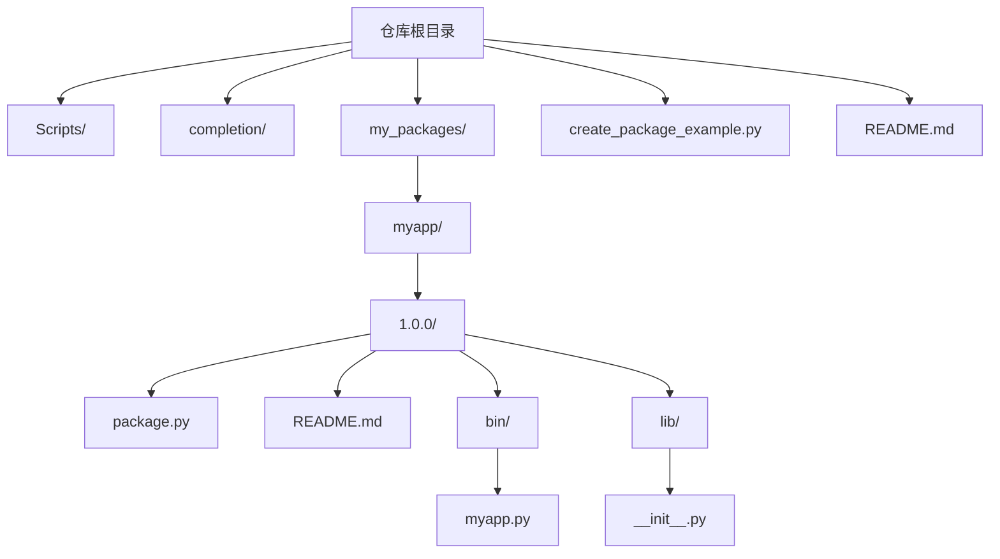
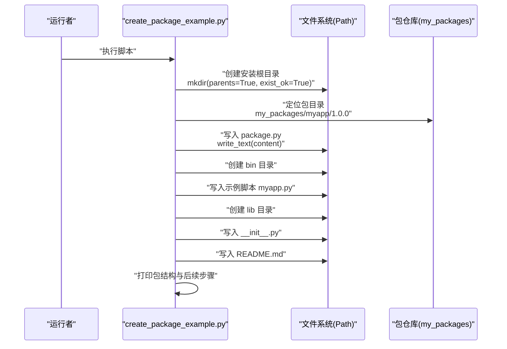
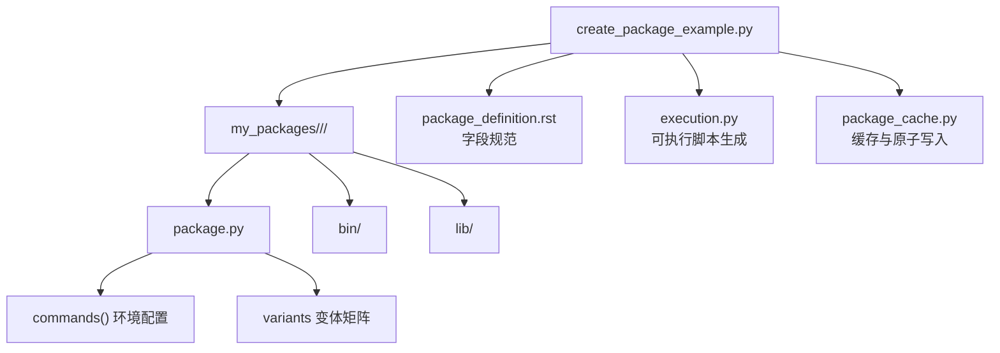

# 脚本化包创建

<cite>
**本文引用的文件**
- [create_package_example.py](file://create_package_example.py)
- [README.md](file://README.md)
- [my_packages/myapp/1.0.0/package.py](file://my_packages/myapp/1.0.0/package.py)
- [my_packages/myapp/1.0.0/README.md](file://my_packages/myapp/1.0.0/README.md)
- [rez-3.3.0/docs/source/package_definition.rst](file://rez-3.3.0/docs/source/package_definition.rst)
- [rez-3.3.0/src/rez/utils/execution.py](file://rez-3.3.0/src/rez/utils/execution.py)
- [rez-3.3.0/src/rez/data/tests/solver/packages/missing_variant_requires/1/package.py](file://rez-3.3.0/src/rez/data/tests/solver/packages/missing_variant_requires/1/package.py)
- [rez-3.3.0/src/rez/package_resources.py](file://rez-3.3.0/src/rez/package_resources.py)
- [rez-3.3.0/src/rez/serialise.py](file://rez-3.3.0/src/rez/serialise.py)
- [rez-3.3.0/src/rez/package_cache.py](file://rez-3.3.0/src/rez/package_cache.py)
- [rez-3.3.0/src/rezplugins/package_repository/filesystem.py](file://rez-3.3.0/src/rezplugins/package_repository/filesystem.py)
</cite>

## 目录
1. [简介](#简介)
2. [项目结构](#项目结构)
3. [核心组件](#核心组件)
4. [架构总览](#架构总览)
5. [详细组件分析](#详细组件分析)
6. [依赖关系分析](#依赖关系分析)
7. [性能考量](#性能考量)
8. [故障排查指南](#故障排查指南)
9. [结论](#结论)
10. [附录](#附录)

## 简介
本文件围绕脚本化创建 Rez 包的完整流程进行深入解析，重点分析 create_package_example.py 如何通过 Python API 自动化完成以下任务：
- 目录结构创建：按“包名/版本”层级建立安装根目录
- package.py 文件生成：生成标准的包定义文件，包含名称、版本、描述、依赖、变体、命令等字段
- bin 和 lib 子目录初始化：创建可执行脚本与库入口文件
- README 文档生成：提供使用说明与后续步骤指引
- 参数化扩展：如何将包名、版本号等改为可配置参数
- 错误处理与原子性：如何保证目录创建与文件写入的健壮性
- CI/CD 集成：如何将脚本纳入自动化流水线

## 项目结构
该仓库包含一个用于演示的脚本 create_package_example.py，以及一个示例包 myapp/1.0.0，展示了 Rez 包的标准目录布局与 package.py 的典型字段。

图表来源
- [create_package_example.py](file://create_package_example.py#L1-L179)
- [my_packages/myapp/1.0.0/package.py](file://my_packages/myapp/1.0.0/package.py#L1-L33)
- [my_packages/myapp/1.0.0/README.md](file://my_packages/myapp/1.0.0/README.md#L1-L27)

章节来源
- [README.md](file://README.md#L37-L77)
- [create_package_example.py](file://create_package_example.py#L1-L179)

## 核心组件
- create_package_example.py：自动化创建 Rez 包的主脚本，负责目录与文件的生成、内容填充与验证提示
- 示例包 myapp/1.0.0：仓库内已存在的包，作为脚本输出结果的对照与验证对象
- Rez 官方文档与源码：提供 package.py 字段规范、命令函数、变体、序列化与缓存等实现细节

章节来源
- [create_package_example.py](file://create_package_example.py#L1-L179)
- [my_packages/myapp/1.0.0/package.py](file://my_packages/myapp/1.0.0/package.py#L1-L33)
- [my_packages/myapp/1.0.0/README.md](file://my_packages/myapp/1.0.0/README.md#L1-L27)

## 架构总览
脚本执行流程分为四个阶段：目录准备、package.py 生成、bin/lib 初始化、README 生成与验证提示。下图展示了脚本内部的关键调用链与数据流。

图表来源
- [create_package_example.py](file://create_package_example.py#L1-L179)

## 详细组件分析

### 目录结构创建与初始化
- 脚本通过 Path 组合出包安装根目录路径，并使用 mkdir(parents=True, exist_ok=True) 递归创建目录
- 该策略避免了重复报错，且能一次性创建多级目录
- 与 Rez 官方文档对包仓库布局的约定一致：每个包的定义文件位于版本目录根部，其余内容由构建过程决定

章节来源
- [create_package_example.py](file://create_package_example.py#L16-L27)
- [rez-3.3.0/docs/source/basic_concepts.rst](file://rez-3.3.0/docs/source/basic_concepts.rst#L141-L169)

### package.py 文件生成
- 内容包含标准字段：name、version、description、authors、requires、system_requires、commands、variants、tools
- commands 函数用于设置环境变量（如 PATH、PYTHONPATH），并绑定 {root} 占位符
- variants 定义不同 Python 版本的变体，便于按需选择
- 脚本在写入后打印“语法正确”的验证提示，模拟对 package.py 的解析与信息提取

章节来源
- [create_package_example.py](file://create_package_example.py#L28-L64)
- [my_packages/myapp/1.0.0/package.py](file://my_packages/myapp/1.0.0/package.py#L1-L33)
- [rez-3.3.0/docs/source/package_definition.rst](file://rez-3.3.0/docs/source/package_definition.rst#L1-L39)

### bin 与 lib 子目录初始化
- bin 目录用于存放可执行脚本；脚本示例展示了如何读取环境变量并输出信息
- lib 目录用于存放 Python 库入口文件；__init__.py 提供包的初始化占位
- 若需要跨平台可执行脚本，可参考 Rez 的工具函数，自动创建 .py 与平台特定脚本

章节来源
- [create_package_example.py](file://create_package_example.py#L69-L91)
- [my_packages/myapp/1.0.0/README.md](file://my_packages/myapp/1.0.0/README.md#L1-L27)
- [rez-3.3.0/src/rez/utils/execution.py](file://rez-3.3.0/src/rez/utils/execution.py#L96-L177)

### README 文档生成
- README 提供包用途、依赖、使用方法（加载环境、在环境中执行命令、指定 Python 版本）等说明
- 为使用者提供快速上手与后续步骤指引，便于集成到本地开发或 CI 流程

章节来源
- [create_package_example.py](file://create_package_example.py#L92-L122)
- [my_packages/myapp/1.0.0/README.md](file://my_packages/myapp/1.0.0/README.md#L1-L27)

### 关键方法调用逻辑（Path 与 write_text）
- Path 对象用于组合路径，简化字符串拼接与跨平台兼容
- write_text 以 UTF-8 编码写入文件内容，确保中文字符正确显示
- 通过 sys.path.insert 将包目录加入模块搜索路径，模拟对 package.py 的解析与信息提取

章节来源
- [create_package_example.py](file://create_package_example.py#L138-L156)

### 参数化输入扩展（包名、版本号）
- 当前脚本将包名与版本硬编码为常量，可通过命令行参数或配置文件注入
- 建议新增参数：
  - 包名：用于构造 my_packages/<name>/<version>
  - 版本号：用于构造 my_packages/<name>/<version>
  - 依赖列表：requires 与 variants 可动态生成
  - 变体矩阵：根据目标平台与工具链生成变体集合
- 参数校验与默认值设置：对非法版本号、空包名等情况进行拦截

章节来源
- [create_package_example.py](file://create_package_example.py#L16-L21)
- [rez-3.3.0/src/rez/data/tests/solver/packages/missing_variant_requires/1/package.py](file://rez-3.3.0/src/rez/data/tests/solver/packages/missing_variant_requires/1/package.py#L1-L10)

### 错误处理与原子性保障
- 目录创建：使用 exist_ok=True 避免重复创建失败；若需严格控制，可在创建前检查是否存在并删除旧版本
- 文件写入：采用 write_text 写入文本；为提升健壮性，可引入临时文件 + 原子替换策略（先写入临时文件，再重命名为目标文件）
- 并发安全：Rez 在缓存与写入过程中使用锁与临时文件命名策略，避免竞态条件；可借鉴其思路在脚本中增加临时文件与重命名步骤
- 异常捕获：对文件写入与目录创建进行 try-except 包裹，记录错误并回滚（删除已创建的中间文件）

章节来源
- [create_package_example.py](file://create_package_example.py#L26-L27)
- [rez-3.3.0/src/rez/serialise.py](file://rez-3.3.0/src/rez/serialise.py#L45-L85)
- [rez-3.3.0/src/rez/package_cache.py](file://rez-3.3.0/src/rez/package_cache.py#L348-L388)

### CI/CD 集成建议
- 触发方式：在 CI 中以脚本参数化的方式调用 create_package_example.py，传入包名、版本、依赖等
- 步骤编排：
  - 代码变更触发流水线
  - 运行脚本生成包结构与 package.py
  - 执行 Rez 构建命令将包安装到本地仓库
  - 运行包验证脚本（如 practice_test.py）确认 commands 与变体可用
  - 将生成的包上传至制品库或发布到共享仓库
- 并发与缓存：使用临时文件与原子重命名减少并发写入冲突；利用 Rez 的缓存机制加速后续构建
- 日志与报告：记录脚本输出与构建日志，便于问题定位与审计

章节来源
- [create_package_example.py](file://create_package_example.py#L157-L174)
- [README.md](file://README.md#L78-L97)

## 依赖关系分析
脚本与 Rez 生态的关键依赖点如下：
- 包仓库布局：官方文档明确 package.py 位于版本目录根部，bin 与 lib 由构建决定
- 变体与命令：package.py 的 variants 与 commands 影响环境解析与工具可用性
- 序列化与缓存：Rez 在写入与缓存中采用临时文件与锁机制，保障一致性

图表来源
- [create_package_example.py](file://create_package_example.py#L1-L179)
- [rez-3.3.0/docs/source/package_definition.rst](file://rez-3.3.0/docs/source/package_definition.rst#L1-L39)
- [rez-3.3.0/src/rez/utils/execution.py](file://rez-3.3.0/src/rez/utils/execution.py#L96-L177)
- [rez-3.3.0/src/rez/package_cache.py](file://rez-3.3.0/src/rez/package_cache.py#L348-L388)

章节来源
- [rez-3.3.0/docs/source/package_definition.rst](file://rez-3.3.0/docs/source/package_definition.rst#L1-L39)
- [rez-3.3.0/src/rez/utils/execution.py](file://rez-3.3.0/src/rez/utils/execution.py#L96-L177)
- [rez-3.3.0/src/rez/package_cache.py](file://rez-3.3.0/src/rez/package_cache.py#L348-L388)

## 性能考量
- 目录与文件写入：批量写入时尽量合并为一次写入，减少磁盘 IO 次数
- 变体数量：variants 过多会增加解析与构建时间，建议按需拆分或分层
- 缓存利用：复用 Rez 的缓存与锁机制，避免重复写入与竞态
- 跨平台差异：Windows 下路径与权限处理需特别注意，必要时使用临时文件 + 原子重命名

## 故障排查指南
- 目录创建失败：检查权限与路径合法性；使用 exist_ok=True 与异常捕获
- 文件写入失败：确认编码（UTF-8）、磁盘空间与只读属性；采用临时文件 + 原子重命名
- package.py 解析错误：核对字段类型与语法；commands 中的 env 变量需符合 Rez 约定
- 变体缺失：确保 variants 中引用的依赖存在；参考测试用例中的变体依赖示例

章节来源
- [create_package_example.py](file://create_package_example.py#L138-L156)
- [rez-3.3.0/src/rez/data/tests/solver/packages/missing_variant_requires/1/package.py](file://rez-3.3.0/src/rez/data/tests/solver/packages/missing_variant_requires/1/package.py#L1-L10)

## 结论
create_package_example.py 提供了一个清晰、可扩展的脚本化包创建模板。通过参数化输入、健壮的错误处理与原子性写入策略，可将其无缝集成到本地开发与 CI/CD 流水线中。结合 Rez 的 package.py 字段规范与官方工具链，能够高效产出标准化、可维护的包结构。

## 附录
- 参考字段与示例：package_definition.rst
- 变体与命令：package_resources.py、package_definition.rst
- 可执行脚本生成：execution.py
- 原子写入与缓存：serialise.py、package_cache.py
- 包仓库布局：filesystem.py