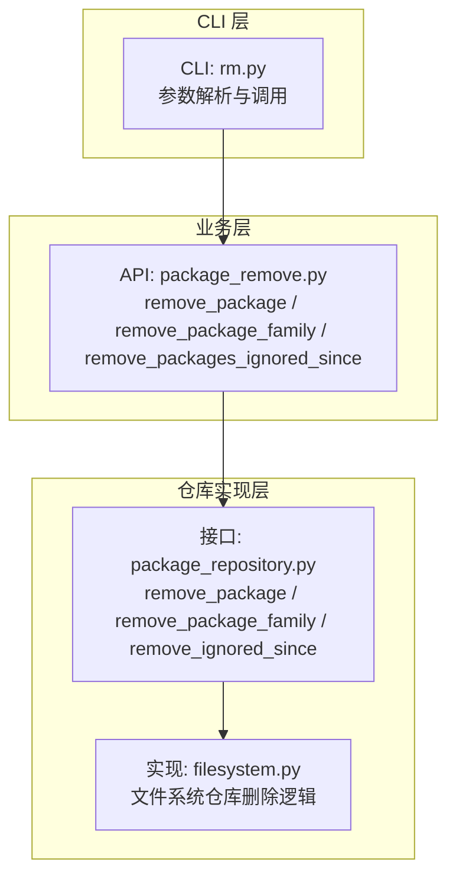
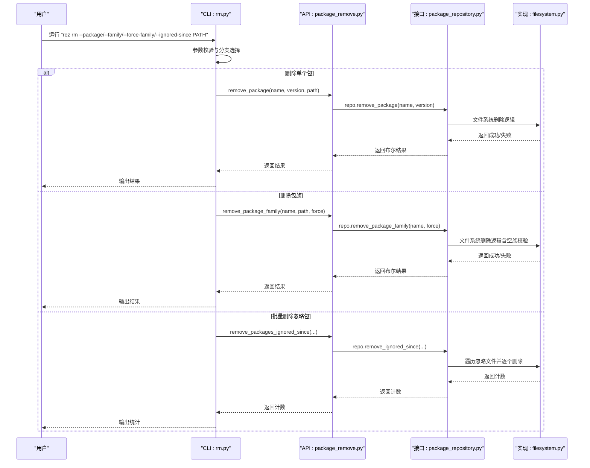
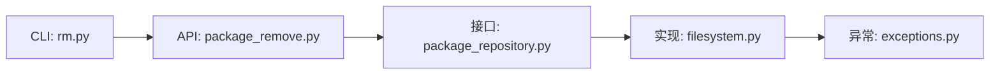

# 包卸载

<cite>
**本文引用的文件**
- [package_remove.py](file://rez-3.3.0/src/rez/package_remove.py)
- [rm.py](file://rez-3.3.0/src/rez/cli/rm.py)
- [package_repository.py](file://rez-3.3.0/src/rez/package_repository.py)
- [filesystem.py](file://rez-3.3.0/src/rezplugins/package_repository/filesystem.py)
- [exceptions.py](file://rez-3.3.0/src/rez/exceptions.py)
- [test_packages.py](file://rez-3.3.0/src/rez/tests/test_packages.py)
- [package.py](file://my_packages/maya/2022/package.py)
</cite>

## 目录
1. [简介](#简介)
2. [项目结构](#项目结构)
3. [核心组件](#核心组件)
4. [架构总览](#架构总览)
5. [详细组件分析](#详细组件分析)
6. [依赖关系分析](#依赖关系分析)
7. [性能与安全性考量](#性能与安全性考量)
8. [故障排查指南](#故障排查指南)
9. [结论](#结论)
10. [附录：命令与API使用示例](#附录命令与api使用示例)

## 简介
本篇文档围绕 Rez 的包卸载能力展开，重点解释如何安全地从包仓库中移除包或特定版本，并详细说明 CLI 命令 `rez rm` 的实现逻辑。文档特别强调：
- 卸载前的依赖与可见性检查，避免破坏现有解析环境；
- 使用 maya 2022 包作为示例，演示命令行与 API 的卸载流程；
- 强调卸载的不可逆性及生产环境注意事项；
- 提供卸载前验证步骤与备份策略，确保操作安全。

## 项目结构
Rez 的包卸载功能由三层组成：
- CLI 层：负责参数解析与用户交互，调用业务层函数；
- 业务层：封装仓库操作的高层 API，如删除包、删除包族、批量清理忽略包等；
- 仓库实现层：具体仓库类型（如文件系统）的删除逻辑与约束校验。

图表来源
- [rm.py](file://rez-3.3.0/src/rez/cli/rm.py#L1-L120)
- [package_remove.py](file://rez-3.3.0/src/rez/package_remove.py#L1-L80)
- [package_repository.py](file://rez-3.3.0/src/rez/package_repository.py#L250-L320)
- [filesystem.py](file://rez-3.3.0/src/rezplugins/package_repository/filesystem.py#L708-L802)

章节来源
- [rm.py](file://rez-3.3.0/src/rez/cli/rm.py#L1-L120)
- [package_remove.py](file://rez-3.3.0/src/rez/package_remove.py#L1-L80)
- [package_repository.py](file://rez-3.3.0/src/rez/package_repository.py#L250-L320)
- [filesystem.py](file://rez-3.3.0/src/rezplugins/package_repository/filesystem.py#L708-L802)

## 核心组件
- CLI 命令 `rez rm`：支持按包、按包族、强制按包族、按忽略时长批量删除；支持 dry-run（仅对忽略包清理生效）。
- 业务 API：
  - 删除指定包：remove_package(name, version, path)
  - 删除包族：remove_package_family(name, path, force=False)
  - 批量删除忽略包：remove_packages_ignored_since(days, paths=None, dry_run=False, verbose=False)
- 仓库接口与实现：
  - 接口定义了 remove_package/remove_package_family/remove_ignored_since；
  - 文件系统实现包含可见性检查、空族校验、组合包限制、删除目录与日志输出等。

章节来源
- [rm.py](file://rez-3.3.0/src/rez/cli/rm.py#L1-L120)
- [package_remove.py](file://rez-3.3.0/src/rez/package_remove.py#L1-L80)
- [package_repository.py](file://rez-3.3.0/src/rez/package_repository.py#L250-L320)
- [filesystem.py](file://rez-3.3.0/src/rezplugins/package_repository/filesystem.py#L708-L802)

## 架构总览
下面的序列图展示了 CLI 调用到仓库删除的完整链路，以及关键的错误处理点。

图表来源
- [rm.py](file://rez-3.3.0/src/rez/cli/rm.py#L37-L120)
- [package_remove.py](file://rez-3.3.0/src/rez/package_remove.py#L11-L80)
- [package_repository.py](file://rez-3.3.0/src/rez/package_repository.py#L250-L320)
- [filesystem.py](file://rez-3.3.0/src/rezplugins/package_repository/filesystem.py#L708-L802)

## 详细组件分析

### CLI 命令 `rez rm` 的实现逻辑
- 参数互斥组：--package、--family、--force-family、--ignored-since 互斥，且 PATH 为必填项（除 dry-run 的忽略包清理外）。
- 删除单个包：
  - 解析包名与版本（VersionedObject），调用 remove_package；
  - 不支持 dry-run；
  - 未找到包时返回错误码。
- 删除包族：
  - 支持普通删除（要求包族为空）与强制删除（force=True）；
  - 不支持 dry-run；
  - 抛出仓库错误时输出错误并退出。
- 批量删除忽略包：
  - 支持 dry-run 与 verbose；
  - 遍历仓库，识别 .ignore{ver} 文件，计算忽略时长，满足条件则删除对应包；
  - 返回实际删除数量。

章节来源
- [rm.py](file://rez-3.3.0/src/rez/cli/rm.py#L1-L120)

### 业务 API：删除包、包族与忽略包
- remove_package(name, version, path)
  - 将字符串版本转为 Version，获取仓库实例并调用 repo.remove_package；
  - 允许删除被忽略的包（隐藏包）。
- remove_package_family(name, path, force=False)
  - 获取仓库实例并调用 repo.remove_package_family；
  - force=False 时，必须保证包族为空，否则抛出仓库错误。
- remove_packages_ignored_since(days, paths=None, dry_run=False, verbose=False)
  - 遍历指定路径（默认 config.packages_path），逐个仓库执行 remove_ignored_since；
  - 返回删除数量（dry-run 下返回“将要删除”的数量）。

章节来源
- [package_remove.py](file://rez-3.3.0/src/rez/package_remove.py#L11-L80)

### 仓库接口与文件系统实现
- 接口方法
  - remove_package(pkg_name, pkg_version)：删除指定包，即使被忽略也应可删除；
  - remove_package_family(pkg_name, force=False)：删除空包族，force=True 可强制删除非空族；
  - remove_ignored_since(days, dry_run=False, verbose=False)：删除忽略时长达到阈值的包。
- 文件系统实现要点
  - 删除包：
    - 先尝试忽略该包（若存在忽略标记），再复制一份仓库进行可见性检查；
    - 若为组合式包风格，抛出不支持异常；
    - 删除包目录，同时取消忽略；
    - 返回成功。
  - 删除包族：
    - 复制仓库副本以绕过缓存与忽略；
    - 若 force=False，遍历包族内包，若非空则抛出仓库错误；
    - 成功后删除包族目录并触发变更通知。
  - 批量删除忽略包：
    - 遍历包族目录，筛选以忽略前缀开头的文件；
    - 计算忽略时长，满足阈值则调用 remove_package 并统计数量；
    - dry-run 模式下仅统计不删除。

章节来源
- [package_repository.py](file://rez-3.3.0/src/rez/package_repository.py#L250-L320)
- [filesystem.py](file://rez-3.3.0/src/rezplugins/package_repository/filesystem.py#L708-L802)

### 错误与异常处理
- PackageRepositoryError：仓库相关错误，如非空包族删除、组合式包删除不支持等；
- ResourceError：资源相关错误，如仓库类型或位置不匹配；
- CLI 层在遇到仓库错误时会打印错误信息并退出；
- 测试覆盖了删除包、删除包族（含强制删除）、批量删除忽略包的行为。

章节来源
- [exceptions.py](file://rez-3.3.0/src/rez/exceptions.py#L191-L193)
- [rm.py](file://rez-3.3.0/src/rez/cli/rm.py#L56-L83)
- [test_packages.py](file://rez-3.3.0/src/rez/tests/test_packages.py#L545-L617)

## 依赖关系分析
- CLI 依赖业务 API；
- 业务 API 依赖仓库接口；
- 仓库接口由具体实现类（如文件系统）提供；
- 文件系统实现内部依赖忽略机制与版本对象。

图表来源
- [rm.py](file://rez-3.3.0/src/rez/cli/rm.py#L1-L120)
- [package_remove.py](file://rez-3.3.0/src/rez/package_remove.py#L1-L80)
- [package_repository.py](file://rez-3.3.0/src/rez/package_repository.py#L250-L320)
- [filesystem.py](file://rez-3.3.0/src/rezplugins/package_repository/filesystem.py#L708-L802)
- [exceptions.py](file://rez-3.3.0/src/rez/exceptions.py#L191-L193)

章节来源
- [rm.py](file://rez-3.3.0/src/rez/cli/rm.py#L1-L120)
- [package_remove.py](file://rez-3.3.0/src/rez/package_remove.py#L1-L80)
- [package_repository.py](file://rez-3.3.0/src/rez/package_repository.py#L250-L320)
- [filesystem.py](file://rez-3.3.0/src/rezplugins/package_repository/filesystem.py#L708-L802)
- [exceptions.py](file://rez-3.3.0/src/rez/exceptions.py#L191-L193)

## 性能与安全性考量
- 性能
  - 文件系统仓库在删除前会复制一份仓库以绕过缓存与忽略，确保可见性判断准确，但会带来额外开销；
  - 批量删除忽略包时，按仓库遍历并逐个删除，复杂度与忽略包数量线性相关。
- 安全性
  - 删除包族默认要求包族为空，强制删除需显式传入 force=True；
  - 删除包时允许删除被忽略的包，但不会影响解析缓存；
  - 组合式包风格不支持删除，避免破坏组合结构；
  - dry-run 仅对批量忽略包清理有效，单包与包族删除不支持 dry-run。
- 生产环境建议
  - 操作前先执行“忽略包清理”dry-run，评估影响范围；
  - 对于非空包族，优先删除其中的版本后再删除包族；
  - 备份仓库目录或使用版本控制管理仓库变更；
  - 在 CI/CD 中将删除操作与审计日志结合，确保可追溯。

[本节为通用指导，无需列出章节来源]

## 故障排查指南
- “无法删除非空包族”
  - 现象：删除包族时报错，提示非空；
  - 处理：先删除包族内的所有版本，再删除包族；或使用 --force-family 强制删除（谨慎）。
- “组合式包删除不支持”
  - 现象：对组合式包执行删除报错；
  - 处理：此类包不支持直接删除，请通过其他方式维护。
- “包未找到”
  - 现象：删除单个包或包族返回未找到；
  - 处理：确认包名、版本与仓库路径正确；检查是否已被忽略但仍存在。
- “仓库类型或位置不匹配”
  - 现象：资源句柄与仓库类型/位置不一致；
  - 处理：确认 PATH 指向正确的仓库位置，避免跨挂载或别名导致的位置差异。
- “权限问题或目录不可写”
  - 现象：删除包目录失败；
  - 处理：检查目录权限与只读属性，必要时提升权限或修复只读标志。

章节来源
- [filesystem.py](file://rez-3.3.0/src/rezplugins/package_repository/filesystem.py#L708-L802)
- [exceptions.py](file://rez-3.3.0/src/rez/exceptions.py#L55-L78)
- [rm.py](file://rez-3.3.0/src/rez/cli/rm.py#L56-L83)

## 结论
Rez 的包卸载能力通过清晰的分层设计实现了安全可控的删除流程：CLI 层负责用户输入与流程调度，业务 API 提供统一的删除接口，仓库实现层保障删除行为的一致性与约束。对于 maya 2022 等包，既可通过命令行快速删除，也可通过 API 编排自动化流程。生产环境中务必遵循“先验证、后删除、再备份”的原则，确保操作可逆与可回滚。

[本节为总结，无需列出章节来源]

## 附录：命令与API使用示例

### 示例：使用 maya 2022 包
- maya 2022 包定义位于 my_packages/maya/2022/package.py，可用于本地仓库演示卸载。
- 仓库路径可指向 my_packages 或任意 Rez 包仓库目录。

章节来源
- [package.py](file://my_packages/maya/2022/package.py#L1-L9)

### 命令行示例（基于 CLI 实现）
- 删除单个包（PATH 必填）
  - 命令：rez rm --package "maya-2022" PATH
  - 行为：调用 remove_package，不支持 dry-run
- 删除包族（PATH 必填）
  - 命令：rez rm --family maya PATH
  - 行为：要求包族为空；若非空则报错
  - 强制删除：rez rm --force-family maya PATH
- 批量删除忽略包（可选 dry-run）
  - 命令：rez rm --ignored-since 7 PATH
  - 行为：删除忽略时长≥7天的包；支持 --dry-run 与 --verbose

章节来源
- [rm.py](file://rez-3.3.0/src/rez/cli/rm.py#L1-L120)

### API 使用示例（基于业务 API）
- 删除单个包
  - 函数：remove_package(name, version, path)
  - 适用场景：已知包名与版本，且仓库路径正确
- 删除包族
  - 函数：remove_package_family(name, path, force=False)
  - 适用场景：需要清理整个包族；force=True 时可强制删除非空族
- 批量删除忽略包
  - 函数：remove_packages_ignored_since(days, paths=None, dry_run=False, verbose=False)
  - 适用场景：定期清理长期忽略的包，dry-run 可预估影响

章节来源
- [package_remove.py](file://rez-3.3.0/src/rez/package_remove.py#L11-L80)

### 卸载前验证与备份策略
- 验证步骤
  - 使用“忽略包清理”dry-run：rez rm --ignored-since N --dry-run PATH，查看将被删除的包列表；
  - 检查包族是否为空：删除包族前先删除全部版本；
  - 确认仓库类型与位置：避免跨挂载或别名导致的资源句柄不匹配。
- 备份策略
  - 仓库目录快照：删除前对 PATH 进行备份；
  - 版本控制：将仓库纳入版本管理，记录每次变更；
  - 日志审计：在 CI/CD 中记录删除操作与结果，便于回溯。

章节来源
- [rm.py](file://rez-3.3.0/src/rez/cli/rm.py#L85-L107)
- [filesystem.py](file://rez-3.3.0/src/rezplugins/package_repository/filesystem.py#L764-L802)