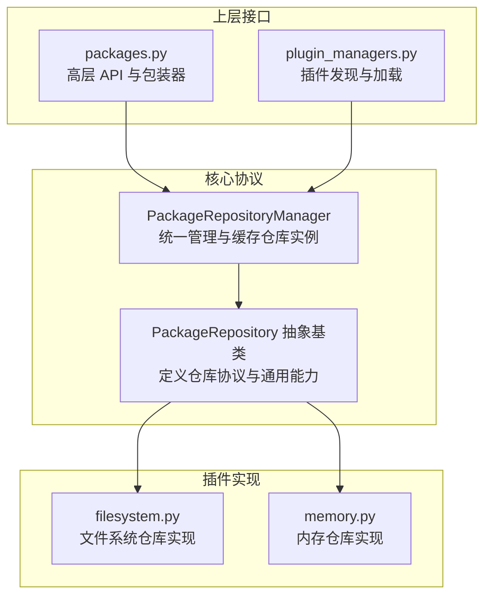
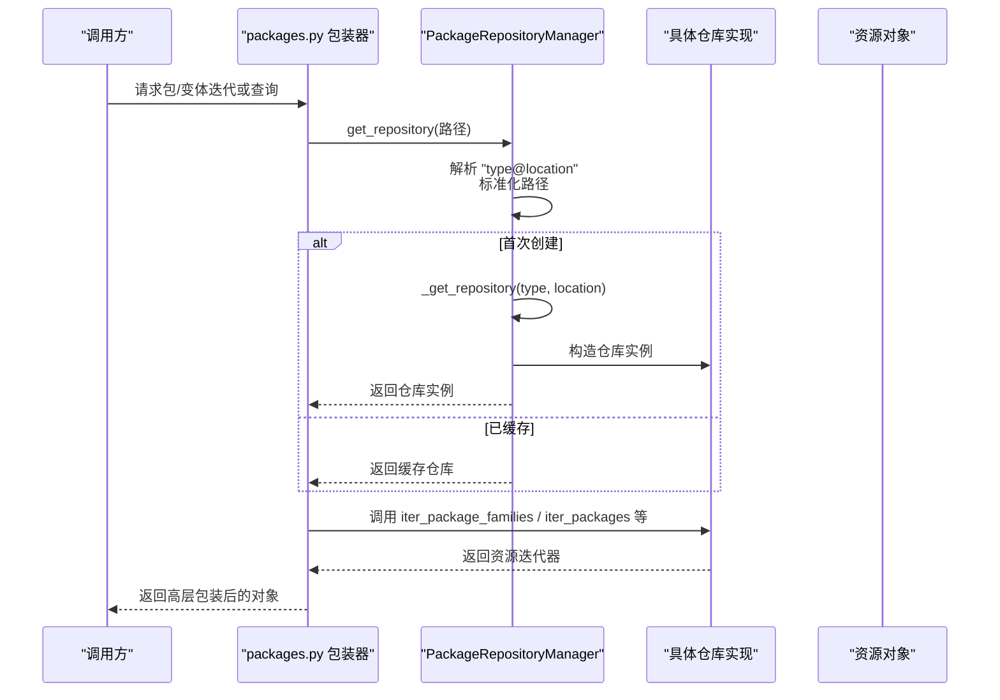
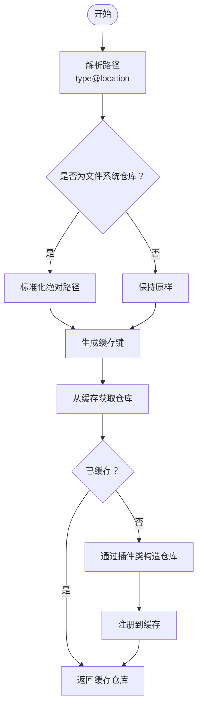
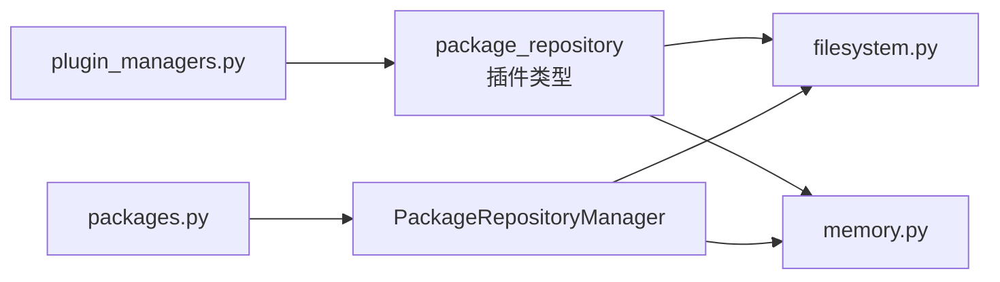

# 仓库协议与接口

<cite>
**本文引用的文件列表**
- [package_repository.py](file://rez/src/rez/package_repository.py)
- [filesystem.py](file://rez/src/rezplugins/package_repository/filesystem.py)
- [memory.py](file://rez/src/rezplugins/package_repository/memory.py)
- [packages.py](file://rez/src/rez/packages.py)
- [plugin_managers.py](file://rez/src/rez/plugin_managers.py)
- [test_package_repository.py](file://rez/src/rez/tests/test_package_repository.py)
- [test_plugin_manager.py](file://rez/src/rez/tests/test_plugin_manager.py)
</cite>

## 目录
1. [简介](#简介)
2. [项目结构](#项目结构)
3. [核心组件](#核心组件)
4. [架构总览](#架构总览)
5. [详细组件分析](#详细组件分析)
6. [依赖关系分析](#依赖关系分析)
7. [性能考量](#性能考量)
8. [故障排查指南](#故障排查指南)
9. [结论](#结论)

## 简介
本文件围绕 Rez 的“仓库协议与接口”展开，重点解释：
- 基于 PackageRepository 抽象基类定义的仓库协议，包括 iter_package_families、iter_packages 等核心接口的契约；
- 插件系统如何通过 rezplugins/package_repository 目录下的 filesystem 与 memory 实现扩展仓库类型；
- get_repository 函数如何利用 PackageRepositoryManager 根据路径创建具体仓库实例；
- 结合 memory.py 中的 create_memory_package_repository 函数，展示内存仓库的创建与使用场景；
- uid 属性在仓库唯一性识别中的作用。

## 项目结构
Rez 将仓库协议定义在核心模块中，并通过插件机制提供多种实现（如 filesystem、memory）。包的高层 API 通过 packages.py 暴露给上层调用者，插件加载由 plugin_managers.py 负责。

图表来源
- [package_repository.py](file://rez/src/rez/package_repository.py#L103-L121)
- [filesystem.py](file://rez/src/rezplugins/package_repository/filesystem.py#L431-L520)
- [memory.py](file://rez/src/rezplugins/package_repository/memory.py#L107-L169)
- [packages.py](file://rez/src/rez/packages.py#L1-L60)
- [plugin_managers.py](file://rez/src/rez/plugin_managers.py#L120-L200)

章节来源
- [package_repository.py](file://rez/src/rez/package_repository.py#L103-L121)
- [filesystem.py](file://rez/src/rezplugins/package_repository/filesystem.py#L431-L520)
- [memory.py](file://rez/src/rezplugins/package_repository/memory.py#L107-L169)
- [packages.py](file://rez/src/rez/packages.py#L1-L60)
- [plugin_managers.py](file://rez/src/rez/plugin_managers.py#L120-L200)

## 核心组件
- PackageRepository 抽象基类：定义仓库协议、资源注册、缓存清理、uid 唯一标识、资源获取等通用能力。
- PackageRepositoryManager：负责解析路径、按需创建并缓存仓库实例、跨仓库资源定位与一致性校验。
- 具体仓库实现：
  - 文件系统仓库（filesystem）：面向磁盘的包族、包、变体资源，支持组合式包文件。
  - 内存仓库（memory）：面向内存的数据结构，用于临时或程序化构建的包。

章节来源
- [package_repository.py](file://rez/src/rez/package_repository.py#L103-L121)
- [package_repository.py](file://rez/src/rez/package_repository.py#L514-L648)
- [filesystem.py](file://rez/src/rezplugins/package_repository/filesystem.py#L431-L520)
- [memory.py](file://rez/src/rezplugins/package_repository/memory.py#L107-L169)

## 架构总览
下图展示了从上层 API 到插件实现的整体调用链路与职责划分。

图表来源
- [packages.py](file://rez/src/rez/packages.py#L1-L60)
- [package_repository.py](file://rez/src/rez/package_repository.py#L537-L592)
- [package_repository.py](file://rez/src/rez/package_repository.py#L640-L648)

章节来源
- [packages.py](file://rez/src/rez/packages.py#L1-L60)
- [package_repository.py](file://rez/src/rez/package_repository.py#L537-L592)
- [package_repository.py](file://rez/src/rez/package_repository.py#L640-L648)

## 详细组件分析

### 1) 仓库协议与接口契约
- 抽象基类定义的核心接口：
  - iter_package_families：遍历仓库中的包族资源，返回无特定顺序的迭代器。
  - iter_packages：在给定包族资源下，遍历该家族内的包资源。
  - iter_variants：在给定包资源下，遍历该包内的变体资源。
  - get_package_family：按名称获取包族资源，不存在则返回空。
  - get_parent_package_family / get_parent_package：从包/变体资源反查父级。
  - get_package_payload_path：定义包载荷安装目标路径（由具体实现决定）。
- 资源注册与缓存：
  - register_resource：注册资源类型到资源池。
  - clear_caches：清空资源池缓存。
- 唯一性标识：
  - uid：持久化的唯一标识；默认实现为 (name(), location)，具体仓库可覆盖以保证跨平台/网络路径的一致性。

章节来源
- [package_repository.py](file://rez/src/rez/package_repository.py#L145-L172)
- [package_repository.py](file://rez/src/rez/package_repository.py#L172-L200)
- [package_repository.py](file://rez/src/rez/package_repository.py#L200-L220)
- [package_repository.py](file://rez/src/rez/package_repository.py#L487-L512)
- [package_repository.py](file://rez/src/rez/package_repository.py#L103-L121)

### 2) 插件系统与仓库实现扩展
- 插件发现与加载：
  - plugin_managers.py 通过命名空间包与入口点扫描，自动发现并加载位于 rezplugins/package_repository 下的插件模块。
  - 同名插件会按搜索路径顺序覆盖，允许用户自定义实现覆盖内置实现。
- 文件系统仓库（filesystem）：
  - 提供 FileSystemPackageRepository，注册多种资源类型（包族、包、变体及其组合形式），并实现上述核心接口。
  - 对路径大小写不敏感平台进行规范化处理，避免误判不同仓库。
  - 提供 get_package_from_uri / get_variant_from_uri 等 URI 定位能力。
- 内存仓库（memory）：
  - 提供 MemoryPackageRepository，注册内存型资源类型，数据存储在字典中。
  - 提供 create_repository 静态工厂方法，绕过全局管理器，直接创建临时内存仓库，适合程序化构建与测试场景。

章节来源
- [plugin_managers.py](file://rez/src/rez/plugin_managers.py#L120-L200)
- [filesystem.py](file://rez/src/rezplugins/package_repository/filesystem.py#L431-L520)
- [filesystem.py](file://rez/src/rezplugins/package_repository/filesystem.py#L552-L558)
- [filesystem.py](file://rez/src/rezplugins/package_repository/filesystem.py#L563-L575)
- [memory.py](file://rez/src/rezplugins/package_repository/memory.py#L133-L156)
- [memory.py](file://rez/src/rezplugins/package_repository/memory.py#L107-L169)
- [test_plugin_manager.py](file://rez/src/rez/tests/test_plugin_manager.py#L74-L113)

### 3) get_repository 与 PackageRepositoryManager
- 路径解析与标准化：
  - 支持形如 "type@location" 的路径；若省略 type，默认为 "filesystem"。
  - 文件系统仓库对路径执行绝对路径规范化，避免同路径不同表示导致的误判。
- 实例缓存与复用：
  - 使用字典缓存已创建的仓库实例，避免重复构造。
- 资源定位：
  - get_resource / get_resource_from_handle：根据仓库类型与位置获取资源，内部通过管理器获取仓库后再委托仓库完成资源获取。

章节来源
- [package_repository.py](file://rez/src/rez/package_repository.py#L537-L592)
- [package_repository.py](file://rez/src/rez/package_repository.py#L593-L648)

### 4) 内存仓库的创建与使用场景
- create_memory_package_repository（静态工厂）：
  - 直接创建 MemoryPackageRepository，不参与全局缓存，适合临时数据与程序化构建。
  - 通过 ResourcePool(cache_size=None) 关闭缓存，确保临时性。
- 使用场景：
  - 开发者工作区中的“开发者包”加载；
  - 通过 PackageMaker 程序化生成包时的临时存储；
  - 单元测试中构造可控的内存仓库以隔离外部环境。

章节来源
- [memory.py](file://rez/src/rezplugins/package_repository/memory.py#L133-L156)
- [memory.py](file://rez/src/rezplugins/package_repository/memory.py#L157-L169)

### 5) uid 属性与仓库唯一性识别
- 默认 uid 实现：
  - 返回 (name(), location)，适用于大多数本地路径场景。
- 文件系统仓库的增强实现：
  - 在存在目录的情况下，附加 inode 号，确保即使路径别名或符号链接导致路径不同，也能正确识别同一仓库。
- 管理器层面的比较：
  - are_same：通过比较两个路径对应的仓库 uid 是否相等，从而判断它们是否指向同一仓库。

图表来源
- [package_repository.py](file://rez/src/rez/package_repository.py#L537-L592)
- [filesystem.py](file://rez/src/rezplugins/package_repository/filesystem.py#L552-L558)

章节来源
- [package_repository.py](file://rez/src/rez/package_repository.py#L103-L121)
- [package_repository.py](file://rez/src/rez/package_repository.py#L586-L592)
- [filesystem.py](file://rez/src/rezplugins/package_repository/filesystem.py#L552-L558)

### 6) 接口契约与实现一致性
- 文件系统仓库实现：
  - iter_package_families / iter_packages / iter_variants：委托资源对象迭代，保证与资源模型一致。
  - get_package_family：基于资源池获取包族资源。
- 内存仓库实现：
  - 与文件系统仓库相同的接口契约，但数据来源于内存字典。
  - get_package_family / iter_package_families / iter_packages / iter_variants：均通过对应资源类的迭代逻辑实现。

章节来源
- [filesystem.py](file://rez/src/rezplugins/package_repository/filesystem.py#L559-L588)
- [filesystem.py](file://rez/src/rezplugins/package_repository/filesystem.py#L563-L575)
- [memory.py](file://rez/src/rezplugins/package_repository/memory.py#L170-L198)

## 依赖关系分析
- 插件发现依赖：
  - plugin_managers.py 通过命名空间包与入口点扫描，加载 rezplugins/package_repository 下的实现模块。
- 仓库实例依赖：
  - PackageRepositoryManager 通过插件管理器获取具体仓库类并构造实例。
- 上层 API 依赖：
  - packages.py 通过 package_repository_manager 统一访问仓库，屏蔽底层实现差异。

图表来源
- [plugin_managers.py](file://rez/src/rez/plugin_managers.py#L120-L200)
- [package_repository.py](file://rez/src/rez/package_repository.py#L640-L648)
- [packages.py](file://rez/src/rez/packages.py#L1-L60)

章节来源
- [plugin_managers.py](file://rez/src/rez/plugin_managers.py#L120-L200)
- [package_repository.py](file://rez/src/rez/package_repository.py#L640-L648)
- [packages.py](file://rez/src/rez/packages.py#L1-L60)

## 性能考量
- 缓存策略：
  - 资源池缓存：仓库与资源对象均可能被缓存，减少重复 IO 与解析开销。
  - 文件系统仓库对目录枚举与文件读取使用 LRU 缓存与可选 memcache 装饰器，提升大仓库访问效率。
- 路径规范化：
  - 文件系统仓库对路径进行规范化，避免大小写与符号链接导致的重复扫描与误判。
- 临时内存仓库：
  - create_repository 使用禁用缓存的 ResourcePool，避免临时数据污染全局缓存。

章节来源
- [filesystem.py](file://rez/src/rezplugins/package_repository/filesystem.py#L528-L551)
- [memory.py](file://rez/src/rezplugins/package_repository/memory.py#L133-L156)

## 故障排查指南
- 插件覆盖问题：
  - 若自定义插件未生效，检查 plugin_path 与命名空间包路径配置，确认插件模块已被正确加载且同名插件按预期覆盖。
- 路径大小写不一致：
  - 在大小写不敏感平台上，确保路径规范化后仍能区分不同仓库；必要时使用 inode 等持久标识。
- 资源句柄不匹配：
  - get_resource_from_handle 会对仓库类型与位置进行严格校验，若抛出错误，检查传入的变量是否与仓库实际信息一致。
- 测试验证：
  - 可参考测试用例验证仓库行为，例如大小写不一致导致的异常情况。

章节来源
- [test_plugin_manager.py](file://rez/src/rez/tests/test_plugin_manager.py#L74-L113)
- [test_package_repository.py](file://rez/src/rez/tests/test_package_repository.py#L27-L42)
- [package_repository.py](file://rez/src/rez/package_repository.py#L457-L486)

## 结论
- PackageRepository 抽象基类定义了清晰的仓库协议，确保不同实现（filesystem、memory）在接口层保持一致。
- 插件系统通过命名空间包与入口点实现灵活扩展，支持用户自定义覆盖内置实现。
- PackageRepositoryManager 提供统一的路径解析、实例缓存与资源定位能力，简化上层调用。
- 内存仓库的 create_repository 为临时数据与程序化构建提供了高效、隔离的解决方案。
- uid 属性在跨路径差异场景下保障仓库唯一性识别的准确性，是实现 are_same 等一致性判断的关键。