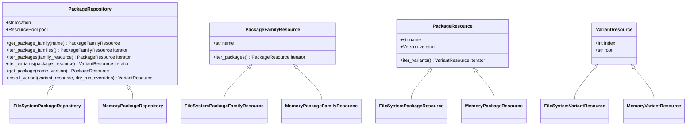

# 包发现机制

<cite>
**本文档中引用的文件**   
- [packages.py](file://rez-3.3.0\src\rez\packages.py)
- [package_repository.py](file://rez-3.3.0\src\rez\package_repository.py)
- [filesystem.py](file://rez-3.3.0\src\rezplugins\package_repository\filesystem.py)
- [memory.py](file://rez-3.3.0\src\rezplugins\package_repository\memory.py)
- [package_cache.py](file://rez-3.3.0\src\rez\package_cache.py)
- [config.py](file://rez-3.3.0\src\rez\config.py)
- [my_packages](file://my_packages)
</cite>

## 目录
1. [包发现机制概述](#包发现机制概述)
2. [核心发现函数分析](#核心发现函数分析)
3. [包仓库接口与实现](#包仓库接口与实现)
4. [包搜索路径与优先级](#包搜索路径与优先级)
5. [包命名、版本解析与变体匹配](#包命名版本解析与变体匹配)
6. [包缓存机制](#包缓存机制)
7. [多仓库环境下的冲突解决](#多仓库环境下的冲突解决)
8. [调试与日志分析](#调试与日志分析)

## 包发现机制概述

Rez的包发现机制是其核心功能之一，它允许系统在本地或远程仓库中动态地查找和加载软件包。该机制基于`PackageRepository`接口，通过`packages.py`中的`get_package`和`iter_packages`函数实现。Rez支持多种仓库类型，包括基于文件系统的仓库和内存仓库，这些仓库通过插件系统进行管理。包发现过程遵循特定的搜索顺序和优先级规则，确保在多仓库环境中能够正确解析包依赖。

**Section sources**
- [packages.py](file://rez-3.3.0\src\rez\packages.py#L1-L50)
- [package_repository.py](file://rez-3.3.0\src\rez\package_repository.py#L1-L50)

## 核心发现函数分析

### get_package函数

`get_package`函数是Rez包发现的核心，它通过指定包名和版本号来查找并返回一个包实例。该函数首先将版本号转换为版本范围，然后调用`iter_packages`函数获取一个迭代器，从中获取第一个匹配的包。如果未找到匹配的包，则返回`None`。


**Diagram sources**
- [packages.py](file://rez-3.3.0\src\rez\packages.py#L577-L598)

### iter_packages函数

`iter_packages`函数用于迭代指定包名的所有包实例。它首先通过`_get_families`函数获取所有匹配的包族，然后遍历这些包族，从每个包族中获取包实例。为了避免重复，函数使用一个集合来记录已见过的包（通过包名和版本号的组合）。如果指定了版本范围，函数还会检查包的版本是否在该范围内。


**Diagram sources**
- [packages.py](file://rez-3.3.0\src\rez\packages.py#L541-L575)

## 包仓库接口与实现

### PackageRepository接口

`PackageRepository`是所有包仓库的基类，定义了包仓库的基本行为。它提供了获取包族、包和变体的方法，以及安装和移除包的功能。每个仓库实例都有一个唯一的标识符（uid），用于区分不同的仓库实例。



**Diagram sources**
- [package_repository.py](file://rez-3.3.0\src\rez\package_repository.py#L59-L400)

### 文件系统仓库实现

`FileSystemPackageRepository`是基于文件系统的包仓库实现。它将包存储在特定的目录结构中，例如`/LOCATION/pkgA/1.0.0/package.py`。该实现支持两种存储格式：一种是每个包版本存储在一个单独的目录中，另一种是将所有包版本存储在一个文件中（称为“combined”格式）。


**Diagram sources**
- [filesystem.py](file://rez-3.3.0\src\rezplugins\package_repository\filesystem.py#L431-L800)

### 内存仓库实现

`MemoryPackageRepository`是基于内存的包仓库实现，主要用于存储程序化创建的包或开发中的包。它将包数据存储在一个字典中，组织形式如下：
```python
{
    "foo": {
        "1.0.0": {
            "name": "foo",
            "version": "1.0.0",
            "description": "does foo-like things.",
        }
    },
    "bah": {
        "_NO_VERSION": {
            "name": "bah",
            "description": "does bah-like things.",
            "requires": ["python-2.6", "foo-1+"]
        }
    }
}
```

**Diagram sources**
- [memory.py](file://rez-3.3.0\src\rezplugins\package_repository\memory.py#L107-L202)

## 包搜索路径与优先级

### REZ_PACKAGES_PATH环境变量

`REZ_PACKAGES_PATH`环境变量用于自定义包搜索路径。该变量的值是一个路径列表，Rez会按照列表中的顺序依次搜索这些路径。每个路径可以是文件系统路径，也可以是`type@location`形式的字符串，其中`type`指定了仓库类型（如`filesystem`或`memory`），`location`指定了仓库位置。


**Diagram sources**
- [package_repository.py](file://rez-3.3.0\src\rez\package_repository.py#L537-L574)
- [config.py](file://rez-3.3.0\src\rez\config.py#L364-L366)

### 搜索顺序与优先级

Rez的包搜索遵循特定的顺序和优先级规则。当在多个仓库中发现同名同版本的包时，搜索路径中靠前的仓库中的包具有更高的优先级。这意味着，如果在第一个仓库中找到了匹配的包，Rez将不会继续搜索后续仓库中的同名包。


**Diagram sources**
- [packages.py](file://rez-3.3.0\src\rez\packages.py#L541-L575)

## 包命名、版本解析与变体匹配

### 包命名与版本解析

Rez中的包命名遵循特定的格式，通常为`name-version`。版本号遵循语义化版本规范，例如`1.0.0`。Rez使用`Version`类来表示和解析版本号，并使用`VersionRange`类来表示版本范围。版本范围可以是精确匹配（`==1.0.0`）、大于等于（`>=1.0.0`）、小于（`<2.0.0`）等。


**Section sources**
- [packages.py](file://rez-3.3.0\src\rez\packages.py#L193-L243)
- [my_packages](file://my_packages)

### 变体匹配

变体（Variant）是包的特定配置或构建变体。一个包可以有多个变体，每个变体通过一个索引（index）来标识。Rez在解析包时，会根据请求的变体要求来匹配最合适的变体。


**Diagram sources**
- [packages.py](file://rez-3.3.0\src\rez\packages.py#L304-L323)

## 包缓存机制

### 缓存结构

Rez的包缓存机制用于存储包的有效载荷副本，以避免在运行时从共享存储中获取文件。缓存的结构如下：
```
/<cache_dir>/foo/1.0.0/af8d/a/<payload>
                           /a.json
```
其中，`af8d`是变体句柄的SHA1哈希值的前4个字符，`a`是增量命名的子目录，用于避免哈希冲突。`a.json`文件用于存储变体的元数据，以便快速查找匹配的变体。


**Diagram sources**
- [package_cache.py](file://rez-3.3.0\src\rez\package_cache.py#L52-L63)

### 缓存性能优化

包缓存机制通过以下方式优化发现性能：
1. **减少网络延迟**：将包的有效载荷存储在本地磁盘，避免了网络延迟。
2. **避免重复下载**：一旦包被缓存，后续的请求可以直接使用缓存的副本。
3. **异步缓存**：Rez支持异步缓存，可以在后台线程中进行包的缓存操作，不影响主程序的性能。


**Diagram sources**
- [package_cache.py](file://rez-3.3.0\src\rez\package_cache.py#L108-L133)

## 多仓库环境下的冲突解决

### 冲突检测

在多仓库环境中，可能会出现同名同版本的包存在于多个仓库中的情况。Rez通过`seen`集合来检测和避免这种冲突。当在搜索路径中找到一个包时，Rez会将其（包名和版本号的组合）加入`seen`集合。如果后续的仓库中发现了同名同版本的包，Rez会跳过它。


**Diagram sources**
- [packages.py](file://rez-3.3.0\src\rez\packages.py#L560-L567)

### 优先级规则

Rez的优先级规则确保了在多仓库环境中，搜索路径中靠前的仓库中的包具有更高的优先级。这意味着，如果在第一个仓库中找到了匹配的包，Rez将不会继续搜索后续仓库中的同名包。这种规则有助于确保包的版本和配置的一致性。


**Diagram sources**
- [packages.py](file://rez-3.3.0\src\rez\packages.py#L541-L575)

## 调试与日志分析

### 调试命令

当包发现失败时，可以使用以下命令进行调试：
- `rez search <package_name>`：搜索指定名称的包。
- `rez config`：查看当前的配置，包括`packages_path`。
- `rez env --verbose`：以详细模式运行环境，查看详细的解析过程。


**Section sources**
- [packages.py](file://rez-3.3.0\src\rez\packages.py#L851-L904)

### 日志分析

Rez的日志可以帮助诊断包发现失败的原因。关键的日志信息包括：
- 包仓库的加载状态。
- 包的搜索和匹配过程。
- 缓存操作的状态。


**Section sources**
- [package_cache.py](file://rez-3.3.0\src\rez\package_cache.py#L117-L133)
- [config.py](file://rez-3.3.0\src\rez\config.py#L612-L624)