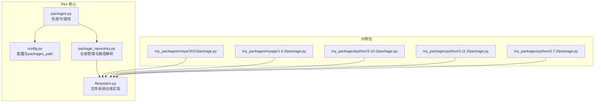
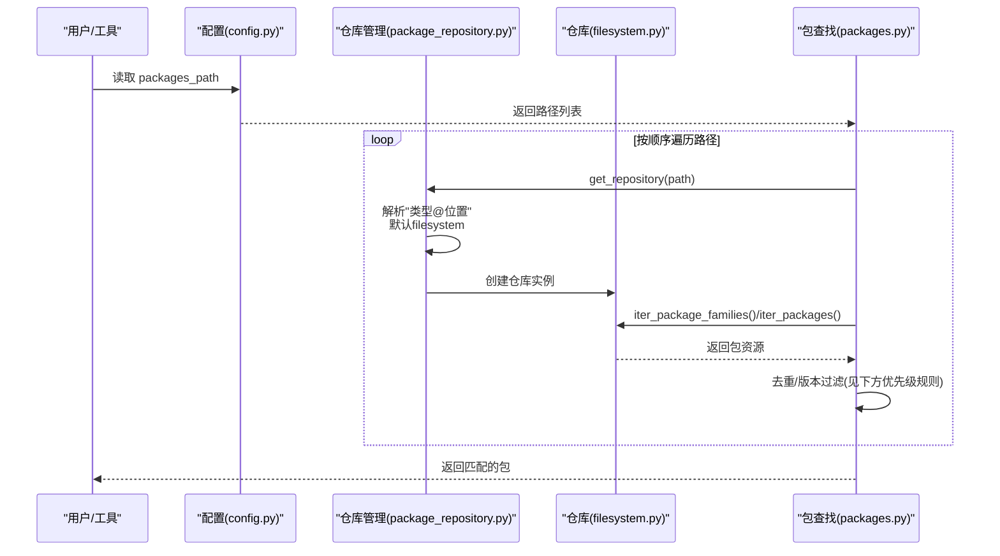
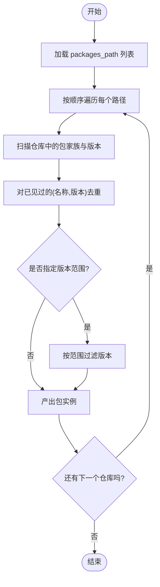
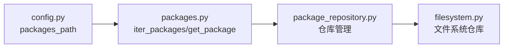

# 包发现路径与优先级

<cite>
**本文引用的文件**
- [packages.py](file://rez-3.3.0/src/rez/packages.py)
- [config.py](file://rez-3.3.0/src/rez/config.py)
- [package_repository.py](file://rez-3.3.0/src/rez/package_repository.py)
- [filesystem.py](file://rez-3.3.0/src/rezplugins/package_repository/filesystem.py)
- [basic_concepts.rst](file://rez-3.3.0/docs/source/basic_concepts.rst)
- [my_packages/maya/2022/package.py](file://my_packages/maya/2022/package.py)
- [my_packages/myapp/1.0.0/package.py](file://my_packages/myapp/1.0.0/package.py)
- [my_packages/python/3.10.0/package.py](file://my_packages/python/3.10.0/package.py)
- [my_packages/python/3.11.0/package.py](file://my_packages/python/3.11.0/package.py)
- [my_packages/python/3.7.0/package.py](file://my_packages/python/3.7.0/package.py)
</cite>

## 目录
1. [引言](#引言)
2. [项目结构](#项目结构)
3. [核心组件](#核心组件)
4. [架构总览](#架构总览)
5. [详细组件分析](#详细组件分析)
6. [依赖关系分析](#依赖关系分析)
7. [性能考量](#性能考量)
8. [故障排查指南](#故障排查指南)
9. [结论](#结论)
10. [附录](#附录)

## 引言
本文件围绕 Rez 的包发现路径与优先级展开，重点解释以下内容：
- REZ_PACKAGES_PATH 环境变量如何定义包搜索路径列表，并以“路径列表中靠前的仓库优先级更高”为原则进行解析。
- 配置项 packages_path 的加载逻辑，以及当路径中包含“@”符号时如何解析为特定仓库类型（例如 filesystem@/path）。
- 在多路径下同名包的版本解析与优先级覆盖机制。
- 提供调试路径解析问题的实用命令与方法。

## 项目结构
本仓库包含 Rez 核心实现、文档与示例包目录。与本主题直接相关的文件包括：
- Rez 核心：packages.py（包迭代与查找）、config.py（配置与 packages_path 解析）、package_repository.py（仓库管理与路径解析）。
- 文件系统仓库插件：filesystem.py（文件系统仓库资源与遍历）。
- 示例包：my_packages 下的 maya、myapp、python 等包定义，用于演示多路径下的同名包与版本覆盖。

图表来源
- [packages.py](file://rez-3.3.0/src/rez/packages.py#L541-L600)
- [config.py](file://rez-3.3.0/src/rez/config.py#L364-L420)
- [package_repository.py](file://rez-3.3.0/src/rez/package_repository.py#L540-L649)
- [filesystem.py](file://rez-3.3.0/src/rezplugins/package_repository/filesystem.py#L1-L200)
- [my_packages/maya/2022/package.py](file://my_packages/maya/2022/package.py#L1-L9)
- [my_packages/myapp/1.0.0/package.py](file://my_packages/myapp/1.0.0/package.py#L1-L33)
- [my_packages/python/3.10.0/package.py](file://my_packages/python/3.10.0/package.py#L1-L8)
- [my_packages/python/3.11.0/package.py](file://my_packages/python/3.11.0/package.py#L1-L8)
- [my_packages/python/3.7.0/package.py](file://my_packages/python/3.7.0/package.py#L1-L8)

章节来源
- [packages.py](file://rez-3.3.0/src/rez/packages.py#L541-L600)
- [config.py](file://rez-3.3.0/src/rez/config.py#L364-L420)
- [package_repository.py](file://rez-3.3.0/src/rez/package_repository.py#L540-L649)
- [filesystem.py](file://rez-3.3.0/src/rezplugins/package_repository/filesystem.py#L1-L200)

## 核心组件
- 包搜索路径与优先级
  - packages.py 中的 iter_packages 与 get_package 函数明确指出：路径列表中靠前的仓库优先级更高；对同一名称的包，先出现的版本会隐藏后续相同版本，但不同版本不会互相隐藏。
- 配置项 packages_path 的加载
  - config.py 中的 config_schema 将 packages_path 定义为 PathList 类型，其解析器 PathList 使用 os.pathsep 分割环境变量值，得到路径列表。
- 路径中“@”符号的解析
  - package_repository.py 的仓库管理器在解析 packages_path 中的条目时，按“类型@位置”的形式拆分；若未显式指定类型，则默认为 filesystem 类型；filesystem 类型还会将路径标准化为绝对路径。
- 文件系统仓库实现
  - filesystem.py 展示了文件系统仓库如何枚举包家族与版本，支持组合式资源（combined）等特性，为多路径下的包发现提供底层支持。

章节来源
- [packages.py](file://rez-3.3.0/src/rez/packages.py#L541-L600)
- [config.py](file://rez-3.3.0/src/rez/config.py#L364-L420)
- [package_repository.py](file://rez-3.3.0/src/rez/package_repository.py#L540-L649)
- [filesystem.py](file://rez-3.3.0/src/rezplugins/package_repository/filesystem.py#L1-L200)

## 架构总览
Rez 的包发现流程由“配置加载 -> 仓库解析 -> 资源枚举 -> 版本选择”构成。packages_path 决定搜索顺序，仓库管理器负责将字符串路径解析为具体仓库实例，文件系统仓库负责从磁盘读取包定义。

图表来源
- [config.py](file://rez-3.3.0/src/rez/config.py#L364-L420)
- [package_repository.py](file://rez-3.3.0/src/rez/package_repository.py#L540-L649)
- [filesystem.py](file://rez-3.3.0/src/rezplugins/package_repository/filesystem.py#L1-L200)
- [packages.py](file://rez-3.3.0/src/rez/packages.py#L541-L600)

## 详细组件分析

### 组件A：包搜索路径与优先级规则
- packages.py 中 iter_packages 的注释明确指出：
  - 路径列表中靠前的仓库优先级更高；
  - 对于同名包，先出现的版本会隐藏后续相同版本，但不同版本不会互相隐藏。
- 这意味着：
  - 当多个仓库包含同名包时，先被扫描到的仓库中的包会被优先采用；
  - 若某版本在同一路径中重复出现，会被去重；
  - 不同版本（如 1.0.0 与 1.2.0）不会互相隐藏。

图表来源
- [packages.py](file://rez-3.3.0/src/rez/packages.py#L541-L600)

章节来源
- [packages.py](file://rez-3.3.0/src/rez/packages.py#L541-L600)

### 组件B：配置项 packages_path 的加载逻辑
- config.py 中的 config_schema 将 packages_path 映射为 PathList 类型。
- PathList 的解析器使用 os.pathsep 分割环境变量值，得到路径列表。
- 因此，REZ_PACKAGES_PATH 的值应以平台分隔符分隔多个路径，Rez 会将其解析为列表。

章节来源
- [config.py](file://rez-3.3.0/src/rez/config.py#L364-L420)

### 组件C：路径中“@”符号的解析与仓库类型
- package_repository.py 的仓库管理器在解析 packages_path 中的条目时：
  - 将字符串按“@”拆分为“类型”和“位置”，若未提供类型则默认为 filesystem；
  - filesystem 类型会将位置转换为绝对路径；
  - 最终以“类型@位置”的形式缓存并返回仓库实例。
- 这意味着：
  - filesystem@/path 与 /path 是等价的（前者显式指定了仓库类型）；
  - 多个仓库可以混合存在于同一 packages_path 列表中，Rez 会按顺序解析并使用。

章节来源
- [package_repository.py](file://rez-3.3.0/src/rez/package_repository.py#L540-L649)

### 组件D：文件系统仓库实现与包枚举
- filesystem.py 展示了文件系统仓库如何：
  - 枚举包家族与版本；
  - 支持组合式资源（combined），允许在单文件中声明多个版本；
  - 通过资源池与缓存提升性能。
- 这些能力为多路径下的包发现提供了基础。

章节来源
- [filesystem.py](file://rez-3.3.0/src/rezplugins/package_repository/filesystem.py#L1-L200)

### 组件E：多路径下同名包的版本解析与优先级覆盖机制
- 结合 packages.py 的去重与版本过滤逻辑，以及文档 basic_concepts.rst 中的“更早出现的包优先”的说明，可以总结如下：
  - 同名包在不同仓库中出现时，先扫描到的仓库中的包优先；
  - 对于同一名称的相同版本，后续出现的会被忽略（去重）；
  - 不同版本不会互相隐藏，最终结果包含所有满足条件的版本，但同名同版本以先出现者为准。
- 示例包结构（my_packages）展示了：
  - 同名包（如 python）在不同子目录下存在多个版本；
  - maya 与 myapp 作为独立包族，便于验证跨路径解析。

章节来源
- [packages.py](file://rez-3.3.0/src/rez/packages.py#L541-L600)
- [basic_concepts.rst](file://rez-3.3.0/docs/source/basic_concepts.rst#L169-L198)
- [my_packages/maya/2022/package.py](file://my_packages/maya/2022/package.py#L1-L9)
- [my_packages/myapp/1.0.0/package.py](file://my_packages/myapp/1.0.0/package.py#L1-L33)
- [my_packages/python/3.10.0/package.py](file://my_packages/python/3.10.0/package.py#L1-L8)
- [my_packages/python/3.11.0/package.py](file://my_packages/python/3.11.0/package.py#L1-L8)
- [my_packages/python/3.7.0/package.py](file://my_packages/python/3.7.0/package.py#L1-L8)

## 依赖关系分析
- packages.py 依赖 config.py 获取 packages_path；
- packages.py 通过 package_repository_manager 访问仓库；
- package_repository.py 将字符串路径解析为仓库实例；
- filesystem.py 实现文件系统仓库的具体资源枚举。

图表来源
- [config.py](file://rez-3.3.0/src/rez/config.py#L364-L420)
- [packages.py](file://rez-3.3.0/src/rez/packages.py#L541-L600)
- [package_repository.py](file://rez-3.3.0/src/rez/package_repository.py#L540-L649)
- [filesystem.py](file://rez-3.3.0/src/rezplugins/package_repository/filesystem.py#L1-L200)

章节来源
- [config.py](file://rez-3.3.0/src/rez/config.py#L364-L420)
- [packages.py](file://rez-3.3.0/src/rez/packages.py#L541-L600)
- [package_repository.py](file://rez-3.3.0/src/rez/package_repository.py#L540-L649)
- [filesystem.py](file://rez-3.3.0/src/rezplugins/package_repository/filesystem.py#L1-L200)

## 性能考量
- 仓库缓存：package_repository.py 会对仓库实例进行缓存，避免重复创建与解析。
- 资源池与缓存：filesystem.py 使用资源池与缓存减少重复读取与解析成本。
- 建议：
  - 将常用仓库置于列表前部，减少扫描次数；
  - 合理组织包目录结构，避免过多层级导致的 IO 开销；
  - 使用组合式资源（combined）减少文件数量，提高加载效率。

章节来源
- [package_repository.py](file://rez-3.3.0/src/rez/package_repository.py#L540-L649)
- [filesystem.py](file://rez-3.3.0/src/rezplugins/package_repository/filesystem.py#L1-L200)

## 故障排查指南
- 确认 packages_path 是否正确设置
  - 使用配置工具查看当前 packages_path，确认各路径顺序与类型（含“@”）是否符合预期。
- 验证仓库类型解析
  - 若路径未显式指定类型，将默认为 filesystem；若需要其他类型，请显式写为 type@location。
- 排查同名包覆盖
  - 若发现某个版本未生效，检查该版本是否被更早出现的同名版本覆盖；必要时调整路径顺序或删除重复版本。
- 使用示例包验证
  - my_packages 下的 maya、myapp、python 包可用于验证多路径解析与版本覆盖行为。

章节来源
- [basic_concepts.rst](file://rez-3.3.0/docs/source/basic_concepts.rst#L169-L198)
- [my_packages/maya/2022/package.py](file://my_packages/maya/2022/package.py#L1-L9)
- [my_packages/myapp/1.0.0/package.py](file://my_packages/myapp/1.0.0/package.py#L1-L33)
- [my_packages/python/3.10.0/package.py](file://my_packages/python/3.10.0/package.py#L1-L8)
- [my_packages/python/3.11.0/package.py](file://my_packages/python/3.11.0/package.py#L1-L8)
- [my_packages/python/3.7.0/package.py](file://my_packages/python/3.7.0/package.py#L1-L8)

## 结论
- REZ_PACKAGES_PATH 通过 config.py 的 PathList 解析为路径列表，仓库管理器按顺序解析“类型@位置”并创建仓库实例。
- packages.py 的包查找逻辑确保“路径越靠前，优先级越高”，且对同名同版本进行去重，不同版本互不隐藏。
- 通过合理设置 packages_path 与仓库类型，结合示例包结构，可有效控制包发现与版本解析行为。

## 附录
- 实用命令建议（来自文档 basic_concepts.rst）
  - 查看 packages_path：使用配置工具输出当前 packages_path，核对路径顺序与类型。
  - 参考文档：Package Search Path 一节详细说明了搜索路径的概念与优先级规则。

章节来源
- [basic_concepts.rst](file://rez-3.3.0/docs/source/basic_concepts.rst#L169-L198)