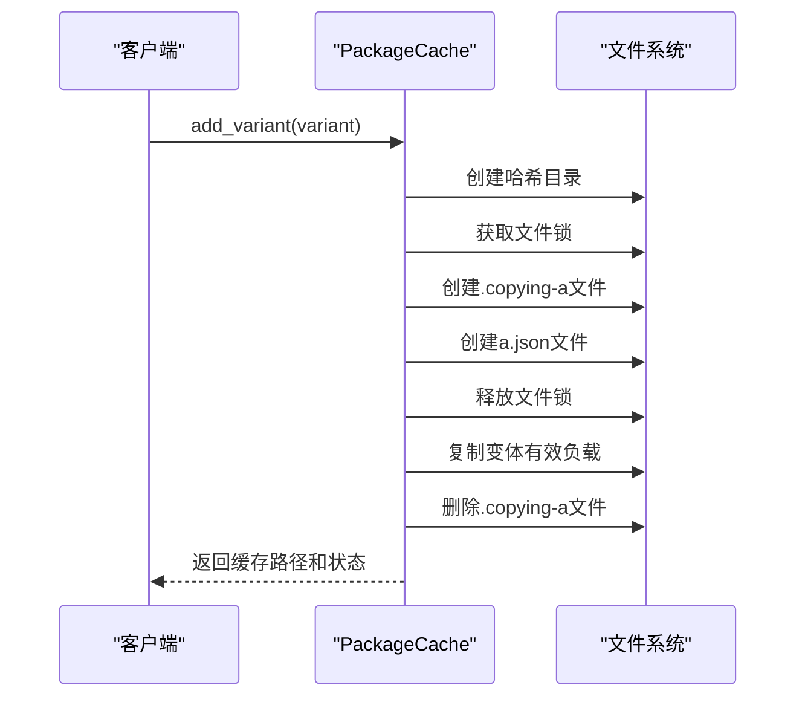
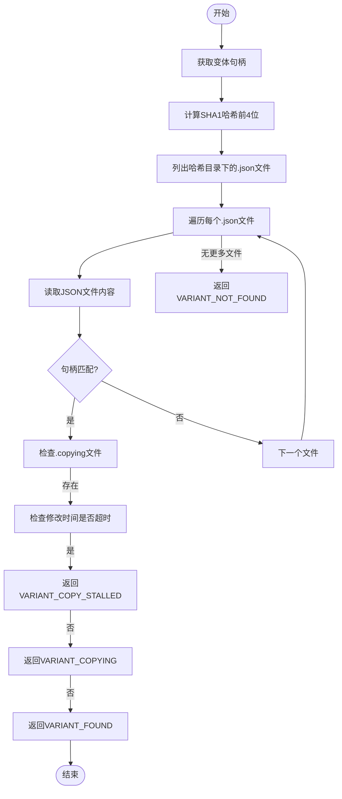
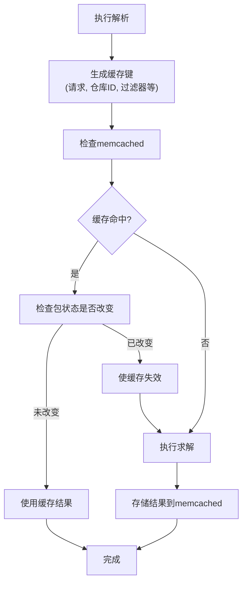

# 包缓存与性能优化

<cite>
**本文档中引用的文件**  
- [package_cache.py](file://rez-3.3.0\src\rez\package_cache.py)
- [resolver.py](file://rez-3.3.0\src\rez\resolver.py)
- [packages.py](file://rez-3.3.0\src\rez\packages.py)
- [filesystem.py](file://rez-3.3.0\src\rezplugins\package_repository\filesystem.py)
- [caching.rst](file://rez-3.3.0\docs\source\caching.rst)
</cite>

## 目录
1. [简介](#简介)
2. [包缓存结构](#包缓存结构)
3. [多进程安全机制](#多进程安全机制)
4. [缓存查找与状态管理](#缓存查找与状态管理)
5. [解析缓存与性能优化](#解析缓存与性能优化)
6. [包发现性能提升](#包发现性能提升)
7. [结论](#结论)

## 简介
Rez系统中的包缓存机制旨在通过本地存储变体有效负载来提升包解析和环境加载的性能。该机制避免了在运行时从共享存储中重复获取包文件，从而显著减少I/O开销。包缓存的核心实现位于`package_cache.py`中的`PackageCache`类，它通过哈希目录结构、文件锁和`.copying`文件等机制确保多进程环境下的数据一致性。此外，系统还利用memcached实现解析结果的缓存，进一步减少重复解析的计算开销。

## 包缓存结构
包缓存采用分层目录结构来组织变体有效负载，其设计兼顾了路径长度优化和哈希冲突避免。缓存结构遵循以下模式：

```
/<cache_dir>/foo/1.0.0/af8d/a/<payload>
                           /a.json
```

其中，`af8d`是变体句柄（handle）的SHA1哈希值的前4个字符。句柄是一个字典，包含唯一标识变体的字段。为避免哈希冲突，变体被存储在增量命名的子目录中（如`a`、`b`、...、`aa`、`ab`等）。`a.json`文件用于在哈希子目录中快速定位正确的变体，其内容包含变体的句柄信息。这种设计使得缓存路径保持较短，同时避免了搜索大量`variant.json`文件来匹配变体的开销。

```mermaid
graph TD
CacheRoot[/<cache_dir>]
PackageName[foo]
Version[1.0.0]
HashDir[af8d]
IncrementalDir[a]
Payload[<payload>]
JsonFile[a.json]
CacheRoot --> PackageName
PackageName --> Version
Version --> HashDir
HashDir --> IncrementalDir
HashDir --> JsonFile
IncrementalDir --> Payload
```

**图示来源**
- [package_cache.py](file://rez-3.3.0\src\rez\package_cache.py#L54-L63)

## 多进程安全机制
`PackageCache`类通过一系列步骤确保多线程/多进程环境下的操作安全，并保证部分复制的变体有效负载永远不会被使用：

1.  创建哈希目录（例如`/<cache_dir>/foo/1.0.0/af8d`）；
2.  获取文件锁互斥体（`/<cache_dir>/.lock`）；
3.  创建`.copying-a`（或`-b`、`-c`等）文件，表示该变体正在被复制，尚不可用；
4.  创建`a.json`文件，防止其他进程/线程创建相同的本地变体；
5.  释放文件锁；
6.  将变体有效负载复制到`/<cache_dir>/foo/1.0.0/af8d/a`；
7.  删除`.copying-a`文件。

`get_cached_root`和`add_variant`方法协同工作，利用文件锁和`.copying`文件来保证操作的原子性和一致性。`_lock`方法使用`LockFile`类在`._sys_dir`目录下创建一个`.lock`文件，确保关键代码段的互斥访问。`.copying`文件的存在不仅标记了复制状态，还通过定期更新其修改时间来检测复制是否停滞。



**图示来源**
- [package_cache.py](file://rez-3.3.0\src\rez\package_cache.py#L216-L225)
- [package_cache.py](file://rez-3.3.0\src\rez\package_cache.py#L834-L847)

## 缓存查找与状态管理
`PackageCache`类提供了多种方法来管理缓存中的变体状态。`get_cached_root`方法用于查找变体的缓存根路径。它首先调用`_get_cached_root`内部方法，根据变体句柄在哈希目录中搜索对应的`.json`文件。如果找到匹配的文件且没有`.copying`文件存在，则返回`VARIANT_FOUND`状态和缓存路径。如果`.copying`文件存在，则检查其修改时间，若超过`_COPYING_TIME_MAX`（5秒），则判定为`VARIANT_COPY_STALLED`状态。

`get_last_release_time`和`get_variant_state_handle`函数在解析缓存中扮演关键角色。`get_last_release_time`函数遍历所有包路径，查询每个仓库中指定包族的最新发布时。它通过调用仓库的`get_last_release_time`方法获取时间戳，并返回所有结果中的最大值。`get_variant_state_handle`是仓库接口的一部分，对于`filesystem`类型的仓库，它返回与变体关联的文件（如`package.py`）的最后修改日期，用于检测包定义是否发生变化。



**图示来源**
- [package_cache.py](file://rez-3.3.0\src\rez\package_cache.py#L994-L1033)
- [packages.py](file://rez-3.3.0\src\rez\packages.py#L825-L848)
- [filesystem.py](file://rez-3.3.0\src\rezplugins\package_repository\filesystem.py#L581-L584)

## 解析缓存与性能优化
Rez系统通过memcached实现解析结果的缓存，以减少重复解析的开销。当一个解析请求完成时，其结果（solver_dict）会与包的最新发布时和变体状态一起存储到memcached中。`get_last_release_time`和`get_variant_state_handle`是缓存失效机制的核心。在尝试使用缓存的解析结果前，系统会检查：
1.  **包定义是否改变**：通过比较当前`get_variant_state_handle`与缓存中的状态，如果任一包的定义文件被修改，则缓存失效。
2.  **是否有新版本发布**：通过比较当前`get_last_release_time`与缓存中的时间，如果自上次解析以来有新版本发布，则缓存失效。

这种双重检查机制确保了缓存结果的准确性和时效性。只有当包定义未改变且没有新版本发布时，缓存的解析结果才会被重用，从而在保证正确性的前提下最大化性能提升。



**图示来源**
- [resolver.py](file://rez-3.3.0\src\rez\resolver.py#L175-L289)
- [caching.rst](file://rez-3.3.0\docs\source\caching.rst#L47-L58)

## 包发现性能提升
`get_package_from_uri`的实现结合了包缓存机制，显著提升了包发现的性能。该函数首先尝试通过预定义的包路径直接查找包。如果失败，它会采用一种“反向工程”的方法，从URI中解析出包名和版本，并尝试构建可能的仓库路径进行搜索。虽然这种方法被标记为“hack”，但它确保了在复杂URI结构下仍能发现包。

包缓存对整体性能的提升体现在多个层面：
1.  **I/O性能**：通过将变体有效负载缓存到本地磁盘，避免了每次环境加载时从网络或共享存储读取大文件的延迟。
2.  **CPU性能**：memcached的解析缓存避免了复杂的依赖求解过程，将耗时的计算操作转换为快速的内存查找。
3.  **并发性能**：文件锁和`.copying`文件机制允许多个进程安全地并发访问和更新缓存，而不会导致数据损坏或不一致。

## 结论
Rez的包缓存与性能优化体系是一个多层次、协同工作的系统。它通过`PackageCache`类的哈希目录结构和增量子目录设计，高效地存储和管理变体有效负载。利用文件锁和`.copying`文件，它在多进程环境下保证了操作的安全性和数据的一致性。通过`get_last_release_time`和`get_variant_state_handle`与memcached的深度集成，实现了智能的解析结果缓存和失效机制，极大地减少了重复解析的开销。最终，`get_package_from_uri`等函数的优化实现，确保了整个包发现和加载流程的高效性，为大规模软件环境的快速部署提供了坚实的基础。