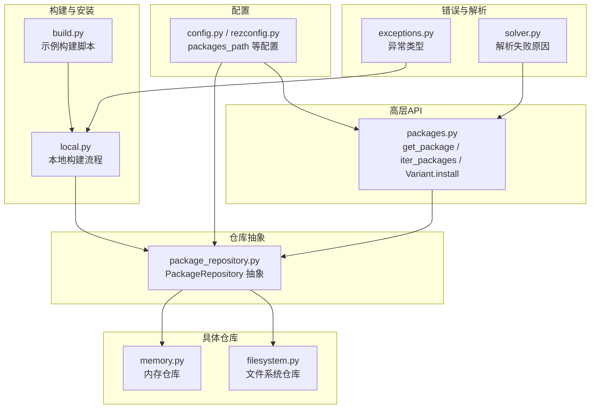
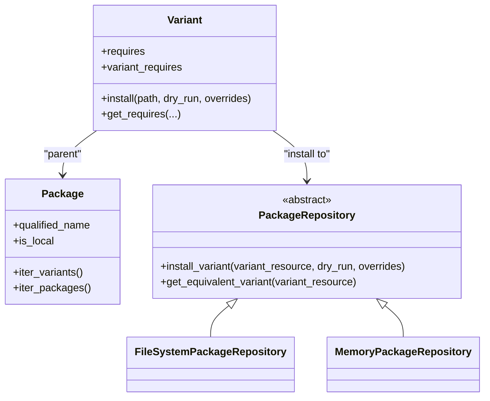
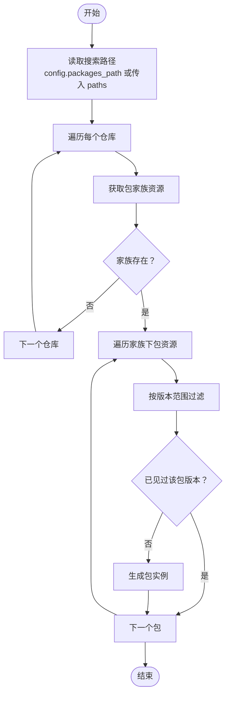
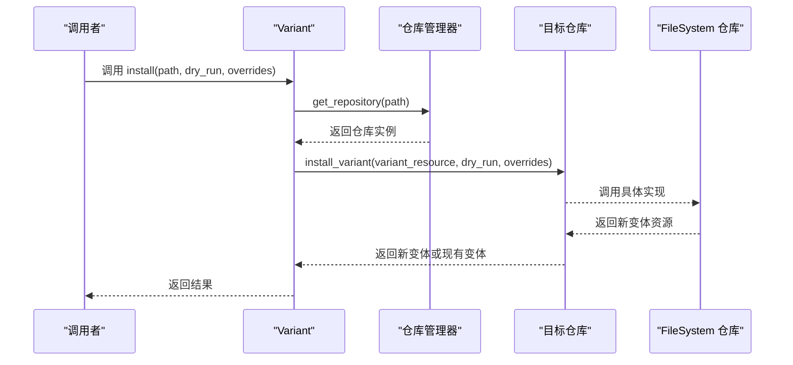
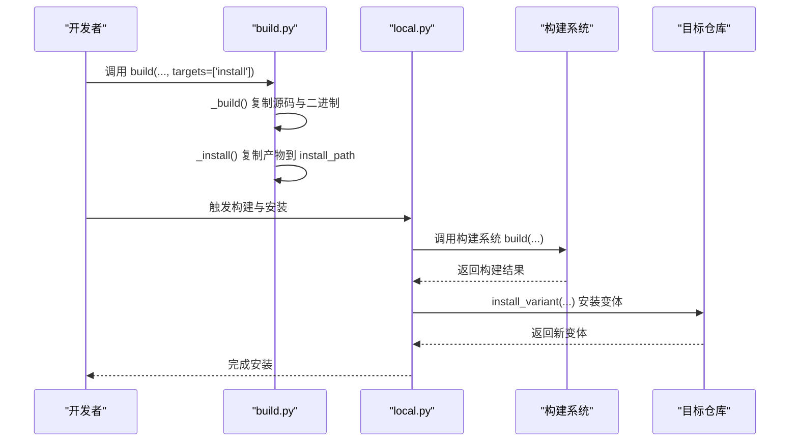
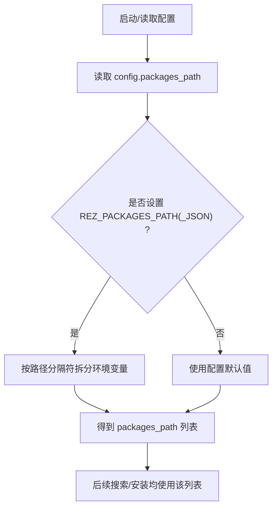
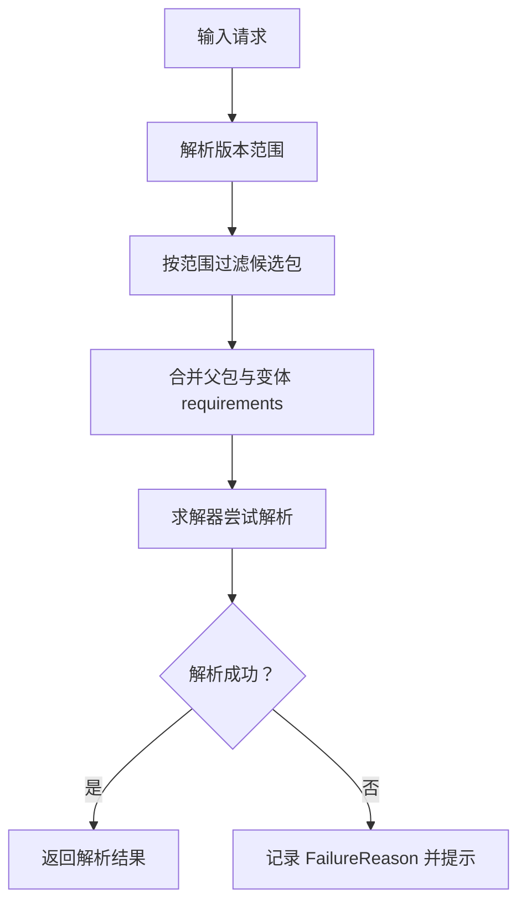
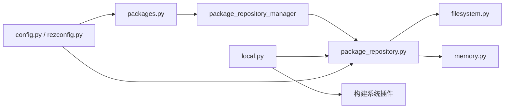

# 包安装

<cite>
**本文引用的文件**
- [packages.py](file://rez-3.3.0/src/rez/packages.py)
- [package_repository.py](file://rez-3.3.0/src/rez/package_repository.py)
- [filesystem.py](file://rez-3.3.0/src/rezplugins/package_repository/filesystem.py)
- [memory.py](file://rez-3.3.0/src/rezplugins/package_repository/memory.py)
- [build.py](file://rez-3.3.0/example_packages/hello_world/build.py)
- [local.py](file://rez-3.3.0/src/rezplugins/build_process/local.py)
- [config.py](file://rez-3.3.0/src/rez/config.py)
- [rezconfig.py](file://rez-3.3.0/src/rez/rezconfig.py)
- [exceptions.py](file://rez-3.3.0/src/rez/exceptions.py)
- [solver.py](file://rez-3.3.0/src/rez/solver.py)
</cite>

## 目录
1. [简介](#简介)
2. [项目结构](#项目结构)
3. [核心组件](#核心组件)
4. [架构总览](#架构总览)
5. [详细组件分析](#详细组件分析)
6. [依赖分析](#依赖分析)
7. [性能考虑](#性能考虑)
8. [故障排查指南](#故障排查指南)
9. [结论](#结论)
10. [附录](#附录)

## 简介
本章节面向希望理解 Rez 包安装全流程的读者，围绕以下目标展开：
- 基于 packages.py 中的 get_package 与 iter_packages，解释 Rez 如何从包仓库（如 filesystem 或 memory）中发现与加载包。
- 详解 Variant.install 方法如何将包实例安装到目标仓库。
- 结合 hello_world 示例的 build.py，展示从源码构建并安装包的完整流程。
- 解释包搜索路径 packages_path 的机制，以及如何通过 REZ_PACKAGES_PATH 环境变量进行配置。
- 涵盖安装过程中的版本解析、变体选择与依赖检查。
- 提供将自定义包（如 Python 3.10.0）成功安装到本地仓库的操作指南，并说明安装失败的常见原因及解决方案。

## 项目结构
Rez 的包安装能力由“资源包装器 + 仓库抽象 + 构建流程 + 配置系统”共同构成。关键模块包括：
- packages.py：提供包与变体的高层 API，负责在仓库中发现与加载包。
- package_repository.py：定义仓库抽象接口，含 install_variant 等核心安装入口。
- filesystem.py / memory.py：具体仓库实现，负责文件系统与内存中的包读写与安装。
- build.py（示例）：展示如何编写构建脚本以产出可安装的包产物。
- local.py：本地构建流程，负责调用构建系统、安装变体、短链接等。
- config.py / rezconfig.py：配置与默认值来源，含 packages_path、本地/发布仓库路径等。
- exceptions.py：安装过程中抛出的异常类型。
- solver.py：解析失败原因，辅助定位依赖冲突等问题。

图表来源
- [packages.py](file://rez-3.3.0/src/rez/packages.py#L541-L600)
- [package_repository.py](file://rez-3.3.0/src/rez/package_repository.py#L324-L364)
- [filesystem.py](file://rez-3.3.0/src/rezplugins/package_repository/filesystem.py#L1-L120)
- [memory.py](file://rez-3.3.0/src/rezplugins/package_repository/memory.py#L105-L200)
- [local.py](file://rez-3.3.0/src/rezplugins/build_process/local.py#L171-L284)
- [build.py](file://rez-3.3.0/example_packages/hello_world/build.py#L1-L59)
- [config.py](file://rez-3.3.0/src/rez/config.py#L364-L400)
- [rezconfig.py](file://rez-3.3.0/src/rez/rezconfig.py#L60-L85)
- [exceptions.py](file://rez-3.3.0/src/rez/exceptions.py#L1-L120)
- [solver.py](file://rez-3.3.0/src/rez/solver.py#L221-L265)

章节来源
- [packages.py](file://rez-3.3.0/src/rez/packages.py#L541-L600)
- [config.py](file://rez-3.3.0/src/rez/config.py#L364-L400)
- [rezconfig.py](file://rez-3.3.0/src/rez/rezconfig.py#L60-L85)

## 核心组件
- 包与变体资源包装器：Package、Variant 提供统一访问接口，支持延迟绑定、上下文注入、变体要求合并等。
- 仓库抽象：PackageRepository 定义 install_variant、get_equivalent_variant 等安装相关接口。
- 仓库实现：filesystem 与 memory 两类仓库分别处理磁盘与内存中的包数据。
- 安装入口：Variant.install 将变体安装到目标仓库；filesystem.memory 的 install_variant 实现具体落盘逻辑。
- 配置：packages_path、local_packages_path、release_packages_path 等决定搜索与安装位置。
- 构建流程：local.py 负责构建、安装、短链接、测试等。

章节来源
- [packages.py](file://rez-3.3.0/src/rez/packages.py#L324-L464)
- [package_repository.py](file://rez-3.3.0/src/rez/package_repository.py#L324-L364)
- [filesystem.py](file://rez-3.3.0/src/rezplugins/package_repository/filesystem.py#L1-L120)
- [memory.py](file://rez-3.3.0/src/rezplugins/package_repository/memory.py#L105-L200)
- [config.py](file://rez-3.3.0/src/rez/config.py#L364-L400)
- [rezconfig.py](file://rez-3.3.0/src/rez/rezconfig.py#L60-L85)

## 架构总览
Rez 的包安装采用“高层 API + 仓库抽象 + 具体仓库 + 构建流程”的分层设计。高层 API 在 packages.py 中提供，仓库抽象在 package_repository.py 中定义，filesystem 与 memory 分别实现具体仓库，local.py 执行实际的构建与安装动作。

图表来源
- [packages.py](file://rez-3.3.0/src/rez/packages.py#L324-L464)
- [package_repository.py](file://rez-3.3.0/src/rez/package_repository.py#L324-L364)
- [filesystem.py](file://rez-3.3.0/src/rezplugins/package_repository/filesystem.py#L1-L120)
- [memory.py](file://rez-3.3.0/src/rezplugins/package_repository/memory.py#L105-L200)

## 详细组件分析

### 组件A：包发现与加载（packages.py）
- iter_packages(name, range_, paths)：按搜索路径遍历仓库，返回去重后的包实例，优先满足版本范围。
- get_package(name, version, paths)：将版本转为范围后调用 iter_packages，返回首个匹配包。
- iter_package_families / get_package_family_from_repository：用于家族级遍历与获取。
- PackageSearchPath：封装多仓库路径集合，支持迭代包、判断包是否在该集合中。

图表来源
- [packages.py](file://rez-3.3.0/src/rez/packages.py#L541-L599)

章节来源
- [packages.py](file://rez-3.3.0/src/rez/packages.py#L541-L599)

### 组件B：变体安装（Variant.install 与仓库 install_variant）
- Variant.install(path, dry_run, overrides)：通过仓库管理器获取目标仓库，调用 repo.install_variant，返回现有或新建变体。
- PackageRepository.install_variant：抽象接口，具体由 filesystem.memory 实现。
- filesystem.memory 的 install_variant：根据变体定义与覆盖参数，创建或合并变体，返回新变体资源。

图表来源
- [packages.py](file://rez-3.3.0/src/rez/packages.py#L434-L464)
- [package_repository.py](file://rez-3.3.0/src/rez/package_repository.py#L324-L364)
- [filesystem.py](file://rez-3.3.0/src/rezplugins/package_repository/filesystem.py#L1-L120)
- [memory.py](file://rez-3.3.0/src/rezplugins/package_repository/memory.py#L105-L200)

章节来源
- [packages.py](file://rez-3.3.0/src/rez/packages.py#L434-L464)
- [package_repository.py](file://rez-3.3.0/src/rez/package_repository.py#L324-L364)
- [filesystem.py](file://rez-3.3.0/src/rezplugins/package_repository/filesystem.py#L1-L120)
- [memory.py](file://rez-3.3.0/src/rezplugins/package_repository/memory.py#L105-L200)

### 组件C：从源码构建并安装（hello_world 示例）
- build.py：示例构建脚本，定义 build(source_path, build_path, install_path, targets)，在 install 目标下复制产物至安装路径。
- local.py：本地构建流程，负责：
  - 创建变体安装目录与短链接（hashed_variants）。
  - 调用构建系统（如 CMake）执行构建与安装。
  - 复制额外文件、安装 include 模块。
  - 失败时清理已安装变体，抛出 BuildError。

图表来源
- [build.py](file://rez-3.3.0/example_packages/hello_world/build.py#L1-L59)
- [local.py](file://rez-3.3.0/src/rezplugins/build_process/local.py#L244-L284)
- [local.py](file://rez-3.3.0/src/rezplugins/build_process/local.py#L383-L420)

章节来源
- [build.py](file://rez-3.3.0/example_packages/hello_world/build.py#L1-L59)
- [local.py](file://rez-3.3.0/src/rezplugins/build_process/local.py#L244-L284)
- [local.py](file://rez-3.3.0/src/rezplugins/build_process/local.py#L383-L420)

### 组件D：包搜索路径与环境变量（REZ_PACKAGES_PATH）
- packages_path：Rez 的包搜索路径列表，默认来自配置；可通过环境变量 REZ_PACKAGES_PATH 或其 JSON 版本 REZ_PACKAGES_PATH_JSON 覆盖。
- PathList Setting：将环境变量按路径分隔符拆分为列表。
- 配置默认值：local_packages_path、release_packages_path 等。

图表来源
- [config.py](file://rez-3.3.0/src/rez/config.py#L137-L162)
- [config.py](file://rez-3.3.0/src/rez/config.py#L364-L400)
- [rezconfig.py](file://rez-3.3.0/src/rez/rezconfig.py#L60-L85)
- [packages.py](file://rez-3.3.0/src/rez/packages.py#L541-L599)

章节来源
- [config.py](file://rez-3.3.0/src/rez/config.py#L137-L162)
- [config.py](file://rez-3.3.0/src/rez/config.py#L364-L400)
- [rezconfig.py](file://rez-3.3.0/src/rez/rezconfig.py#L60-L85)
- [packages.py](file://rez-3.3.0/src/rez/packages.py#L541-L599)

### 组件E：版本解析、变体选择与依赖检查
- 版本解析：iter_packages 内部将字符串版本转换为 VersionRange，仅返回落在范围内的包。
- 变体选择：Variant.requires 合并父包与当前变体的 requirements；solver 在解析阶段依据这些要求进行求解。
- 依赖检查：当无法解析或出现冲突时，solver 会给出 FailureReason（如 DependencyConflicts、TotalReduction），并附带详细描述。

图表来源
- [packages.py](file://rez-3.3.0/src/rez/packages.py#L541-L599)
- [packages.py](file://rez-3.3.0/src/rez/packages.py#L400-L433)
- [solver.py](file://rez-3.3.0/src/rez/solver.py#L221-L265)

章节来源
- [packages.py](file://rez-3.3.0/src/rez/packages.py#L541-L599)
- [packages.py](file://rez-3.3.0/src/rez/packages.py#L400-L433)
- [solver.py](file://rez-3.3.0/src/rez/solver.py#L221-L265)

## 依赖分析
- packages.py 依赖 package_repository_manager 获取仓库实例，再调用仓库接口。
- Variant.install 依赖仓库抽象的 install_variant；具体实现由 filesystem.memory 提供。
- local.py 依赖构建系统插件与仓库接口完成安装。
- 配置系统通过 config 与 rezconfig 提供 packages_path、本地/发布仓库路径等。

图表来源
- [packages.py](file://rez-3.3.0/src/rez/packages.py#L541-L599)
- [package_repository.py](file://rez-3.3.0/src/rez/package_repository.py#L324-L364)
- [filesystem.py](file://rez-3.3.0/src/rezplugins/package_repository/filesystem.py#L1-L120)
- [memory.py](file://rez-3.3.0/src/rezplugins/package_repository/memory.py#L105-L200)
- [local.py](file://rez-3.3.0/src/rezplugins/build_process/local.py#L244-L284)
- [config.py](file://rez-3.3.0/src/rez/config.py#L364-L400)
- [rezconfig.py](file://rez-3.3.0/src/rez/rezconfig.py#L60-L85)

章节来源
- [packages.py](file://rez-3.3.0/src/rez/packages.py#L541-L599)
- [package_repository.py](file://rez-3.3.0/src/rez/package_repository.py#L324-L364)
- [filesystem.py](file://rez-3.3.0/src/rezplugins/package_repository/filesystem.py#L1-L120)
- [memory.py](file://rez-3.3.0/src/rezplugins/package_repository/memory.py#L105-L200)
- [local.py](file://rez-3.3.0/src/rezplugins/build_process/local.py#L244-L284)
- [config.py](file://rez-3.3.0/src/rez/config.py#L364-L400)
- [rezconfig.py](file://rez-3.3.0/src/rez/rezconfig.py#L60-L85)

## 性能考虑
- 缓存与去重：iter_packages 对相同 name+version 的包进行去重，避免重复加载。
- 资源池与句柄：仓库通过 ResourceHandle 与资源池缓存资源，减少重复 IO。
- 变体短链接：hashed_variants 下创建短链接，降低长路径带来的开销。
- 解析缓存：仓库可提供 get_variant_state_handle/get_last_release_time，配合缓存提升解析性能。

章节来源
- [packages.py](file://rez-3.3.0/src/rez/packages.py#L541-L599)
- [filesystem.py](file://rez-3.3.0/src/rezplugins/package_repository/filesystem.py#L1-L120)
- [local.py](file://rez-3.3.0/src/rezplugins/build_process/local.py#L171-L199)

## 故障排查指南
- 包未找到（PackageFamilyNotFoundError / PackageNotFoundError）
  - 检查 REZ_PACKAGES_PATH 是否包含正确的本地路径。
  - 确认包定义文件存在且格式正确。
- 版本不匹配
  - 使用 get_package(name, version) 时确保 version 字符串符合范围规则。
- 依赖冲突（DependencyConflicts / TotalReduction）
  - 查看 solver 的 failure_detail，定位冲突来源与搜索路径。
- 构建失败（BuildError）
  - 检查构建系统日志与 local.py 的安装流程，确认 install_path 权限与空间。
- 仓库错误（PackageRepositoryError / ResourceError）
  - 检查仓库路径权限、磁盘空间、文件锁等。

章节来源
- [exceptions.py](file://rez-3.3.0/src/rez/exceptions.py#L1-L120)
- [solver.py](file://rez-3.3.0/src/rez/solver.py#L221-L265)
- [local.py](file://rez-3.3.0/src/rezplugins/build_process/local.py#L244-L284)

## 结论
Rez 的包安装体系以清晰的分层设计实现：高层 API 负责发现与加载，仓库抽象统一安装接口，具体仓库实现负责落盘细节，构建流程贯穿安装全过程。通过 packages_path 与 REZ_PACKAGES_PATH，用户可以灵活控制包搜索路径；通过 Variant.install 与仓库 install_variant，实现了从源码到目标仓库的完整安装闭环。结合版本解析、变体选择与依赖检查，Rez 能够稳定地完成复杂场景下的包安装与环境构建。

## 附录

### 自定义包安装到本地仓库的操作指南（以 Python 3.10.0 为例）
- 步骤概览
  1) 准备本地包目录：在本地仓库路径下创建包家族与版本目录，放置 package.py。
  2) 配置包搜索路径：设置 REZ_PACKAGES_PATH 指向包含该本地仓库的路径。
  3) 验证发现：使用 packages.iter_packages / get_package 确认包可见。
  4) 构建与安装：若需要从源码构建，编写 build.py 并通过本地构建流程安装。
  5) 校验安装：检查目标仓库中是否存在对应变体与产物。

- 关键要点
  - packages_path 默认来自配置；可通过 REZ_PACKAGES_PATH 或 REZ_PACKAGES_PATH_JSON 覆盖。
  - Variant.install 支持 dry_run 与 overrides，便于预检与定制安装行为。
  - 本地仓库路径与发布仓库路径分别由 local_packages_path 与 release_packages_path 控制。

章节来源
- [packages.py](file://rez-3.3.0/src/rez/packages.py#L541-L599)
- [config.py](file://rez-3.3.0/src/rez/config.py#L364-L400)
- [rezconfig.py](file://rez-3.3.0/src/rez/rezconfig.py#L60-L85)
- [packages.py](file://rez-3.3.0/src/rez/packages.py#L434-L464)
- [build.py](file://rez-3.3.0/example_packages/hello_world/build.py#L1-L59)
- [local.py](file://rez-3.3.0/src/rezplugins/build_process/local.py#L244-L284)