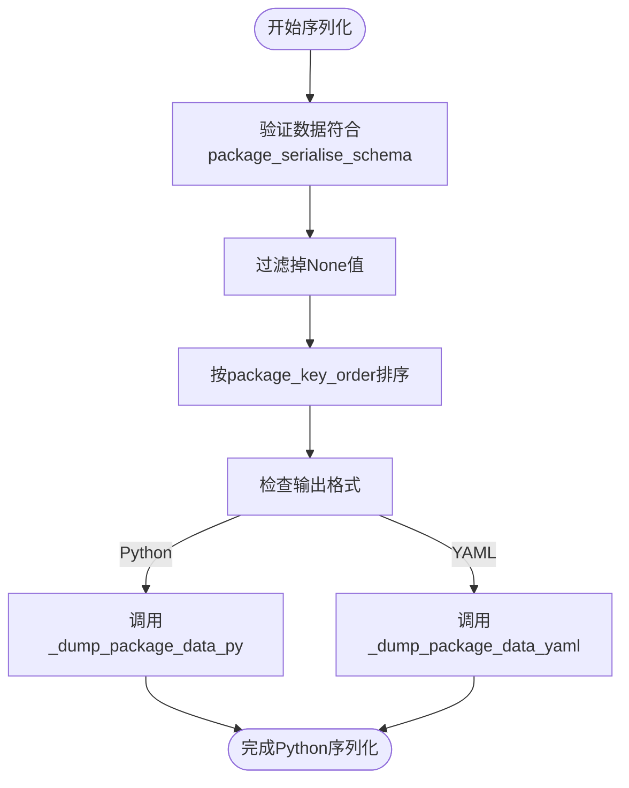
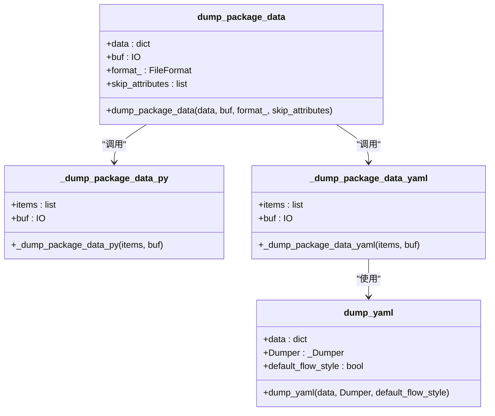
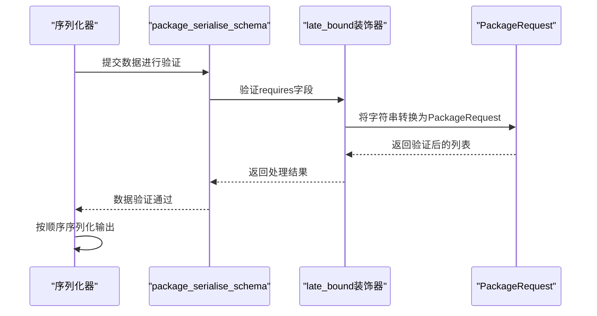
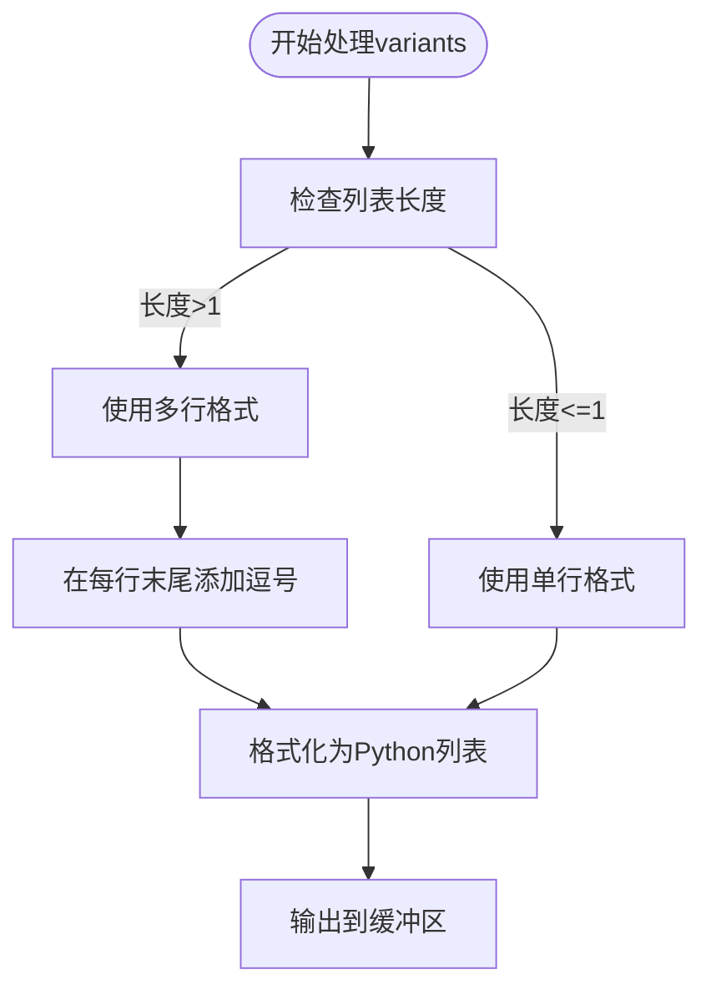
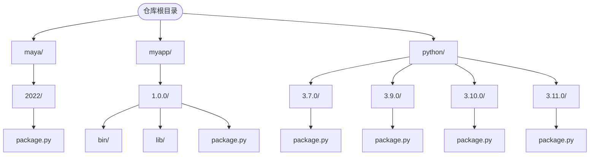

# 包安装中的元数据处理

<cite>
**本文档中引用的文件**  
- [package_serialise.py](file://rez-3.3.0\src\rez\package_serialise.py)
- [serialise.py](file://rez-3.3.0\src\rez\serialise.py)
- [yaml.py](file://rez-3.3.0\src\rez\utils\yaml.py)
- [package_resources.py](file://rez-3.3.0\src\rez\package_resources.py)
- [filesystem.py](file://rez-3.3.0\src\rezplugins\package_repository\filesystem.py)
- [package.py](file://my_packages\maya\2022\package.py)
</cite>

## 目录
1. [简介](#简介)
2. [元数据序列化机制](#元数据序列化机制)
3. [特殊字段处理逻辑](#特殊字段处理逻辑)
4. [存储结构与命名规范](#存储结构与命名规范)
5. [自定义元数据最佳实践](#自定义元数据最佳实践)
6. [常见问题与解决方案](#常见问题与解决方案)

## 简介
Rez包管理系统通过结构化的元数据来定义和管理软件包。元数据处理是包安装过程中的核心环节，它确保了包定义的正确序列化、跨平台兼容性以及依赖关系的准确解析。本文档详细阐述了`package_serialise.py`如何序列化包定义对象（Package）的元数据，包括版本信息、依赖关系、变体配置和自定义属性的JSON/YAML编码过程。

**Section sources**
- [package_serialise.py](file://rez-3.3.0\src\rez\package_serialise.py#L1-L223)

## 元数据序列化机制

### 序列化架构与流程
Rez系统使用`package_serialise.py`模块来处理包元数据的序列化。该模块定义了`package_serialise_schema`，这是一个基于`Schema`库的验证模式，用于确保包数据的结构正确性。序列化过程遵循预定义的键顺序（`package_key_order`），这保证了输出的一致性和可读性。

序列化主要通过`dump_package_data`函数实现，该函数接受数据字典、输出流和格式参数（`FileFormat.py`或`FileFormat.yaml`）。首先，数据会经过验证和过滤，移除`None`值，然后按照预定义的顺序组织成键值对列表。最后，根据指定格式调用相应的转储函数。

**Diagram sources**
- [package_serialise.py](file://rez-3.3.0\src\rez\package_serialise.py#L113-L143)

### JSON/YAML编码过程
虽然Rez主要使用Python和YAML格式，但其序列化机制可以扩展到JSON。对于YAML格式，`_dump_package_data_yaml`函数利用`dump_yaml`工具将每个键值对独立转换为YAML字符串并打印到输出流。对于Python格式，`_dump_package_data_py`函数则生成可执行的Python代码，其中特殊类型如`SourceCode`会被转换为函数定义。

**Diagram sources**
- [package_serialise.py](file://rez-3.3.0\src\rez\package_serialise.py#L165-L222)
- [yaml.py](file://rez-3.3.0\src\rez\utils\yaml.py#L44-L49)

**Section sources**
- [package_serialise.py](file://rez-3.3.0\src\rez\package_serialise.py#L113-L223)
- [yaml.py](file://rez-3.3.0\src\rez\utils\yaml.py#L44-L63)

## 特殊字段处理逻辑

### 依赖关系字段处理
`requires`、`build_requires`和`private_build_requires`字段在序列化时被特别处理。它们被定义为`late_bound`类型，这意味着它们可以是静态列表或在运行时计算的函数。序列化时，这些字段会先通过`late_bound`装饰器进行处理，然后转换为标准的`PackageRequest`对象列表。

**Diagram sources**
- [package_serialise.py](file://rez-3.3.0\src\rez\package_serialise.py#L79-L81)
- [package_resources.py](file://rez-3.3.0\src\rez\package_resources.py#L62-L69)

### 变体配置处理
`variants`字段是一个二维列表，表示包的不同变体配置。序列化时，系统会检查列表长度，对于长度大于1的列表，会采用美观的多行格式进行输出，每行末尾添加逗号以符合Python语法。这种处理方式提高了大型变体列表的可读性。

**Diagram sources**
- [package_serialise.py](file://rez-3.3.0\src\rez\package_serialise.py#L196-L207)

### 自定义属性处理
`config`字段被特殊处理为一个作用域（scope）。在Python格式输出中，它会被包装在`with scope('config') as config:`语句块中，这允许在包定义中使用配置作用域。其他自定义属性则通过`Optional(str): object`模式被包含在序列化模式中，确保了系统的扩展性。

**Section sources**
- [package_serialise.py](file://rez-3.3.0\src\rez\package_serialise.py#L187-L189)
- [package_serialise.py](file://rez-3.3.0\src\rez\package_serialise.py#L109-L110)

## 存储结构与命名规范

### 目标仓库存储结构
Rez包在目标仓库中的存储遵循严格的目录结构。每个包以包名作为目录，其下包含以版本号命名的子目录，每个版本目录中包含`package.py`或`package.yaml`文件。例如，`maya`包的2022版本存储在`my_packages/maya/2022/package.py`。

**Diagram sources**
- [filesystem.py](file://rez-3.3.0\src\rezplugins\package_repository\filesystem.py#L438-L442)
- [package.py](file://my_packages\maya\2022\package.py)

### 命名规范
Rez支持两种主要的元数据文件命名规范：`package.py`和`package.yaml`。系统通过`package_filenames`配置项来定义可接受的文件名列表。此外，还支持将多个版本的包定义合并到单个文件中，如`pkgC.yaml`，这种"combined"格式通过`version_overrides`字段来管理不同版本间的差异。

**Section sources**
- [filesystem.py](file://rez-3.3.0\src\rezplugins\package_repository\filesystem.py#L446-L448)
- [filesystem.py](file://rez-3.3.0\src\rezplugins\package_repository\filesystem.py#L470)

## 自定义元数据最佳实践

### 扩展性设计
Rez的元数据模式设计为可扩展的，通过`extensible_schema_dict`函数，可以在标准模式基础上添加任意自定义字段。这允许用户在不修改核心代码的情况下添加特定于项目的元数据。最佳实践是将自定义字段组织在逻辑分组中，并提供清晰的文档说明。

### 避免循环引用
在定义自定义元数据时，应避免创建循环引用。例如，不应让包A的`requires`字段引用包B，同时包B的`requires`字段又引用包A。系统在解析依赖关系时会检测到这种冲突并抛出`ResolveError`。

### 版本兼容性
为了保证跨版本兼容性，建议使用`late_bound`装饰器来定义可能随环境变化的字段。这允许字段值在运行时动态计算，而不是在序列化时固定。同时，应避免使用未来可能被弃用的内部API。

**Section sources**
- [package_resources.py](file://rez-3.3.0\src\rez\package_resources.py#L81-L92)
- [package_serialise.py](file://rez-3.3.0\src\rez\package_serialise.py#L96-L100)

## 常见问题与解决方案

### 编码错误
最常见的编码错误是字符串中包含特殊字符而未正确转义。解决方案是使用`as_block_string`函数处理长描述文本，该函数会将文本转换为三引号包围的块字符串，自动处理换行和引号。

### 循环引用
循环引用会导致解析器无限递归。系统通过`cached_property`装饰器和验证机制来检测和防止循环引用。当检测到冲突时，会抛出带有详细信息的`ResolveError`异常。

### 版本不兼容
旧版本的Rez可能无法识别新版本引入的元数据字段。解决方案是使用`extensible_schema_dict`，它允许在模式中包含任意额外字段，从而保证向后兼容性。同时，应遵循语义化版本控制原则，避免在小版本更新中引入破坏性变更。

**Section sources**
- [package_serialise.py](file://rez-3.3.0\src\rez\package_serialise.py#L183-L185)
- [solver.py](file://rez-3.3.0\src\rez\solver.py#L330-L334)
- [schema.py](file://rez-3.3.0\src\rez\utils\schema.py#L80-L92)