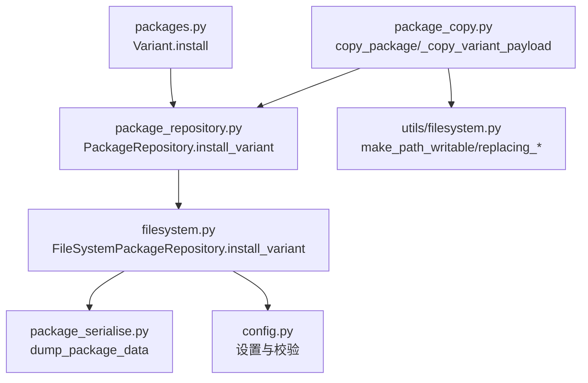
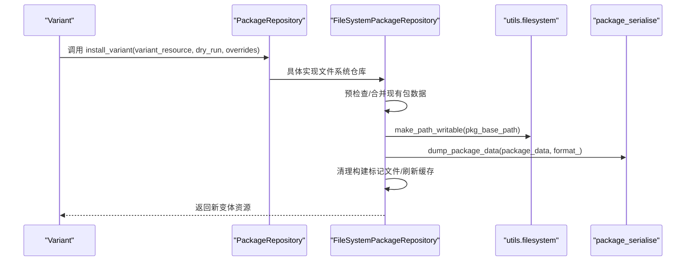
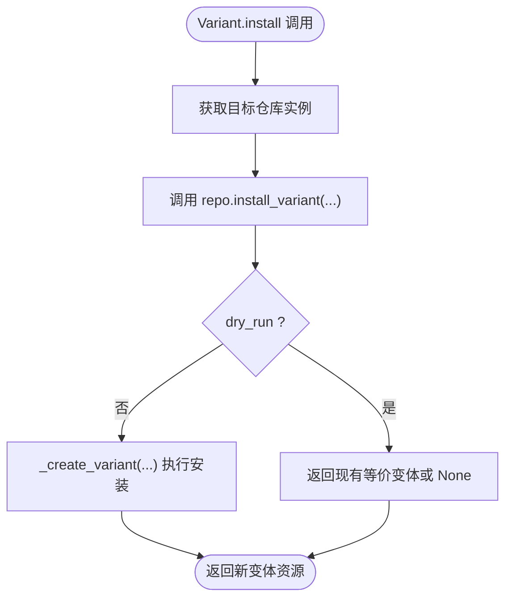
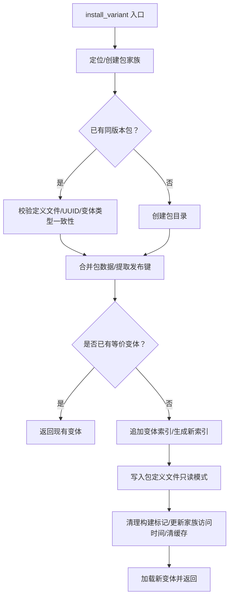
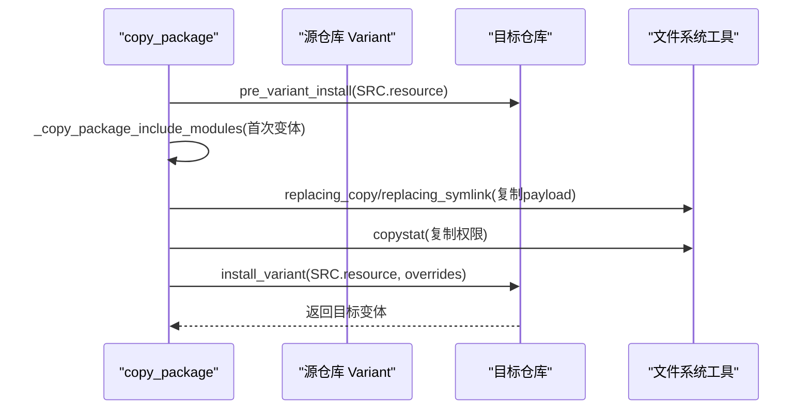
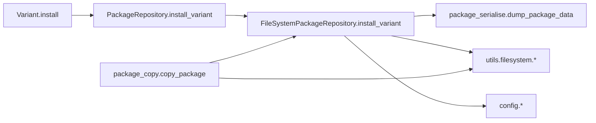

# 包安装操作

<cite>
**本文引用的文件列表**
- [rez-3.3.0/src/rez/packages.py](file://rez-3.3.0/src/rez/packages.py)
- [rez-3.3.0/src/rez/package_repository.py](file://rez-3.3.0/src/rez/package_repository.py)
- [rez-3.3.0/src/rezplugins/package_repository/filesystem.py](file://rez-3.3.0/src/rezplugins/package_repository/filesystem.py)
- [rez-3.3.0/src/rez/package_copy.py](file://rez-3.3.0/src/rez/package_copy.py)
- [rez-3.3.0/src/rez/utils/filesystem.py](file://rez-3.3.0/src/rez/utils/filesystem.py)
- [rez-3.3.0/src/rez/package_serialise.py](file://rez-3.3.0/src/rez/package_serialise.py)
- [rez-3.3.0/src/rez/config.py](file://rez-3.3.0/src/rez/config.py)
- [rez-3.3.0/my_packages/myapp/1.0.0/package.py](file://rez-3.3.0/my_packages/myapp/1.0.0/package.py)
- [rez-3.3.0/my_packages/myapp/1.0.0/bin/myapp.py](file://rez-3.3.0/my_packages/myapp/1.0.0/bin/myapp.py)
</cite>

## 目录
1. [引言](#引言)
2. [项目结构](#项目结构)
3. [核心组件](#核心组件)
4. [架构总览](#架构总览)
5. [详细组件分析](#详细组件分析)
6. [依赖关系分析](#依赖关系分析)
7. [性能考量](#性能考量)
8. [故障排查指南](#故障排查指南)
9. [结论](#结论)
10. [附录：最佳实践与常见问题](#附录最佳实践与常见问题)

## 引言
本文件围绕 Rez 的“包安装操作”展开，重点解释 Variant.install 方法如何通过 package_repository.py 中的 install_variant 接口，将已解析的包实例写入目标仓库；同时阐述 package_copy.py 模块在跨仓库复制包时的忽略策略、原子性保障与错误回滚机制；并给出权限管理、路径验证与依赖锁定处理机制的说明，最后提供将开发中的包（如 myapp）安全安装到本地仓库的最佳实践及常见问题与解决方案。

## 项目结构
- 核心安装流程涉及以下模块：
  - packages.py：Variant 类及其 install 方法
  - package_repository.py：PackageRepository 抽象类与 install_variant 接口
  - filesystem.py：文件系统仓库实现（包含 install_variant 的具体逻辑）
  - package_copy.py：跨仓库复制包的高层封装，含忽略策略、原子性与回滚
  - utils/filesystem.py：文件系统工具（权限、路径、替换复制等）
  - package_serialise.py：包定义文件的序列化与写入
  - config.py：全局配置项（影响安装行为）

图表来源
- [rez-3.3.0/src/rez/packages.py](file://rez-3.3.0/src/rez/packages.py#L433-L463)
- [rez-3.3.0/src/rez/package_repository.py](file://rez-3.3.0/src/rez/package_repository.py#L324-L345)
- [rez-3.3.0/src/rezplugins/package_repository/filesystem.py](file://rez-3.3.0/src/rezplugins/package_repository/filesystem.py#L907-L946)
- [rez-3.3.0/src/rez/package_copy.py](file://rez-3.3.0/src/rez/package_copy.py#L23-89)
- [rez-3.3.0/src/rez/utils/filesystem.py](file://rez-3.3.0/src/rez/utils/filesystem.py#L88-L119)
- [rez-3.3.0/src/rez/package_serialise.py](file://rez-3.3.0/src/rez/package_serialise.py#L113-L143)
- [rez-3.3.0/src/rez/config.py](file://rez-3.3.0/src/rez/config.py#L1-L200)

章节来源
- [rez-3.3.0/src/rez/packages.py](file://rez-3.3.0/src/rez/packages.py#L433-L463)
- [rez-3.3.0/src/rez/package_repository.py](file://rez-3.3.0/src/rez/package_repository.py#L324-L345)
- [rez-3.3.0/src/rezplugins/package_repository/filesystem.py](file://rez-3.3.0/src/rezplugins/package_repository/filesystem.py#L907-L946)

## 核心组件
- Variant.install：面向单个变体的安装入口，负责定位目标仓库并调用 install_variant。
- PackageRepository.install_variant：抽象接口，定义“将一个变体安装到该仓库”的契约。
- FileSystemPackageRepository.install_variant：文件系统仓库的具体实现，完成元数据合并、变体追加、包定义文件写入、构建标记清理、变更通知等。
- package_copy.copy_package：高层复制函数，支持重命名/重版本、覆盖策略、浅拷贝、忽略策略、时间戳控制、包含模块复制等。
- utils.filesystem：提供 make_path_writable、replacing_copy、replacing_symlink、additive_copytree 等原子性与一致性保障工具。
- package_serialise.dump_package_data：按指定格式（py/yaml）序列化包数据并写入文件。

章节来源
- [rez-3.3.0/src/rez/packages.py](file://rez-3.3.0/src/rez/packages.py#L433-L463)
- [rez-3.3.0/src/rez/package_repository.py](file://rez-3.3.0/src/rez/package_repository.py#L324-L345)
- [rez-3.3.0/src/rezplugins/package_repository/filesystem.py](file://rez-3.3.0/src/rezplugins/package_repository/filesystem.py#L1200-L1488)
- [rez-3.3.0/src/rez/package_copy.py](file://rez-3.3.0/src/rez/package_copy.py#L23-89)
- [rez-3.3.0/src/rez/utils/filesystem.py](file://rez-3.3.0/src/rez/utils/filesystem.py#L88-L119)
- [rez-3.3.0/src/rez/package_serialise.py](file://rez-3.3.0/src/rez/package_serialise.py#L113-L143)

## 架构总览
下图展示了从 Variant.install 到文件系统仓库写入包定义与变体的完整链路，以及 package_copy 在跨仓库场景下的参与点。

图表来源
- [rez-3.3.0/src/rez/packages.py](file://rez-3.3.0/src/rez/packages.py#L433-L463)
- [rez-3.3.0/src/rez/package_repository.py](file://rez-3.3.0/src/rez/package_repository.py#L324-L345)
- [rez-3.3.0/src/rezplugins/package_repository/filesystem.py](file://rez-3.3.0/src/rezplugins/package_repository/filesystem.py#L1432-L1458)
- [rez-3.3.0/src/rez/utils/filesystem.py](file://rez-3.3.0/src/rez/utils/filesystem.py#L88-L119)
- [rez-3.3.0/src/rez/package_serialise.py](file://rez-3.3.0/src/rez/package_serialise.py#L113-L143)

## 详细组件分析

### Variant.install 与 install_variant 契约
- Variant.install 将自身包装为资源后，委托给目标仓库的 install_variant 完成实际安装。
- install_variant 支持 dry_run 模式返回现有等价变体或 None；支持 overrides 合并属性。
- 文件系统仓库实现会根据是否已有同名同版本包、是否存在等价变体、是否需要追加变体等分支进行处理。

图表来源
- [rez-3.3.0/src/rez/packages.py](file://rez-3.3.0/src/rez/packages.py#L433-L463)
- [rez-3.3.0/src/rez/package_repository.py](file://rez-3.3.0/src/rez/package_repository.py#L324-L345)
- [rez-3.3.0/src/rezplugins/package_repository/filesystem.py](file://rez-3.3.0/src/rezplugins/package_repository/filesystem.py#L907-L946)

章节来源
- [rez-3.3.0/src/rez/packages.py](file://rez-3.3.0/src/rez/packages.py#L433-L463)
- [rez-3.3.0/src/rez/package_repository.py](file://rez-3.3.0/src/rez/package_repository.py#L324-L345)

### 文件系统仓库 install_variant 的实现要点
- 变体安装前的预检查与准备：
  - 若存在同名同版本包且定义文件缺失，允许继续写入以覆盖。
  - UUID 一致性校验，避免将不同包写入同一位置。
  - 无变体包与有变体包之间的互斥校验。
- 包数据合并与变体追加：
  - 读取新包数据，剔除构建期键，保留发布相关键用于迁移。
  - 若已有包且数据差异仅限发布键，则保留现有变体列表；否则按需合并。
  - 若目标包已有等价变体，直接返回；否则追加新变体索引。
- 元数据写入与文件系统一致性：
  - 计算包定义文件名与扩展名，写入 package_data。
  - 使用只读模式写入（非 Windows 平台），并在必要时临时提升目录可写。
  - 清理构建标记文件（.buildingX），刷新家族目录访问时间并清空内部缓存。
- 覆盖策略与时间戳：
  - overrides 对现有包优先级较低（仅当键不存在时才写入），对新建包则完全生效。
  - 未显式指定 timestamp 时默认写入当前时间戳。

图表来源
- [rez-3.3.0/src/rezplugins/package_repository/filesystem.py](file://rez-3.3.0/src/rezplugins/package_repository/filesystem.py#L1200-L1488)
- [rez-3.3.0/src/rez/package_serialise.py](file://rez-3.3.0/src/rez/package_serialise.py#L113-L143)

章节来源
- [rez-3.3.0/src/rezplugins/package_repository/filesystem.py](file://rez-3.3.0/src/rezplugins/package_repository/filesystem.py#L1200-L1488)

### 跨仓库复制：package_copy 的忽略策略、原子性与回滚
- 复制流程概览：
  - 校验源包可重定位性（可强制跳过）。
  - 解析目标仓库（字符串路径或仓库对象）。
  - 过滤要复制的变体索引，预先执行 dry_run 检测目标是否存在等价变体。
  - 对每个待安装变体：
    - 预安装阶段：调用目标仓库的 pre_variant_install，创建“构建中”标记文件，避免半成品被解析。
    - 复制包含模块（首次变体时）。
    - 复制/浅链接变体负载：根据 shallow 选项选择替换复制或符号链接；对重叠子路径进行跳过以避免破坏其他变体根。
    - 复制权限：逐层 copystat，保持目录权限一致。
    - 创建短链接（hashed_variants 场景）。
    - 应用 overrides（如重命名/重版本、时间戳等），调用 install_variant 写入包定义与变体。
  - 结果汇总：返回 copied 与 skipped 列表。
- 原子性与回滚：
  - 预安装阶段创建“构建中”标记文件，确保在 payload 未就绪时不会被解析。
  - 失败时删除部分安装的 payload 或回退到取消状态（由上层构建流程触发）。
  - 复制阶段使用可逆的替换复制/符号链接，失败时可清理残留。
- 忽略策略：
  - 通过目标仓库的 dry_run 检测等价变体，overwrite=false 时跳过；overwrite=true 时覆盖。
  - 对于非重定位包，默认拒绝复制，可通过 force 跳过校验但不保证可用性。

图表来源
- [rez-3.3.0/src/rez/package_copy.py](file://rez-3.3.0/src/rez/package_copy.py#L23-89)
- [rez-3.3.0/src/rez/package_copy.py](file://rez-3.3.0/src/rez/package_copy.py#L171-L227)
- [rez-3.3.0/src/rez/package_copy.py](file://rez-3.3.0/src/rez/package_copy.py#L230-L383)
- [rez-3.3.0/src/rez/utils/filesystem.py](file://rez-3.3.0/src/rez/utils/filesystem.py#L88-L119)

章节来源
- [rez-3.3.0/src/rez/package_copy.py](file://rez-3.3.0/src/rez/package_copy.py#L23-89)
- [rez-3.3.0/src/rez/package_copy.py](file://rez-3.3.0/src/rez/package_copy.py#L171-L227)
- [rez-3.3.0/src/rez/package_copy.py](file://rez-3.3.0/src/rez/package_copy.py#L230-L383)

### 权限管理、路径验证与依赖锁定
- 权限管理：
  - 写入包定义文件时采用只读模式（非 Windows 平台），必要时通过 make_path_writable 临时提升目录权限，结束后恢复原权限。
  - 复制 payload 时对目录权限逐层 copystat，保持与源一致。
- 路径验证：
  - 目标仓库路径规范化与存在性检查，避免跨挂载导致的误判。
  - 复制前检测 variant.root 是否存在，确保源变体有效。
- 依赖锁定：
  - 安装流程不直接修改依赖锁文件；依赖解析与锁定由解析器与上下文管理，安装阶段主要保证包定义与变体的正确落盘。

章节来源
- [rez-3.3.0/src/rezplugins/package_repository/filesystem.py](file://rez-3.3.0/src/rezplugins/package_repository/filesystem.py#L907-L946)
- [rez-3.3.0/src/rez/utils/filesystem.py](file://rez-3.3.0/src/rez/utils/filesystem.py#L88-L119)
- [rez-3.3.0/src/rez/package_copy.py](file://rez-3.3.0/src/rez/package_copy.py#L230-L383)

## 依赖关系分析
- Variant.install 依赖 PackageRepository.install_variant 的具体实现。
- FileSystemPackageRepository.install_variant 依赖：
  - package_serialise.dump_package_data 写入包定义文件
  - utils.filesystem.make_path_writable、replacing_copy、replacing_symlink、additive_copytree 提供原子性与一致性
  - config 设置（如 package_filenames、variant_shortlinks_dirname 等）影响行为
- package_copy.copy_package 作为高层封装，串联 Variant.install 与 FileSystemPackageRepository.install_variant，并在复制 payload 时复用上述工具。

图表来源
- [rez-3.3.0/src/rez/packages.py](file://rez-3.3.0/src/rez/packages.py#L433-L463)
- [rez-3.3.0/src/rez/package_repository.py](file://rez-3.3.0/src/rez/package_repository.py#L324-L345)
- [rez-3.3.0/src/rezplugins/package_repository/filesystem.py](file://rez-3.3.0/src/rezplugins/package_repository/filesystem.py#L1432-L1458)
- [rez-3.3.0/src/rez/package_serialise.py](file://rez-3.3.0/src/rez/package_serialise.py#L113-L143)
- [rez-3.3.0/src/rez/utils/filesystem.py](file://rez-3.3.0/src/rez/utils/filesystem.py#L88-L119)
- [rez-3.3.0/src/rez/config.py](file://rez-3.3.0/src/rez/config.py#L1-L200)
- [rez-3.3.0/src/rez/package_copy.py](file://rez-3.3.0/src/rez/package_copy.py#L23-89)

章节来源
- [rez-3.3.0/src/rez/package_repository.py](file://rez-3.3.0/src/rez/package_repository.py#L324-L345)
- [rez-3.3.0/src/rezplugins/package_repository/filesystem.py](file://rez-3.3.0/src/rezplugins/package_repository/filesystem.py#L1432-L1458)

## 性能考量
- 缓存与内存优化：
  - 文件系统仓库对目录遍历与资源查询使用 LRU 缓存装饰器，减少重复 IO。
  - 可选 memcached 连接池用于加速列表目录等操作。
- 写入优化：
  - 包定义文件写入采用只读模式，避免不必要的权限变更。
  - 变体短链接在 hashed_variants 场景下生成，降低长路径开销。
- 复制优化：
  - shallow 模式使用符号链接，减少磁盘占用与 IO 时间。
  - additive_copytree 与 replacing_* 工具提供幂等与可逆的复制语义。

章节来源
- [rez-3.3.0/src/rezplugins/package_repository/filesystem.py](file://rez-3.3.0/src/rezplugins/package_repository/filesystem.py#L528-L551)
- [rez-3.3.0/src/rezplugins/package_repository/filesystem.py](file://rez-3.3.0/src/rezplugins/package_repository/filesystem.py#L534-L551)
- [rez-3.3.0/src/rez/package_copy.py](file://rez-3.3.0/src/rez/package_copy.py#L230-L383)

## 故障排查指南
- “无法复制非可重定位包”：
  - 现象：复制时报错，提示不可复制非重定位包。
  - 处理：若确需复制，请使用 force 参数（谨慎使用，可能影响运行时可用性）。
- “目标仓库路径不可创建/无权限”：
  - 现象：安装时报错，仓库路径无法创建或写入失败。
  - 处理：确认目标路径存在且具备写权限；必要时使用 make_path_writable 临时提升权限。
- “变体等价性冲突或 UUID 不匹配”：
  - 现象：安装报错，提示 UUID 不一致或变体类型不匹配。
  - 处理：确保源变体与目标包属于同一包定义；避免混入不同包。
- “构建标记文件残留”：
  - 现象：包目录被标记为“构建中”，导致解析器忽略。
  - 处理：安装完成后自动清理 .buildingX 标记文件；若失败，需手动清理或回滚。
- “权限不一致导致解析失败”：
  - 现象：复制后权限异常，导致解析器无法读取。
  - 处理：使用 copystat 逐层复制权限；必要时手动修复。

章节来源
- [rez-3.3.0/src/rez/package_copy.py](file://rez-3.3.0/src/rez/package_copy.py#L99-L104)
- [rez-3.3.0/src/rezplugins/package_repository/filesystem.py](file://rez-3.3.0/src/rezplugins/package_repository/filesystem.py#L907-L946)
- [rez-3.3.0/src/rezplugins/package_repository/filesystem.py](file://rez-3.3.0/src/rezplugins/package_repository/filesystem.py#L1449-L1458)
- [rez-3.3.0/src/rez/utils/filesystem.py](file://rez-3.3.0/src/rez/utils/filesystem.py#L88-L119)

## 结论
Rez 的包安装体系通过 Variant.install 与 install_variant 的清晰分层，结合文件系统仓库的强一致写入与工具层的原子性保障，实现了从开发包到本地仓库的安全安装。跨仓库复制流程进一步完善了忽略策略、覆盖控制与错误回滚能力。遵循本文的最佳实践与排障建议，可在大多数场景下稳定地完成安装任务。

## 附录：最佳实践与常见问题

### 最佳实践（以 myapp 为例）
- 开发包安装到本地仓库的步骤建议：
  1. 准备本地仓库路径（例如本地 packages 目录）。
  2. 使用 Variant.install 将 myapp 的各变体安装至目标仓库，或使用 copy_package 进行跨仓库复制。
  3. 若 myapp 为多变体，建议先 dry_run 检查等价变体，再决定是否覆盖。
  4. 安装完成后，确认包定义文件与变体根目录权限一致，避免解析器忽略。
  5. 如启用 hashed_variants，确保短链接目录存在且可写，便于后续解析。
- 安全注意事项：
  - 避免在同一包家族下混入不同包（UUID 校验会阻止）。
  - 非重定位包尽量不要复制到共享仓库，或明确使用 force 并承担风险。
  - 复制前确保源变体 root 存在且可读。

章节来源
- [rez-3.3.0/src/rez/packages.py](file://rez-3.3.0/src/rez/packages.py#L433-L463)
- [rez-3.3.0/src/rez/package_copy.py](file://rez-3.3.0/src/rez/package_copy.py#L23-89)
- [rez-3.3.0/my_packages/myapp/1.0.0/package.py](file://rez-3.3.0/my_packages/myapp/1.0.0/package.py)
- [rez-3.3.0/my_packages/myapp/1.0.0/bin/myapp.py](file://rez-3.3.0/my_packages/myapp/1.0.0/bin/myapp.py)

### 常见问题与解决方案
- 问题：安装后包未被解析
  - 可能原因：包目录被标记为“构建中”或权限不足。
  - 解决：检查并清理 .buildingX 标记文件；确保目录可写。
- 问题：复制后变体根路径异常
  - 可能原因：重叠变体子路径导致浅复制冲突。
  - 解决：使用 _get_overlapped_variant_dirs 的检测逻辑，避免浅复制重叠子路径。
- 问题：权限不一致导致命令执行失败
  - 可能原因：复制后目录权限未同步。
  - 解决：使用 copystat 逐层复制权限，或手动修复。

章节来源
- [rez-3.3.0/src/rezplugins/package_repository/filesystem.py](file://rez-3.3.0/src/rezplugins/package_repository/filesystem.py#L1449-L1458)
- [rez-3.3.0/src/rez/package_copy.py](file://rez-3.3.0/src/rez/package_copy.py#L230-L383)
- [rez-3.3.0/src/rez/utils/filesystem.py](file://rez-3.3.0/src/rez/utils/filesystem.py#L88-L119)