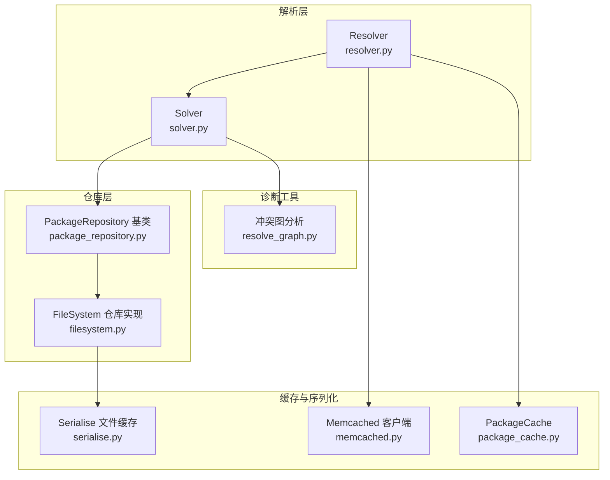
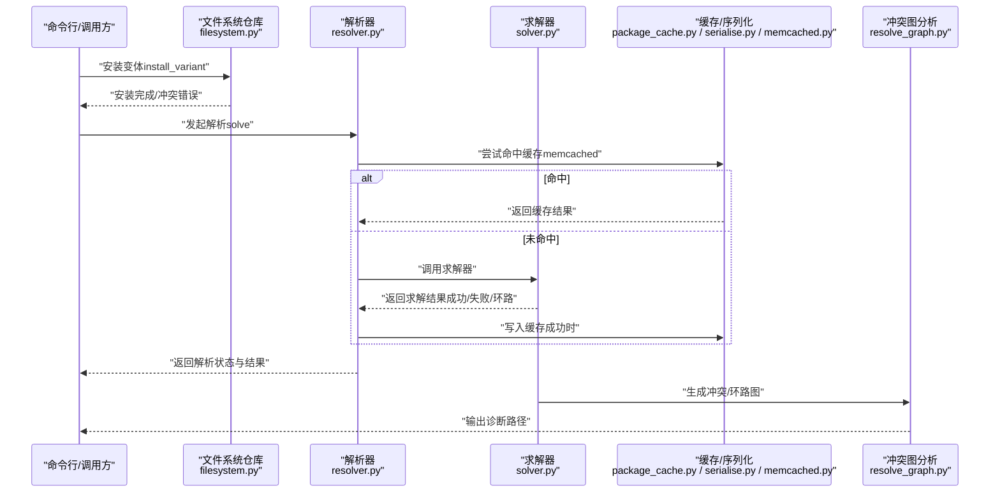
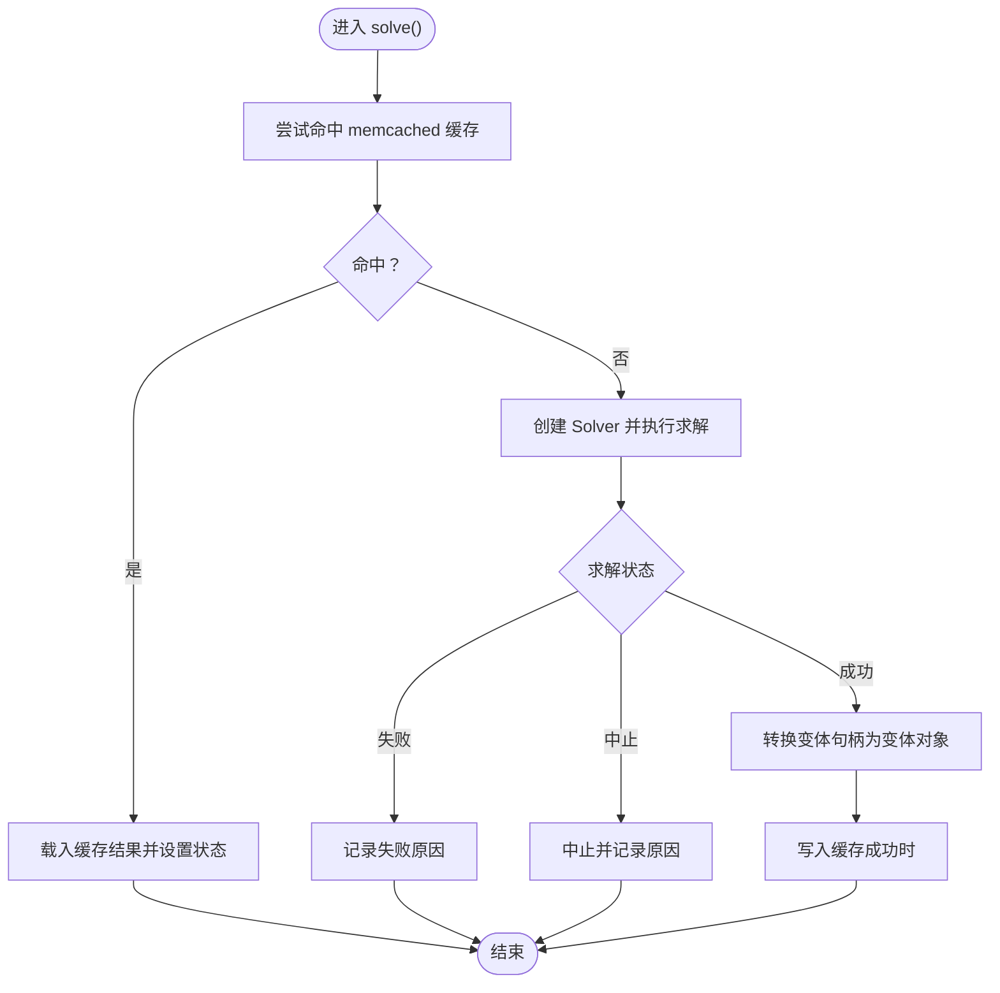
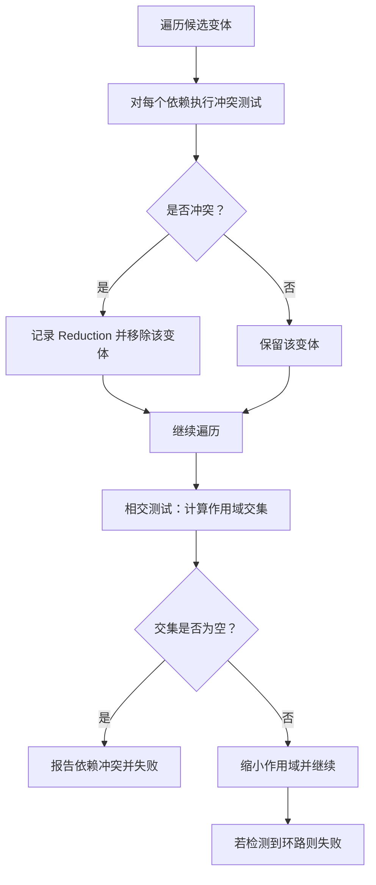
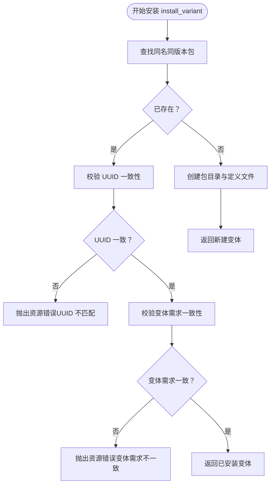
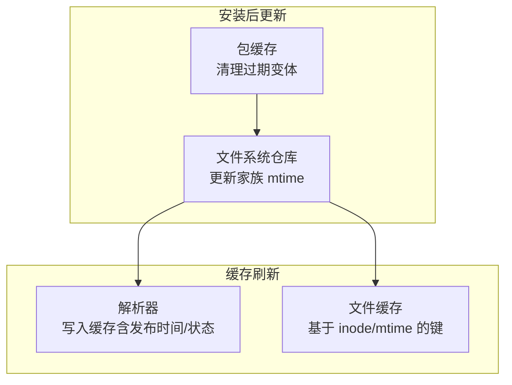
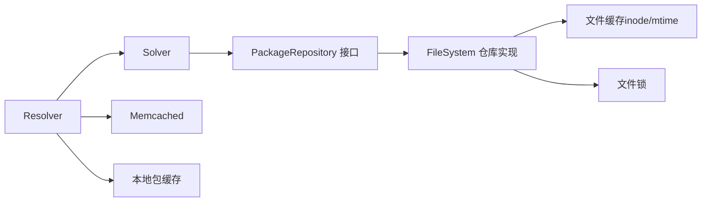

# 安装状态验证与冲突检测

<cite>
**本文引用的文件**
- [resolver.py](file://rez-3.3.0/src/rez/resolver.py)
- [solver.py](file://rez-3.3.0/src/rez/solver.py)
- [package_repository.py](file://rez-3.3.0/src/rez/package_repository.py)
- [filesystem.py](file://rez-3.3.0/src/rezplugins/package_repository/filesystem.py)
- [resolve_graph.py](file://rez-3.3.0/src/rez/utils/resolve_graph.py)
- [memcached.py](file://rez-3.3.0/src/rez/utils/memcached.py)
- [package_cache.py](file://rez-3.3.0/src/rez/package_cache.py)
- [serialise.py](file://rez-3.3.0/src/rez/serialise.py)
</cite>

## 目录
1. [简介](#简介)
2. [项目结构](#项目结构)
3. [核心组件](#核心组件)
4. [架构总览](#架构总览)
5. [详细组件分析](#详细组件分析)
6. [依赖关系分析](#依赖关系分析)
7. [性能考量](#性能考量)
8. [故障排查指南](#故障排查指南)
9. [结论](#结论)
10. [附录](#附录)

## 简介
本文件围绕“安装后状态验证与冲突检测”主题，系统阐述以下内容：
- 如何通过解析器在安装完成后验证新包的可解析性，确保依赖项被正确识别且无版本冲突；
- 包仓库如何检查目标仓库中是否存在同名同版本包，以及如何处理变体冲突与哈希一致性校验；
- 安装后对包索引的更新机制与缓存刷新策略；
- 提供验证脚本编写思路与常见冲突场景（依赖环、版本锁定、仓库不一致）的诊断与修复方法。

## 项目结构
本节聚焦与安装状态验证和冲突检测直接相关的模块与插件：
- 解析器与求解器：resolver.py 负责调用 Solver 并进行缓存；solver.py 实现依赖求解算法与冲突检测；
- 包仓库抽象与文件系统实现：package_repository.py 定义仓库接口；filesystem.py 实现文件系统仓库的安装与一致性校验；
- 缓存与序列化：package_cache.py 管理本地缓存；serialise.py 提供文件缓存键生成；memcached.py 提供分布式缓存客户端；
- 冲突可视化：resolve_graph.py 提供冲突路径与环路信息辅助诊断。

图表来源
- [resolver.py](file://rez-3.3.0/src/rez/resolver.py#L114-L171)
- [solver.py](file://rez-3.3.0/src/rez/solver.py#L687-L720)
- [package_repository.py](file://rez-3.3.0/src/rez/package_repository.py#L514-L649)
- [filesystem.py](file://rez-3.3.0/src/rezplugins/package_repository/filesystem.py#L890-L951)
- [package_cache.py](file://rez-3.3.0/src/rez/package_cache.py#L1-L120)
- [serialise.py](file://rez-3.3.0/src/rez/serialise.py#L123-L157)
- [memcached.py](file://rez-3.3.0/src/rez/utils/memcached.py#L164-L210)
- [resolve_graph.py](file://rez-3.3.0/src/rez/utils/resolve_graph.py#L40-L80)

章节来源
- [resolver.py](file://rez-3.3.0/src/rez/resolver.py#L114-L171)
- [solver.py](file://rez-3.3.0/src/rez/solver.py#L687-L720)
- [package_repository.py](file://rez-3.3.0/src/rez/package_repository.py#L514-L649)
- [filesystem.py](file://rez-3.3.0/src/rezplugins/package_repository/filesystem.py#L890-L951)
- [package_cache.py](file://rez-3.3.0/src/rez/package_cache.py#L1-L120)
- [serialise.py](file://rez-3.3.0/src/rez/serialise.py#L123-L157)
- [memcached.py](file://rez-3.3.0/src/rez/utils/memcached.py#L164-L210)
- [resolve_graph.py](file://rez-3.3.0/src/rez/utils/resolve_graph.py#L40-L80)

## 核心组件
- 解析器（Resolver）
  - 负责调用 Solver 进行依赖求解，并结合 memcached 缓存加速；
  - 提供状态查询（成功/失败/中止）、结果转换为包变体列表、以及缓存键生成与命中逻辑。
- 求解器（Solver）
  - 实现依赖范围交集、冲突检测、循环检测等核心算法；
  - 对冲突与环路输出可读的诊断信息，便于定位问题。
- 包仓库（PackageRepository）
  - 抽象仓库接口，定义安装、忽略、移除、资源句柄等通用能力；
  - 文件系统仓库（filesystem.py）实现具体安装流程与一致性校验。
- 缓存与序列化
  - 文件缓存键基于文件 inode 与 mtime，避免跨网络文件系统写后读一致性问题；
  - 本地包缓存管理变体复制、空间阈值与过期清理。
- 冲突可视化
  - 冲突图分析工具提供从初始请求到冲突或环路的路径描述，辅助诊断。

章节来源
- [resolver.py](file://rez-3.3.0/src/rez/resolver.py#L114-L171)
- [solver.py](file://rez-3.3.0/src/rez/solver.py#L687-L720)
- [package_repository.py](file://rez-3.3.0/src/rez/package_repository.py#L514-L649)
- [filesystem.py](file://rez-3.3.0/src/rezplugins/package_repository/filesystem.py#L890-L951)
- [package_cache.py](file://rez-3.3.0/src/rez/package_cache.py#L1-L120)
- [serialise.py](file://rez-3.3.0/src/rez/serialise.py#L123-L157)
- [resolve_graph.py](file://rez-3.3.0/src/rez/utils/resolve_graph.py#L40-L80)

## 架构总览
安装后状态验证与冲突检测的关键流程如下：
- 安装阶段：文件系统仓库执行变体安装，进行同名同版本与变体需求一致性校验；
- 验证阶段：解析器调用求解器进行可解析性验证，同时利用缓存加速；
- 冲突检测：求解器在相交测试与冲突测试中发现冲突与环路，返回失败状态与原因；
- 诊断阶段：通过冲突图分析工具输出路径信息，辅助定位问题。

图表来源
- [filesystem.py](file://rez-3.3.0/src/rezplugins/package_repository/filesystem.py#L890-L951)
- [resolver.py](file://rez-3.3.0/src/rez/resolver.py#L114-L171)
- [solver.py](file://rez-3.3.0/src/rez/solver.py#L687-L720)
- [package_cache.py](file://rez-3.3.0/src/rez/package_cache.py#L1-L120)
- [serialise.py](file://rez-3.3.0/src/rez/serialise.py#L123-L157)
- [memcached.py](file://rez-3.3.0/src/rez/utils/memcached.py#L164-L210)
- [resolve_graph.py](file://rez-3.3.0/src/rez/utils/resolve_graph.py#L40-L80)

## 详细组件分析

### 解析器（Resolver）与可解析性验证
- 缓存命中与失效策略
  - 解析器根据请求、仓库 UID、过滤器与排序器等生成缓存键；
  - 若存在时间戳，则区分“带时间戳”与“非带时间戳”缓存条目；
  - 当仓库中包的状态变化或有新版本发布时，删除旧缓存条目并重新求解。
- 结果转换与状态
  - 将求解器返回的变体句柄转换为实际变体对象；
  - 记录失败原因、解决耗时与加载耗时，便于统计与调试。

图表来源
- [resolver.py](file://rez-3.3.0/src/rez/resolver.py#L114-L171)
- [resolver.py](file://rez-3.3.0/src/rez/resolver.py#L175-L374)
- [resolver.py](file://rez-3.3.0/src/rez/resolver.py#L397-L475)

章节来源
- [resolver.py](file://rez-3.3.0/src/rez/resolver.py#L114-L171)
- [resolver.py](file://rez-3.3.0/src/rez/resolver.py#L175-L374)
- [resolver.py](file://rez-3.3.0/src/rez/resolver.py#L397-L475)

### 求解器（Solver）与冲突检测
- 冲突检测
  - 在遍历候选变体时，对每个依赖进行冲突测试，记录 Reduction；
  - 在相交测试阶段，若某作用域与提取范围相交为空，则判定为依赖冲突并失败。
- 环路检测
  - 使用图算法检测环路，返回失败状态与环路边信息；
  - 冲突图分析工具可输出从初始请求到环路或冲突的路径，便于定位。

图表来源
- [solver.py](file://rez-3.3.0/src/rez/solver.py#L687-L720)
- [solver.py](file://rez-3.3.0/src/rez/solver.py#L1317-L1346)
- [resolve_graph.py](file://rez-3.3.0/src/rez/utils/resolve_graph.py#L40-L80)

章节来源
- [solver.py](file://rez-3.3.0/src/rez/solver.py#L687-L720)
- [solver.py](file://rez-3.3.0/src/rez/solver.py#L1317-L1346)
- [resolve_graph.py](file://rez-3.3.0/src/rez/utils/resolve_graph.py#L40-L80)

### 包仓库（PackageRepository）与安装一致性校验
- 同名同版本包检查
  - 在安装前查找目标家族下是否存在同版本包；
  - 若存在，进一步校验 UUID 一致性与变体需求一致性，否则抛出资源错误。
- 变体冲突与哈希重复检测
  - 文件系统仓库通过变体需求集合比较，检测变体是否已存在；
  - 若存在等效变体，返回已安装变体句柄，避免重复安装。
- 锁定与并发安全
  - 安装过程使用文件锁，防止并发安装导致的数据竞争。

图表来源
- [filesystem.py](file://rez-3.3.0/src/rezplugins/package_repository/filesystem.py#L1218-L1248)
- [filesystem.py](file://rez-3.3.0/src/rezplugins/package_repository/filesystem.py#L1326-L1351)
- [filesystem.py](file://rez-3.3.0/src/rezplugins/package_repository/filesystem.py#L960-L999)

章节来源
- [filesystem.py](file://rez-3.3.0/src/rezplugins/package_repository/filesystem.py#L1218-L1248)
- [filesystem.py](file://rez-3.3.0/src/rezplugins/package_repository/filesystem.py#L1326-L1351)
- [filesystem.py](file://rez-3.3.0/src/rezplugins/package_repository/filesystem.py#L960-L999)

### 包索引更新与缓存刷新策略
- 文件系统仓库索引更新
  - 安装完成后，文件系统仓库会更新家族目录的 mtime，作为“最后发布时间”的依据；
  - 清理缓存时，清除 LRU 缓存与文件缓存，确保后续读取最新元数据。
- 解析缓存刷新
  - 解析器在成功求解后，将“最近发布时间”与“变体状态句柄”一并写入缓存；
  - 若仓库中包状态变化或出现新版本，缓存会被删除并重新生成。
- 文件缓存键
  - 文件缓存键包含文件 inode 与 mtime，避免跨网络文件系统写后读一致性问题；
  - 支持 memcached 缓存包文件，提升加载性能。

图表来源
- [filesystem.py](file://rez-3.3.0/src/rezplugins/package_repository/filesystem.py#L98-L104)
- [filesystem.py](file://rez-3.3.0/src/rezplugins/package_repository/filesystem.py#L1000-L1015)
- [resolver.py](file://rez-3.3.0/src/rez/resolver.py#L327-L374)
- [serialise.py](file://rez-3.3.0/src/rez/serialise.py#L123-L157)
- [package_cache.py](file://rez-3.3.0/src/rez/package_cache.py#L768-L804)

章节来源
- [filesystem.py](file://rez-3.3.0/src/rezplugins/package_repository/filesystem.py#L98-L104)
- [filesystem.py](file://rez-3.3.0/src/rezplugins/package_repository/filesystem.py#L1000-L1015)
- [resolver.py](file://rez-3.3.0/src/rez/resolver.py#L327-L374)
- [serialise.py](file://rez-3.3.0/src/rez/serialise.py#L123-L157)
- [package_cache.py](file://rez-3.3.0/src/rez/package_cache.py#L768-L804)

## 依赖关系分析
- 组件耦合
  - Resolver 依赖 Solver 与缓存系统，负责高层调度与结果转换；
  - Solver 依赖仓库接口与图算法，负责冲突与环路检测；
  - 文件系统仓库实现具体安装与一致性校验，向上提供统一接口；
  - 缓存系统贯穿文件缓存与解析缓存，提升整体性能。
- 外部依赖
  - memcached 用于解析缓存；
  - 文件系统与锁文件用于并发控制与一致性保证。

图表来源
- [resolver.py](file://rez-3.3.0/src/rez/resolver.py#L114-L171)
- [solver.py](file://rez-3.3.0/src/rez/solver.py#L687-L720)
- [package_repository.py](file://rez-3.3.0/src/rez/package_repository.py#L514-L649)
- [filesystem.py](file://rez-3.3.0/src/rezplugins/package_repository/filesystem.py#L890-L951)
- [serialise.py](file://rez-3.3.0/src/rez/serialise.py#L123-L157)
- [memcached.py](file://rez-3.3.0/src/rez/utils/memcached.py#L164-L210)
- [package_cache.py](file://rez-3.3.0/src/rez/package_cache.py#L1-L120)

章节来源
- [resolver.py](file://rez-3.3.0/src/rez/resolver.py#L114-L171)
- [solver.py](file://rez-3.3.0/src/rez/solver.py#L687-L720)
- [package_repository.py](file://rez-3.3.0/src/rez/package_repository.py#L514-L649)
- [filesystem.py](file://rez-3.3.0/src/rezplugins/package_repository/filesystem.py#L890-L951)
- [serialise.py](file://rez-3.3.0/src/rez/serialise.py#L123-L157)
- [memcached.py](file://rez-3.3.0/src/rez/utils/memcached.py#L164-L210)
- [package_cache.py](file://rez-3.3.0/src/rez/package_cache.py#L1-L120)

## 性能考量
- 解析缓存
  - 解析器在启用缓存时，优先命中 memcached 条目；命中后直接返回结果，显著降低重复解析成本；
  - 缓存键包含请求、仓库 UID、过滤器与排序器等，确保不同上下文不会误命中。
- 文件缓存
  - 文件缓存键基于 inode 与 mtime，避免跨网络文件系统写后读一致性问题；
  - 支持压缩与最小压缩长度配置，平衡网络传输与 CPU 开销。
- 本地包缓存
  - 本地包缓存按变体哈希分桶存储，减少扫描开销；
  - 提供空间阈值与缓冲区限制，避免磁盘空间不足导致的性能退化。

章节来源
- [resolver.py](file://rez-3.3.0/src/rez/resolver.py#L114-L171)
- [resolver.py](file://rez-3.3.0/src/rez/resolver.py#L327-L374)
- [serialise.py](file://rez-3.3.0/src/rez/serialise.py#L123-L157)
- [package_cache.py](file://rez-3.3.0/src/rez/package_cache.py#L1-L120)

## 故障排查指南
- 常见冲突场景与诊断
  - 依赖环：求解器检测到环路，返回失败状态；可通过冲突图分析工具输出从初始请求到环路的路径，定位环路边。
  - 版本锁定：相交测试阶段若作用域与提取范围相交为空，判定为依赖冲突；检查请求范围与仓库可用版本。
  - 仓库不一致：安装阶段若 UUID 或变体需求不一致，抛出资源错误；核对包定义与变体需求。
- 诊断步骤
  - 启用高冗余日志，查看解析器与求解器输出；
  - 使用冲突图分析工具输出路径，定位冲突或环路；
  - 清理缓存后重试，确认缓存一致性问题已排除。
- 修复建议
  - 调整请求范围或版本约束，消除冲突；
  - 修正包定义中的 UUID 或变体需求，确保一致性；
  - 清理本地包缓存与文件缓存，避免陈旧数据影响。

章节来源
- [solver.py](file://rez-3.3.0/src/rez/solver.py#L1317-L1346)
- [resolve_graph.py](file://rez-3.3.0/src/rez/utils/resolve_graph.py#L40-L80)
- [filesystem.py](file://rez-3.3.0/src/rezplugins/package_repository/filesystem.py#L1218-L1248)
- [filesystem.py](file://rez-3.3.0/src/rezplugins/package_repository/filesystem.py#L1326-L1351)
- [resolver.py](file://rez-3.3.0/src/rez/resolver.py#L175-L374)

## 结论
通过解析器、求解器与包仓库的协同，系统实现了安装后的可解析性验证与冲突检测：
- 安装阶段严格校验同名同版本与变体需求一致性，避免重复与冲突；
- 解析阶段利用缓存加速并提供失败原因与诊断路径；
- 仓库与缓存刷新策略确保索引与缓存的一致性与新鲜度；
- 面对依赖环、版本锁定与仓库不一致等常见冲突，系统提供了清晰的诊断与修复路径。

## 附录
- 验证脚本编写思路（不展示具体代码，仅给出路径与要点）
  - 使用解析器进行安装后验证
    - 路径参考：[resolver.py](file://rez-3.3.0/src/rez/resolver.py#L114-L171)
    - 步骤要点：构造请求、调用 solve()、检查状态与失败原因、必要时打印图信息。
  - 安装变体并进行一致性校验
    - 路径参考：[filesystem.py](file://rez-3.3.0/src/rezplugins/package_repository/filesystem.py#L890-L951)
    - 步骤要点：调用 install_variant()、捕获资源错误、核对 UUID 与变体需求。
  - 清理缓存与刷新索引
    - 路径参考：[filesystem.py](file://rez-3.3.0/src/rezplugins/package_repository/filesystem.py#L1000-L1015)
    - 步骤要点：调用 clear_caches()、确认家族目录 mtime 更新。
  - 输出冲突与环路诊断
    - 路径参考：[resolve_graph.py](file://rez-3.3.0/src/rez/utils/resolve_graph.py#L40-L80)
    - 步骤要点：在求解失败后生成冲突图，输出从初始请求到冲突/环路的路径。