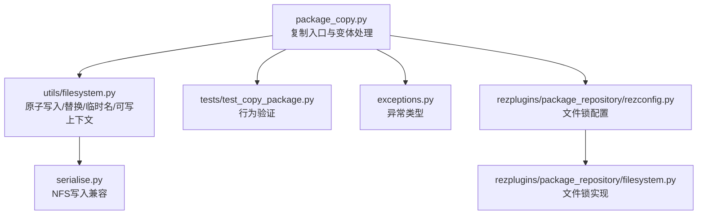
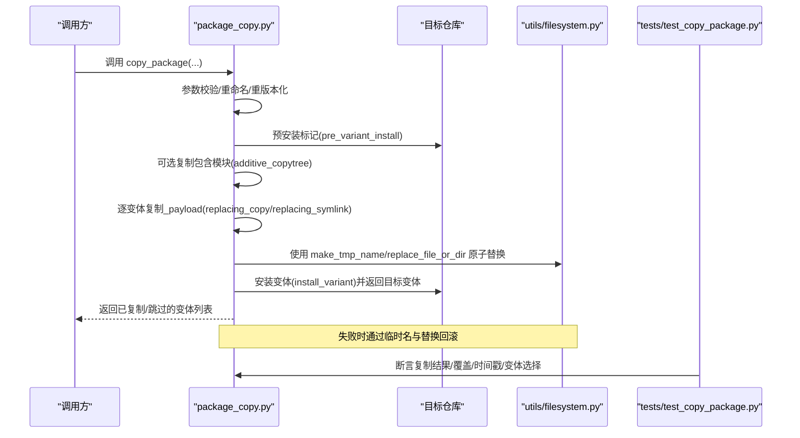
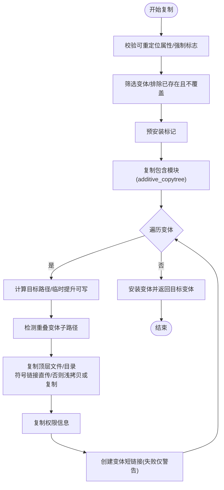
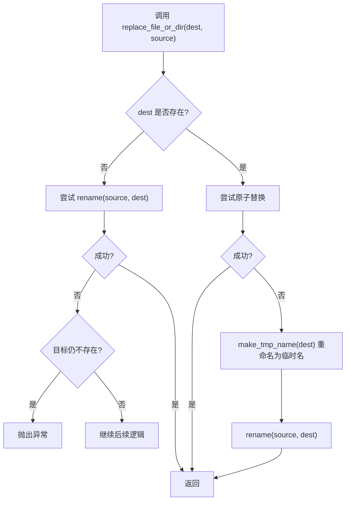
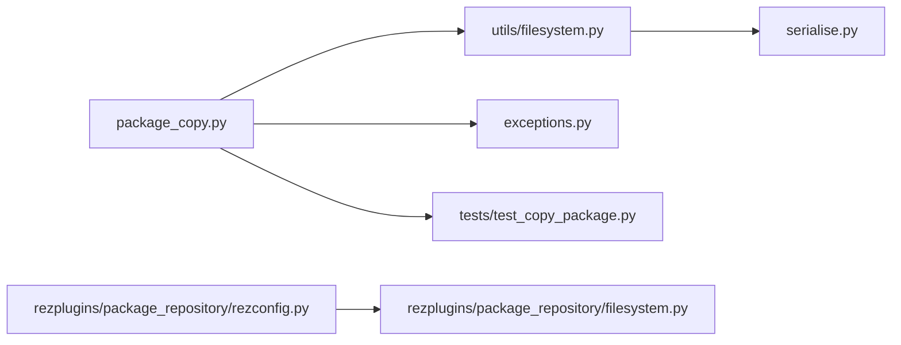

# 文件复制与资源同步

<cite>
**本文引用的文件**
- [package_copy.py](file://rez-3.3.0/src/rez/package_copy.py)
- [filesystem.py](file://rez-3.3.0/src/rez/utils/filesystem.py)
- [test_copy_package.py](file://rez-3.3.0/src/rez/tests/test_copy_package.py)
- [exceptions.py](file://rez-3.3.0/src/rez/exceptions.py)
- [serialise.py](file://rez-3.3.0/src/rez/serialise.py)
- [rezconfig.py](file://rez-3.3.0/src/rezplugins/package_repository/rezconfig.py)
- [filesystem.py（仓库插件）](file://rez-3.3.0/src/rezplugins/package_repository/filesystem.py)
</cite>

## 目录
1. [简介](#简介)
2. [项目结构](#项目结构)
3. [核心组件](#核心组件)
4. [架构总览](#架构总览)
5. [详细组件分析](#详细组件分析)
6. [依赖关系分析](#依赖关系分析)
7. [性能考量](#性能考量)
8. [故障排查指南](#故障排查指南)
9. [结论](#结论)
10. [附录](#附录)

## 简介
本文件围绕 Rez 包安装中的“文件复制与资源同步”主题，系统性梳理 package_copy.py 模块如何安全地完成包资源文件的复制，涵盖源路径扫描、目标路径创建、文件传输与权限设置等关键步骤；解释 filesystem.py 提供的原子写入与替换能力如何保障复制过程的完整性；说明临时目录与校验机制如何实现错误回滚；并对大型文件、符号链接与特殊文件类型的处理策略进行说明；最后给出在不同文件系统（如 NFS、SMB）间的最佳实践及常见问题的应对方案。

## 项目结构
与“文件复制与资源同步”直接相关的模块与测试如下：
- 复制主流程：package_copy.py
- 文件系统工具：utils/filesystem.py
- 测试用例：tests/test_copy_package.py
- 异常定义：exceptions.py
- 写入缓存与 NFS 兼容：serialise.py
- 仓库锁配置：rezplugins/package_repository/rezconfig.py
- 仓库插件锁实现：rezplugins/package_repository/filesystem.py

图表来源
- [package_copy.py](file://rez-3.3.0/src/rez/package_copy.py#L1-L228)
- [filesystem.py](file://rez-3.3.0/src/rez/utils/filesystem.py#L228-L325)
- [test_copy_package.py](file://rez-3.3.0/src/rez/tests/test_copy_package.py#L1-L333)
- [exceptions.py](file://rez-3.3.0/src/rez/exceptions.py#L90-L105)
- [serialise.py](file://rez-3.3.0/src/rez/serialise.py#L45-L85)
- [rezconfig.py](file://rez-3.3.0/src/rezplugins/package_repository/rezconfig.py#L1-L28)
- [filesystem.py（仓库插件）](file://rez-3.3.0/src/rezplugins/package_repository/filesystem.py#L960-L978)

章节来源
- [package_copy.py](file://rez-3.3.0/src/rez/package_copy.py#L1-L228)
- [filesystem.py](file://rez-3.3.0/src/rez/utils/filesystem.py#L228-L325)
- [test_copy_package.py](file://rez-3.3.0/src/rez/tests/test_copy_package.py#L1-L333)

## 核心组件
- 复制入口与变体处理：负责参数解析、重命名/重版本化、变体过滤、覆盖策略、预安装标记、包含模块复制、变体负载复制与短链接创建等。
- 文件系统工具：提供原子写入/替换、临时名生成、可写权限临时提升、目录树复制（合并）、硬链接支持、跨平台重命名（含 Windows robocopy 回退）等。
- 测试用例：验证复制行为、覆盖与时间戳、变体选择、重命名/重版本化、包含模块复制等。
- 异常体系：集中定义 PackageCopyError 等异常类型，便于上层捕获与提示。
- 写入兼容：针对 NFS 的写入缓存策略，避免立即读取刚写文件导致的问题。
- 仓库锁：通过文件锁避免并发写入冲突，保障安装一致性。

章节来源
- [package_copy.py](file://rez-3.3.0/src/rez/package_copy.py#L23-L228)
- [filesystem.py](file://rez-3.3.0/src/rez/utils/filesystem.py#L228-L325)
- [test_copy_package.py](file://rez-3.3.0/src/rez/tests/test_copy_package.py#L101-L333)
- [exceptions.py](file://rez-3.3.0/src/rez/exceptions.py#L90-L105)
- [serialise.py](file://rez-3.3.0/src/rez/serialise.py#L45-L85)
- [rezconfig.py](file://rez-3.3.0/src/rezplugins/package_repository/rezconfig.py#L1-L28)
- [filesystem.py（仓库插件）](file://rez-3.3.0/src/rezplugins/package_repository/filesystem.py#L960-L978)

## 架构总览
下图展示从调用复制到最终安装变体的整体流程，以及关键原子操作与回滚点。

图表来源
- [package_copy.py](file://rez-3.3.0/src/rez/package_copy.py#L171-L227)
- [filesystem.py](file://rez-3.3.0/src/rez/utils/filesystem.py#L236-L325)
- [test_copy_package.py](file://rez-3.3.0/src/rez/tests/test_copy_package.py#L101-L225)

## 详细组件分析

### package_copy.py：复制流程与安全策略
- 参数与约束
  - 支持重命名/重版本化、覆盖策略、浅拷贝（仅符号链接）、跟随符号链接、保持时间戳、跳过负载、干运行、强制复制等。
  - 对非可重定位包默认拒绝复制，除非显式强制。
- 变体筛选与去重
  - 根据目标仓库检查是否存在同名变体，overwrite=false 时直接跳过。
- 预安装与包含模块
  - 在安装首个变体前执行预安装标记，防止仓库提前识别未完成的包。
  - 复制包含模块（additive_copytree 合并），确保环境变量等在目标仓库可用。
- 负载复制
  - 计算目标变体安装路径，按需临时提升可写权限。
  - 对顶层文件/目录：符号链接直接复制；否则根据 shallow 决定是复制还是符号链接。
  - 对重叠变体子路径进行检测，避免浅拷贝破坏其他变体根。
  - 复制完成后，递归复制源包/变体的权限信息。
  - 创建变体短链接（base26），失败仅警告不中断。
- 错误与回滚
  - 通过原子替换与临时名机制，失败时回滚到原状态。

图表来源
- [package_copy.py](file://rez-3.3.0/src/rez/package_copy.py#L171-L383)

章节来源
- [package_copy.py](file://rez-3.3.0/src/rez/package_copy.py#L23-L228)
- [package_copy.py](file://rez-3.3.0/src/rez/package_copy.py#L230-L383)

### utils/filesystem.py：原子操作与回滚
- 原子替换 replace_file_or_dir
  - 若目标不存在，尝试直接重命名；若失败但目标仍不存在则抛出异常。
  - 若目标存在，优先使用原子替换；失败则回退到“先重命名为临时名，再将新内容移动到目标”的两步法。
- 替换式复制 replacing_copy
  - 通过临时名生成器在同目录内生成临时目标，先写入临时名，再原子替换。
  - 支持保留符号链接或跟随符号链接复制。
- 临时名 make_tmp_name
  - 在同一目录生成临时名并在退出时清理，避免跨卷/跨挂载导致的 rename 失败。
- 可写权限临时提升 make_path_writable
  - 仅在必要时临时提升权限，结束后恢复原权限。
- 目录树复制 additive_copytree
  - 将源目录合并到已有目标目录，适合包含模块场景。
- 跨平台重命名 rename
  - Windows 下遇到权限错误时，尝试使用 robocopy 进行移动，失败则抛出 OSError。

图表来源
- [filesystem.py](file://rez-3.3.0/src/rez/utils/filesystem.py#L263-L325)

章节来源
- [filesystem.py](file://rez-3.3.0/src/rez/utils/filesystem.py#L228-L325)
- [filesystem.py](file://rez-3.3.0/src/rez/utils/filesystem.py#L682-L732)

### 测试用例：行为验证
- 基本复制、覆盖与跳过、变体选择、重命名/重版本化、时间戳控制、包含模块复制等均有覆盖。
- 通过断言验证复制结果、覆盖前后时间戳变化、变体匹配等。

章节来源
- [test_copy_package.py](file://rez-3.3.0/src/rez/tests/test_copy_package.py#L101-L333)

### 异常与错误类型
- PackageCopyError：复制过程中出现的错误统一由该异常类型承载，便于上层捕获与提示。

章节来源
- [exceptions.py](file://rez-3.3.0/src/rez/exceptions.py#L90-L105)

### NFS/SMB 最佳实践与兼容
- NFS 写入兼容：serialise.py 中采用“同时写入本地缓存并在读取时重定向”的策略，缓解某些 NFS 实现立即读取刚写文件的问题。
- 仓库锁：通过文件锁避免并发写入冲突，支持多种锁类型与超时配置，减少竞态风险。

章节来源
- [serialise.py](file://rez-3.3.0/src/rez/serialise.py#L45-L85)
- [rezconfig.py](file://rez-3.3.0/src/rezplugins/package_repository/rezconfig.py#L1-L28)
- [filesystem.py（仓库插件）](file://rez-3.3.0/src/rezplugins/package_repository/filesystem.py#L960-L978)

## 依赖关系分析
- package_copy.py 依赖 utils/filesystem.py 的原子写入/替换、临时名、可写权限提升、目录树复制等能力。
- package_copy.py 通过仓库接口进行预安装标记与安装变体，确保复制期间仓库可见性与一致性。
- 测试用例依赖 package_copy.py 的公开 API，验证复制行为与边界条件。

图表来源
- [package_copy.py](file://rez-3.3.0/src/rez/package_copy.py#L1-L228)
- [filesystem.py](file://rez-3.3.0/src/rez/utils/filesystem.py#L228-L325)
- [test_copy_package.py](file://rez-3.3.0/src/rez/tests/test_copy_package.py#L1-L333)
- [exceptions.py](file://rez-3.3.0/src/rez/exceptions.py#L90-L105)
- [serialise.py](file://rez-3.3.0/src/rez/serialise.py#L45-L85)
- [rezconfig.py](file://rez-3.3.0/src/rezplugins/package_repository/rezconfig.py#L1-L28)
- [filesystem.py（仓库插件）](file://rez-3.3.0/src/rezplugins/package_repository/filesystem.py#L960-L978)

## 性能考量
- 硬链接复制：copytree 支持硬链接优先，失败回退到复制，有助于减少大文件复制开销。
- 符号链接处理：浅拷贝模式下优先符号链接，避免重复数据；深拷贝模式下可选择跟随符号链接复制。
- 权限复制：仅在必要时复制权限，避免不必要的 stat/copystat 调用。
- 并发控制：仓库文件锁降低并发写入竞争，减少失败重试成本。

章节来源
- [filesystem.py](file://rez-3.3.0/src/rez/utils/filesystem.py#L407-L458)

## 故障排查指南
- 传输中断
  - 利用原子替换与临时名机制，失败会回滚到原状态，避免部分写入导致的数据损坏。
  - Windows 下权限错误可回退到 robocopy 移动，失败则抛出 OSError。
- 磁盘空间不足
  - 复制前应确保目标路径有足够空间；若中途失败，临时文件会在上下文退出时清理。
- 文件锁定
  - 使用仓库文件锁避免并发写入；可通过配置调整锁类型与超时。
- NFS/SMB 特殊性
  - 写入阶段采用本地缓存策略，降低立即读取刚写文件的风险。
- 符号链接与特殊文件
  - 默认保留符号链接；如需跟随复制，可启用跟随选项；对设备文件等特殊类型，当前实现未显式处理，建议在非可重定位包上谨慎使用。

章节来源
- [filesystem.py](file://rez-3.3.0/src/rez/utils/filesystem.py#L236-L325)
- [filesystem.py](file://rez-3.3.0/src/rez/utils/filesystem.py#L682-L732)
- [serialise.py](file://rez-3.3.0/src/rez/serialise.py#L45-L85)
- [rezconfig.py](file://rez-3.3.0/src/rezplugins/package_repository/rezconfig.py#L1-L28)
- [filesystem.py（仓库插件）](file://rez-3.3.0/src/rezplugins/package_repository/filesystem.py#L960-L978)

## 结论
package_copy.py 通过严格的变体筛选、预安装标记、包含模块合并与原子替换等手段，实现了包资源文件的安全复制。filesystem.py 提供的临时名、原子替换、可写权限提升与跨平台重命名等能力，为复制过程的完整性与可回滚提供了坚实基础。结合仓库文件锁与 NFS/SMB 兼容策略，可在复杂网络环境中稳定完成包安装与资源同步。

## 附录
- 关键函数与路径
  - 复制入口：[copy_package](file://rez-3.3.0/src/rez/package_copy.py#L23-L228)
  - 变体负载复制：[_copy_variant_payload](file://rez-3.3.0/src/rez/package_copy.py#L230-L383)
  - 原子替换：[replace_file_or_dir](file://rez-3.3.0/src/rez/utils/filesystem.py#L263-L325)
  - 替换式复制：[replacing_copy](file://rez-3.3.0/src/rez/utils/filesystem.py#L236-L261)
  - 临时名生成：[make_tmp_name](file://rez-3.3.0/src/rez/utils/filesystem.py#L305-L325)
  - 可写权限提升：[make_path_writable](file://rez-3.3.0/src/rez/utils/filesystem.py#L88-L119)
  - 目录树复制（合并）：[additive_copytree](file://rez-3.3.0/src/rez/utils/filesystem.py#L290-L303)
  - 跨平台重命名：[rename](file://rez-3.3.0/src/rez/utils/filesystem.py#L682-L732)
  - 测试用例：[test_copy_package.py](file://rez-3.3.0/src/rez/tests/test_copy_package.py#L101-L333)
  - 异常类型：[PackageCopyError](file://rez-3.3.0/src/rez/exceptions.py#L90-L105)
  - NFS 写入兼容：[open_file_for_write](file://rez-3.3.0/src/rez/serialise.py#L45-L85)
  - 仓库锁配置：[rezconfig.py](file://rez-3.3.0/src/rezplugins/package_repository/rezconfig.py#L1-L28)
  - 仓库锁实现：[filesystem.py（仓库插件）](file://rez-3.3.0/src/rezplugins/package_repository/filesystem.py#L960-L978)