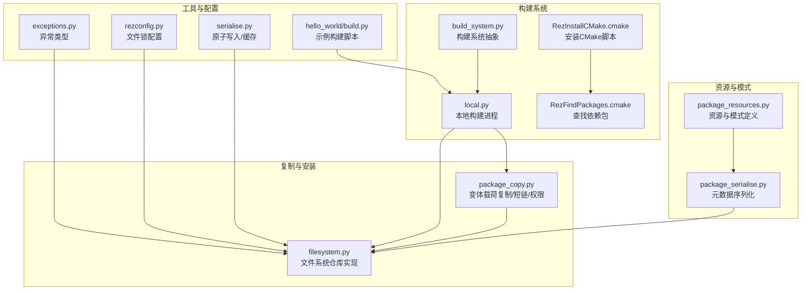
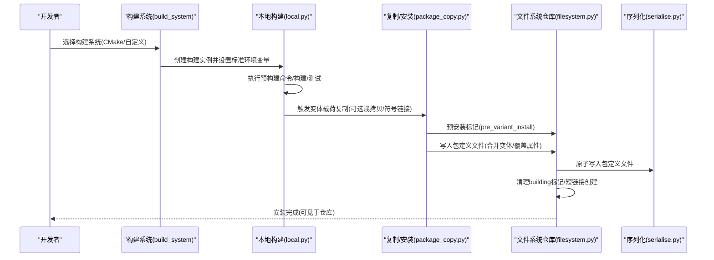
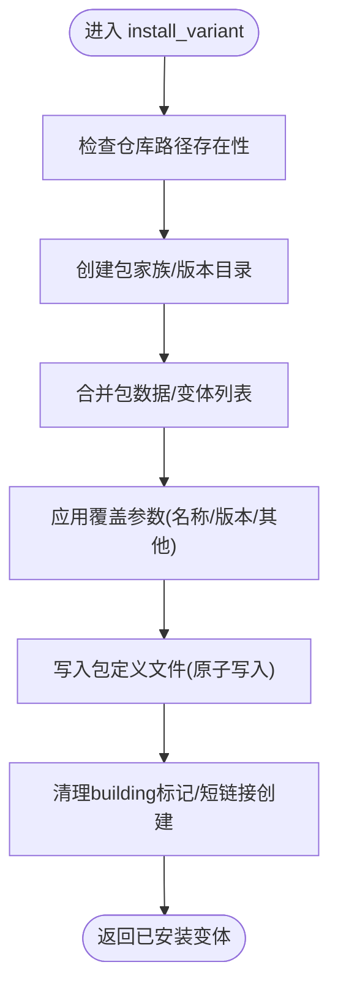
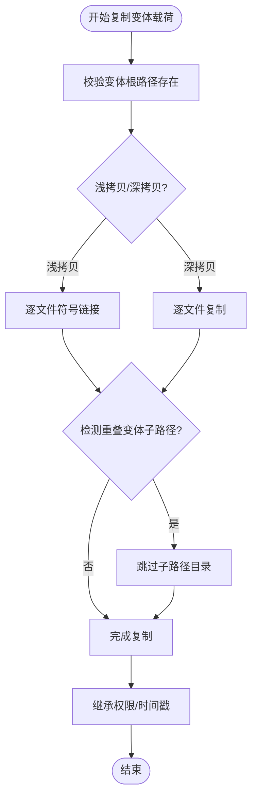
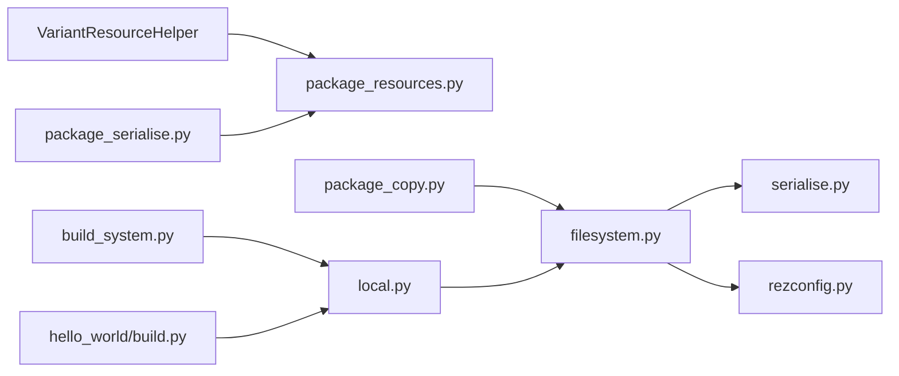

# 包安装流程

<cite>
**本文引用的文件**
- [rez-3.3.0/src/rez/package_resources.py](file://rez-3.3.0/src/rez/package_resources.py)
- [rez-3.3.0/src/rez/package_serialise.py](file://rez-3.3.0/src/rez/package_serialise.py)
- [rez-3.3.0/src/rez/package_copy.py](file://rez-3.3.0/src/rez/package_copy.py)
- [rez-3.3.0/src/rezplugins/package_repository/filesystem.py](file://rez-3.3.0/src/rezplugins/package_repository/filesystem.py)
- [rez-3.3.0/src/rezplugins/build_process/local.py](file://rez-3.3.0/src/rezplugins/build_process/local.py)
- [rez-3.3.0/src/rez/build_system.py](file://rez-3.3.0/src/rez/build_system.py)
- [rez-3.3.0/src/rezplugins/build_system/cmake_files/RezInstallCMake.cmake](file://rez-3.3.0/src/rezplugins/build_system/cmake_files/RezInstallCMake.cmake)
- [rez-3.3.0/src/rezplugins/build_system/cmake_files/RezFindPackages.cmake](file://rez-3.3.0/src/rezplugins/build_system/cmake_files/RezFindPackages.cmake)
- [rez-3.3.0/src/rez/serialise.py](file://rez-3.3.0/src/rez/serialise.py)
- [rez-3.3.0/src/rezplugins/package_repository/rezconfig.py](file://rez-3.3.0/src/rezplugins/package_repository/rezconfig.py)
- [rez-3.3.0/src/rez/exceptions.py](file://rez-3.3.0/src/rez/exceptions.py)
- [rez-3.3.0/example_packages/hello_world/build.py](file://rez-3.3.0/example_packages/hello_world/build.py)
</cite>

## 目录
1. [引言](#引言)
2. [项目结构](#项目结构)
3. [核心组件](#核心组件)
4. [架构总览](#架构总览)
5. [详细组件分析](#详细组件分析)
6. [依赖关系分析](#依赖关系分析)
7. [性能考量](#性能考量)
8. [故障排查指南](#故障排查指南)
9. [结论](#结论)
10. [附录](#附录)

## 引言
本文件围绕 Rez 的“包安装流程”展开，重点解释 Variant.install 方法如何将已解析的包实例写入目标仓库，涵盖元数据序列化、文件复制与符号链接创建等步骤；结合 hello_world 示例中的 build.py 展示从源码构建到最终安装的完整生命周期，并说明与 CMake 等构建系统的集成方式；同时讨论安装过程中的权限管理、原子性保障与错误回滚机制，并给出将开发中的包（如 myapp）安全安装到本地仓库的最佳实践及常见问题与解决方案。

## 项目结构
Rez 的安装流程由多个模块协同完成：
- 资源与模式：定义包与变体的资源模型与校验模式，确保元数据一致性。
- 序列化：将包元数据以 Python/YAML 格式写出，保证字段顺序与兼容性。
- 复制与安装：负责变体载荷复制、短链接创建、权限继承与时间戳更新。
- 文件系统仓库：实现具体磁盘写入、包定义文件生成、变体合并与冲突检测。
- 构建系统与构建进程：在安装前执行构建，注入标准环境变量，支持 CMake 等。
- 错误与回滚：通过异常类型与锁机制保障安装过程的健壮性。

图表来源
- [rez-3.3.0/src/rez/package_resources.py](file://rez-3.3.0/src/rez/package_resources.py#L1-L120)
- [rez-3.3.0/src/rez/package_serialise.py](file://rez-3.3.0/src/rez/package_serialise.py#L1-L120)
- [rez-3.3.0/src/rez/package_copy.py](file://rez-3.3.0/src/rez/package_copy.py#L160-L400)
- [rez-3.3.0/src/rezplugins/package_repository/filesystem.py](file://rez-3.3.0/src/rezplugins/package_repository/filesystem.py#L1196-L1450)
- [rez-3.3.0/src/rez/build_system.py](file://rez-3.3.0/src/rez/build_system.py#L1-L120)
- [rez-3.3.0/src/rezplugins/build_process/local.py](file://rez-3.3.0/src/rezplugins/build_process/local.py#L141-L319)
- [rez-3.3.0/src/rezplugins/build_system/cmake_files/RezInstallCMake.cmake](file://rez-3.3.0/src/rezplugins/build_system/cmake_files/RezInstallCMake.cmake#L1-L205)
- [rez-3.3.0/src/rezplugins/build_system/cmake_files/RezFindPackages.cmake](file://rez-3.3.0/src/rezplugins/build_system/cmake_files/RezFindPackages.cmake#L1-L104)
- [rez-3.3.0/src/rez/serialise.py](file://rez-3.3.0/src/rez/serialise.py#L45-L85)
- [rez-3.3.0/src/rezplugins/package_repository/rezconfig.py](file://rez-3.3.0/src/rezplugins/package_repository/rezconfig.py#L1-L28)
- [rez-3.3.0/src/rez/exceptions.py](file://rez-3.3.0/src/rez/exceptions.py#L1-L120)
- [rez-3.3.0/example_packages/hello_world/build.py](file://rez-3.3.0/example_packages/hello_world/build.py#L1-L59)

章节来源
- [rez-3.3.0/src/rez/package_resources.py](file://rez-3.3.0/src/rez/package_resources.py#L1-L120)
- [rez-3.3.0/src/rez/package_serialise.py](file://rez-3.3.0/src/rez/package_serialise.py#L1-L120)

## 核心组件
- Variant 与资源模型：VariantResource/VariantResourceHelper 定义变体根路径、子路径与短链接策略，为安装提供定位依据。
- 元数据序列化：package_serialise 将包数据按固定键序写出，支持 Python/YAML，保留命令注释兼容。
- 变体载荷复制：package_copy 实现浅拷贝/深拷贝、符号链接、权限继承、重叠变体规避与临时可写目录处理。
- 文件系统仓库：filesystem 实现包家族/版本目录创建、包定义文件写入、变体合并、冲突检测与“building”标记清理。
- 构建系统与进程：build_system 抽象构建系统接口，local 实现本地构建流程，注入标准环境变量，支持测试与取消回调。
- 原子写入与锁：serialise 提供写入缓存与原子写入策略，filesystem 配合文件锁避免并发写入冲突。
- 异常体系：exceptions 定义包安装相关的异常类型，便于统一捕获与提示。

章节来源
- [rez-3.3.0/src/rez/package_resources.py](file://rez-3.3.0/src/rez/package_resources.py#L338-L521)
- [rez-3.3.0/src/rez/package_serialise.py](file://rez-3.3.0/src/rez/package_serialise.py#L113-L223)
- [rez-3.3.0/src/rez/package_copy.py](file://rez-3.3.0/src/rez/package_copy.py#L160-L400)
- [rez-3.3.0/src/rezplugins/package_repository/filesystem.py](file://rez-3.3.0/src/rezplugins/package_repository/filesystem.py#L1196-L1450)
- [rez-3.3.0/src/rez/build_system.py](file://rez-3.3.0/src/rez/build_system.py#L177-L312)
- [rez-3.3.0/src/rezplugins/build_process/local.py](file://rez-3.3.0/src/rezplugins/build_process/local.py#L141-L319)
- [rez-3.3.0/src/rez/serialise.py](file://rez-3.3.0/src/rez/serialise.py#L45-L85)
- [rez-3.3.0/src/rez/exceptions.py](file://rez-3.3.0/src/rez/exceptions.py#L1-L120)

## 架构总览
下图展示从源码构建到安装写入仓库的关键调用链路与职责分工。

图表来源
- [rez-3.3.0/src/rez/build_system.py](file://rez-3.3.0/src/rez/build_system.py#L177-L312)
- [rez-3.3.0/src/rezplugins/build_process/local.py](file://rez-3.3.0/src/rezplugins/build_process/local.py#L141-L319)
- [rez-3.3.0/src/rez/package_copy.py](file://rez-3.3.0/src/rez/package_copy.py#L160-L227)
- [rez-3.3.0/src/rezplugins/package_repository/filesystem.py](file://rez-3.3.0/src/rezplugins/package_repository/filesystem.py#L1196-L1450)
- [rez-3.3.0/src/rez/serialise.py](file://rez-3.3.0/src/rez/serialise.py#L45-L85)

## 详细组件分析

### Variant.install 与包定义写入
- 安装入口：filesystem.install_variant 接收变体资源与覆盖参数，创建仓库路径，调用内部 _create_variant 完成包定义文件生成与变体合并。
- 包定义生成：_create_variant 中，读取现有包数据或新包数据，移除仅构建期字段，合并发布信息，决定是否新增变体列表项，并写入包定义文件。
- 原子写入：通过 open_file_for_write 在本地缓存中写入，再落盘，减少 NFS 等环境下立即读取失败的风险。
- 并发控制：文件锁配置（file_lock_type、file_lock_timeout、file_lock_dir）用于避免多进程同时写入导致的数据竞争。

图表来源
- [rez-3.3.0/src/rezplugins/package_repository/filesystem.py](file://rez-3.3.0/src/rezplugins/package_repository/filesystem.py#L1196-L1450)
- [rez-3.3.0/src/rez/serialise.py](file://rez-3.3.0/src/rez/serialise.py#L45-L85)
- [rez-3.3.0/src/rezplugins/package_repository/rezconfig.py](file://rez-3.3.0/src/rezplugins/package_repository/rezconfig.py#L1-L28)

章节来源
- [rez-3.3.0/src/rezplugins/package_repository/filesystem.py](file://rez-3.3.0/src/rezplugins/package_repository/filesystem.py#L1196-L1450)
- [rez-3.3.0/src/rez/serialise.py](file://rez-3.3.0/src/rez/serialise.py#L45-L85)
- [rez-3.3.0/src/rezplugins/package_repository/rezconfig.py](file://rez-3.3.0/src/rezplugins/package_repository/rezconfig.py#L1-L28)

### 变体载荷复制、符号链接与权限
- 复制策略：package_copy._copy_variant_payload 支持浅拷贝（符号链接）与深拷贝（复制），根据 is_varianted 与 hashed_variants 决定子路径与跳过规则。
- 重叠变体规避：当存在 A 与 A/B 子路径时，避免将 A/B 作为浅拷贝链接到原始包，防止污染。
- 权限继承：复制后对包与变体根目录执行 shutil.copystat，保持权限与时间戳一致。
- 临时可写：若目标路径部分存在且配置允许，使用 make_path_writable 上下文临时提升权限，确保写入成功。

图表来源
- [rez-3.3.0/src/rez/package_copy.py](file://rez-3.3.0/src/rez/package_copy.py#L230-L383)

章节来源
- [rez-3.3.0/src/rez/package_copy.py](file://rez-3.3.0/src/rez/package_copy.py#L230-L383)

### 元数据序列化与字段顺序
- 字段顺序：package_serialise.package_key_order 指定优先输出字段，确保包定义文件可读性与一致性。
- 格式支持：支持 Python 与 YAML 两种格式，命令注释在 YAML 中被转换为注释形式，便于调试。
- 数据清洗：过滤 None 值与构建期专用键，仅保留发布所需字段。

章节来源
- [rez-3.3.0/src/rez/package_serialise.py](file://rez-3.3.0/src/rez/package_serialise.py#L18-L112)
- [rez-3.3.0/src/rez/package_serialise.py](file://rez-3.3.0/src/rez/package_serialise.py#L113-L223)

### 构建系统与 CMake 集成
- 构建系统抽象：build_system 提供统一接口，detect 有效构建系统，支持 child_build_system（如 CMake -> Make）。
- 标准环境变量：set_standard_vars 注入 REZ_BUILD_* 系列变量，便于构建脚本使用。
- CMake 集成：
  - RezInstallCMake.cmake：生成并安装 <unversioned_package>.cmake，自动处理相对路径与库发现。
  - RezFindPackages.cmake：在构建环境中查找 Rez 包，组合 include/ld/defs 到输出变量。

章节来源
- [rez-3.3.0/src/rez/build_system.py](file://rez-3.3.0/src/rez/build_system.py#L1-L120)
- [rez-3.3.0/src/rez/build_system.py](file://rez-3.3.0/src/rez/build_system.py#L177-L312)
- [rez-3.3.0/src/rezplugins/build_system/cmake_files/RezInstallCMake.cmake](file://rez-3.3.0/src/rezplugins/build_system/cmake_files/RezInstallCMake.cmake#L1-L205)
- [rez-3.3.0/src/rezplugins/build_system/cmake_files/RezFindPackages.cmake](file://rez-3.3.0/src/rezplugins/build_system/cmake_files/RezFindPackages.cmake#L1-L104)

### hello_world 示例构建生命周期
- 示例脚本：hello_world/build.py 定义 build 函数，按需复制 python 与 bin 目录，设置二进制可执行权限，并在 install 目标存在时执行安装。
- 与 Rez 集成：local 构建进程会注入 REZ_BUILD_* 环境变量，构建产物位于 REZ_BUILD_PATH，安装目标位于 REZ_BUILD_INSTALL_PATH，最终由仓库写入包定义与载荷。

章节来源
- [rez-3.3.0/example_packages/hello_world/build.py](file://rez-3.3.0/example_packages/hello_world/build.py#L1-L59)
- [rez-3.3.0/src/rezplugins/build_process/local.py](file://rez-3.3.0/src/rezplugins/build_process/local.py#L141-L319)

### 权限管理、原子性与错误回滚
- 权限管理：
  - 临时可写：当目标路径部分存在且配置允许时，使用 make_path_writable 临时提升权限，写入后再恢复。
  - 权限继承：复制完成后对包与变体根目录执行 copystat，保持权限一致。
- 原子性：
  - 原子写入：serialise.open_file_for_write 在本地缓存写入后再落盘，降低 NFS 等环境下的读取失败风险。
  - 文件锁：filesystem 配置 file_lock_type、file_lock_timeout、file_lock_dir，避免并发写入冲突。
- 回滚与取消：
  - 取消安装：local 构建进程在发生 BuildError 时调用 on_variant_install_cancelled，清理 building 标记，避免无效包被识别。
  - 短链接创建失败：filesystem 对短链接创建进行容错，仅记录警告，不影响整体安装。

章节来源
- [rez-3.3.0/src/rez/package_copy.py](file://rez-3.3.0/src/rez/package_copy.py#L278-L383)
- [rez-3.3.0/src/rez/serialise.py](file://rez-3.3.0/src/rez/serialise.py#L45-L85)
- [rez-3.3.0/src/rezplugins/package_repository/rezconfig.py](file://rez-3.3.0/src/rezplugins/package_repository/rezconfig.py#L1-L28)
- [rez-3.3.0/src/rezplugins/build_process/local.py](file://rez-3.3.0/src/rezplugins/build_process/local.py#L317-L352)
- [rez-3.3.0/src/rezplugins/package_repository/filesystem.py](file://rez-3.3.0/src/rezplugins/package_repository/filesystem.py#L1419-L1450)

## 依赖关系分析
- VariantResource/VariantResourceHelper 依赖 package_resources 的模式与元数据转发机制。
- package_serialise 依赖 package_resources 的 schema 与 SourceCode。
- package_copy 依赖 filesystem 仓库接口与权限工具。
- filesystem 依赖 serialise 的原子写入与配置的文件锁设置。
- build_system 与 local 构建进程共同驱动安装前构建与测试。
- hello_world/build.py 作为外部构建脚本，遵循 Rez 注入的环境变量约定。

图表来源
- [rez-3.3.0/src/rez/package_resources.py](file://rez-3.3.0/src/rez/package_resources.py#L338-L521)
- [rez-3.3.0/src/rez/package_serialise.py](file://rez-3.3.0/src/rez/package_serialise.py#L113-L223)
- [rez-3.3.0/src/rez/package_copy.py](file://rez-3.3.0/src/rez/package_copy.py#L160-L227)
- [rez-3.3.0/src/rezplugins/package_repository/filesystem.py](file://rez-3.3.0/src/rezplugins/package_repository/filesystem.py#L1196-L1450)
- [rez-3.3.0/src/rez/serialise.py](file://rez-3.3.0/src/rez/serialise.py#L45-L85)
- [rez-3.3.0/src/rezplugins/package_repository/rezconfig.py](file://rez-3.3.0/src/rezplugins/package_repository/rezconfig.py#L1-L28)
- [rez-3.3.0/src/rez/build_system.py](file://rez-3.3.0/src/rez/build_system.py#L177-L312)
- [rez-3.3.0/src/rezplugins/build_process/local.py](file://rez-3.3.0/src/rezplugins/build_process/local.py#L141-L319)
- [rez-3.3.0/example_packages/hello_world/build.py](file://rez-3.3.0/example_packages/hello_world/build.py#L1-L59)

## 性能考量
- 浅拷贝与符号链接：在大体量载荷场景下，浅拷贝可显著减少 IO 与磁盘占用；但需注意重叠变体规避逻辑。
- 原子写入与缓存：本地缓存写入可降低 NFS 等网络存储的读写抖动，提高稳定性。
- 文件锁策略：合理设置 file_lock_timeout 与 file_lock_dir，避免因权限不足导致的锁创建失败。
- 并发安装：在多用户共享仓库中，建议启用文件锁并限制并发写入数量。

## 故障排查指南
- 权限问题
  - 症状：写入失败或无法修改现有包定义。
  - 排查：确认仓库路径权限，必要时开启 make_package_temporarily_writable；检查文件锁目录权限。
  - 参考：[临时可写与文件锁配置](file://rez-3.3.0/src/rezplugins/package_repository/rezconfig.py#L1-L28)，[临时可写上下文](file://rez-3.3.0/src/rez/package_copy.py#L278-L287)。
- 路径与依赖锁定
  - 症状：安装后包不可见或变体未合并。
  - 排查：确认包定义文件格式与扩展名匹配；检查 hashed_variants 与变体子路径；核对 UUID 一致性。
  - 参考：[包定义写入与变体合并](file://rez-3.3.0/src/rezplugins/package_repository/filesystem.py#L1355-L1438)。
- 构建阶段失败
  - 症状：构建中断或测试失败。
  - 排查：查看 pre_build_commands 与构建日志；确认 REZ_BUILD_* 环境变量正确注入；必要时启用 write_build_scripts 获取交互式构建脚本。
  - 参考：[标准环境变量注入](file://rez-3.3.0/src/rez/build_system.py#L209-L259)，[本地构建流程](file://rez-3.3.0/src/rezplugins/build_process/local.py#L141-L319)。
- 短链接创建失败
  - 症状：变体根路径过长或链接创建报错。
  - 排查：短链接创建失败仅记录警告，不影响安装；可手动清理或调整短链接策略。
  - 参考：[短链接创建与容错](file://rez-3.3.0/src/rezplugins/package_repository/filesystem.py#L1419-L1450)。

章节来源
- [rez-3.3.0/src/rezplugins/package_repository/rezconfig.py](file://rez-3.3.0/src/rezplugins/package_repository/rezconfig.py#L1-L28)
- [rez-3.3.0/src/rez/package_copy.py](file://rez-3.3.0/src/rez/package_copy.py#L278-L287)
- [rez-3.3.0/src/rezplugins/package_repository/filesystem.py](file://rez-3.3.0/src/rezplugins/package_repository/filesystem.py#L1355-L1450)
- [rez-3.3.0/src/rez/build_system.py](file://rez-3.3.0/src/rez/build_system.py#L209-L259)
- [rez-3.3.0/src/rezplugins/build_process/local.py](file://rez-3.3.0/src/rezplugins/build_process/local.py#L141-L319)

## 结论
Rez 的包安装流程通过“资源模型—元数据序列化—载荷复制—仓库写入”的分层设计，实现了高可靠、可扩展的安装能力。借助文件锁、原子写入与权限管理，安装过程具备良好的并发安全性与错误回滚能力。结合 CMake 等构建系统，可无缝衔接从源码到本地仓库的全生命周期。针对权限、路径与依赖锁定等常见问题，建议通过配置文件锁、启用临时可写与严格校验包定义文件来规避风险。

## 附录
- 最佳实践（将开发中的包安全安装到本地仓库）
  - 使用 hashed_variants 与短链接，缩短路径长度，提升可维护性。
  - 启用文件锁与合理的 file_lock_timeout，避免并发写入冲突。
  - 在安装前运行测试（pre_install），确保构建产物符合预期。
  - 对非可重定位包谨慎复制，必要时强制 relocatable 或使用符号链接策略。
  - 使用原子写入与本地缓存写入，降低网络存储抖动带来的失败率。
  - 若仓库路径权限受限，开启 make_package_temporarily_writable 并限定作用范围。