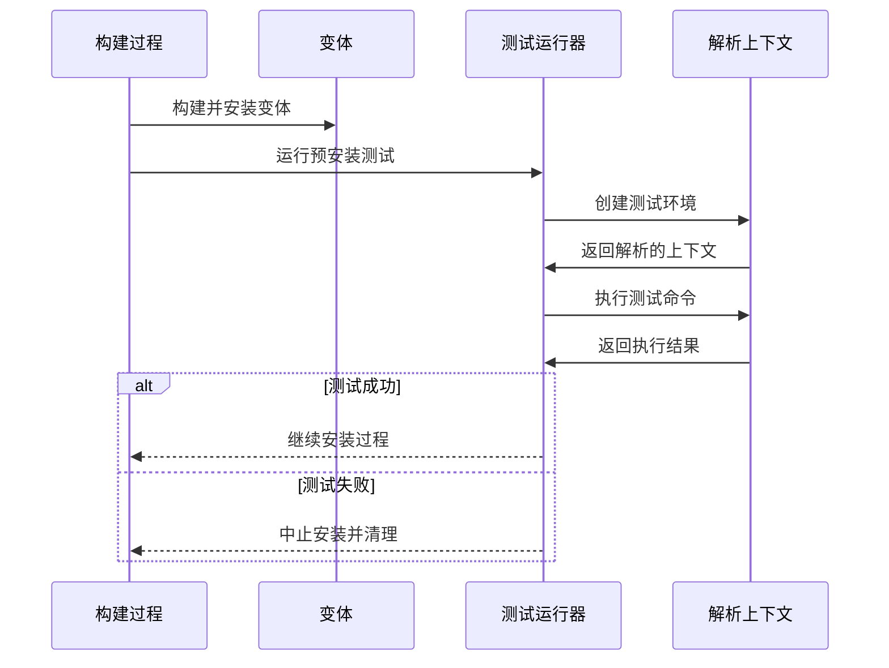
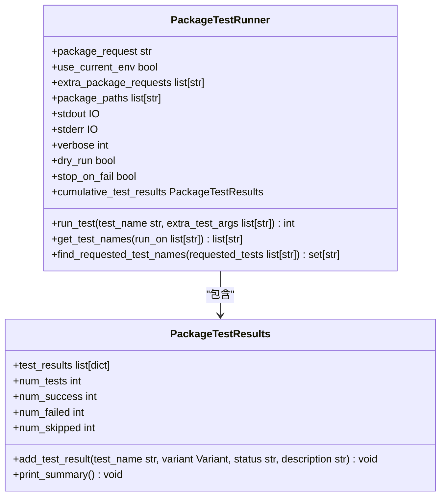
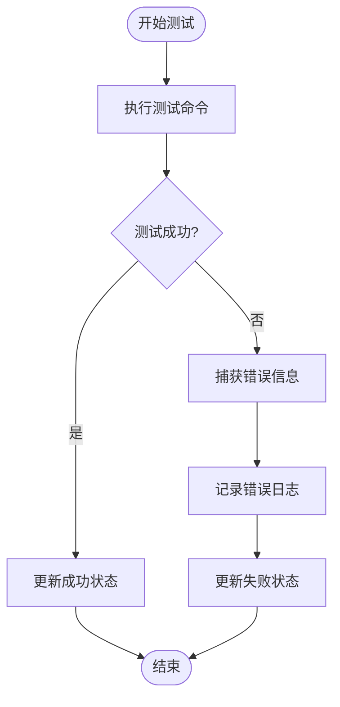

# 安装验证与测试

<cite>
**本文档中引用的文件**   
- [package_test.py](file://rez-3.3.0\src\rez\package_test.py)
- [package.py](file://my_packages\myapp\1.0.0\package.py)
- [hello_world\package.py](file://rez-3.3.0\example_packages\hello_world\package.py)
- [test.py](file://rez-3.3.0\src\rez\cli\test.py)
- [local.py](file://rez-3.3.0\src\rezplugins\build_process\local.py)
</cite>

## 目录
1. [简介](#简介)
2. [安装后验证测试机制](#安装后验证测试机制)
3. [package.test属性定义](#packagetest属性定义)
4. [测试失败处理与日志收集](#测试失败处理与日志收集)
5. [编写有效安装后测试用例的最佳实践](#编写有效安装后测试用例的最佳实践)
6. [常见问题与解决方案](#常见问题与解决方案)

## 简介
Rez包管理系统提供了一套完整的安装后验证与测试机制，确保软件包在部署后能够正常工作。本文档详细阐述了`package_test.py`模块如何执行包的验证测试，包括可执行文件权限检查、Python模块导入测试和依赖完整性验证。通过分析`hello_world`示例中的`package.py`，说明如何定义`package.test`属性来指定安装后的测试命令和预期结果。同时，文档还解释了测试失败时的错误报告机制、日志收集策略和调试信息生成。

## 安装后验证测试机制

Rez系统在软件包安装过程中集成了验证测试机制，确保安装的包能够正常工作。测试主要在安装/发布过程中执行，通过`_run_tests`方法在安装前运行配置的测试。



**Diagram sources**
- [local.py](file://rez-3.3.0\src\rezplugins\build_process\local.py#L402-L486)

**Section sources**
- [local.py](file://rez-3.3.0\src\rezplugins\build_process\local.py#L388-L486)

## package.test属性定义

`package.test`属性用于定义软件包的测试配置，可以在`package.py`文件中声明。测试配置可以是简单的命令字符串，也可以是包含多个选项的字典。

```python
tests = {
    "unit": "python -m unittest -s {root}/tests",
    "CI": {
        "command": "python {root}/ci_tests/main.py",
        "requires": ["maya-2017"],
        "replace": True
    }
}
```

测试配置中的命令字符串会自动扩展引用，如`{root}`会被替换为包的根目录。如果测试条目是字符串，则将其视为测试命令；如果是字典，则"command"字段是命令，"requires"列表会被添加到测试环境中。



**Diagram sources**
- [package_test.py](file://rez-3.3.0\src\rez\package_test.py#L20-L749)

**Section sources**
- [package_test.py](file://rez-3.3.0\src\rez\package_test.py#L20-L749)
- [package.py](file://my_packages\myapp\1.0.0\package.py#L1-L33)

## 测试失败处理与日志收集

当测试失败时，Rez系统会提供详细的错误报告和日志信息，帮助开发者快速定位问题。测试运行器会捕获测试命令的退出码，并根据结果更新测试状态。



测试失败时，系统会输出详细的错误信息，包括：
- 测试命令的退出码
- 环境解析失败的原因
- 依赖项冲突的详细信息
- 测试执行过程中的调试信息

日志收集策略包括：
1. 使用标准的Python logging模块进行日志记录
2. 在调试模式下输出详细的执行信息
3. 记录测试环境的解析过程
4. 保存测试命令的完整执行路径

**Diagram sources**
- [package_test.py](file://rez-3.3.0\src\rez\package_test.py#L468-L485)
- [logging_.py](file://rez-3.3.0\src\rez\utils\logging_.py#L1-L63)

**Section sources**
- [package_test.py](file://rez-3.3.0\src\rez\package_test.py#L468-L485)
- [logging_.py](file://rez-3.3.0\src\rez\utils\logging_.py#L1-L63)

## 编写有效安装后测试用例的最佳实践

编写有效的安装后测试用例需要遵循一系列最佳实践，确保测试的可靠性和可维护性。

### 测试用例设计原则
1. **原子性**: 每个测试用例应该只测试一个功能点
2. **独立性**: 测试用例之间不应该有依赖关系
3. **可重复性**: 测试结果应该在相同条件下可重复
4. **快速执行**: 测试用例应该尽可能快速执行

### 测试配置最佳实践
```python
tests = {
    "basic_functionality": {
        "command": "python {root}/bin/myapp.py --version",
        "requires": ["python-3.7+"],
        "run_on": ["pre_release"],
        "on_variants": False
    },
    "integration_test": {
        "command": "python {root}/tests/integration.py",
        "requires": ["maya-2022", "nuke-13.0"],
        "run_on": ["default"],
        "timeout": 300
    }
}
```

### 测试环境管理
- 使用`requires`字段明确声明测试依赖
- 避免在测试中修改全局环境变量
- 使用临时目录进行文件操作测试
- 在测试完成后清理临时资源

**Section sources**
- [package.py](file://my_packages\myapp\1.0.0\package.py#L1-L33)
- [package_test.py](file://rez-3.3.0\src\rez\package_test.py#L20-L749)

## 常见问题与解决方案

### 环境隔离问题
**问题**: 测试环境与开发环境不一致导致测试失败
**解决方案**: 
- 使用`use_current_env=False`确保测试在纯净环境中运行
- 明确声明所有测试依赖项
- 使用版本范围限制依赖版本

### 路径查找问题
**问题**: 测试中无法正确找到可执行文件或模块
**解决方案**:
- 使用`{root}`变量引用包根目录
- 在`commands()`函数中正确设置`PATH`和`PYTHONPATH`
- 验证可执行文件的权限设置

### 权限问题
**问题**: 测试中无法执行可执行文件
**解决方案**:
- 确保可执行文件具有正确的执行权限
- 在安装过程中验证文件权限
- 使用`os.chmod()`在测试前设置正确权限

```mermaid
flowchart LR
A[环境隔离问题] --> B[使用纯净测试环境]
A --> C[明确声明依赖]
D[路径查找问题] --> E[使用{root}变量]
D --> F[正确设置PATH]
G[权限问题] --> H[验证执行权限]
G --> I[使用os.chmod]
```

**Diagram sources**
- [package_test.py](file://rez-3.3.0\src\rez\package_test.py#L412-L423)
- [utils\filesystem.py](file://rez-3.3.0\src\rez\utils\filesystem.py)

**Section sources**
- [package_test.py](file://rez-3.3.0\src\rez\package_test.py#L412-L423)
- [utils\filesystem.py](file://rez-3.3.0\src\rez\utils\filesystem.py)